##临界知识
行记录与数据类型,记录删除策略
行记录与事务
行记录与回滚
行记录与下一条记录的位置,当前记录拥有的记录数(B+树)
Mysql的上限受到连接数,磁盘io寻址,磁盘吞吐量影响
访问某条记录会把所在页的所有数据都放入缓存,以便再次使用
LRU脏页刷盘时机
LRU热数据冷数据策略
##参考
[mysql是怎么运行的]()
##行格式
###隐藏列
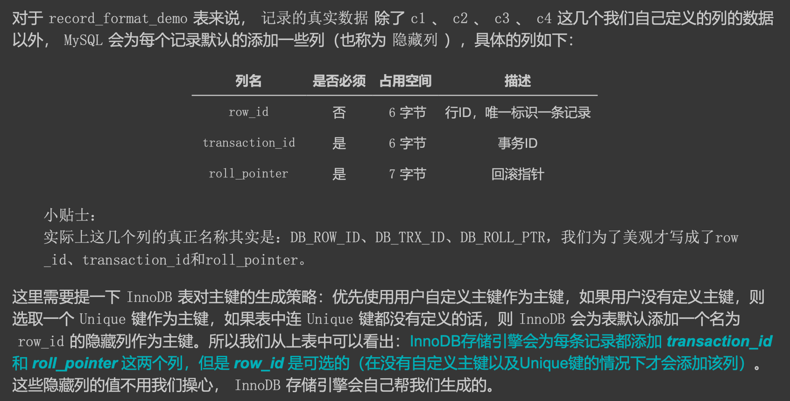
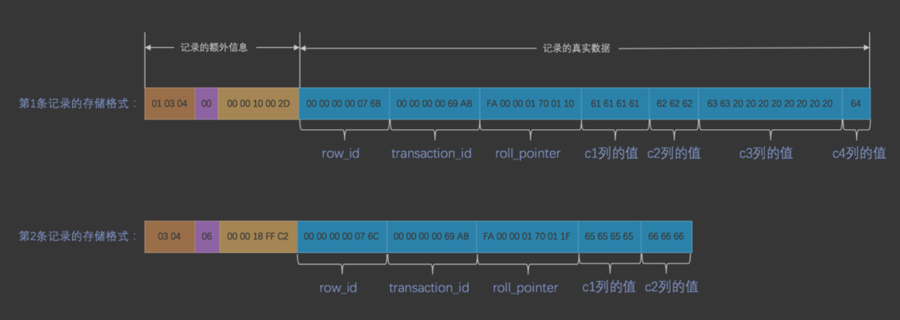
####row_id
```asp
服务器会在内存中维护一个全局变量，每当向某个包含隐藏的 row_id 列的表中插入一条记录时，就会把该 变量的值当作新记录的 row_id 列的值，并且把该变量自增1。 

每当这个变量的值为256的倍数时，就会将该变量的值刷新到系统表空间的页号为 7 的页面中一个称之为Max Row ID 的属性处(我们前边介绍表空间结构时详细说过)。

当系统启动时，会将上边提到的 Max Row ID 属性加载到内存中，将该值加上256之后赋值给我们前边提到的 全局变量(因为在上次关机时该全局变量的值可能大于 Max Row ID 属性值)

这个 Max Row ID 属性占用的存储空间是8个字节，当某个事务向某个包含 row_id 隐藏列的表插入一条记录，并 且为该记录分配的 row_id 值为256的倍数时，
就会向系统表空间页号为7的页面的相应偏移量处写入8个字节的 值
```
####trx_id
####roll point
###compact
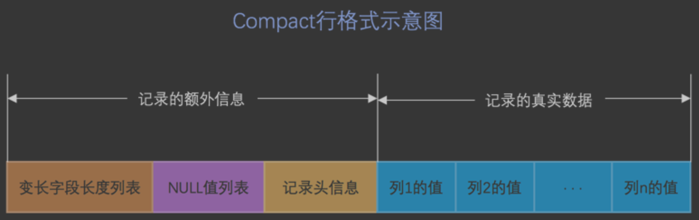

####表列度长段字长变(逆序)
把所有变长字段的真实数据占用的字节长度都存放在记录的开头部位，从而形成一个变长 字段长度列表，
各变长字段数据占用的字节数按照列的顺序逆序存放，逆序存放
```$xslt
1. 假设某个字符集中表示一个字符最多需要使用的字节数为 W ，也就是使用 SHOW CHARSET 语句的结果中的 Maxlen 列，比方说 utf8 字符集中的 W 就是 3 ， gbk 字符集中的 W 就是 2 ， ascii 字符集中的 W 就是 1。
2. 对于变长类型 VARCHAR(M) 来说，这种类型表示能存储最多 M 个字符(注意是字符不是字节)，所以这个类 型能表示的字符串最多占用的字节数就是 M×W 。
3. 假设它实际存储的字符串占用的字节数是 L 。
```
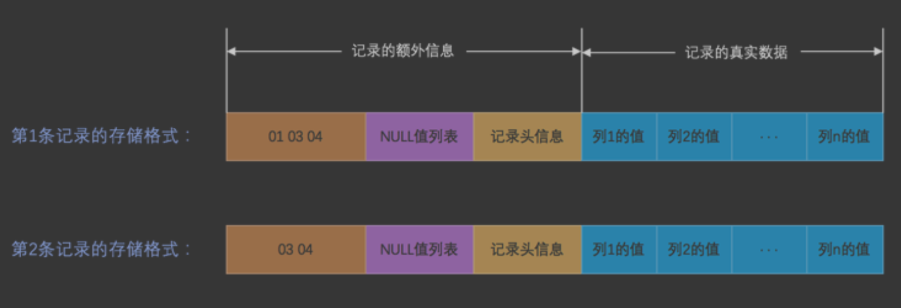
```$xslt
长度具体用1个还是2个字节来 表示真实数据占用的字节数,2个字节最大值65535
```
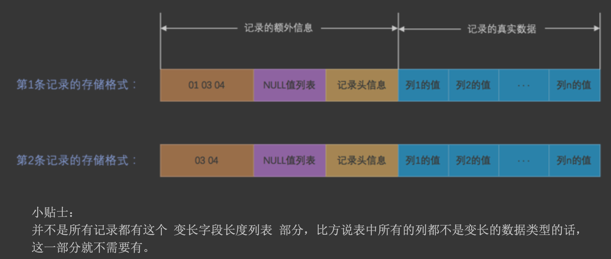
####CHAR(M)列的存储格式
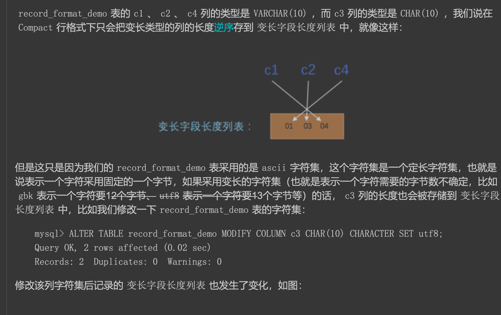
对于 CHAR(M) 类型的列来说，当列采用的是定长字符集时，该列占用的字节数不会被加到变长字 段长度列表，而如果采用变长字符集时，该列占用的字节数也会被加到变长字段长度列表
####null(逆序)
```asp
变长字段长度列表中只存储值为 NULL 的列内容占用的长度，值为 NULL 的列的长度 是不储存的 。也就是说对于第二条记录来说，因为 c4 列的值为 NULL ，
所以第二条记录的 变长字段长度列表 只 需要存储 c1 和 c2 列的长度即可。其中 c1 列存储的值为 'eeee' ，占用的字节数为 4 ， c2 列存储的值
为 'fff' ，占用的字节数为 3 。数字 4 可以用1个字节表示， 3 也可以用1个字节表示，所以整个 变长字段长度 列表 共需2个字节。

如果表中没有允许存储 NULL 的列，则 NULL 也不存在了
否则将每个允许存储 NULL 的列对应一个
二进制位，二进制位按照列的顺序逆序排列，二进制位表示的意义如下：
二进制位的值为 1 时，代表该列的值为 NULL 
二进制位的值为 0 时，代表该列的值不为 NULL 

MySQL 规定 NULL值列表 必须用整数个字节的位表示，如果使用的二进制位个数不是整数个字节，则在字节 的高位补 0 
```
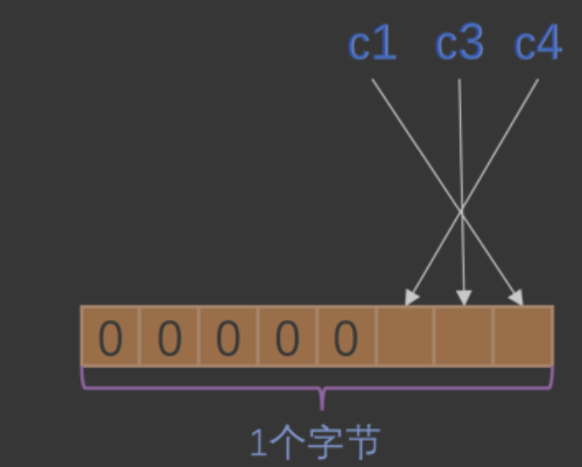
####记录头
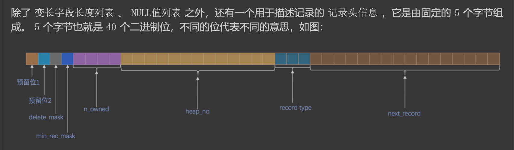
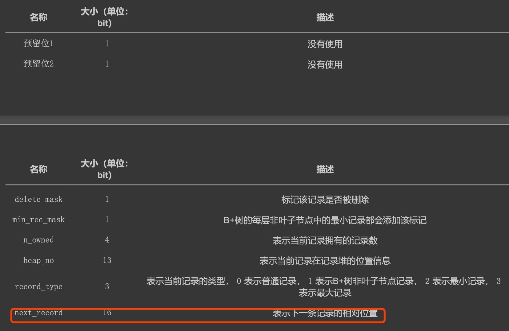


###行溢出
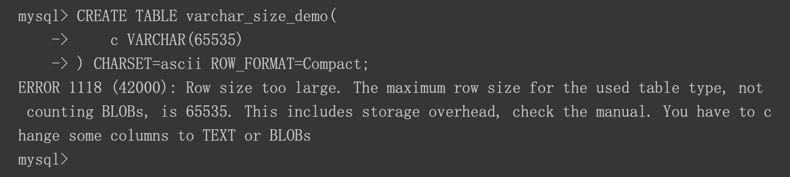
其他所有的列(不包括隐藏列和记录头信息)占用的字节长度加起来不能超过 65535 个字节
```asp
一个页的大小一般是 16KB ，也就是 16384 字节，而一个 VARCHAR(M) 类 型的列就最多可以存储 65532 个字节，这样就可能造成一个页存放不了一条记录的尴尬情况。
在 Compact 和 Reduntant 行格式中，对于占用存储空间非常大的列，在 记录的真实数据 处只会存储该列的一部 分数据，把剩余的数据分散存储在几个其他的页中，
然后 记录的真实数据 处用20个字节存储指向这些页的地址 (当然这20个字节中还包括这些分散在其他页面中的数据的占用的字节数)，从而可以找到剩余数据所在的页， 如图所示:
```
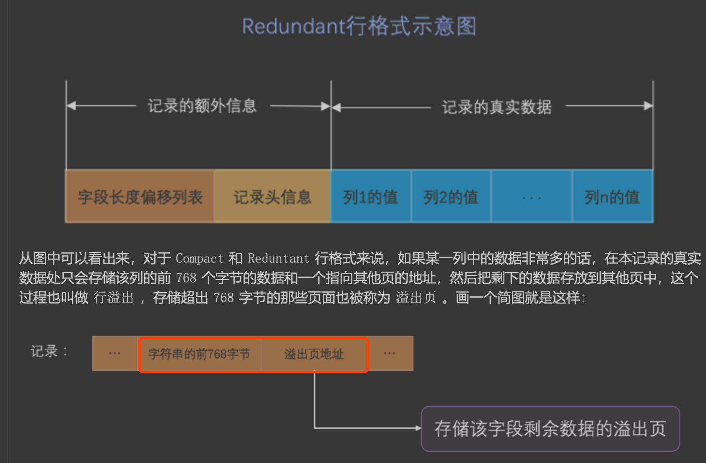

###Dynamic
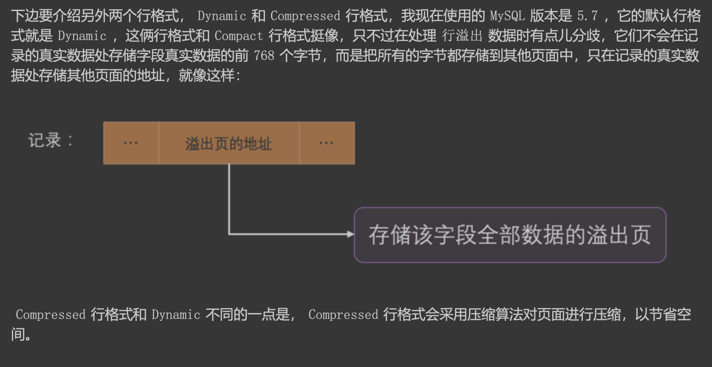
###compressed
Compressed 行格式和 Dynamic 不同的一点是， Compressed 行格式会采用压缩算法对页面进行压缩，以节省空 间。
##数据物理存储格式
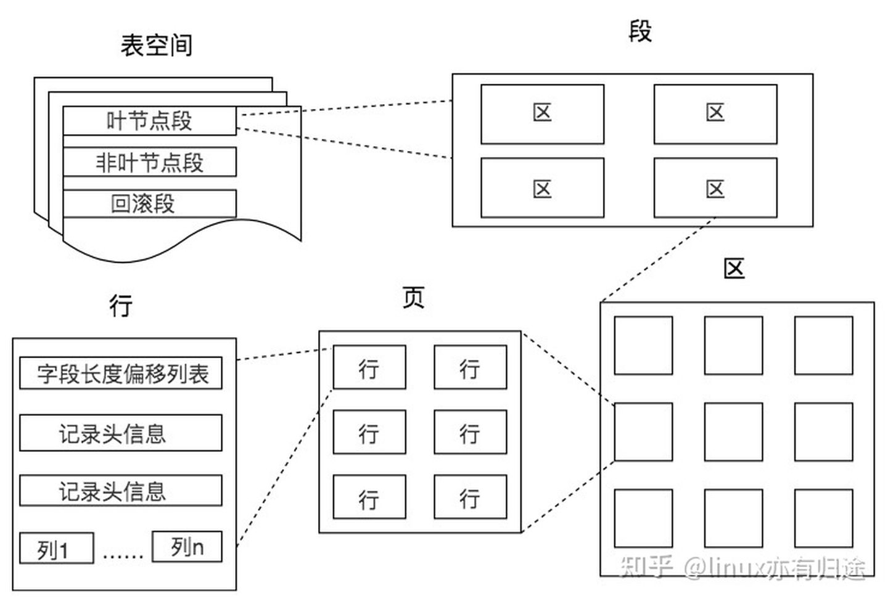
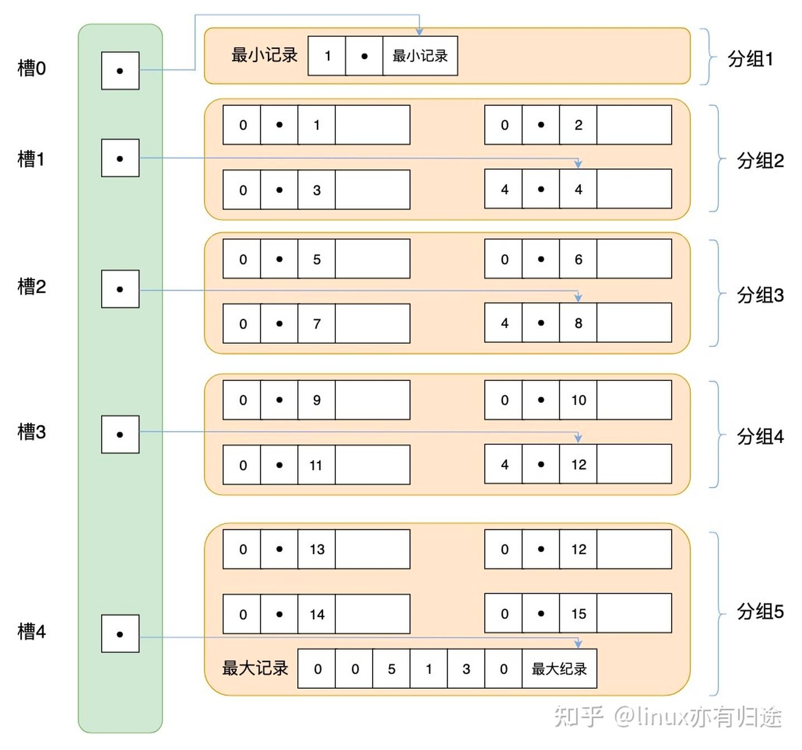
[](https://zhuanlan.zhihu.com/p/345414925)
##buffer pool(页缓存)
```asp
即使我们 只需要访问一个页的一条记录，那也需要先把整个页的数据加载到内存中。将整个页加载到内存中后就可以进行 读写访问了，
在进行完读写访问之后并不着急把该页对应的内存空间释放掉，而是将其 缓存 起来，
这样将来有 请求再次访问该页面时，就可以省去磁盘 IO 的开销了。
```
###控制块
控制块和缓存页是一一对应的
它们都被存放到 Buffer Pool 中，其中控制块被存放到 Buffer Pool
的前边，缓存页被存放到 Buffer Pool 后边
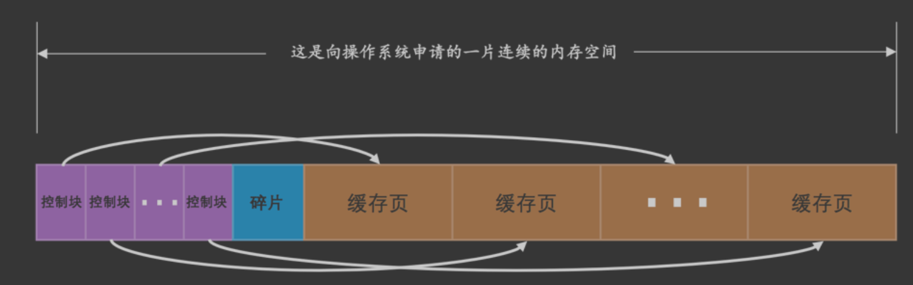
###缓存页hashmap
表空间号 + 页号 来定位一个页
```asp
我们可以用 表空间号 + 页号 作为 key ， 缓存页 作为 value 创建一个哈希表，在需要访问某个页的数据 时，
先从哈希表中根据 表空间号 + 页号 看看有没有对应的缓存页，如果有，直接使用该缓存页就好，如果没 有，那就从 free链表 中选一个空闲的缓存页，
然后把磁盘中对应的页加载到该缓存页的位置
```
###LRU缓存页链表
```asp
如果该页不在 Buffer Pool 中，在把该页从磁盘加载到 Buffer Pool 中的缓存页时，就把该缓存页对应的 控制块 作为节点塞到链表的头部。
如果该页已经缓存在 Buffer Pool 中，则直接把该页对应的 控制块 移动到 LRU链表 的头部。
也就是说:只要我们使用到某个缓存页，就把该缓存页调整到 LRU链表 的头部，这样 LRU链表 尾部就是最近最少 使用的缓存页喽~ 
所以当 Buffer Pool 中的空闲缓存页使用完时，到 LRU链表 的尾部找些缓存页淘汰就OK啦， 真简单，啧啧...
```


####InnoDB 预读(AIO)
如果顺序访问了某个区
( extent )的页面超过这个系统变量的值(56个页面)，就会触发一次 异步 读取下一个区中全部的页面到 Buffer Pool 的请求，注意 异步 
读取意味着从磁盘中加载这些被预读的页面并不会影响到当前工作线程的正常 执行。
####全表扫描
```asp
当需要访问这些页时，会把它们统统都加载到 Buffer Pool 中，这也就意味着吧唧一下，
Buffer Pool 中的所有页都被换了一次血，其他查询语句在执行时又得执行一次从磁盘加载到 Buffer Pool 的操作。
而这种全表扫描的语句执行的频率也不高，每次执行都要把 Buffer Pool 中的缓存页换一次血，这 严重的影响到其他查询对 Buffer Pool 的使用，从而大大降低了缓存命中率
```
####分区域LRU链表(热数据区/young区域,冷数据区/old区域)
```asp
当磁盘上的某个页面在初次加载到Buffer Pool中的某个缓存页时，该缓存页对应 的控制块会被放到old区域的头部。这样针对预读到 Buffer Pool 却不进行后续访问的页面就会被逐渐从
old 区域逐出，而不会影响 young 区域中被使用比较频繁的缓存页

所以我们只需要规定，在对某个处在 old 区域的缓存页进行第一次访问时就在它对应的控制块中 记录下来这个访问时间，如果后续的访问时间与第一次访问的时间在某个时间间隔内，
那么该页面就不会被 从old区域移动到young区域的头部，否则将它移动到young区域的头部。上述的这个间隔时间是由系统变
```
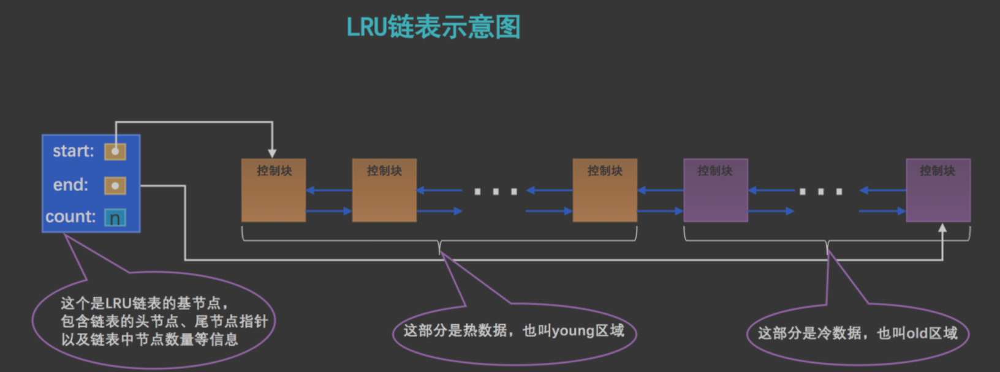
###free链表
把所有空闲的缓存页对应的控制块作为一个节 点放到一个链表中，这个链表也可以被称作 free链表
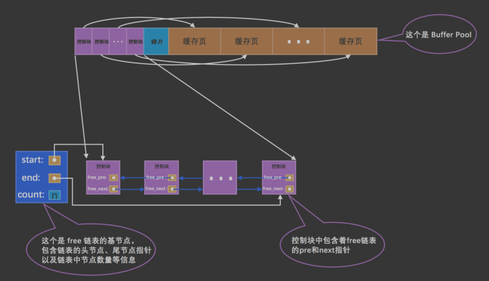
链表的基节点占用的内存空间 并不包含在为 Buffer Pool 申请的一大片连续内存空间之内，而是单独申请的一块内存空间
###flush链表(脏页)
```asp
如果我们修改了 Buffer Pool 中某个缓存页的数据，那它就和磁盘上的页不一致了，这样的缓存页也被称为 脏 页 (英文名: dirty page )。当然，
最简单的做法就是每发生一次修改就立即同步到磁盘上对应的页上，但是 频繁的往磁盘中写数据会严重的影响程序的性能(毕竟磁盘慢的像乌龟一样)。
所以每次修改缓存页后，我们并 不着急立即把修改同步到磁盘上，而是在未来的某个时间点进行同步
凡是修改过的缓存页对 应的控制块都会作为一个节点加入到一个链表中，因为这个链表节点对应的缓存页都是需要被刷新到磁盘上的， 所以也叫 flush链表
```
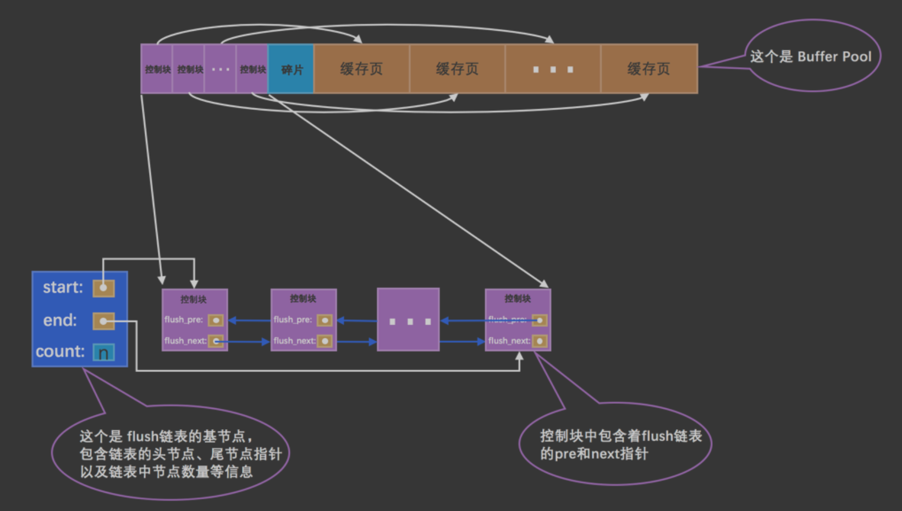
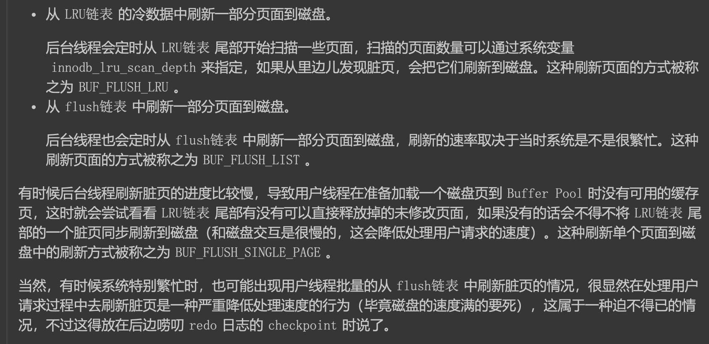
###buffer pool多实例,扩容chunk
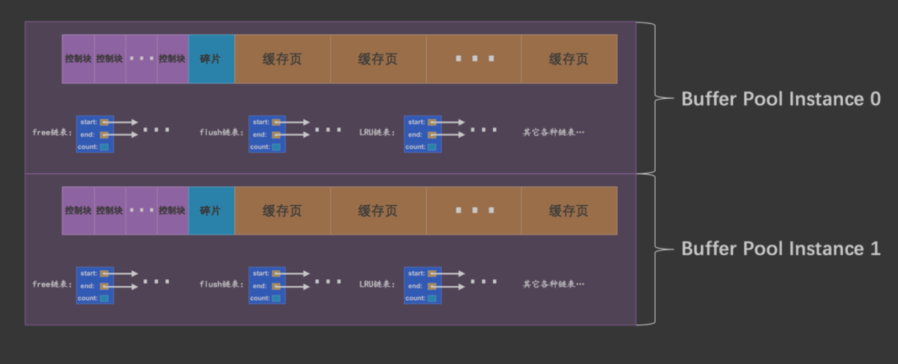
每次当我们要重新调整 Buffer Pool 大小时，都需要重新向操作系统申请一块连续的内存空间，然后将旧的 Buffer Pool 中的内容复制到这一 块新空间，
这是极其耗时的。所以设计 MySQL 的大叔们决定不再一次性为某个 Buffer Pool 实例向操作系统申请 一大片连续的内存空间，而是以一个所谓的 chunk 为单位向操作系统申请空间。也就是说一个 Buffer Pool 
实例 其实是由若干个 chunk 组成的，一个 chunk 就代表一片连续的内存空间，里边儿包含了若干缓存页与其对应的控 制块
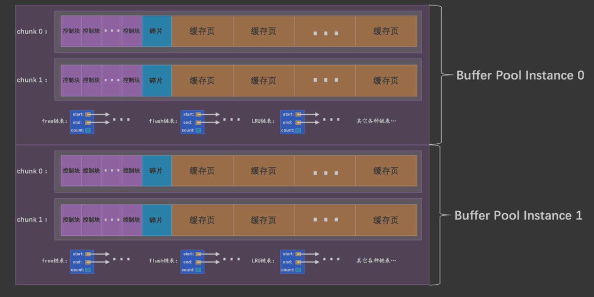
###unzip LRU链表 
用于管理解压页
###zip clean链表
用于管理没有被解压的压缩页表
##frm表结构
