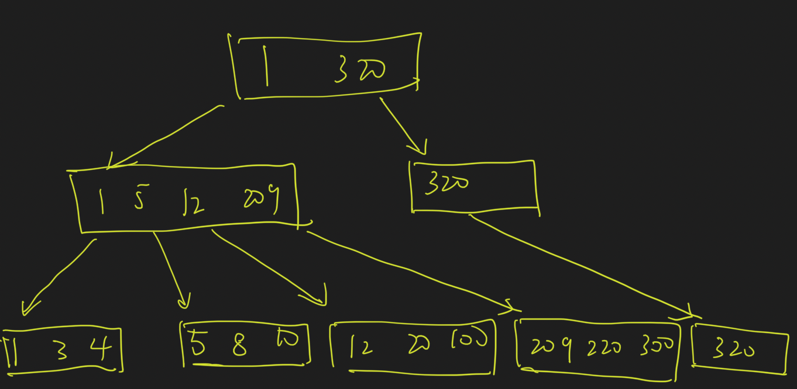
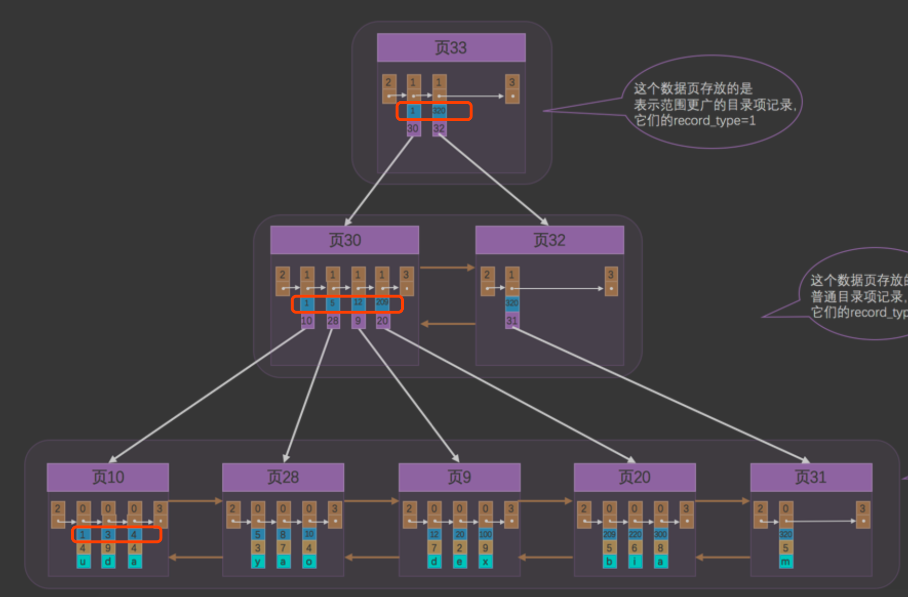
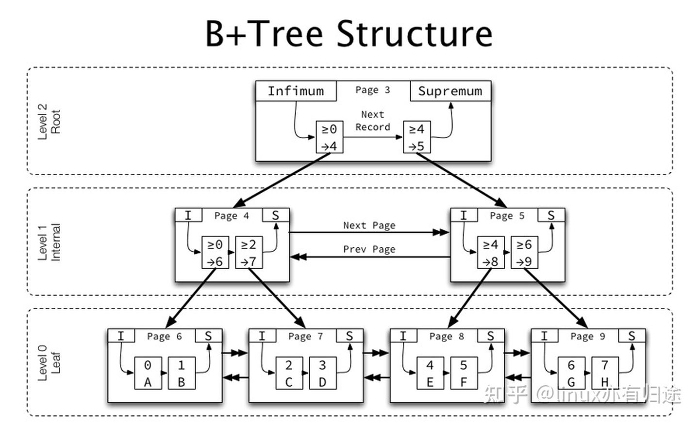
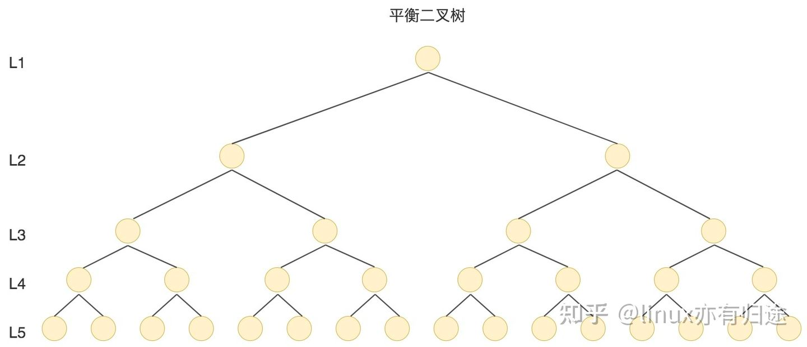
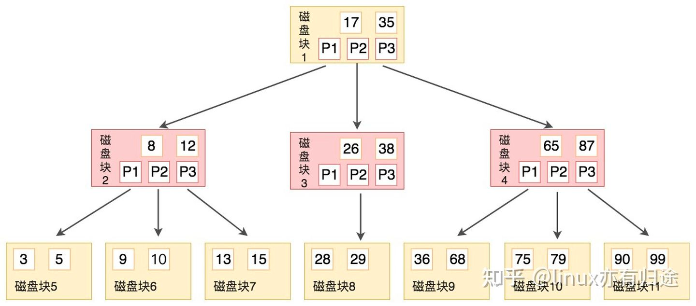
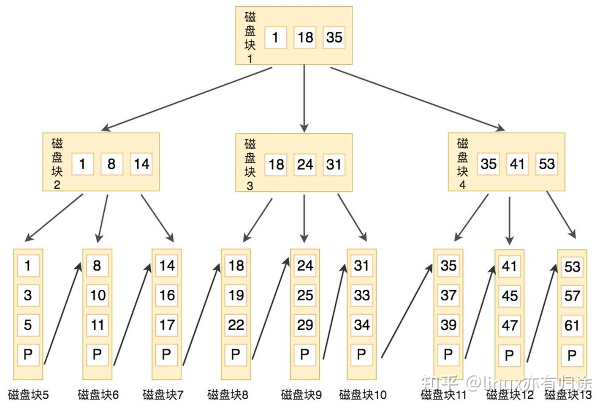

##临界知识
b+树中抽象概念与mysql实现的对应关系
b+树加快检索减少io的措施,内存与磁盘性能差距大
b+树适合的操作,查找,插入,范围查找
b+树相对b树的优势,一个非叶子节点能包含更多的关键码(不包含数据)
##参考
[](https://blog.csdn.net/wufeifan_learner/article/details/109724836)
[](https://zhuanlan.zhihu.com/p/345414925)
[mysql是怎么运行的:从根上理解mysql]()
##mysql中的B+树
```$xslt
1.高度平衡，即根节点到叶节点的高度是相等的。
2.叶子节点是按顺序存储的，有序搜索树。
3.只有叶子节点保存数据，非叶子节点只保存索引，不保存实际的数据
4.非叶子节点的关键码是子树的最大关键码
5.一个节点(非叶子节点&叶子节点)就是1页,1页16k
6.
7.B+树高度一般为3层,只需要高度为3的B+树就可以完成，通过主键查询只需要3次IO操作就能查到对应数据
7.
```
##B树时间复杂度
O(1)->O(h)

##B+树时间复杂度

###B+树阶
m阶,每个节点的关键码个数最多m-1个,插入后==m则需要分裂,删除后小于m/2则合并
###读、写、遍历
O(n+h)
###B+插入分裂&mysql页分裂
[](https://www.cs.usfca.edu/~galles/visualization/BPlusTree.html)

###B+删除合并&mysql页合并

##mysql中的非叶子节点(页,16k)


```$xslt
如果key使用的是bigint，则为8字节，指针在mysql中为6字节，一共是14字节，则16k能存放 16 * 1024 / 14 = 1170 个索引指针。于是可以算出，对于一颗高度为2的B+树，
根节点存储索引指针节点，那么它有1170个叶子节点存储数据，每个叶子节点可以存储16条数据，一共 1170 x 16 = 18720 条数据。
而对于高度为3的B+树，就可以存放 1170 x 1170 x 16 = 21902400 条数据（两千多万条数据），也就是对于两千多万条的数据，
我们只需要高度为3的B+树就可以完成，通过主键查询只需要3次IO操作就能查到对应数据。所以在 InnoDB 中B+树高度一般为3层时，就能满足千万级的数据存储，
所以一个节点为1页，也就是16k是比较合理的

```
##mysql中的叶子节点(页,16k)

##为啥用B+树不用链表,二叉树,平衡二叉树,hashmap,B树
```$xslt
1.不用链表,为了加快检索
2.不用二叉树,二叉树容易退化成线性链表
3.不用平衡二叉树,B+树多路平衡查找树,为了减少高度,减少IO次数
4.不用B树,innodb希望将更多的索引(非叶子节点关键码)加载到内存,减少io次数,
B树的非叶子节点包含数据,加载到内存占用空间大,B+树一个页能包含更多的关键码
5.不用hashmap,B+s树范围查找是顺序访问
```




##生产环境B+树层级与io次数
[](https://blog.csdn.net/dl674756321/article/details/102987984)
