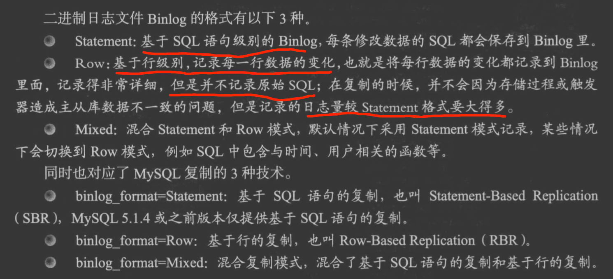
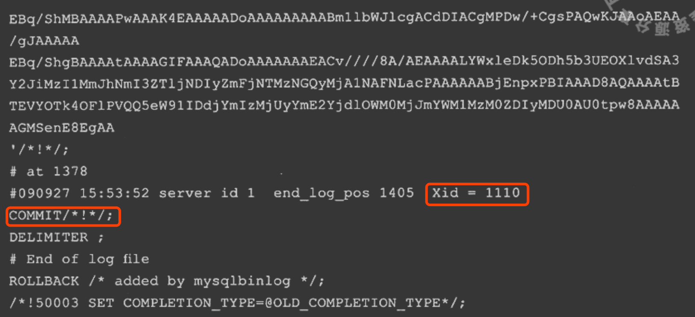
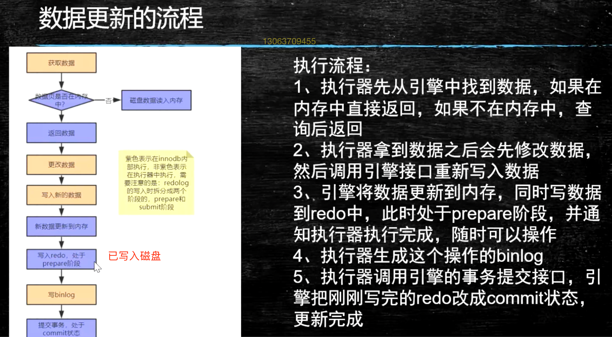
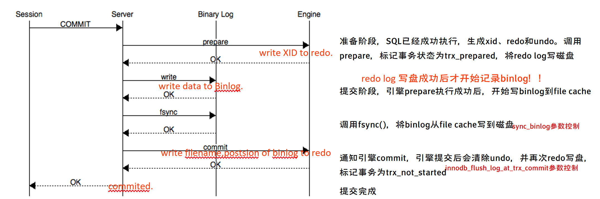

#临界知识
binlog主从复制日志和redolog事务恢复日志需要保持一致
#binlog作用
```asp
在实际应用中， binlog 的主要使用场景有两个，分别是 主从复制 和 数据恢复 。

主从复制 ：在 Master 端开启 binlog ，然后将 binlog 发送到各个 Slave 端， Slave 端重放 binlog 从而达到主从数据一致。
数据恢复 ：通过使用 mysqlbinlog 工具来恢复数据。
```
#binlog刷盘时机
```asp
0：不去强制要求，由系统自行判断何时写入磁盘；
1：每次 commit 的时候都要将 binlog 写入磁盘；
N：每N个事务，才会将 binlog 写入磁盘。
```
#binlog日志格式

##statement
##row
#MySQL 怎么知道 binlog 是完整的?
```asp
回答：一个事务的 binlog 是有完整格式的：statement 格式的 binlog，
最后会有 COMMIT；row 格式的 binlog，最后会有一个 XID event(事务id)。
另外，在 MySQL 5.6.2 版本以后，还引入了 binlog-checksum 参数，用来验证 binlog 内容的正确性。
对于 binlog 日志由于磁盘原因，可能会在日志中间出错的情况，MySQL 可以通过校验 checksum 的结果来发现。所以，MySQL 还是有办法验证事务 binlog 的完整性的。
```

#为啥有binlog还需要redo？binlog不能直接恢复吗?
```asp
为啥有了binlog 还需要redo?binlog不是用在了主从复制上了吗?不要说binlog是逻辑执行，为啥主从复制就可以接受逻辑语句，
事务恢复就不能接受了？redis的aof也是逻辑语句，咋不像mysql 的事务恢复这么多事

mysql需要保证事务性，逻辑语句不能保证事务性，原因如下：
```
[](https://spongecaptain.cool/post/database/logicalandphicallog/#21-%E4%BA%8B%E5%8A%A1%E5%B9%B6%E5%8F%91%E6%8E%A7%E5%88%B6)
[](https://time.geekbang.org/column/article/73161)
##事务并发控制
```asp
我们需要使用事务并发控制的原因基于以下事实（以 MySQL 为语境解释）：

事务由 SQL 语句构成，每一个 SQL 语句可分解为多个不可分隔的读/写操作；
事务的执行实际上是一连串不可分割读写操作的执行；
事务调度器负责调度不可分割读写操作的执行顺序，它们可能来自于不同事务；
事务并发控制的一个目标就是实现并行化事务；
逻辑日志很难实现一致的事务并发控制。由于逻辑日志难以携带并发执行顺序的信息，当同时有多个事务产生更新操作时，数据库内部会将这些操作调度为串行化序列执行，需要机制来保障每次回放操作的执行顺序与调度产生的顺序一致。

另一方面，物理日志本身就是存储就是基于不可分隔的更新操作，因此其存储先后顺序就代表了执行器的调度顺序。而且由于很容易判断两个 page 是否是同一个 page，如果不是，完全可以安全并行地并行执行。

为了实现宕机前后事务并发控制的一致性，数据库选择使用 Physical Logging 作为其 Redo Log。
```
##幂等性
```asp
物理日志能够做的幂等性，因为其本质是对状态机某一个字段在更新前后状态的记录，无论执行多少次，最终得到的状态总是相同的。
逻辑日志并不能够提供幂等性的语义，因为某一个更新操作本身不具备幂等性

binlog是逻辑日志，可能包含多个page，假设记录了一条逻辑日志update table set a=a+1;多次重放后结果一定是有问题的。如果是redo log，
它和具体的page挂钩，“page 111， table, a, old value 1, new value 5"，像这条物理日志不论重放多少次，a的值结果不会有问题
```
##数据量大小
逻辑也不是一无是处，其在日志数据量上占优。

##日志重放效率

#relay log
#两阶段提交
[](https://blog.csdn.net/luis_ora/article/details/82663263)
##binlog vs redo 
```asp
a）层次不同。redo/undo log是innodb层维护的，而binlog是mysql server层维护的，跟采用何种引擎没有关系，记录的是所有引擎的更新操作的日志记录。

b）记录内容不同。redo/undo日志记录的是每个页的修改情况，属于物理日志+逻辑日志结合的方式（redo log物理到页，页内采用逻辑日志，undo log采用的是逻辑日志），
目的是保证数据的一致性。binlog记录的都是事务操作内容，比如一条语句DELETE FROM TABLE WHERE i > 1之类的，不管采用的是什么引擎，当然格式是二进制的，
要解析日志内容可以用这个命令mysqlbinlog -vv BINLOG。

c）记录时机不同。redo/undo日志在事务执行过程中会不断的写入;而binlog仅仅在事务提交后才写入到日志，之前描述有误，binlog是在事务最终commit前写入的，
多谢anti-semicolon 指出。当然，binlog什么时候刷新到磁盘跟参数sync_binlog相关

```
##redo log 和 binlog 是怎么关联起来的?

```asp
它们有一个共同的数据字段，叫 XID。崩溃恢复的时候，会按顺序扫描 redo log：
如果碰到既有 prepare、又有 commit 的 redo log，
就直接提交；如果碰到只有 parepare、而没有 commit 的 redo log，就拿着 XID 去 binlog 找对应的事务。


```
##详情
[](https://jishuin.proginn.com/p/763bfbd67abc)

[](https://xie.infoq.cn/article/a0524f9df0d1b9fff8b0af42f)
[](https://www.dazhuanlan.com/lesliealga/topics/1454752)
[](http://mysql.taobao.org/monthly/2018/12/04/)
[](http://mysql.taobao.org/monthly/2015/12/01/)
[](http://keithlan.github.io/2018/07/24/mysql_group_commit/)
```asp
我们先来看一下崩溃恢复时的判断规则。
如果 redo log 里面的事务是完整的，也就是已经有了 commit 标识，则直接提交；如果 redo log 里面的事务只有完整的 prepare，
则判断对应的事务 binlog 是否存在并完整：a. 如果是，则提交事务；b. 否则，回滚事务。

将语句执行
记录redo log，并将记录状态设置为prepare
通知Server，已经修改好了，可以提交事务了
将更新的内容写入binlog
commit，提交事务
将redo log里这个事务相关的记录状态设置为commited
prepare： redolog写入log buffer，并fsync持久化到磁盘，在redolog事务中记录2PC的XID，在redolog事务打上prepare标识

commit： binlog写入log buffer，并fsync持久化到磁盘，在binlog事务中记录2PC的XID，同时在redolog事务打上commit标识 其中，prepare和commit阶段所提到的“事务”，都是指内部XA事务，即2PC

prepare 阶段：sql 成功执行，生成xid、redo log、undo log。调用 prepare 将事务状态设为 TRX_PREPARED，并将 redo log、undo log 刷磁盘
commit 阶段：
记录 bin log，write()&fsync()，只要 fsync() 成功事务就一定要提交了，此时生成Xid_log_event，失败调用ha_rollback_trans回滚。
InnoDB commit 完成事务提交，清除 undo log、刷 redo log 日志，设置事务状态为TRX_NOT_STARTED


Commit Stage：队列中的事务依次进行innodb commit，将undo头的状态修改为TRX_UNDO_CACHED/TRX_UNDO_TO_FREE/TRX_UNDO_TO_PURGE任意一种 
(undo相关知识参阅之前的月报)；并释放事务锁，清理读写事务链表、readview等一系列操作。每个事务在commit阶段也会去更新事务页的binlog位点。

Commit阶段不用刷盘，如上所述，Flush阶段中的Redo log刷盘已经足够保证数据库崩溃时的数据安全了
Commit阶段队列的作用是承接Sync阶段的事务，完成最后的引擎提交，使得Sync可以尽早的处理下一组事务，最大化组提交的效率
```
