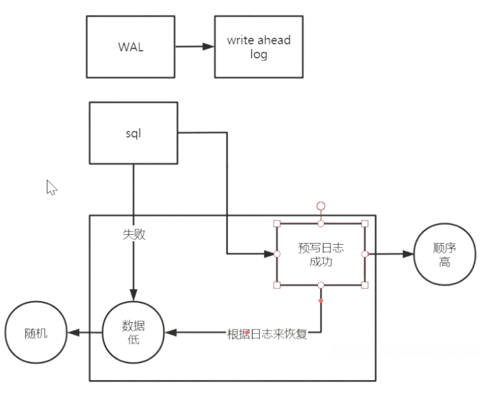
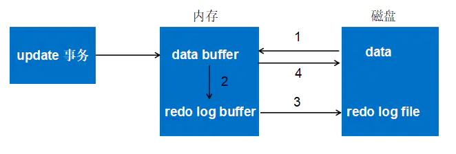
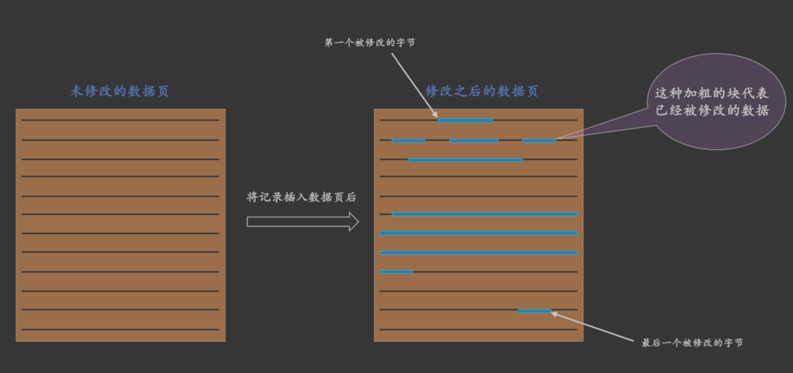
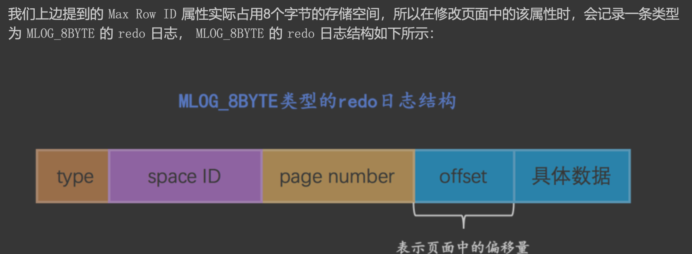
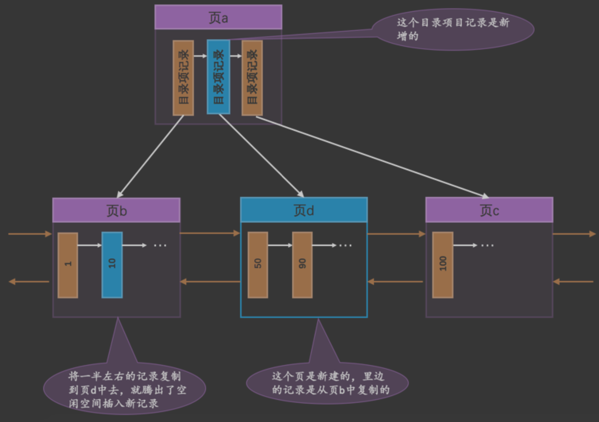
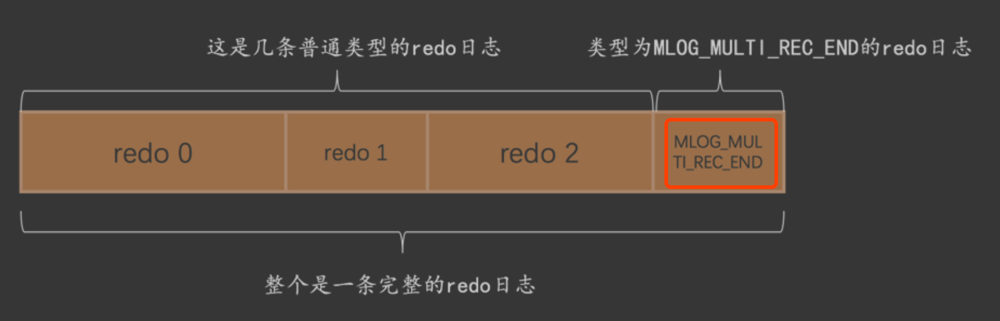
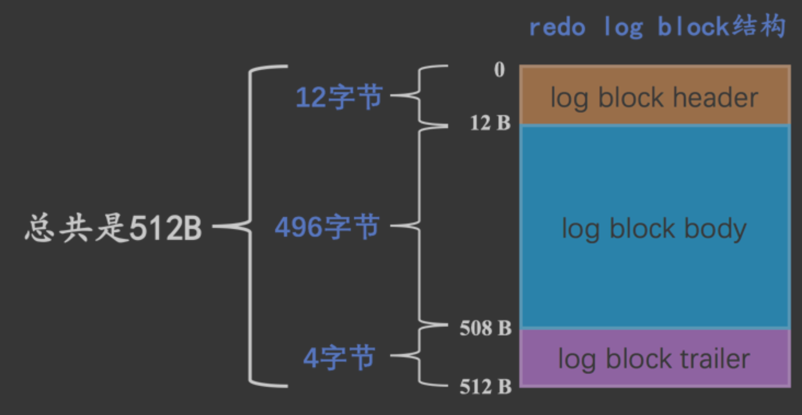
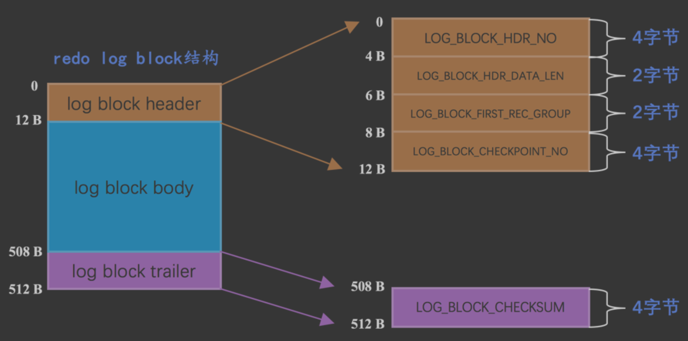
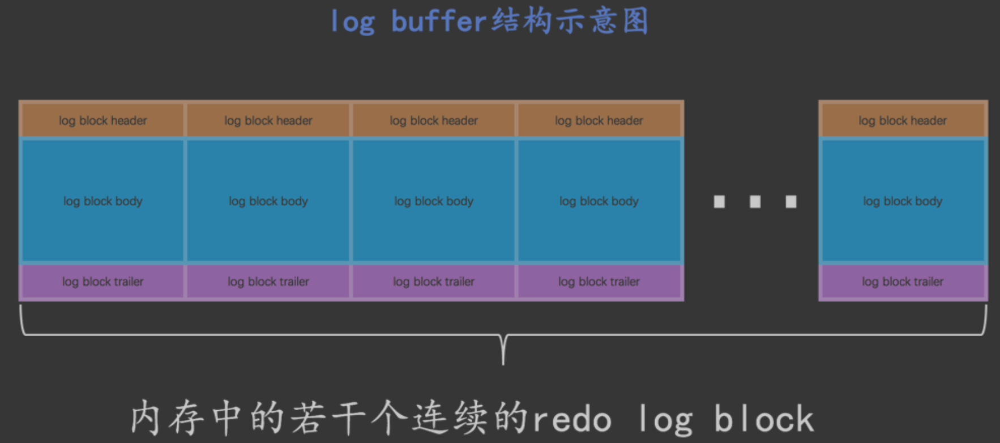

#临界知识
redo日志顺序写日志,提高持久化速度
redo物理逻辑日志(页面是物理页面,内容是物理记录,逻辑指需要执行插入记录的函数)
redo是先满足持久化的核心需求,然后再异步更新逻辑
redo日志会把事务在执行过程 中对数据库所做的所有修改都记录下来，在之后系统奔溃重启后可以把事务所做的任何修改都恢复出来
mysql插入一条记录的时候，需要悲观插入时，buffer pool中进行了实际的插入和页分裂，redo只是记录了这个过程中页的操作。插入和分裂其实是真实发生了，只是没有回写到磁盘
redo日志刷盘时机
redo崩溃恢复机制
#redo日志的作用,提高持久化速度

##why need?
```asp
1.有时候我们仅仅修改了某个页面中的一个字节，但是我们知道在 InnoDB 中是以页为单位来进行磁盘IO的， 也就是说我们在该事务提交时不得不将一个
完整的页面从内存中刷新到磁盘，我们又知道一个页面默认是 16KB大小，只修改一个字节就要刷新16KB的数据到磁盘上显然是太浪费了

2.一个事务可能包含很多语句，即使是一条语句也可能修改许多页面，倒霉催的是该事务修改的这些页面可能 并不相邻，这就意味着在将某个事务修改的 
Buffer Pool 中的页面刷新到磁盘时，需要进行很多的随机IO， 随机IO比顺序IO要慢，尤其对于传统的机械硬盘来说。
```
##how to do?
```asp
我们只是想让已经提交了的事务对数据库中数据所做的修改永久生效，即使后来 系统崩溃，在重启后也能把这种修改恢复出来。所以我们其实没有必要在
每次事务提交时就把该事务在内存中修 改过的全部页面刷新到磁盘，只需要把修改了哪些东西记录一下就好，比方说某个事务将系统表空间中的第100 
号页面中偏移量为1000处的那个字节的值 1 改成 2 我们只需要记录一下

重启之后只要按照上述内容所记录的 步骤重新更新一下数据页，那么该事务对数据库中所做的修改又可以被恢复出来，也就意味着满足 持久性 的要 求。
因为在系统奔溃重启时需要按照上述内容所记录的步骤重新更新数据页，所以上述内容也被称之为 重做日 志 
```
```asp
redo 日志是顺序写入磁盘的
redo 日志占用的空间非常小
```
```asp
redo 日志占用的空间非常小

我们只是想让已经提交了的事务对数据库中数据所做的修改永久生效，即使后来 系统崩溃，在重启后也能把这种修改恢复出来。所以我们其实没有必要在
每次事务提交时就把该事务在内存中修 改过的全部页面刷新到磁盘，只需要把修改了哪些东西记录一下就好

存储表空间ID、页号、偏移量以及需要更新的值所需的存储空间是很小的，关于 redo 日志的格式我们稍后 会详细唠叨，现在只要知道一条 redo 日志占用的空间不是很大就好了

redo 日志是顺序写入磁盘的
在执行事务的过程中，每执行一条语句，就可能产生若干条 redo 日志，这些日志是按照产生的顺序写入磁
盘的，也就是使用顺序IO
```
#redo日志写入流程

```asp
mysql插入一条记录的时候，需要悲观插入时，buffer pool中进行了实际的插入和页分裂，
redo只是记录了这个过程中页的操作。插入和分裂其实是真实发生了，只是没有回写到磁盘
```
#redo日志与事务的关系

```asp
第一步：先将原始数据从磁盘中读入内存中来，修改数据的内存拷贝
第二步：生成一条重做日志并写入redo log buffer，记录的是数据被修改后的值
第三步：当事务commit时，将redo log buffer中的内容刷新到 redo log file，对 redo log file采用追加写的方式
第四步：定期将内存中修改的数据刷新到磁盘中
```
#redo日志物理结构

```asp
各个部分的详细释义如下:
type :该条 redo 日志的类型。
在 MySQL 5.7.21 这个版本中，设计 InnoDB 的大叔一共为 redo 日志设计了53种不同的类型，稍后会详细介 绍不同类型的 redo 日志。
space ID :表空间ID。
page number :页号。
data :该条 redo 日志的具体内容。
```
#redo日志常见更改项

```asp
1.表中包含多少个索引，一条 INSERT 语句就可能更新多少棵 B+ 树
2.针对某一棵 B+ 树来说，既可能更新叶子节点页面，也可能更新内节点页面，也可能创建新的页面(在该记 录插入的叶子节点的剩余空间比较少，不足以存放该记录时，会进行页面的分裂，在内节点页面中添加 目录 项记录
3.16k数据页的Page Header 中的各种页面统计信息，比如 PAGE_N_DIR_SLOTS 表示的槽数量可能会更改， PAGE_HEAP_TOP代表的还未使用的空间最小地址可能会更改， PAGE_N_HEAP 代表的本页面中的记录数量可能会更改
4.在数据页里的记录是按照索引列从小到大的顺序组成一个单向链表的，每插入一条记录，还需要更 新上一条记录的记录头信息中的 next_record 属性来维护这个单向链表
```
#redo日志常见类型(物理/逻辑)
##物理日志 & 逻辑日志
物理日志: 大部分情况下 Redo是物理日志，记录的是数据页的物理变化
逻辑日志: 不是记录页面的实际修改，而是记录修改页面的一类操作，比如新建数据页时，需要记录逻辑日志
##row_id隐藏列redo日志(物理日志)

##写入1、2、4、8个字节的 redo 日志(物理日志)

```asp
只需要记录一下在某个页面的某个偏移量处修改了几个字节的值，具体被修改的内容是啥 就好了
```



```asp
只要将MLOG_WRITE_STRING类型的redo日志的len字段填充上1、2、4、8这些数字，就可以分别替代MLOG _1BYTE、MLOG_2BYTE、MLOG_4BYTE、MLOG_8BYTE这些类型的redo日志，
为啥还要多此一举设计这么多类 型呢?还不是因为省空间啊，能不写len字段就不写len字段，省一个字节算一个字节。
```
##MLOG_COMP_REC_INSERT插入的redo日志(物理逻辑日志,物理页面,内容还需执行特定函数)
```asp
物理层面看，这些日志都指明了对哪个表空间的哪个页进行了修改。

逻辑层面看，在系统奔溃重启时，并不能直接根据这些日志里的记载，将页面内的某个偏移量处恢复成某个
数据，而是需要调用一些事先准备好的函数，执行完这些函数后才可以将页面恢复成系统奔溃前的样子
```

offset 代表的是该记录的前一条记录在页面中的地址。为啥要记录前一条记录的地址呢?这是因为每向数 据页插入一条记录，都需要修改该页面中维护的记录链表，每条记录的 记录头信息 中都包含一个称为
next_record 的属性，所以在插入新记录时，需要修改前一条记录的 next_record 属性
```asp
很显然这个类型为 MLOG_COMP_REC_INSERT 的 redo 日志并没有记录 PAGE_N_DIR_SLOTS 的值修改为了啥， PAGE_HEAP_TOP 的值修改为了啥，
PAGE_N_HEAP 的值修改为了啥等等这些信息，而只是把在本页面中插入一条记录所有必备的要素记了下来，之后系统奔溃重启时，服务器会调用相关向某个页面插入一条记录的那个函数，
而 redo 日志中的那些数据就可以被当成是调用这个函数所需的参数，在调用完该函数后，页面中的 PAGE_N_DIR_SLOTS 、 PAGE_HEAP_TOP 、 PAGE_N_HEAP 等等的值也就都被恢复到系统奔溃前的样子了。这就是所
谓的 逻辑 日志的意思
```
#Mini-Transaction(mtr)
```asp
该数据页剩余的空闲空间不足，那么事情就悲剧了，我们前边说过，遇到这种情况要进行所谓的 页 分裂 操作，也就是新建一个叶子节点，
然后把原先数据页中的一部分记录复制到这个新的数据页中，然后再 把记录插入进去，把这个叶子节点插入到叶子节点链表中，
最后还要在内节点中添加一条 目录项记录 指向 这个新创建的页面。很显然，这个过程要对多个页面进行修改，也就意味着会产生多条 redo 日志，我们把 这种情况称之为 悲观插入
```

页b 已经塞满了记录，没有更多的空闲空间来容纳这条新记录了，所以我们需要进行页面的分裂操作

对于 悲观插入 来说，由于需要 新申请数据页，还需要改动一些系统页面，比方说要修改各种段、区的统计信息信息，各种链表的统计信息 
(比如什么 FREE 链表、 FSP_FREE_FRAG 链表吧啦吧啦我们在唠叨表空间那一章中介绍过的各种东东)等等 等等，反正总共需要记录的 redo 日志有二、三十条
##MLOG_MULTI_REC_END
所以某个需要保证原子性的操作产生的一系列 redo 日志必须要以一个类型为 MLOG_MULTI_REC_END 结尾

##事务与mtr

#redo log buffer
##redo block
mtr 生成的 redo 日志都放在了大小为 512字节 的 页(block) 中


###LOG_BLOCK_FIRST_REC_GROUP
一个 mtr 会生产多条 redo 日志记录，这些 redo 日志记录被称之为一个 redo 日志记录组
###LOG_BLOCK_CHECKPOINT_NO
checkpoint 的序号
##redo log buffer(redo日志缓冲区)

###buf_free
该变量指明后 续写入的 redo 日志应该写入到 log buffer 中的哪个位置

###插入单位mtr
其实 并不是每生成一条 redo 日志，就将其插入到 log buffer 中，而是每个 mtr 运行过程中产生的日志先暂时存到 一个地方，当该 mtr 结束的时候，将过程中产生的一组 redo 日志再全部复制到 log buffer 中
###交替插入log buffer
不同的事务可能是并发执行的，所以 T1 、 T2 之间的 mtr 可能是交替执行的。每当一个 mtr 执行完成时，伴随 该 mtr 生成的一组 redo 
日志就需要被复制到 log buffer 中，也就是说不同事务的 mtr 可能是交替写入 log buffer 的


#redo日志刷盘时机 & 刷盘策略
##刷盘时机
```asp
1.事务提交时
我们前边说过之所以使用 redo 日志主要是因为它占用的空间少，还是顺序写，在事务提交时可以不把修改 过的 Buffer Pool 页面刷新到磁盘，
但是为了保证持久性，必须要把修改这些页面对应的 redo 日志刷新到 磁盘。

2.后台线程不停的刷刷刷
后台有一个线程，大约每秒都会刷新一次 log buffer 中的 redo 日志到磁盘

3.log buffer 空间不足时
log buffer 的大小是有限的(通过系统变量 innodb_log_buffer_size 指定)，如果不停的往这个有限大小 的 log buffer 里塞入日志，
很快它就会被填满。设计 InnoDB 的大叔认为如果当前写入 log buffer 的redo 日志量已经占满了 log buffer 总容量的大约一半左右，就需要把这些日志刷新到磁盘上

4.做所谓的 checkpoint 时
```
##innodb_flush_log_at_trx_commit
```asp
0 :当该系统变量值为0时，表示在事务提交时不立即向磁盘中同步 redo 日志，这个任务是交给后台线程 做的。
这样很明显会加快请求处理速度，但是如果事务提交后服务器挂了，后台线程没有及时将 redo 日志刷新到 磁盘，那么该事务对页面的修改会丢失。

1 :当该系统变量值为1时，表示在事务提交时需要将 redo 日志同步到磁盘，可以保证事务的 持久性 。 1 也是 innodb_flush_log_at_trx_commit 的默认值。

2 :当该系统变量值为2时，表示在事务提交时需要将 redo 日志写到操作系统的缓冲区中，但并不需要保 证将日志真正的刷新到磁盘。
这种情况下如果数据库挂了，操作系统没挂的话，事务的 持久性 还是可以保证的，但是操作系统也挂了的 话，那就不能保证 持久性 了
```

#redo日志文件格式

将log buffer中的redo日志刷新到磁盘的本质就是把block的镜像写入日志文件中，所以 redo 日志文件其实也是由若干 个 512 字节大小的block组成。

##Log Sequeue Number(LSN日志序列号)
在统计 lsn 的增长量时，是按照实际 写入的日志量加上占用的 log block header 和 log block trailer 来计算的

每一组由mtr生成的redo日志都有一个唯一的LSN值与其对应，LSN值越小，说明 redo日志产生的越早。
##flushed_to_disk_lsn/buf_next_to_write

redo 日志被不断写入 log buffer ，但是并不会立即刷新到磁盘， lsn 的值就和 flushed_to_disk_lsn 的 值拉开了差距

当有新的 redo 日志写入到 log buffer 时，首先 lsn 的值会增长，但 flushed_to_disk_lsn 不变， 随后随着不断有 log buffer 中的日志被
刷新到磁盘上， flushed_to_disk_lsn 的值也跟着增长。如果两者的值 相同时，说明log buffer中的所有redo日志都已经刷新到磁盘中了
##flush链表中的lsn
flush链表中的脏页是按照页面的第 一次修改时间从大到小进行排序的
把在mtr执行过程中可能修改过的页面加入到Buffer Pool的flush链表
##checkpointlsn
```asp
redo日志只是为了系统 奔溃后恢复脏页用的，如果对应的脏页已经刷新到了磁盘，也就是说即使现在系统奔溃，那么在重启后也用不着 使用redo日志恢复
该页面了，所以该redo日志也就没有存在的必要了，那么它占用的磁盘空间就可以被后续的 redo日志所重用。也就是说:判断某些redo日志占用的磁盘空间
是否可以覆盖的依据就是它对应的脏页是否已经 刷新到磁盘里

比方说现在 页a 被刷新到了磁盘， mtr_1 生成的 redo 日志就可以被覆盖了，所以我们可以进行一个增加 checkpoint_lsn 的操作，我们把这个过程称之为做一次 checkpoint 。
```


##checkpoint_no
目前系统做了多少次 checkpoint 的变量 checkpoint_no ，每做一次 checkpoint ，该变量的值就加1。我们前边说过计算一个 lsn 值对应的 redo 日志文件组偏移量是很容易
的，所以可以计算得到该 checkpoint_lsn 在 redo 日志文件组中对应的偏移量 checkpoint_offset ，然后 把这三个值都写到 redo 日志文件组的管理信息中

#崩溃恢复
##起点
```asp
需要从 checkpoint_lsn 开始读取 redo 日志 来恢复页面。
当然， redo 日志文件组的第一个文件的管理信息中有两个block都存储了 checkpoint_lsn 的信息，我们当然是 要选取最近发生的那次checkpoint的信息。
衡量 checkpoint 发生时间早晚的信息就是所谓的 checkpoint_no ， 我们只要把 checkpoint1 和 checkpoint2 这两个block中的 checkpoint_no 值读出来比一下大小，哪个的
checkpoint_no 值更大，说明哪个block存储的就是最近的一次 checkpoint 信息。这样我们就能拿到最近发生 的 checkpoint 对应的 checkpoint_lsn 
值以及它在 redo 日志文件组中的偏移量 checkpoint_offset
```
##终点

```
redo 日志恢复的起点确定了，那终点是哪个呢?这个还得从block的结构说起。我们说在写 redo 日志的时候都
是顺序写的，写满了一个block之后会再往下一个block中写
普通block的 log block header 部分有一个称之为 LOG_BLOCK_HDR_DATA_LEN 的属性，该属性值记录了当前block 里使用了多少字节的空间。
对于被填满的block来说，该值永远为 512 。如果该属性的值不为 512 ，那么就是它 了，它就是此次奔溃恢复中需要扫描的最后一个block。
```
##恢复过程
根据 redo 日志的 space ID 和 page number 属性计算出散列值，把 space ID 和 page number 相同的 redo 日志放到哈希表的同一个槽里，
如果有多个 space ID 和 page number 都相同的 redo 日志，那么它们之间 使用链表连接起来，按照生成的先后顺序链接起来的

同一个 页面的 redo 日志是按照生成时间顺序进行排序的，所以恢复的时候也是按照这个顺序进行恢复，如果不按 照生成时间顺序进行排序的话，那么可能出现错误
##跳过已经刷新到磁盘的页面

