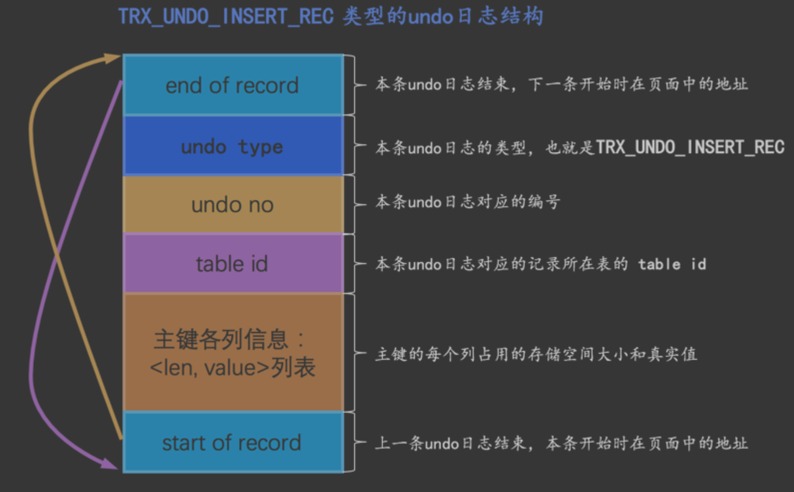
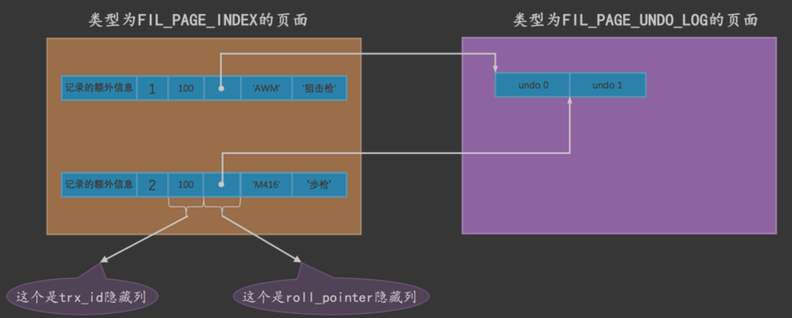
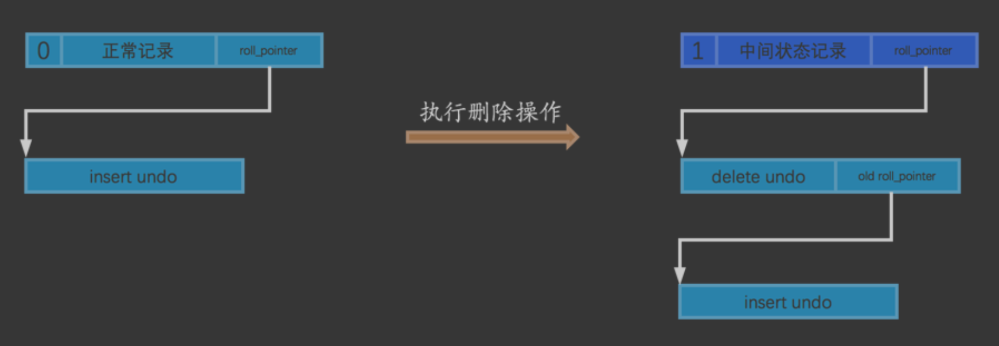
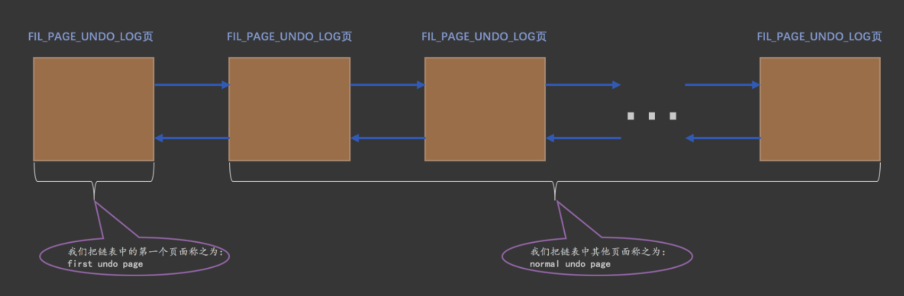
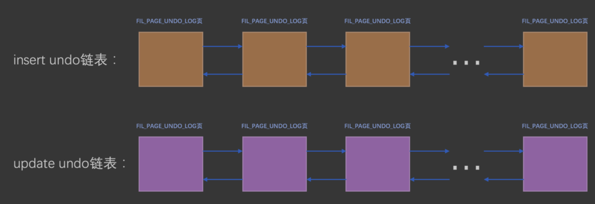

#事务id
##事务分配id的时机
```asp
于只读事务来说，只有在它第一次对某个用户创建的临时表执行增、删、改操作时才会为这个事务分配一
个 事务id ，否则的话是不分配 事务id 

这个所谓的内部临时表和我 们手动用CREATE TEMPORARY TABLE创建的用户临时表并不一样，在事务回滚时并不需要把执行SELE CT语句过程中用到的内部临时表也回滚，在执行SELECT语句用到内部临时表时并不会为它分配事务
id。

只有在第一次真正修改记录时(比如使用INSERT、DELETE、UPDATE语 句)，才会被分配一个单独的事务id，这个事务id是递增的

```
##事务id是怎么生成的(Max Trx ID 的属性)
```asp
服务器会在内存中维护一个全局变量，每当需要为某个事务分配一个 事务id 时，就会把该变量的值当作 事 务id 分配给该事务，并且把该变量自增1。
每当这个变量的值为 256 的倍数时，就会将该变量的值刷新到系统表空间的页号为 5 的页面中一个称之为
Max Trx ID 的属性处，这个属性占用 8 个字节的存储空间。
当系统下一次重新启动时，会将上边提到的 Max Trx ID 属性加载到内存中，将该值加上256之后赋值给我们 前边提到的全局变量(因为在上次关机时该全局变量的值可能大于 Max Trx ID 属性值)
```
##trx_id隐藏列

某个对这个聚簇索引记录做改动的语句所在的事务对应的 事务id 

#undo日志的物理结构
```asp
undo日志 是被记录到类型为 FIL_PAGE_UNDO_LOG 的页面中。这些页面可以从系统表空间中分配，也可以从一种专门存放 undo 日志 的表空间，也就是所谓的 undo tablespace 中分配
一般每对一条记录做一次改动，就对应着一条 undo日志 ，但在某些更新记录的操作中，也可能会对应着2 条 undo日志 
```
##INSERT操作对应的undo日志

#roll_pointer

#版本链

#Undo页面链表


```asp
刚刚开启事务时，一个 Undo页面 链表也不分配。 当事务执行过程中向普通表中插入记录或者执行更新记录主键的操作之后，就会为其分配一个 普通表的 insert undo链表 。
当事务执行过程中删除或者更新了普通表中的记录之后，就会为其分配一个 普通表的update undo链表 。 当事务执行过程中向临时表中插入记录或者执行更新记录主键的操作之后，就会为其分配一个 临时表的 insert undo链表 。
当事务执行过程中删除或者更新了临时表中的记录之后，就会为其分配一个 临时表的update undo链表
```
#回滚段
