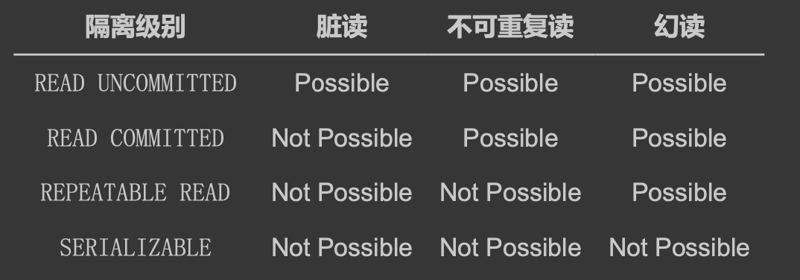
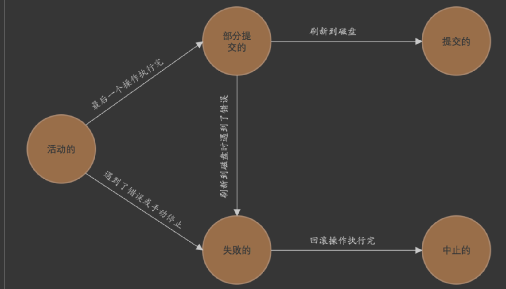
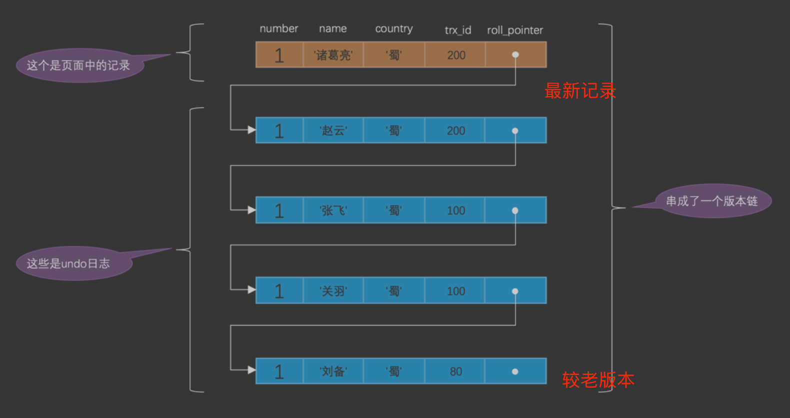
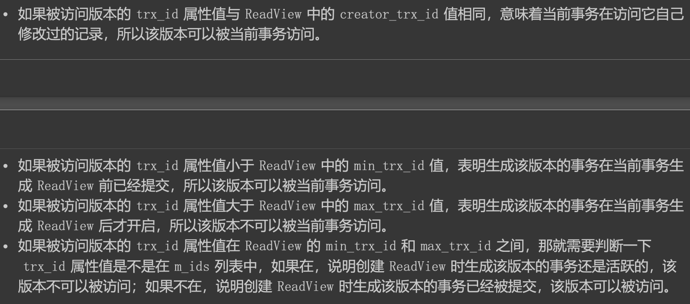
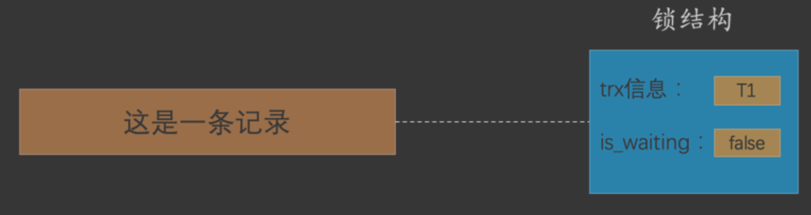
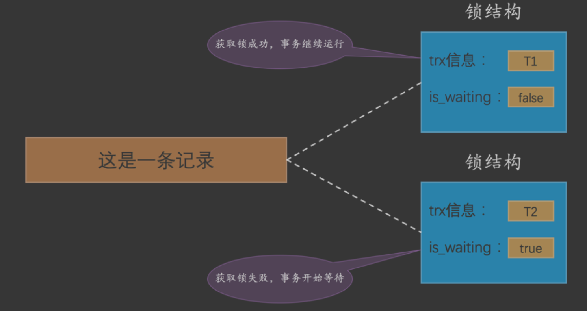
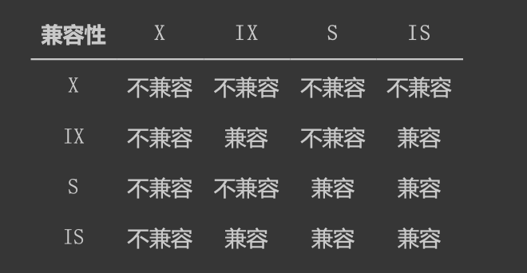
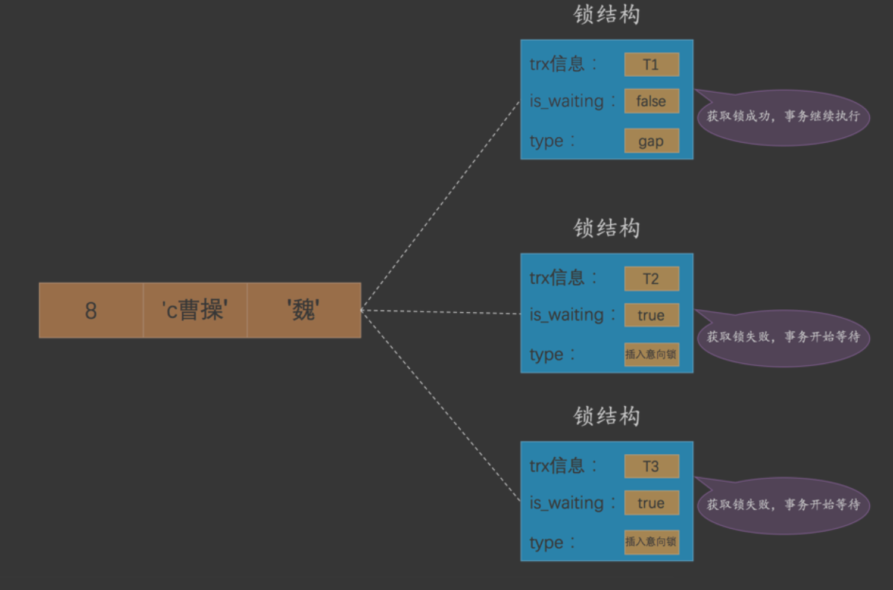

#事务属性ACID
对象:一个系统,系统涉及好几个成员
过程:系统可以同时并行执行
a原子性:一个系统的多个成员的状态(a1,a2,a3)必须一起转移到(b1,b2,b3)状态,不能只有部分转移,部分转移则回退到原始状态
c一致性:一个系统的多个成员的状态(a1,a2,a3)必须一起转移到(c1,c2,c3)的有效状态
i隔离性:多个系统并发执行时,互相不影响
d持久性:执行结果持久化
#事务&内存&磁盘
##事务刷盘时机
##commit
##rollback
#事务并发问题
##脏写
一个事务修改了另一个未提交事务修改过的数据
这是因为脏写这个问题太严重了，不论是哪种隔离级别，都不允许脏 写的情况发生
##脏读
一个事务读到了另一个未提交事务修改过的数据
##不可重复读
两次读的不一样
##幻读(Phantom)
读到了不应该读到的列，幻读问题的产生是因为某个事务读了一个范围的记录，之后别的事务在该范围内插入了新记录，
该事务再次读取该范围的记录时，可以读到新插入的记录，所以幻读问题准确的说并不是因为读取
和写入一条相同记录而产生的
#事务隔离级别

##READ UNCOMMITTED 
读到未提交的
##READ COMMITTED
读到已提交的
##REPEATABLE READ
可重复性去读，MySQL在REPEATABLE READ隔离级别下，是可以禁止幻读问题的发生的
##SERIALIZABLE
序列化

#事务状态

#MVCC
[](https://github.com/twitter-forks/mysql/blob/master/storage/innobase/include/read0read.h#L124)
```asp
trx_id:每次一个事务对某条聚簇索引记录进行改动时，都会把该事务的 事务id 赋值给 trx_id 隐藏列
roll_pointer:每次对某条聚簇索引记录进行改动时，都会把旧的版本写入到 undo日志 中，然后这个隐藏 列就相当于一个指针，
可以通过它来找到该记录修改前的信息

实际上insert undo只在事务回滚时起作用，当事务提交后，该类型的undo日志就没用了，它占用的Und o Log Segment也会被系统回收(也就是该undo
日志占用的Undo页面链表要么被重用，要么被释放)。 虽然真正的insert undo日志占用的存储空间被释放了，但是roll_pointer的值并不会被清除，
roll_po inter属性占用7个字节，第一个比特位就标记着它指向的undo日志的类型，如果该比特位的值为1时， 就代表着它zhi向的undo日志类型为insert undo。
所以我们之后在画图时都会把insert undo给去掉， 大家留意一下就好了

每次对记录进行改动，都会记录一条 undo日志 ，每条 undo日志 也都有一个 roll_pointer 属性( INSERT 操作 对应的 undo日志 没有该属性，
因为该记录并没有更早的版本)，可以将这些 undo日志 都连起来，串成一个链 表，

```
##版本链

所有的版本都会被 roll_pointer 属性连接成一个链表，我们把这个链表称之为 版本链 ，版本链的头节点就是当 前记录最新的值。
另外，每个版本中还包含生成该版本时对应的 事务id
[mysql是怎么运行的]

##read view
核心问题就是:需要判断一下版本链中的哪个版本是当前事务可见的。为 此，设计 InnoDB 的大叔提出了一个 ReadView 的概念
read view在创建后就不会改变了
```asp
m_ids :表示在生成 ReadView 时当前系统中活跃的读写事务的 事务id 列表。
min_trx_id :表示在生成 ReadView 时当前系统中活跃的读写事务中最小的 事务id ，也就是 m_ids 中的最 小值。
max_trx_id :表示生成 ReadView 时系统中应该分配给下一个事务的 id 值。
小贴士:
注意max_trx_id并不是m_ids中的最大值，事务id是递增分配的。比方说现在有id为1，2，3这三 个事务，之后id为3的事务提交了。
那么一个新的读事务在生成ReadView时，m_ids就包括1和2，mi n_trx_id的值就是1，max_trx_id的值就是4。
creator_trx_id :表示生成该 ReadView 的事务的 事务id 

我们之前说执行DELETE语句或者更新主键的UPDATE语句并不会立即把对应的记录完全从页面中删除，而 是执行一个所谓的delete mark操作，
相当于只是对记录打上了一个删除标志位，这主要就是为MVCC服 务的，大家可以对比上边举的例子自己试想一下怎么使用。 
另外，所谓的MVCC只是在我们进行普通的SEELCT查询时才生效
```

###READ COMMITTED生成read view时机
每次读取数据前都生成一个ReadView,使用READ COMMITTED隔离级别的事务在每次查询开始时都会生成一个独立的ReadView
例子,[mysql是怎么运行的,24.3.2]
###REPEATABLE READ生成read view时机
对于使用 REPEATABLE READ 隔离级别的事务来说，只会在第一次执行查询语句时生成一个 ReadView ，之后的查 询就不会重复生成了。
例子,[mysql是怎么运行的,24.3.2]

#锁
##锁释放时机
InnoDB使用锁来保证不会有脏写情况的发生，也就是在第一个事务更新了某 条记录后，就会给这条记录加锁，另一个事务再次更新时就需要等待第一个事务提交了
把锁释放之后才可以继续更新
##脏写,并发事务有了MVCC还需要锁?
并发事务相继对相同的记录做出改动,在这种情况下会发生 脏写 的问题，任何一种隔离级别都不允许这种问题的发生。所以在多 个未提交事务相继对一条
记录做改动时，需要让它们排队执行，这个排队的过程其实是通过 锁 来实现的。 这个所谓的 锁 其实是一个内存中的结构，在事务执行前本来是没有锁的，
也就是说一开始是没有 锁结构 和 记录进行关联的

当一个事务想对这条记录做改动时，首先会看看内存中有没有与这条记录关联的 锁结构 ，当没有的时候就 会在内存中生成一个 锁结构 与之关联。
比方说事务 T1 要对这条记录做改动，就需要生成一个 锁结构 与之 关联:

```asp
trx信息 :代表这个锁结构是哪个事务生成的。
is_waiting :代表当前事务是否在等待

因为之前没有别的事务 为这条记录加锁，所以 is_waiting 属性就是 false ，我们把这个场景就称之为获取锁成功，或者加锁 成功
```

[mysql是怎么运行的,25.1]
##共享锁S和独占锁X
共享锁 ，英文名: Shared Locks ，简称 S锁 。在事务要读取一条记录时，需要先获取该记录的 S锁 。
独占锁 ，也常称 排他锁 ，英文名: Exclusive Locks ，简称 X锁 。在事务要改动一条记录时，需要先获 取该记录的 X锁 


##表锁

##意向锁

```asp
IS、IX锁是表级锁，它们的提出仅仅为了在之后加表级别的S锁和X锁时可以快速判断表中的记录是否 被上锁，以避免用遍历的方式来查看表中有没有上锁的记录，
也就是说其实IS锁和IX锁是兼容的，IX锁和IX锁是 兼容的。
```
```asp
我们在对教学楼整体上锁( 表锁 )时，怎么知道教学楼中有没有教室已经被上锁( 行锁 )了呢?依次检查每一 间教室门口有没有上锁?那这效率也太慢了吧!
遍历是不可能遍历的，这辈子也不可能遍历的，于是乎设计InnoDB 的大叔们提出了一种称之为 意向锁 

意向共享锁，英文名: Intention Shared Lock ，简称 IS锁 。当事务准备在某条记录上加 S锁 时，需要先 在表级别加一个 IS锁 。
意向独占锁，英文名: Intention Exclusive Lock ，简称 IX锁 。当事务准备在某条记录上加 X锁 时，需 要先在表级别加一个 IX锁

学生在教学楼门口加IS锁时，是不关心教学楼门口是否有IX锁的，维修工在教学楼门口加IX锁时，是不 关心教学楼门口是否有IS锁或者其他IX锁的。
IS和IX锁只是为了判断当前时间教学楼里有没有被占用的 教室用的，也就是在对教学楼加S锁或者X锁时才会用到
```

##行锁
在记录上加的锁
###LOCK_REC_NOT_GAP
正经记录锁 是有 S锁 和 X锁 之分的
###Gap Locks
###Next-Key Locks 
###Insert Intention Locks 

[mysql是怎么运行的,25.1]
#脏读、不可重复读、幻读解决方案
##一致性读
读操作利用多版本并发控制( MVCC )，写操作进行 加锁

采用 MVCC 方式的话， 读-写 操作彼此并不冲突，性能更高，采用 加锁 方式的话， 读-写 操 作彼此需要排队执行，影响性能。一般情况下我们当然愿意
采用 MVCC 来解决 读-写 操作并发执行的问 题，但是业务在某些特殊情况下，要求必须采用 加锁 的方式执行，
##锁定读
读、写操作都采用 加锁 
```asp
如果我们的一些业务场景不允许读取记录的旧版本，而是每次都必须去读取记录的最新版本，比方在银 行存款的事务中，你需要先把账户的余额读出来，
然后将其加上本次存款的数额，最后再写到数据库 中。在将账户余额读取出来后，就不想让别的事务再访问该余额，直到本次存款事务执行完成，其他事 
务才可以访问账户的余额。这样在读取记录的时候也就需要对其进行 加锁 操作，这样也就意味着 读 操 作和 写 操作也像 写-写 操作那样排队执行
```
