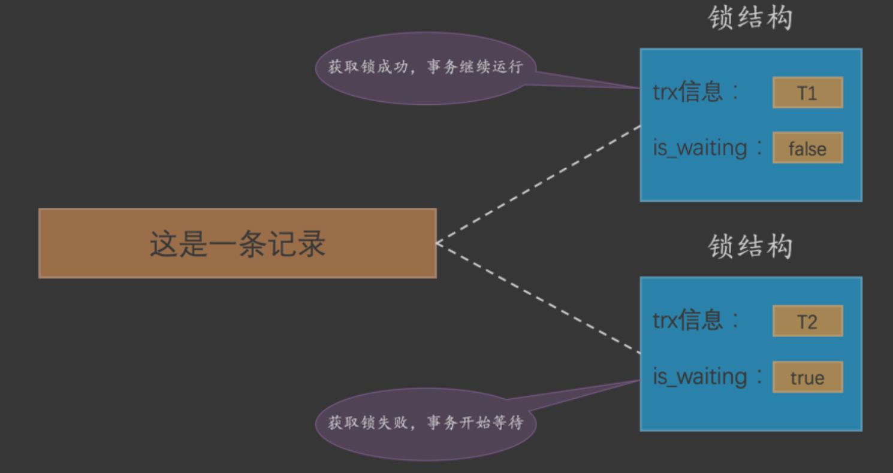
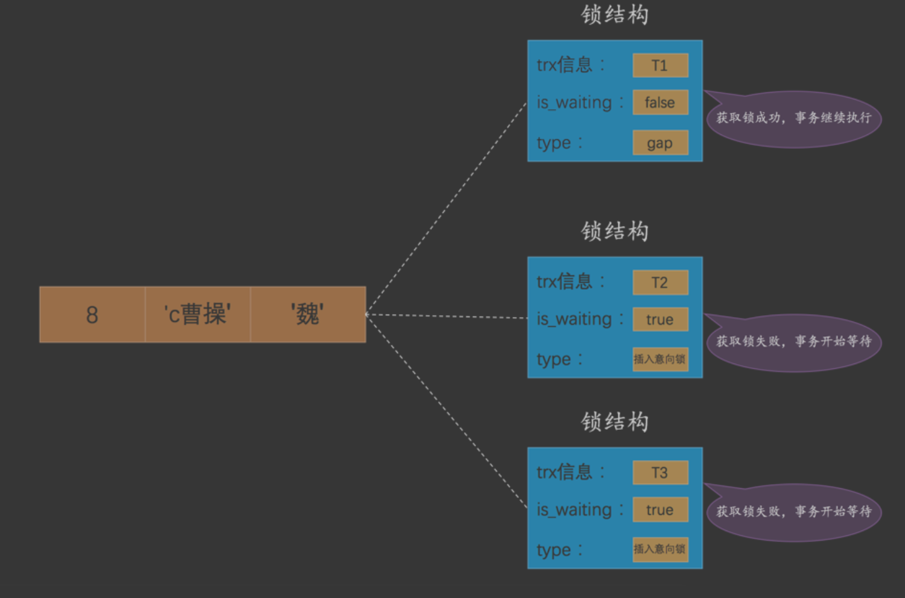

一致性读,快照读
锁定读,共享锁和独占锁
意向锁IX IS相互兼容，与表锁互斥
记录锁
gap锁 的提出仅仅是为了防止插入幻影记录而提出的
#锁
##锁释放时机(两阶段锁)
InnoDB使用锁来保证不会有脏写情况的发生，也就是在第一个事务更新了某 条记录后，就会给这条记录加锁，另一个事务再次更新时就需要等待第一个事务提交了
把锁释放之后才可以继续更新
[](https://segmentfault.com/a/1190000038163191)
##脏写,并发事务有了MVCC还需要锁?
并发事务相继对相同的记录做出改动,在这种情况下会发生 脏写 的问题，任何一种隔离级别都不允许这种问题的发生。所以在多 个未提交事务相继对一条
记录做改动时，需要让它们排队执行，这个排队的过程其实是通过 锁 来实现的。 这个所谓的 锁 其实是一个内存中的结构，在事务执行前本来是没有锁的，
也就是说一开始是没有 锁结构 和 记录进行关联的

当一个事务想对这条记录做改动时，首先会看看内存中有没有与这条记录关联的 锁结构 ，当没有的时候就 会在内存中生成一个 锁结构 与之关联。
比方说事务 T1 要对这条记录做改动，就需要生成一个 锁结构 与之 关联:

```asp
trx信息 :代表这个锁结构是哪个事务生成的。
is_waiting :代表当前事务是否在等待

因为之前没有别的事务 为这条记录加锁，所以 is_waiting 属性就是 false ，我们把这个场景就称之为获取锁成功，或者加锁 成功
```

[mysql是怎么运行的,25.1]
##共享锁S和独占锁X
共享锁 ，英文名: Shared Locks ，简称 S锁 。在事务要读取一条记录时，需要先获取该记录的 S锁 。
独占锁 ，也常称 排他锁 ，英文名: Exclusive Locks ，简称 X锁 。在事务要改动一条记录时，需要先获 取该记录的 X锁 


##表锁

##意向锁

```asp
IS、IX锁是表级锁，它们的提出仅仅为了在之后加表级别的S锁和X锁时可以快速判断表中的记录是否 被上锁，以避免用遍历的方式来查看表中有没有上锁的记录，
也就是说其实IS锁和IX锁是兼容的，IX锁和IX锁是 兼容的。
```
```asp
我们在对教学楼整体上锁( 表锁 )时，怎么知道教学楼中有没有教室已经被上锁( 行锁 )了呢?依次检查每一 间教室门口有没有上锁?那这效率也太慢了吧!
遍历是不可能遍历的，这辈子也不可能遍历的，于是乎设计InnoDB 的大叔们提出了一种称之为 意向锁 

意向共享锁，英文名: Intention Shared Lock ，简称 IS锁 。当事务准备在某条记录上加 S锁 时，需要先 在表级别加一个 IS锁 。
意向独占锁，英文名: Intention Exclusive Lock ，简称 IX锁 。当事务准备在某条记录上加 X锁 时，需 要先在表级别加一个 IX锁

学生在教学楼门口加IS锁时，是不关心教学楼门口是否有IX锁的，维修工在教学楼门口加IX锁时，是不 关心教学楼门口是否有IS锁或者其他IX锁的。
IS和IX锁只是为了判断当前时间教学楼里有没有被占用的 教室用的，也就是在对教学楼加S锁或者X锁时才会用到
```

##行锁
在记录上加的锁
###加锁规则

=不存在,也是范围查询
[](https://www.modb.pro/db/74024)
###Gap Locks
如果你对一条记录加了 gap锁 (不论是 共享gap锁 还是 独占gap
锁 )，并不会限制其他事务对这条记录加 正经记录锁 或者继续加 gap锁 ，再强调一遍， gap锁 的作用仅 仅是为了防止插入幻影记录的而已。

这时候应该 想起我们在前边唠叨 数据页 时介绍的两条伪记录了:
Infimum 记录，表示该页面中最小的记录。 Supremum 记录，表示该页面中最大的记录。
为了实现阻止其他事务插入 number 值在 (20, +∞) 这个区间的新记录，我们可以给索引中的最后一条 记录，也就是 number 值为 20 的那条记录所在
页面的 Supremum 记录加上一个 gap锁 ，画个图就是这 样:
###Next-Key Locks 

###Insert Intention Locks 

我们说一个事务在插入一条记录时需要判断一下插入位置是不是被别的事务加了所谓的 gap锁 ( next-key 锁 也包含 gap锁 ，后边就不强调了)，如果有的话，
插入操作需要等待，直到拥有 gap锁 的那个事务提 交。但是设计 InnoDB 的大叔规定事务在等待的时候也需要在内存中生成一个 锁结构 ，表明有事务想在某 个 间隙 
中插入新记录，但是现在在等待。设计 InnoDB 的大叔就把这种类型的锁命名为 Insert Intention Locks ，官方的类型名称为: LOCK_INSERT_INTENTION ，我们也可以称为 插入意向锁 
[mysql是怎么运行的,25.1]
事实上插入意向锁并不会阻止别的事务继 续获取该记录上任何类型的锁
##两阶段加锁协议
