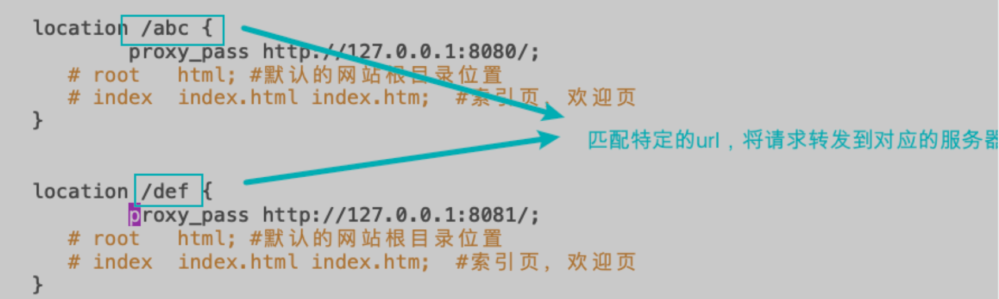

## 2/8预测      

```
1.nginx路由转发配置
2.静态资源配置
3.nginx负载均衡
4.nginx动静分离
5.nginx 零拷贝
6.nginx selector
```
## 索引预习
```
1.核心配置文件
2.反向代理、负载均衡、动静分离
3.进程机制
```
## demo上手

```
./nginx 启动nginx
./nginx -s stop 终止nginx(当然也可以找到nginx进程号，然后使用kill -9 杀掉nginx进程) 
./nginx -s reload (重新加载nginx.conf配置文件)

nginx.conf:全局块、events块、http块
cat /usr/local/etc/nginx/nginx.conf
```
###全局块
```
全局块：worker进 程的数量、错误日志的位置
worker_processes  1;
#error_log  logs/error.log;
```

### events块
```
events块：主要影响nginx服务器与用户的网络连接
events {
    worker_connections  1024;
}
```
### http块
```
http块:请求转发、反向代理、负载均衡

sendfile        on;
keepalive_timeout  65;

#server {
        listen       8000;
        listen       somename:8080;
        server_name  somename  alias  another.alias;

        location / {
            root   html;
            index  index.html index.htm;
        }
    }
```

## 对象模型构建

## 核心概念

###反向代理

###负载均衡
```
upstream lagouServer{
  server 111.229.248.243:8080;
  server 111.229.248.243:8082;
}
```
```
upstream lagouServer{
  ip_hash;
  server 111.229.248.243:8080;
  server 111.229.248.243:8082;
}
```

###多进程模型


## 待续
