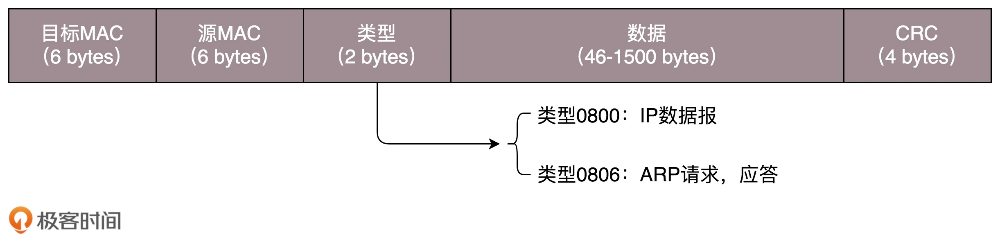

##需求1
这个包是发给谁的？谁应该接收？Medium Access Control，即媒体访问控制,MAC
##MAC地址

局域网使用以太网技术,以太网技术通过MAC地址进行通信

##需求2
大家都在发，会不会产生混乱？有没有谁先发、谁后发的规则？

##以太网技术
技术概念,局域网的一种实现方式
带冲突检测的载波侦听多路访问（CSMA/CD）技术

星状拓扑

##需求3
如果发送的时候出现了错误，怎么办？
##方案:循环冗余检测
