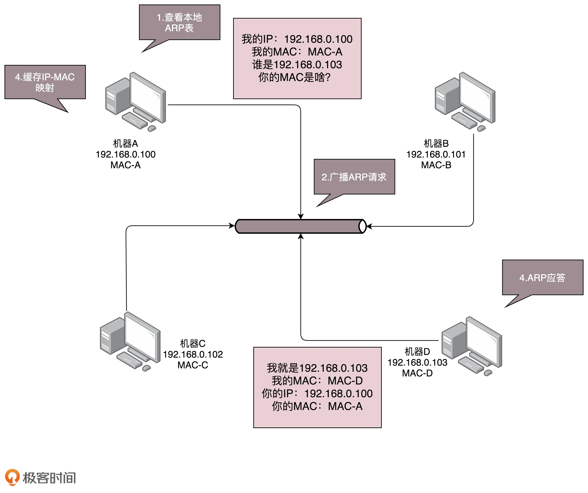
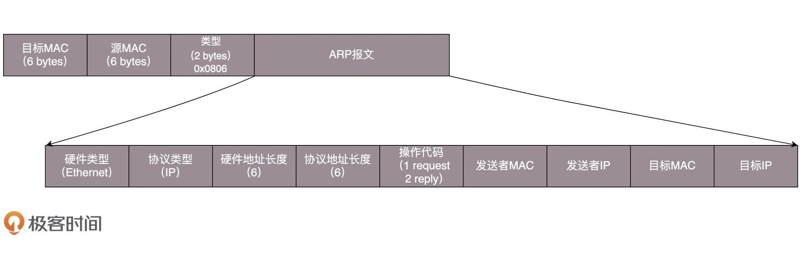
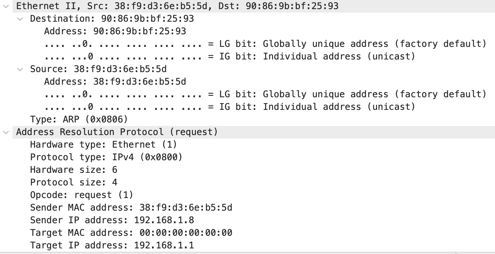

##需求
通过ip地址获取mac地址,MAC地址用于局域网通信
##对象模型
寻找mac地址过程

##协议方案

抓包详情(断网然后联网)

##优化,arp缓存
为了避免每次都用 ARP 请求，机器本地也会进行 ARP 缓存
当然机器会不断地上线下线，IP 也可能会变，所以 ARP 的 MAC 地址缓存过一段时间就会过期
arp推送更新ip和mac映射

##arp操作
查看ip mac映射:arp -a
