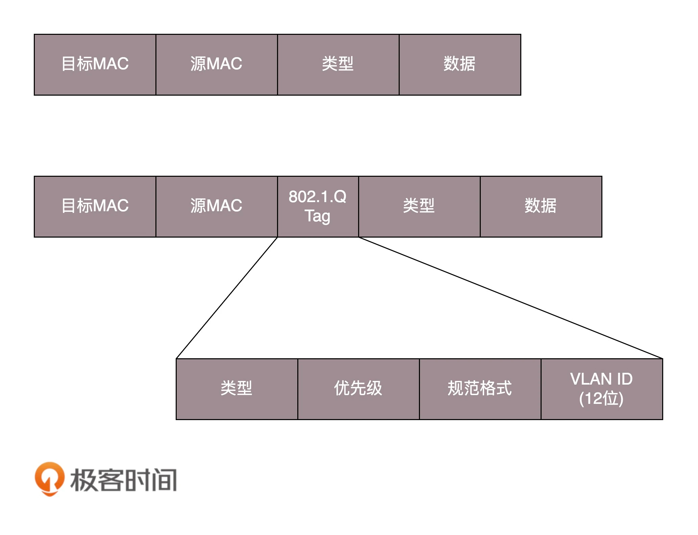

##hub
一层网络设备传输数据而不控制任何流量，比如集线器。任何进入端口数据包会被转发到除进入端口之外的其他所有端口

##交换机

二层交换机依据硬件地址（MAC 地址）在数据链路层（第二层）传送网络帧
当交换机接受的数据帧的目的地址在该映射表中被查到，交换机便将该数据帧送往对应的端口。
如果它查不到，便将该数据帧广播到该端口所属虚拟局域网（VLAN）的所有端口，如果有回应数据包，
交换机便将在映射表中增加新的对应关系。当交换机初次加入网络中时，由于映射表是空的，
所以，所有的数据帧将发往虚拟局域网内的全部端口直到交换机“学习”到各个MAC 地址为止。
这样看来，交换机刚刚启动时与传统的共享式集线器作用相似的，直到映射表创建起来后，才能真正发挥它的性能

###广播问题
物理隔离:路由器
虚拟隔离:VLAN,MAC层加tag

###广播风暴

##路由器
