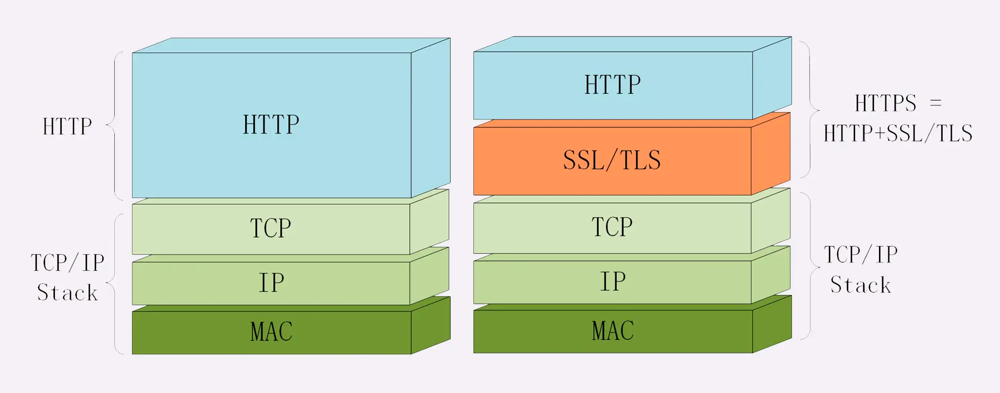

#https
http+TLS,目前是 1.2

##术语
密钥,密文
##加密套件TLS
算法组合

密钥交换算法 + 签名算法 + 对称加密算法 + 摘要算法
“握手时使用 ECDHE 算法进行密钥交换，用 RSA 签名和身份认证，握手后的通信使用 AES 对称算法，密钥长度 256 位，分组模式是 GCM，摘要算法 SHA384 用于消息认证和产生随机数。”
#5大问题
##机密性(混合加密,RSA+对称加密AES)
##完整性(摘要算法,SHA384)
##身份认证(数字签名,摘要算法+私钥加密)
使用私钥再加上摘要算法，就能够实现“数字签名”，同时实现“身份认证”和“不可否认”
就是把公钥私钥的用法反过来，之前是公钥加密、私钥解密，现在是私钥加密、公钥解密。但又因为非对称加密效率太低，所以私钥只加密原文的摘要，
这样运算量就小的多，而且得到的数字签名也很小，方便保管和传输

##不可否认(摘要算法+私钥加密)
靠数字签名解决，内容摘要算法得到摘要，私钥加密摘要，对方使用对应公钥解密，得到摘要，再和自己得到的服务器提供的原文摘要对比，
一致说明这个内容就是原服务器提供的，由证书说明了服务器的身份
##重放(nonce)
需要时间戳和随机数再合起来做一个不可逆的签名,nonce
#对称加密(AES)
AES256,密钥长度256bit

##分组模式
AES128-GCM,密钥长度为 128 位的 AES 算法，使用的分组模式是 GCM

#非对称加密(RSA)
RSA 2048

##公钥
公钥加密后只能用私钥解密，反过来，私钥加密后也只能用公钥解密
网站秘密保管私钥，在网上任意分发公钥，你想要登录网站只要用公钥加密就行了，
密文只能由私钥持有者才能解密。而黑客因为没有私钥，所以就无法破解密文。

##私钥
##密钥交换
##数字签名(身份认证)
使用私钥再加上摘要算法，就能够实现“数字签名”，同时实现“身份认证”和“不可否认”
就是把公钥私钥的用法反过来，之前是公钥加密、私钥解密，现在是私钥加密、公钥解密。但又因为非对称加密效率太低，所以私钥只加密原文的摘要，
这样运算量就小的多，而且得到的数字签名也很小，方便保管和传输

#混合加密(RSA+AES)
可以看到，RSA 的运算速度是非常慢的，2048 位的加解密大约是 15KB/S（微秒或毫秒级），而 AES128 则是 13MB/S（纳秒级），差了几百倍
```asp

aes_128_cbc enc/dec 1000 times : 0.97ms, 13.11MB/s

rsa_1024 enc/dec 1000 times : 138.59ms, 93.80KB/s
rsa_1024/aes ratio = 143.17

rsa_2048 enc/dec 1000 times : 840.35ms, 15.47KB/s
rsa_2048/aes ratio = 868.13
```

##密钥交换(RSA非对称加密)
#摘要算法(SHA256,完整性)
摘要算法,散列函数、哈希函数
摘要算法近似地理解成一种特殊的压缩算法，它能够把任意长度的数据“压缩”成固定长度、而且独一无二的“摘要”字符串，就好像是给这段数据生成了一个数字“指纹”
特殊的“单向”加密算法,只有算法，没有密钥，加密后的数据无法解密，不能从摘要逆推出原文

真正的完整性必须要建立在机密性之上，在混合加密系统里用会话密钥加密消息和摘要，这样黑客无法得知明文

##伪随机数
输入的微小不同会导致输出的剧烈变化，所以也被 TLS 用来生成伪随机数
#证书认证机构(CA,权威机构通过签名对个人公钥进行担保)
由它来给各个公钥签名，用自身的信誉来保证公钥无法伪造，是可信的
有了这个证书体系，操作系统和浏览器都内置了各大 CA 的根证书，上网的时候只要服务器发过来它的证书，就可以验证证书里的签名，顺着证书链（Certificate Chain）
一层层地验证，直到找到根证书，就能够确定证书是可信的，从而里面的公钥也是可信的

服务器返回的是证书链（不包括根证书，根证书预置在浏览器中），然后浏览器就可以使用信任的根证书（根公钥）解析证书链的根证书得到一级证书的公钥+摘要验签，
然后拿一级证书的公钥解密一级证书拿到二级证书的公钥和摘要验签，再然后拿二级证书的公钥解密二级证书得到服务器的公钥和摘要验签，验证过程就结束了
#https 连接流程(2RTT)
[](https://time.geekbang.org/column/article/110354)


ECDHE

RSA

##TLS套件版本沟通
```asp

Handshake Protocol: Client Hello
    Version: TLS 1.2 (0x0303)
    Random: 1cbf803321fd2623408dfe…
    Cipher Suites (17 suites)
        Cipher Suite: TLS_ECDHE_RSA_WITH_AES_128_GCM_SHA256 (0xc02f)
        Cipher Suite: TLS_ECDHE_RSA_WITH_AES_256_GCM_SHA384 (0xc030)
```
```asp

Handshake Protocol: Server Hello
    Version: TLS 1.2 (0x0303)
    Random: 0e6320f21bae50842e96…
    Cipher Suite: TLS_ECDHE_RSA_WITH_AES_256_GCM_SHA384 (0xc030)
```
##服务端身份认证
1.浏览器内置CA证书(公钥)
2.服务端证书(服务端公钥+服务端公钥的摘要验签,验签由二级证书的公钥加密)
##交换随机数
客户端随机数+服务端随机数+pre-master-> 主密钥,会话密钥
三个不可靠的随机数混合起来，那么“随机”的程度就非常高了

##DH算法生成Pre Master Secret
[](https://halfrost.com/cipherkey/)
##随机数+pre master生成主密钥&会话密钥
###主密钥

用于加密密钥的密钥被称为KEK(Key Encrypting Key)
###会话密钥
每次会话都会产生新的会话密钥，即使密钥被窃听了，也只会影响本次会话
加密的对象是用户直接使用的信息(内容)，这个时候密钥被称为CEK(Contents Encrypting Key)
##FINISHED
把之前所有发送的数据做个摘要，再加密(公钥)一下，让服务器做个验证
后面都改用对称算法加密通信了啊，用的就是打招呼时说的 AES，加密对不对还得你测一下

#TLS 1.3
```asp

Handshake Protocol: Client Hello
    Version: TLS 1.2 (0x0303)
    Extension: supported_versions (len=11)
        Supported Version: TLS 1.3 (0x0304)
        Supported Version: TLS 1.2 (0x0303)
```

##最大兼容
##强化安全
如果加密系统使用服务器证书里的 RSA 做密钥交换，一旦私钥泄露或被破解（使用社会工程学或者巨型计算机），
那么黑客就能够使用私钥解密出之前所有报文的“Pre-Master”，再算出会话密钥，破解所有密文
```asp
RSA 握手中，Server Hello 后，客户端拿到服务器的证书，从中提取出服务器的公钥，然后用这个公钥去加密客户端生成的一个随机数（会话密钥）得到密文，
然后将其返回给服务器。虽然每次 TLS 握手中的会话密钥都是不一样的，但服务器的私钥却始终不会变。一旦黑客拿到了服务器私钥，并且截获了之前的所有密文，
就能拿到每次会话中的对称密钥，从而得到客户端和服务器的所有“历史会话记录”。

说到底，RSA 握手下，服务器私钥是不变的，从而导致不具有“前向安全”。而 ECDHE 的私钥却是动态的，黑客拿到了一个，也只能解密一个密文
```
##提升性能(1RTT)
1RTT
###PSK(0-RTT,pre_shared_key)
PSK是从以前建立的安全信道中获得的
TLS1.3 还引入了“0-RTT”握手，用“pre_shared_key”和“early_data”扩展，在 TCP 连接后立即就建立安全连接发送加密消息
##流程
```asp

Handshake Protocol: Client Hello
    Version: TLS 1.2 (0x0303)
    Random: cebeb6c05403654d66c2329…
    Cipher Suites (18 suites)
        Cipher Suite: TLS_AES_128_GCM_SHA256 (0x1301)
        Cipher Suite: TLS_CHACHA20_POLY1305_SHA256 (0x1303)
        Cipher Suite: TLS_AES_256_GCM_SHA384 (0x1302)
    Extension: supported_versions (len=9)
        Supported Version: TLS 1.3 (0x0304)
        Supported Version: TLS 1.2 (0x0303)
    Extension: supported_groups (len=14)
        Supported Groups (6 groups)
            Supported Group: x25519 (0x001d)
            Supported Group: secp256r1 (0x0017)
    Extension: key_share (len=107)
        Key Share extension
            Client Key Share Length: 105
            Key Share Entry: Group: x25519
            Key Share Entry: Group: secp256r1
```


#HTTPS 优化
做任何的优化措施，HTTPS 建立连接可能会比 HTTP 慢上几百毫秒甚至几秒，这其中既有网络耗时，也有计算耗时
##HTTPS比HTTP多出的过程
1.HTTPS 比 HTTP 增加了一个 TLS 握手的步骤，这个步骤最长可以花费两个消息往返，也就是 2-RTT
2.产生用于密钥交换的临时公私钥对（ECDHE）
3.验证证书时访问 CA
4.非对称加密解密处理“Pre-Master”

##HTTPS优化(计算密集型)
###硬件
更快的 CPU
SSL 加速卡
###软件
###协议
协议优化,TLS1.2 -> TLS1.3
RSA -> 椭圆曲线 ECDHE,224 位的 ECC 相当于 2048 位的 RSA
###证书
证书优化,选择椭圆曲线（ECDSA）证书而不是 RSA 证书
##master key复用
###会话复用(session,1-RTT)
```asp

Handshake Protocol: Client Hello
    Version: TLS 1.2 (0x0303)
    Session ID: 13564734eeec0a658830cd…
    Cipher Suites Length: 34


Handshake Protocol: Server Hello
    Version: TLS 1.2 (0x0303)
    Session ID: 13564734eeec0a658830cd…
    Cipher Suite: TLS_ECDHE_RSA_WITH_AES_256_GCM_SHA384 (0xc030)
```

###会话票证(Ticket,1-RTT)
重连的时候，客户端使用扩展“session_ticket”发送“Ticket”而不是“Session ID”
不过“Session Ticket”方案需要使用一个固定的密钥文件（ticket_key）来加密 Ticket，为了防止密钥被破解，保证“前向安全”，密钥文件需要定期轮换，
比如设置为一小时或者一天。
###预共享密钥(Pre-shared Key)
解决的办法是只允许安全的 GET/HEAD 方法（参见第 10 讲），在消息里加入时间戳、“nonce”验证，或者“一次性票证”限制重放。
#OpenSSL
是一个著名的开源密码学程序库和工具包，几乎支持所有公开的加密算法和协议，已经成为了事实上的标准，许多应用软件都会使用它作为底层库来实现 TLS 功能，
包括常用的 Web 服务器 Apache、Nginx 等
