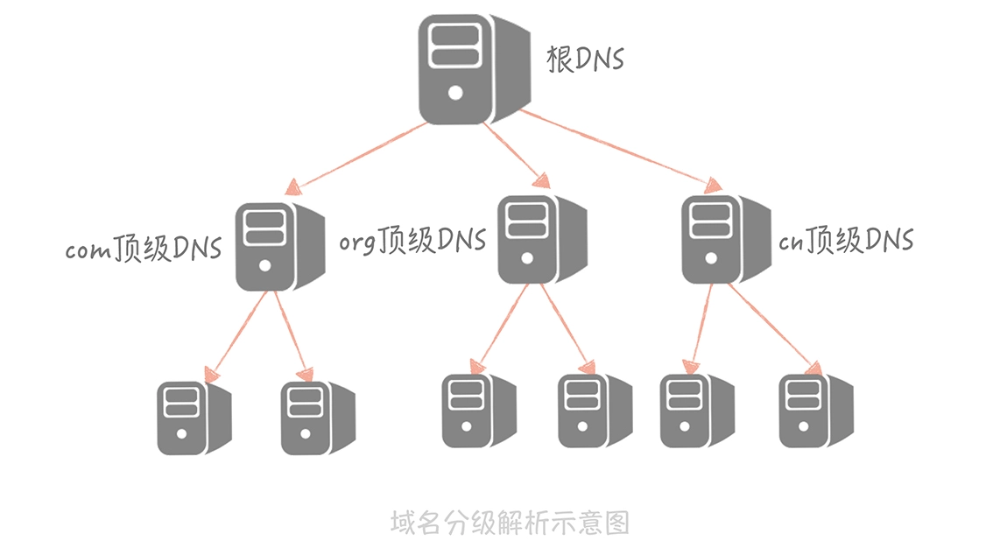
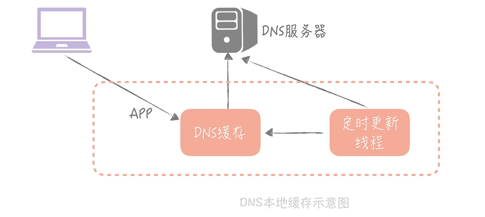
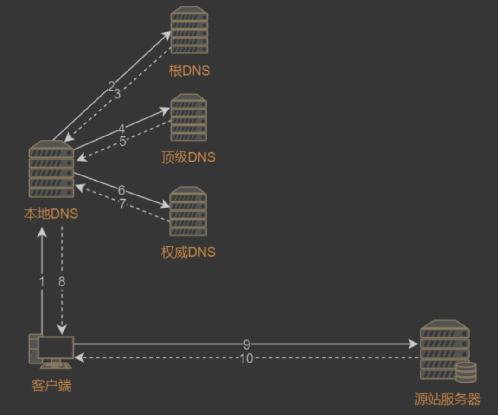
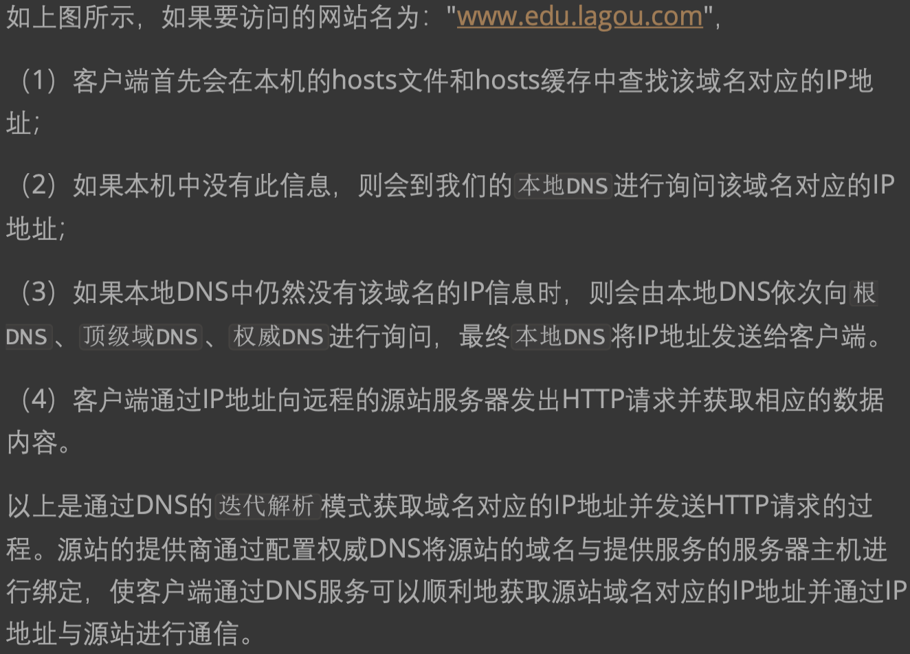
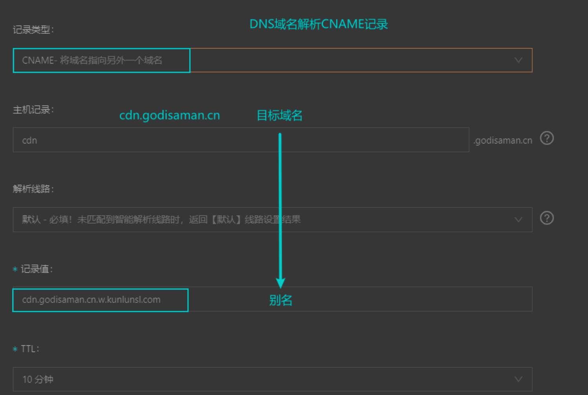

#临界知识
DNS解析过程
DNS三种常用记录类型
#DNS
[拉钩web应用]
##拓扑



```asp
1.hosts(本机)->  
2.Local DNS(运营商)->  
3.根 DNS 返回顶级 DNS（.com）的地址->  
4.com 顶级 DNS 得到 baidu.com 的域名服务器地址
5.再从 baidu.com 的域名服务器中查询到 www.baidu.com 对应的 IP 地址
6.写入 Local DNS 的解析结果缓存,下一次的解析同一个域名就不需要做 DNS 的迭代查询
```

##DNS记录类型
记录由包含4个字 段的数据构成:Name、Value、Type、TTL。其中Name和Value可以理解为一 对键值对，但是其具体含义取决于Type的类型，TTL记录
了该条记录应当从缓存 中删除的时间
###A记录(域名<->ip)
A记录用于描述目标域名到IP地址的映射关系，将目标域名与A记录的 Name字段进行匹配，将成功匹配的记录的Value字段的内容(IP地址)输出到 DNS回应报文中

###NS记录(域名->DNS ip)
Name Server
NS记录用于描述目标域名到负责解析该域名的DNS的映射关系，根据目标 域名对NS记录的Name字段进行匹配，将成功匹配的记录的Value字段
(负责解 析目标域名的DNS的IP地址)输出到DNS回应报文中
###CNAME(域名<->域名)  
CNAME记录用于描述目的域名和别名的对应关系，如果说A记录可以将目 标域名转换为对应主机的IP地址，那么CNAME记录则可以将一个域名(别名) 转换为另一个域名，
如果多条CNAME记录指向同一个域名，则可以将多个不同 的域名的请求指向同一台服务器主机。
并且，CNAME记录通常还对应了一条A 记录，用于提供被转换的域名的IP地址


##ip vs 域名
域名可以在阿里云购买
固定ip可以在运营商购买
##DNS负载均衡
对于域名服务器:域名可以有多个IP（或多条CNAME记录），这是提供负载均衡的一种方式
对于应用服务器:每台服务器的IP是唯一的,每台服务器可以绑定很多域名，每个域名都是可以解析到这台服务器的IP，这样就可以实现很多域名访问同一台服务器
##应用
[aliDNS](https://www.alidns.com/)

