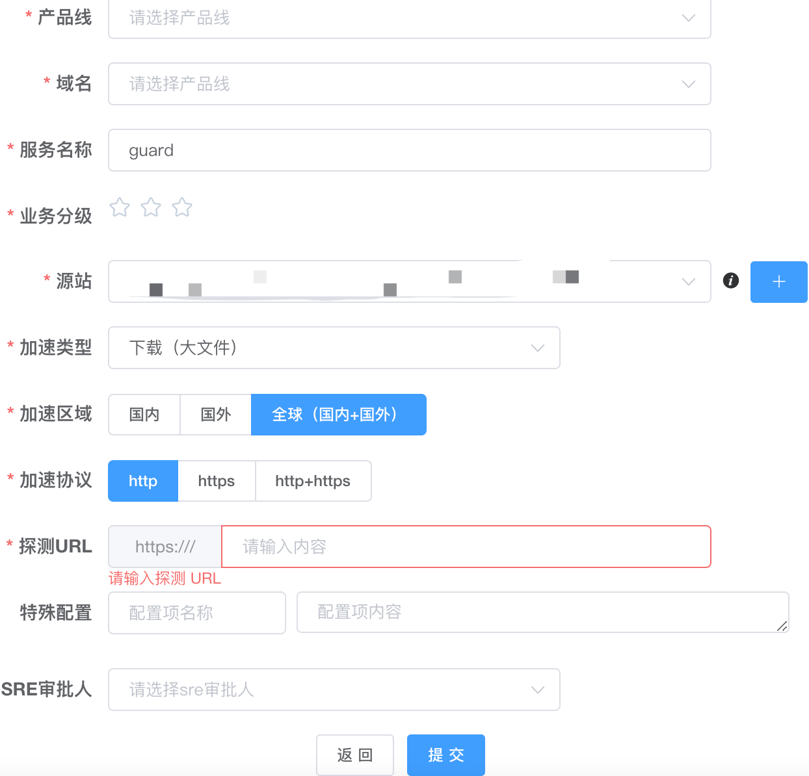

#临界知识
CDN的请求过程,dns->cname->cdn全局负载均衡->cdn就近节点(边缘节点)
CDN原理,CNAME+全局负载均衡
源站:服务的域名
CDN域名:CNAME到的CDN域名
CDN全局负载均衡:高级DNS,DNS NS记录
CDN缓存:nginx opestry
#需求
使用边缘节点 对 静态资源 网络加速
##静态资源(图片,视频)
```asp
对于移动 APP 来说，这些静态资源主要是图片、视频和流媒体信息
对于 Web 网站来说，则包括了 JavaScript 文件、CSS 文件、静态 HTML 文件等等
```
##如何加速?(避免公网骨干网络,就近访问)
```asp
读请求量极大并且对访问速度的要求很高还占据了很高的带宽，这时会出现访问速度慢带宽被占满影响动态请求的问题

如果我们的应用服务器和分布式缓存都部署在北京的机房里，这时一个杭州的用户要访问缓存中的一个视频，那这个视频文件就需要从北京传输到杭州，
期间会经过多个公网骨干网络，延迟很高，会让用户感觉视频打开很慢，严重影响到用户的使用体验
```
#CDN(Content Distribution Network,用户就近物理机)
```asp
静态的资源分发到位于多个地理位置机房中的服务器上，因此它能很好地解决数据就近访问的问题，也就加快了静态资源的访问速度
```
网宿、阿里云、腾讯云
##相关术语

###源站
客户真正的服务器
###边缘服务器
边缘服务器节点就是实际提
供给用户就近连接、访问的服务器
###CDN命中率
CDN一般提供的是静态加速能力，静态加速能力通常通过缓存架构来实现， CDN命中指的是CDN服务器有该资源缓存存在，请求到达CDN节点时，CDN服 务器可以在本地缓存获取资源直接返回客户端，
如果没有命中，则需要CDN节 点到源站获取资源。CDN命中的概率即CDN命中率
###回源
当CDN没有命中缓存时，需要到源站去获取资源，这个过程称为回源
###中间层服务器
存在缓存穿透的问题。为了避免回源引起的性能大幅下降，在CDN的中间层服务器将多个CDN节点的访问进行收敛
##拓扑
[](https://time.geekbang.org/column/article/154490)
[](https://time.geekbang.org/column/article/120664)
[](https://time.geekbang.org/column/article/10085)
[](https://time.geekbang.org/column/article/3716)

边缘节点

服务域名
运营商DNS:CNAME,域名映射域名,www.baidu.com->www.a.shifen.com(CDN的域名),解析CDN域名对于的ip(一般是CDN厂商的dns服务器ip)
CDN服务商
CDN域名
CDN转发


##全局负载均衡(高级DNS服务器,ip地理位置)


```asp
CDN网络架构主要由两大部分，分为中心和边缘两部分:
中心指CDN网关中心和DNS重定向解析中心，负责全局负载均衡，设备系统 安装在管理中心机房
边缘主要指异地节点，CDN分发的载体，主要由Cache和负载均衡器等组成
```


```asp
高速缓存服务器(Cache)负责存储客户网站的大量信息，就像一个靠近用户 的网站服务器一样响应本地用户的访问请求。
理论上，最简单的CDN网络有一个负责全局负载均衡的DNS和各节点一台 Cache，即可运行。DNS支持根据用户源IP地址解析不同的IP，实现就近访问。
为了保证高可用性等，需要监视各节点的流量、健康状况等。一个节点的单台 Cache承载数量不够时，
才需要多台Cache，多台Cache同时工作，才需要负载均衡器，使Cache群协同工作
```
##缓存系统(命中率&回源率)

##问题
###如何将数据同步到CDN
CDN分发,同步静态资源到所有CDN节点上
配置CDN后，如果通过CDN请求不到静态资源,CDN再请求源站
配置

###如何将用户的请求映射到 CDN 节点上(DNS CNAME)
[z_08_DNS_.md]

###如何根据用户的地理位置信息选择到比较近的节点(全局负载均衡器,Global Server Load Balance)
```asp
1.让流量平均分配使得下面管理的服务器的负载更平均
2.流量流经的服务器与流量源头在地缘上是比较接近
```
###对于无法缓存的动态资源，你觉得 CDN 也能有加速效果吗？
cache-control允许缓存的动态资源可以被CDN缓存。不允许缓存的动态资源会回源
cdn一般有专用的高速网络直连源站，或者是动态路径优化，所以动态资源回源要比通过公网速度快很多
###CDN缓存更新
cdn厂家会提供一些删除和更新的接口
缓存刷新

```asp
CDN提供资源的刷新和预热功能。通过刷新功能，可以强制CDN节点回源并获 取最新文件;通过预热功能可以在业务高峰期预热热门资源，
提高资源访问效率
```

####ip地理位置划分
```asp
1.GSLB 可以通过多种策略来保证返回的 CDN 节点和用户尽量保证在同一地缘区域，比如说可以将用户的 IP 地址按照地理位置划分为若干个区域，然后将 CDN 节点对应到一个区域上，根据用户所在区域来返回合适的节点；
2.也可以通过发送数据包测量 RTT 的方式来决定返回哪一个节点。
```
##应用

厂商有金山,腾讯,阿里
###阿里云CDN服务
[](https://www.aliyun.com/product/cdn)
阿里云 SSD固态硬盘
自定义指定资源内容的缓存过期时间规则
