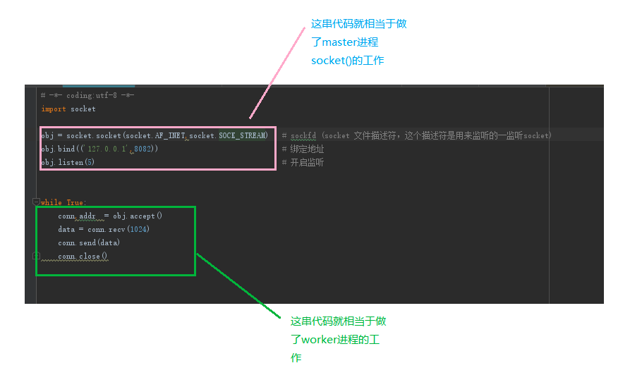
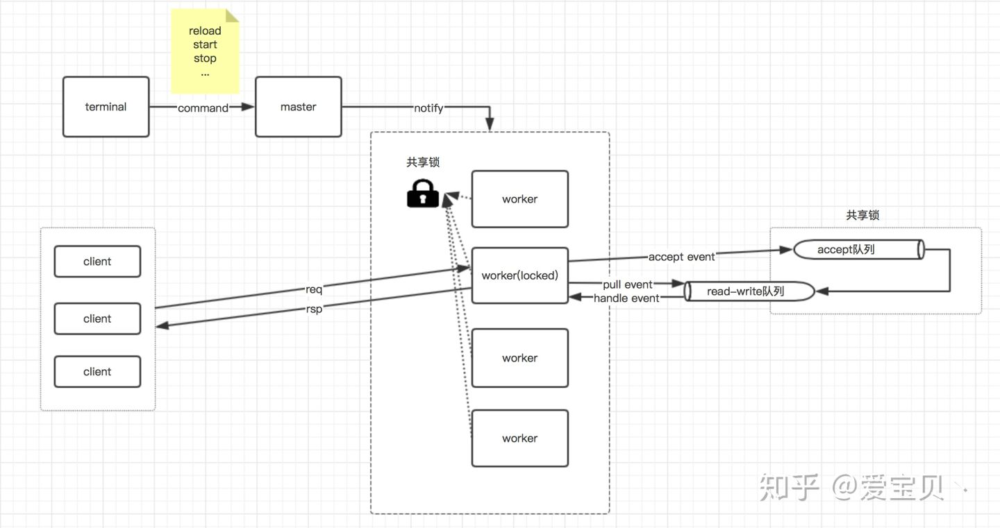
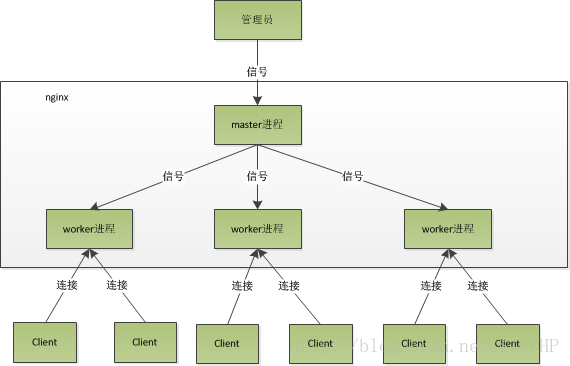

#nginx定位
```asp
Nginx是一个 轻量级/高性能的反向代理Web服务器，他实现非常高效的反向代理、负载平衡，他可以处理2-3万并发连接数
```
#nginx拓扑



```asp
从上图中，我们可以看到worker进程做了
1、accept() 与客户端建立连接
2、recv()接收客户端发过来的数据
3、send() 向客户端发送数据
4、close() 关闭客户端连接
```
[](https://zhuanlan.zhihu.com/p/96757160)
```asp
master进程通过接收客户端的请求，比如-s reload、-s stop等，解析这些命令之后，通过进程间通信，将相应的指令发送到各个worker进程，从而实现对worker进程的控制；
每个worker进程都会竞争同一个共享锁，只有竞争到共享锁的进程才能够处理客户端请求；
当客户端请求发送过来之后，worker进程会处理该请求的事件，如果是accept事件，则会将其添加到accept队列中，如果是read或者write事件，则会将其添加到read-write队列中；
在将事件添加到相应的队列中之后，在持有共享锁的情况下，nginx会处理完accept队列中的客户端连接请求，而对于read或者write事件，则会在释放锁之后直接从read-write队列中取出事件来处理
```
##惊群现象


```asp
由于worker进程 继承了master进程的sockfd,当连接进来是，所有的子进程都将收到通知并“争着”与
它建立连接，这就叫惊群现象。大量的进程被激活又挂起，最后只有一个进程accpet() 到这个连接，这会消耗系统资源
（等待通知，进程被内核全部唤醒，只有一个进程accept成功，其他进程又休眠。这种浪费现象叫惊群）
```
```asp
多个进程监听同一个端口引发的。
解决：
    如果可以同一时刻只能有一个进程监听端口，这样就不会发生“惊群”了，此时新连接事件只能唤醒正在监听的唯一进程。
    如何保持一个时刻只能有一个worker进程监听端口呢？nginx设置了一个accept_mutex锁，在使用accept_mutex锁是，
    只有进程成功调用了ngx_trylock_accept_mutex方法获取锁后才可以监听端口
```
```asp
linux 内核2.6 之后 不会出现惊群现象，只会有一个进程被唤醒
```
##高可用(lvs+keepalive)
master监听work,健康检查,work宕机重启

##热加载
./nginx -s reload

```asp
向master进程发送HUP信号(reload)命令
master进程校验配置语法是否正确
master进程打开新的监听端口
master进程用新配置启动新的worker子进程
master进程向老worker子进程发送QUIT信号
老woker进程关闭监听句柄，处理完当前连接后结束进程
```

#nginx高性能
##nio epoll(C10K问题,C1000K,C10M)
```asp
1.每个请求需要 16KB 内存,100w总共就需要大约 15 GB,100GB内存
2.只有 20% 活跃连接,每个连接只需要 1KB/s 的吞吐量,总共也需要 1.6 Gb/s 的吞吐,需要万兆网卡
```
###C10K & C1000K
[](https://time.geekbang.org/column/article/81268?utm_term=zeusNYGPN&utm_source=geektime&utm_medium=maitaozheshuo)
###C10M
##aio
##sendfile
sendfile使用page cache
[z_操作系统_磁盘io流程_磁盘读写优化_内存映射mmap_顺序读写_直接IO(direct_io)_零拷贝sendfile_预分配_避免swap写_用户进程缓存_内核缓存_磁盘故障.md]
##直接io(适合大文件)
```asp
location /video/ {
    sendfile on;
    sendfile_max_chunk 256k; 
    aio threads;
    directio 512k;
    output_buffers 1 128k;
}
```
```asp
启用aio时会自动启用directio,小于directio定义的大小的文件则采用sendfile进行发送,超过或等于directio定义的大小的文件,将采用aio线程池进行
发送,也就是说aio和directio适合大文件下载.因为大文件不适合进入操作系统的buffers/cache,这样会浪费内存,而且Linux AIO(异步磁盘IO)也要求使用directio的形式.
```
##压缩(gzip)
类似Deflate,去重+哈夫曼编码
##cpu绑核
避免上下文切换使得缓存失效
#nginx web开发
##nginx限流
##nginx动静分离
##nginx 负载均衡

```asp
轮询
权重
ip_hash 
```

# 语法

```
./nginx 启动nginx
./nginx -s stop 终止nginx(当然也可以找到nginx进程号，然后使用kill -9 杀掉nginx进程) 
./nginx -s reload (重新加载nginx.conf配置文件)

nginx.conf:全局块、events块、http块
cat /usr/local/etc/nginx/nginx.conf
```
##全局块
```
全局块：worker进 程的数量、错误日志的位置
worker_processes  1;
#error_log  logs/error.log;
```

## events块
```
events块：主要影响nginx服务器与用户的网络连接
events {
    worker_connections  1024;
}
```
## http块
```
http块:请求转发、反向代理、负载均衡

sendfile        on;
keepalive_timeout  65;

#server {
        listen       8000;
        listen       somename:8080;
        server_name  somename  alias  another.alias;

        location / {
            root   html;
            index  index.html index.htm;
        }
    }
```


#面试题
##Nginx怎么处理请求的？
nginx接收一个请求后，首先由listen和server_name指令匹配server模块，再匹配server模块里的location，location就是实际地址
```asp
#server {
        listen       8000;
        listen       somename:8080;
        server_name  somename  alias  another.alias;

        location / {
            root   html;
            index  index.html index.htm;
        }
    }
```
