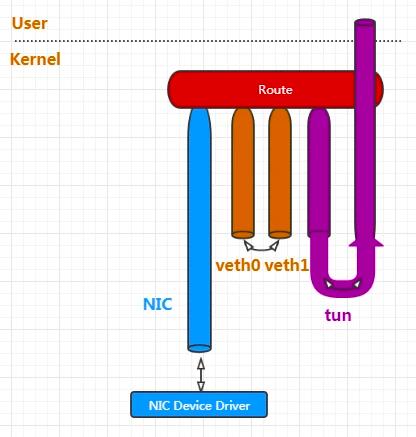
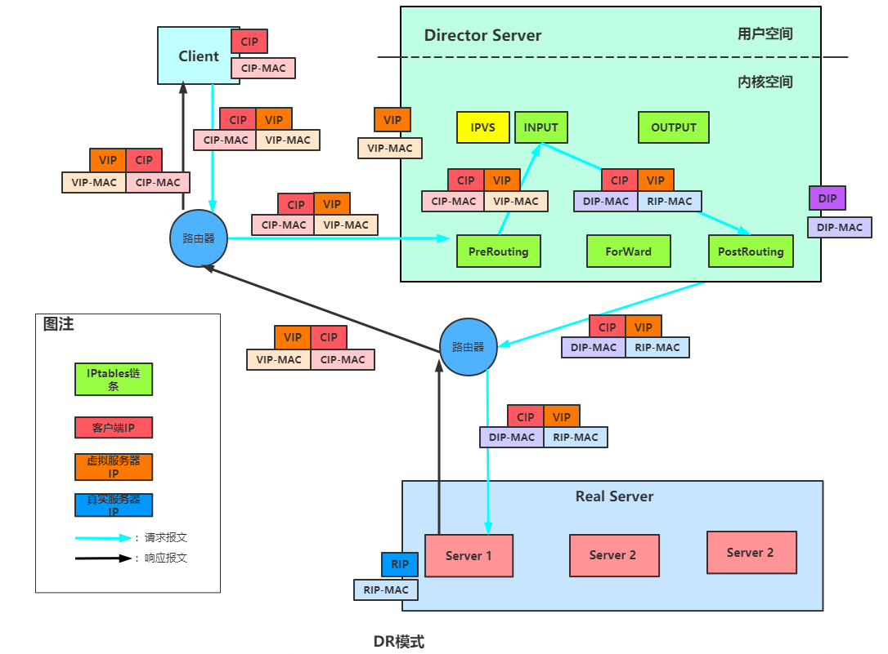
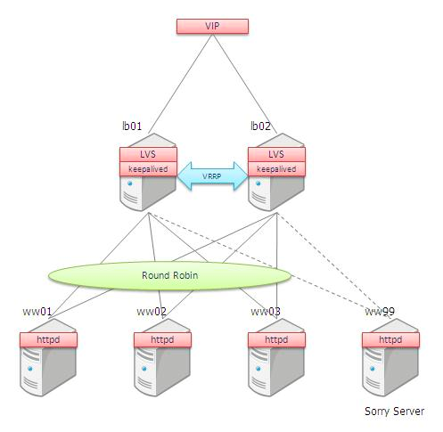

#重要术语
[](https://segmentfault.com/a/1190000020031911)
##物理网卡
##虚拟网络接口/虚拟网卡(loop回环接口)
网卡接口:使用网络底层编程技术实现的一个驱动软件
安装此类程序后主机上会增加一个非真实的网卡（TAP或TUN），并可以像其它网卡一样进行配置。服务程序可以在应用层打开虚拟网卡，如果应用软件
（如网络浏览器）向虚拟网卡发送数据，则服务程序可以读取到该数据。如果服务程序写合适的数据到虚拟网卡，应用软件也可以接收得到。虚拟网卡在很多的操作系统中都有相应的实现
```asp
loop回环接口,在TCP/IP中回环设备是一个通过软件实现的虚拟网络接口，它不与任何硬件相关联
在网络中，所有源地址属于loopback地址的数据包将会被丢弃
IP协议规定loopback数据包是不允许在网络中传输的。网络网络接口必须丢弃接收到的loopback数据包
```
###网卡接口类型

物理网卡接口
veth peer类型接口
tun类型接口
网络接口上并不是一定都有IP地址
##网卡 & ip & mac地址 的关系(ip 别名)
```asp
每个网卡一个mac地址
```

每个网卡可以多个ip,即可以配置ip别名
[](https://blog.csdn.net/lanwangxia/article/details/106942072)
[](https://lishiwen4.github.io/network/virtual-network-interface-multiple-ip)
##arp参数配置
arp_ignore:只响应目的 IP 地址为接收网卡的ip地址  ARP 请求,
别人发过来的arp广播进行忽略
##mac地址欺骗
#LVS模型
##DR

[](https://www.cnblogs.com/Courage129/p/14332902.html)
##高可用keepalived

[](https://dudashuang.com/load-blance/)
#问题
## VIP 已经绑定在负载均衡器上，真实服务器也有多个，在连通的网络里，如何能让多个真实服务器和负载均衡器的 VIP 地址相同?
loopback接口绑定ip别名
##真实服务器的 VIP 不能被其他设备访问的到?在每台真实服务器上的 VIP 地址，只能它们自己知道“我悄悄藏着 VIP”，别的设备压根不知道
实际服务器配置arp_ignore,忽略arp 请求
##LVS  DR模式，RS隐藏了vip, ds怎么知道rs的mac地址的呢？运维手动在ds中配置的路由吗？
realserver加入局域网后,
接收client的请求，根据你设定的负载均衡算法选取一台realserver的ip;
