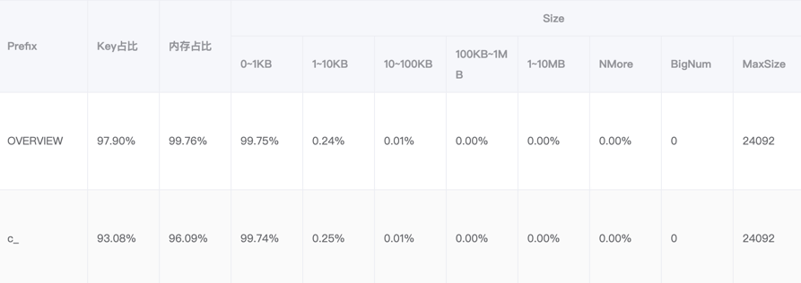
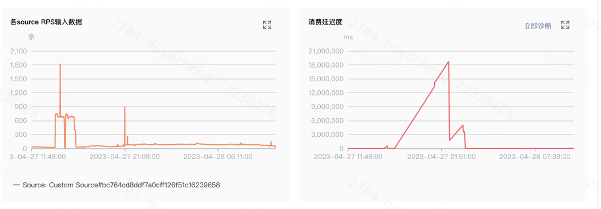

# 业务逻辑

## 业务流程
1.首页,初始化sdk,无cfrnid
2.实名验证,手填curp(INE),circulo(私企征信)->beru(央企征信)
3.curp验证,判断活体ocr,人像对比(1v1  过脸图,INE,手持),1vn(sstg底图库对比)    newberun,incode
4.授权通讯录
5.活体人脸

eva imss 征信(预授信,信用卡)

优质用户(省略INE,活体人脸)，后置到优质用户

注册用户行为数据，外卖出现（增长算法）

优质用户识别逻辑，isvipflow=1

## 巨量引流+引流回传

## 虚实分离

## bnpl
## 了解业务沟通和业务需求

## OCR
巴西驾驶证CNH,CNH正面+过脸图
身份证RG,RG（身份证）,RG正面+过脸图

verdor:caf

## 优质用户h5免ocr
谷歌/facebook算法识别的优质用户,连接跳转h5,免ocr识别

## 外投
将优质用户投递给谷歌/facebook

## 特征类别

### kyc

### 反欺诈

地理位置
设备指纹

### 交易

# 数据

## 时序行为特征

## 模型特征

## 实时特征

## 离线特征

## 外部接口特征
## 特征压单
## flink场景

## redis存储

## flink消费延迟太高，消息积压
火焰图看
修改并发度

## 消息倾斜
分区策略
## 内部特征监控
难点:内部特征可能在同一个请求中使用多次,每次入参不一样,产生的内部特征也不一样，最后一个特征会覆盖前面的特征
内部特征+外部特征

##  风控闭环

## 宽表特征

## 服务治理

### 内存占比突然占比90%
分析
## 图谱
三度
三角关系
社区
### session重试

### 监控

### qps量

### session池

### 查询语句查询超时

### 数据批量导入

### 导入逻辑

### nebula
连接池

### nebula查询优化
查询量太大,请求超时,服务宕机
1.数据empty导致where语句匹配数据量大
2. fetch , match
### 导入优化
1.裂变推荐数据数据量太大

## 特征自动化监控方案
表拆分，数据重复，数据清洗

## 生产本次特征难点
低时延方案
计算distinctCount消耗redis内存,实时+离线
redis扩容耗时
下线特征

## 消息设计
消息可重复投递，放重防幕
消息支持二次触发的能力

## 缓存使用
明确过期时间，过期时间打散
缓存命中率监控，且有预值
缓存架构避免热点key,避免不了使用预案临时推送热点key

## 系统异常
统一的异常日志打印格式
异常做监控，对错误码做监控

## 数据架构
1.谁消费谁监控
# 名单
## 缓存旁路场景
## redis缓存场景
## 数据库分表分库场景
## 分布式锁场景
## 分布式事务场景

## 倒名单

## 数据库/表设计
表查询必须走索引
线上机器扩容考虑是否超过数据库连接池大小
核心流水大表要设计归档
# 三方
## 异步特征查询方案
## 回调
发生回调已达最终态，直接幕等返回
未达最终态,透传继续执行
## 外部渠道对接
幕等字段
非空字段
唯一字段
与渠道对接必须有中间态和异常态
重试必须明确可重试，可幕等
与渠道通信必须设置超时，超时尽量配置化
# 工作流

## 空跑
空跑工作流环境,快照数据

## 跑批
跑批工作流环境

## 压单

## 修单

## 召回
## 工作流
workflowId
bizId+workflowName

## 请求接口幕等
1.幕等键定义,幕等键选择不能为null
2.幕等唯一索引
3.幕等风险对应计数
4.幕等空间和时间全局唯一
5.默认上下游可能重复和并发调用
# 案调系统

# 稳定性平台
检查项

# 事故复盘
1.监控发现时间
2.故障通知业务时间
3.问题解决时间
4.问题细节复盘
5.核心问题+系统解决方案
6.资损复盘:用户资损，公司资损，机构资损
## 资损发现手段
业务链路监控
业务部署核对规则
资金侧机构对账
用户/机构反馈

## 两个第一
第一时间止血，第一时间上报
# 监控
## 降噪

## 灵敏度

## 统计超时特征排名

## 流量标识
手动压单报警
跑批
压测
# 技术建设
## 日志脱敏
## binlog写入

## 需求 基建 稳定性
# 技术流程
## BRD
## PRD
## 技术评审
## 排期
## 开发
## 自测
## cr
## case评审
## 测试
## 准出
## 上线
## 线上观察

## 单测覆盖率
## case评审
## 压测
## 空跑

# 代码cr

# 晋升思考
## 我做了什么?
## 7应该具备什么?
## 1.风控领域的重点事情有哪些
[度小满](https://static001.geekbang.org/con/83/pdf/3478662862/file/%E6%9D%A8%E9%9D%92-20210530%20v3.0.pdf?utm_campaign=geektime_search&utm_content=geektime_search&utm_medium=geektime_search&utm_source=geektime_search&utm_term=geektime_search)
[美地](https://static001.geekbang.org/con/130/pdf/2270361171/file/02.%E7%BE%8E%E7%9A%84%E9%87%91%E8%9E%8D%E6%99%BA%E8%83%BD%E9%A3%8E%E6%8E%A7%E7%B3%BB%E7%BB%9F%E7%9A%84%E6%9E%84%E5%BB%BA%E4%B8%8E%E5%AE%9E%E8%B7%B5-%E6%9B%B9%E9%93%AD%E6%96%8C.pdf?utm_campaign=geektime_search&utm_content=geektime_search&utm_medium=geektime_search&utm_source=geektime_search&utm_term=geektime_search)
1.数据孤岛,前端埋点每次需求都是新的数据源,数据未打通,信用卡和现金贷的特征数据未打通,交易支付信贷风控未打通  

2.非结构化信息,串行化特征,衍生特征链路长,维护成本高,结构化信息,图信息,图像信息,时序信息,场景化, 
a).用户还款意愿
b).用户满意度  
c).用户还款能力  
d).用户借贷需求  

3.数据隐私合规,数据隐私保护趋严, 更高的安全要求

4.地址信息挖掘,居住地稳定性,公司稳定性,行业稳定性,工作地稳定性

5.时序信息特征

6.提效,sql化实时特征,sql化衍生特征

7.数据价值,特征价值,可视化指标引擎

## 2.团队目前的状态以及问题
## 3.哪些事情优先级比较高,需要解决
# 难点case
## 问题1 超时
很多工作流某些任务耗时超过2s,同一个任务大部分耗时1ms左右
### 分析
1.流量高峰?分析发现流量低峰也有出现
2.redis耗时,分析慢查询日志发现redis未超时,请求成功,redis请求成功,打印耗时2s
3.过滤耗时>500ms的日志,发现附近都有耗时的大特征解析,2MB.为什么大特征解析会影响其他特征读取?
### 方案
1.策略下掉大特征
2.优化特征解析过程
#实时特征获取不到

## 问题2 特征延迟
每天2:00~4:00获取不到特征
### 分析
查看生产端消费延时,延时严重
查看输入500/s,输出情况200/s
查看buffer pool,100%
cpu使用情况,90%
算子流入流出,2000/s
kafka消费 1m/s

查看配置,taskmananger 1,slot 1,cpu 1
优化配置

### 方案
## 问题3 redis内存
Redis内存短时间暴涨,内存翻倍,报警

## 地理位置信息mq流量大方案

1.定位系统流量瓶颈,上游清洗(能抗),业务qps(能抗),下游清洗(瓶颈),特征加工(瓶颈)
2.缩小有效流量范围,过滤无效流量,根据有效业务字段过滤,uid+经纬度,经纬度为0
3.缩减下游链路,定制化优化清洗逻辑
## 特征值的key太大
通讯录太大

判断是否存在:做成图谱特征
判断长度:flink实时计算,不适合现有redis存储方式
## 问题4 nebula 大流量耗性能问题
1)sql拆分,优化好性能的sql,
2)nebula session会话设置较少60,支持更高并发度600
3)串行化问题,串行化报错

## 问题5 消息积压问题
1)监控告警积压
2)提高并发度
3)火焰图分析函数方法
4)优化耗时函数,日志
5)提高并发度无效,查看下游积压，下游生产情况

6)分析kafka lag,稳定在300+, qps:60+
7)反馈监控问题
8)message ts生产有问题,和现在相差几小时

## 监控噪音问题

## 用户维度特征体系

## 内存泄露
特征查询服务两个星期出现一次非常严重的超时
## gc问题
请求特征量过大

## 接口超时问题
publiclog日志异步线程池打印
redis接口加分布式缓存
切换新接口，旧切口
容灾,apollo切换新老接口
压测时间

## redis挂恢复

## 稳定性问题
redis超时,特征生产逻辑,有异常值

## redis
特征group数据太大,有异常数据,需要过滤,架构问题，使用宽表可以解决此类问题

## 工作流task块返回结果有时经过后置流水线处理，有时不经过后置流水线处理
1：此次问题是一个历史bug，在极端情况下才会出现

2：极端情况就是串行化特征和其他特征混布，且串行化类特征占比特别大的情况下。

3：现在本地查询到问题后复现率为99%

4：快速解决办法：串行化类的特征目前有其他可替代的规则，和策略+产品+RD+QA 评估后可暂时下掉。

5：长期解决办法：修复多线程的问题

6.报错导致  

## 图谱新老集群数据同步
双写，对比数据，切换

## 慢sql治理

## 特征服务内存泄漏
dump对比分析,部分上涨

## 埋点时间问题
服务端时间
手机端时间
服务端校准时间

## 数据倾斜问题
## redis float浮点类型

## 时间问题
记录未来的时间使用本地字符串，避免夏令时调整的转化问题

## 货币问题注意

## sop军规

## 相似度特征

## 通过cfrnid找pin相同的人数

## 串行化特征

## 三方重构分表分库
服务端preparestatement缓存超过最大65535

## feature-proxy dubbo线程池爆问题
completefuture supplyAsync共享一个线程池
拆分多个线程池
## 判断两个用户的通讯录号码相似度超过75%的用户个数
图谱  uidA->didiphone-uidB
找到uidB的用户个数

fusion-> key set
## http chunk请求问题排查

## 令牌锁

## jackson gson解析问题

## redis锁问题

## redis大key
s000000 geohash异常值过滤

## flink数据倾斜
生产者发送produce发送到固定分区了