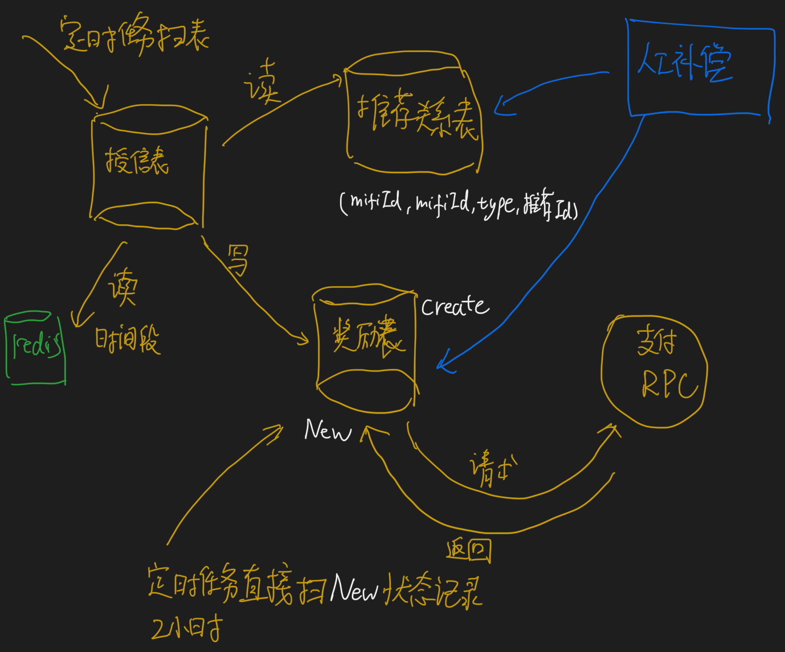
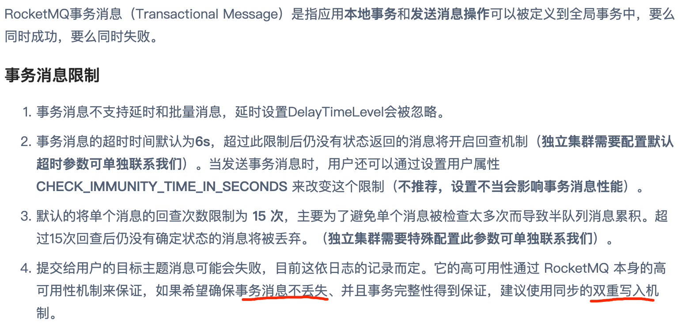
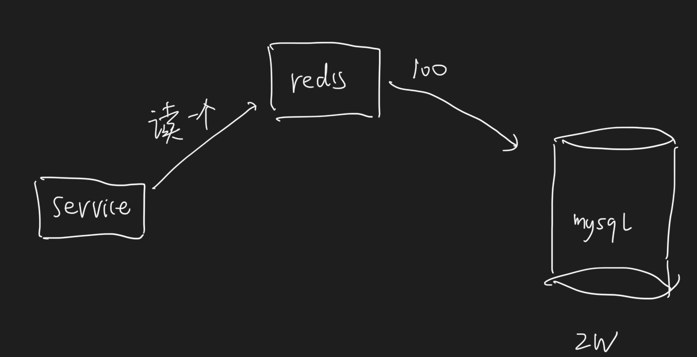

##项目介绍
0.背景介绍
1.模块介绍
2.架构定位
springboot
3.职责介绍
##推荐活动架构


1.分享推荐码
2.绑定推荐码
3.授信后查看推荐关系是否存在,发放授信奖励,先存奖励表status=create,再请求rpc,再更新status=new
4.贷款后查看推荐关系是否存在,发送贷款奖励,先存奖励表status=create,再请求rpc,再更新status=new
5.人工补偿,查看推荐关系是否存在,发送授信/贷款奖励,先存奖励表status=create,再请求rpc,再更新status=new
###功能
1.新老用户定义:活动开始之后未授信的用户是新用户
2.分享推荐码:每个人入口进入活动页,都有推荐码,第一次生成推荐码(幂等),如果奖励了有奖励刮刮卡信息
3.绑定推荐码:活动页有绑定入口,关系表判断是否有绑定关系
4.奖励配比:活动平台配置
5.反欺诈:配置单个用户的奖励上限20个,之后人工联系合作
6.刮刮卡通知与过期:短信通知3次,9天后过期
7.数据库表:推荐码表,推荐关系表,奖励表
8.人工补偿:api入口
9.活动线上配置更新:zookeeper
##Mysql实现推荐奖励请求的幂等性
###为啥要幂等?
推荐活动的奖励表记录在贷超,发放奖励由支付部门的服务发放到用户账号,跨服务请求
###幂等的唯一键
mifi+referRelationId+type(奖励类型)
insert into  select from dual where not exists( select id )
```asp
insert ignore into `Test` select 'aa' , 'cao' from dual where not exists(select 1 from Test where `first_name`='aa' and `second_name`='bb');
```
###数据库幂等性
状态机+补偿性定时任务
1.insert into  status=CREATE
2.rpc request抽奖,之所以请求,因为可以由运营配置
3.rpc 请求分配金额,此时只是记录用户分配的金额,并未真正到账
4.update status=NEW
##通过事件表以及定时任务补偿机制保证了奖励更新的柔性一致性
###定时任务扫描事件表
更新状态机
###为啥不用rocketmq 事务
rocketmq事务依赖于同步策略和刷盘机制,金融属性涉及到钱,所以使用了保守的方式

##推荐码生成器(幂等)
insert ignore into mifi
###推荐码需求
1.位数固定,尽量小
2.效率高
3.安全
###实现
10进制->26进制
9^10(9位) < [0-9A-Z]^6(10位)，去除I ,O容易混淆


###安全
[0-9A-Z]打乱
1.使用用户id和code互换,有安全问题,可通过code拿到用户id
2.使用用户id对应的主键和code相互转换,透露用户体量,有安全问题
3.预算是1W新用户,100W的活动预算,提前生成2w code,随机数(9位的随机数)生成2万个code存储在表里
4.每次缓存在redis 100个,步长100(自然量1000个授信),并记录读取的位置

##设计推荐码表、推荐关系表、奖励表的MySQL索引
分析查询语句
###推荐码表
唯一键:用户id作为唯一键，活动推荐页根据用户id查code
唯一键:推荐码作为唯一键，绑定推荐码时根据code查用户id
###推荐关系表
唯一索引:被推荐人，发放奖励时需要给推荐人、被推荐人发奖励,根据被推荐人的用户id查询推荐人的用户id
普通索引:推荐人，统计每个用户推荐了多少人,分析报表,被推荐人也作为索引
###奖励表
普通索引:用户id,查用户所有的奖励
普通索引:关系id,一个关系id可能获得多次奖励
##使用短网址方案精简推荐活动URL分享
[z_00_分布式_重要案例_02_短URL生成器.md]
##实现Activiti风控审批流的自由跳转
##Zookeeper更新活动元数据配置
##使用Redis缓存热数据如推荐码、短URL
HSET,<64B*512时,Ziplist
##审批流责任链
