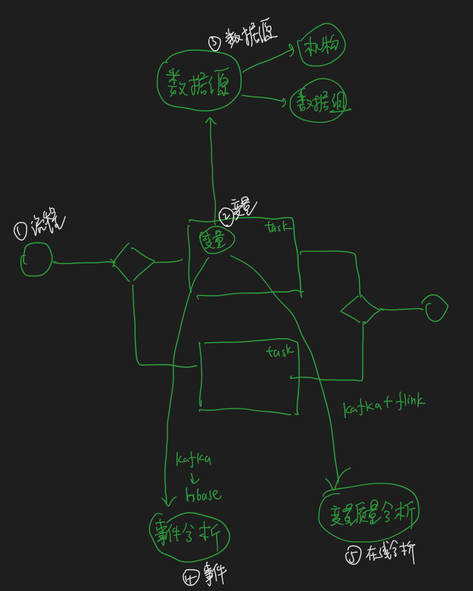

#项目介绍
0.背景介绍
1.模块介绍

2.架构定位
springboot
3.职责介绍
#风控平台业务


##征信数据源
###数据源
290+数据源
40+征信公司数据机构,华道,百融,腾讯,京东,阿里云,银联,中国人民银行征信系统
[](https://zhuanlan.zhihu.com/p/37541188)
机构征信和个人征信,国家授权的业务拍照
###接入方式
http(第三方,配置bean,解析变量后进行http请求)
dubbo(rpc接口,内部其他团队提供的)
hbase(数据组给的内部分析用户,例如高质量用户,拦截用户,配置列簇,表,rowkey信息)
###数据源json模板
##变量
3000+变量
###变量解析语法 
jsonPath
###返回类型
###异常策略
##模型管理
PMML管理,输入,输出
##决策引擎
###规则表管理
1.导流
2.反欺诈
3.分期支用策略
###决策流程管理
##事件分析
流程任务节点->变量执行execution->kafka->rpc data项目->hbase
##变量监控
kafka->flink->elasticsearch
#监控平台业务
##定时任务quartz
1.使用的默认的内存存储+自定义表
2.quartz默认的数据库实现,悲观锁for update
###拓扑
1.Scheduler:调度器
2.Trigger:触发规则
3.JobDetail:job配置
4.job:job实例

###如何实现分布式?
zookeeper+quartz,
1.默认zookeeper最后一个/server/ip,ip是master节点
2.数据库更新,zookeeper写文件/job_reload,timestamp
3.刷新数据库中的表记录,quartz重新调度
#项目redis相关
##redis 消息队列
##redis双写
##redis lua,事务
##redis mysql双写
##二级缓存
理清楚二者过期时间,二者执行顺序,guava原理,缓存一致性
从内存guava,redis,数据库中获取
[z_java_03_guava_cache.md],1d,groupid,processid,version
[redis]set,expire,1d
[mysql]get
[z_01_分布式_临界知识_多级缓存.md]
##双写缓存一致性,guava缓存失效
zookeeper+Cache.invalidate
##雪崩,击穿
[](z_java_03_guava_cache.md)
##redis分布式锁实现分布式定时任务
[z_01_分布式_临界知识_分布式锁.md]
redission, redlock
##使用Redis缓存推荐码、短链接，加载热点数据等热数据,常用redis操作
[z_04_分布式_redis_01_常见问题_常见应用场景_redis分布式锁_原子操作_公司集群_项目常用_简单限流.md]五大操作
HSET KEY field value
field = mifi id_url,
value = mifi id_code,


##延时队列
[z_04_分布式_redis_01_常见问题_常见应用场景_redis分布式锁_原子操作_公司集群_项目常用_简单限流.md]sorted_set
#典型问题

##日志脱敏字节码错误
###选型对比,为啥用asm
动态代理vs字节码插桩vs日志代理
###编译器注解处理器
[z_01_编译期注解.md]
需要使用lombok注解,对于第三方pojo,如thrift pojo没有办法进行脱敏
###动态代理
画图
[z_03_动态代理.md]
动态代理生成代理类,cglib,jdk proxy,需要管理代理类,但是已有的实体类pojo都是new方式创建,不会走代理类逻辑
###字节码插桩
[z_02_字节码插桩_asm.md]
###aop拦截日志打印
所有的打印都做了切面,影响范围太广,需要逻辑判断输出的打印日志是否含有敏感日志,所有日志打印执行时间增长
###有什么难点?字节码脱敏常量池错误
[z_02_字节码插桩_asm.md]

1.arthas 反编译字节码class文件,发现tostring中 throw new OutOf异常,看不到tostring的字节码
2.对比正常和异常的class文件,发现一个tostring只有属性变量,一个有实例方法,猜测是实例方法的问题
3.本地复现,发现实例方法果然报错,拿到日志脱敏源码,只对属性变量脱敏,并没有处理方法,即使没脱敏也不应该报错
4.控制变量,缩小范围,最后发现复写MethodVisitor时,visitVarInsn方法过滤了ALOAD_0,导致实例方法获取不到this,invoke出错,而访问visitFieldInsn时主动ALOAD_0,所以没出错
5.之前考虑为了避免tostring调用实例方法,除去了this指针,紧急使用lombok的@ToString(exclude = "map")去除了出错的map上线
6.后来恢复this指针,做了长期测试,观察了一周后上线,避免脱敏导致的业务报错
##服务每隔几小时Minor GC、Major GC告警CPU飙升(用这个)
(预判)1.minor gc频繁,大概100/min,告警阈值20/min,但是没有major gc,猜测前端打点指标高基数,采样率太高导致
(性能评估)2.计算了前端的指标采样率,指标序列数达到了80个亿,公司的prometheus占用20G,公司中台让把服务停了
(方案)3.前端删减指标,降低采样率,我这边增大了minor gc,1个G->2.5G,降低老年代的内存500M
(第二轮)4.minor GC没怎么报了,但是到了周日又频繁告警minor  gc,然后major gc也上来了,大概30/min,cpu也告警了300%,一般服务都是10%,周末服务重启好了
(复现,性能评估)5.周一自己模拟服务,用top看CPU占用,top -Hp查看最高的线程,base 64转java线程的nid,jstack抓取堆栈,找了一下和业务相关的代码,发现prometheus api 有tag排序和数组拷贝相关
()6.postman压测,使用jmap -histo pid 看到tag几秒上升到百万级别,几秒又降到几十万,找到sort,array的代码，找到调用的地方,发现api调用.config()时无限创建tag
```asp
public static PrometheusMeterRegistry registry = new PrometheusMeterRegistry(PrometheusConfig.DEFAULT) {
        @Override
        public Config config() {
            return super.config().commonTags("application", "mifi-api-v2");
        }
    };
导致每次调用config()都生成一个meterFilter，每个meterFilter都会追加tag到原始tag,然后进行排序(导致cpu暴涨原因)
```

##流水号重复
```asp
雪花算法,两个服务都是一套
冲突了
timestamp,31
machineTag,不一样,我们machineTag给了5位，但是我们从100开始,部分和id冲突了
step不一样
冲突
```
##变量质量明细超过10000行
##Flink数据倾斜问题,通过预聚合
##业务监控系统每隔几天服务宕机
#Flink&Elasticsearch项目
