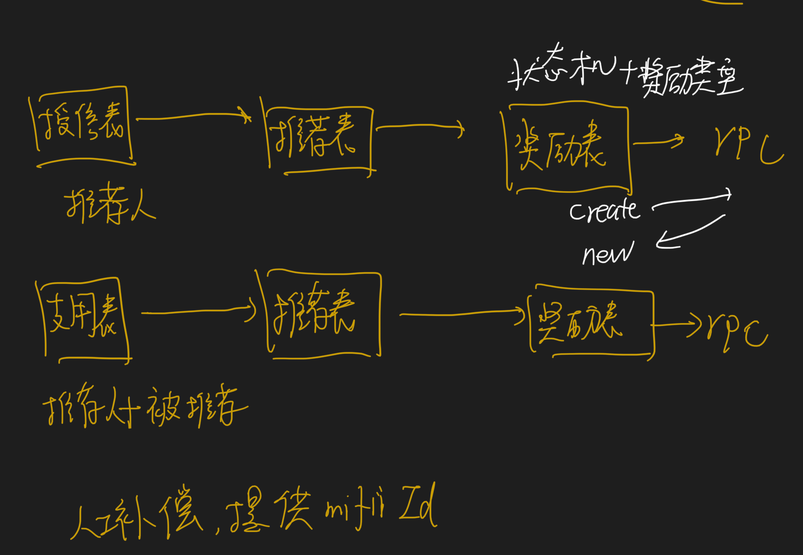

#日志脱敏
##选型对比,为啥用asm
动态代理vs字节码插桩vs日志代理
###编译器注解处理器
[z_01_编译期注解.md]
需要使用lombok注解,对于第三方pojo,如thrift pojo没有办法进行脱敏
###动态代理
画图
[z_03_动态代理.md]
动态代理生成代理类,cglib,jdk proxy,需要管理代理类,但是已有的实体类pojo都是new方式创建,不会走代理类逻辑
###字节码插桩
[z_02_字节码插桩_asm.md]
###aop拦截日志打印
所有的打印都做了切面,影响范围太广,需要逻辑判断输出的打印日志是否含有敏感日志,所有日志打印执行时间增长
##有什么难点
脱敏什么?tostring,why?
[z_02_字节码插桩_asm.md]
#推荐活动概述

1.分享推荐码
2.绑定推荐码

3.授信后查看推荐关系是否存在,发放授信奖励
4.贷款后查看推荐关系是否存在,发送贷款奖励
#Mysql实现推荐奖励请求的幂等性
##为啥要幂等?
推荐活动的奖励表记录在贷超,发放奖励由支付部门的服务发放到用户账号,跨服务请求
##幂等的唯一键
mifi+referRelationId+type(奖励类型)
insert into  select from dual where not exists( select id )
```asp
insert ignore into `Test` select 'aa' , 'cao' from dual where not exists(select 1 from Test where `first_name`='aa' and `second_name`='bb');
```
##数据库幂等性
状态机+补偿性定时任务
1.insert into  status=CREATE
2.rpc request抽奖,之所以请求,因为可以由运营配置
3.rpc 请求分配金额,此时只是记录用户分配的金额,并未真正到账
4.update status=NEW
#通过事件表以及定时任务补偿机制+mq保证了奖励更新的柔性一致性
##mq第一次,重复几次
##定时任务扫描事件表
更新状态机
#redis分布式锁实现分布式定时任务
[z_01_分布式_临界知识_分布式锁.md]
redission, redlock
#使用Redis缓存推荐码、短链接等热数据
#实现activiti风控审批流的自由跳转
#使用短网址方案精简推荐活动URL分享
#通过Hbase统计授信支用的每日报表
