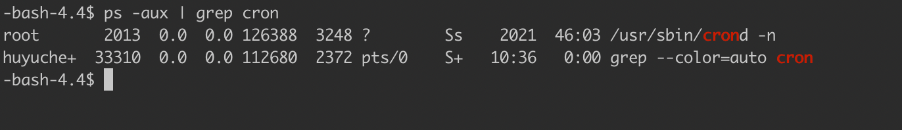
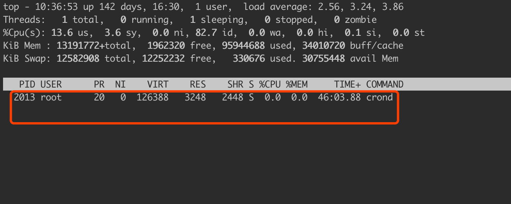
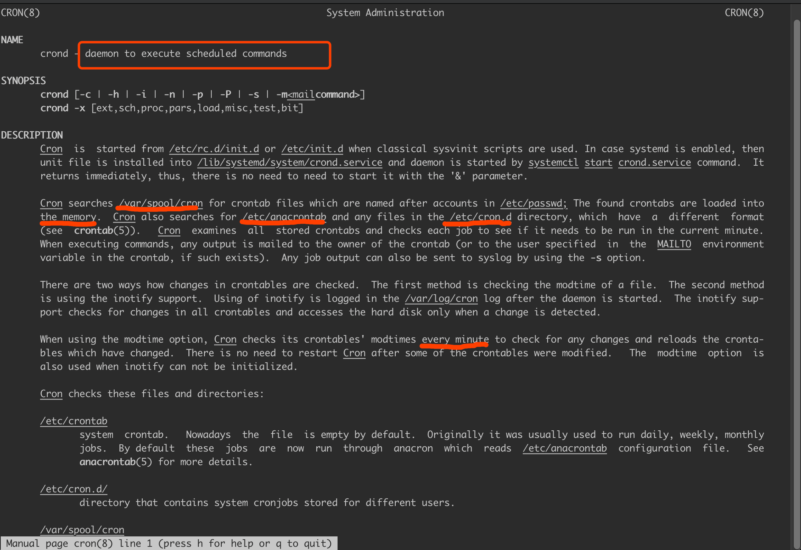
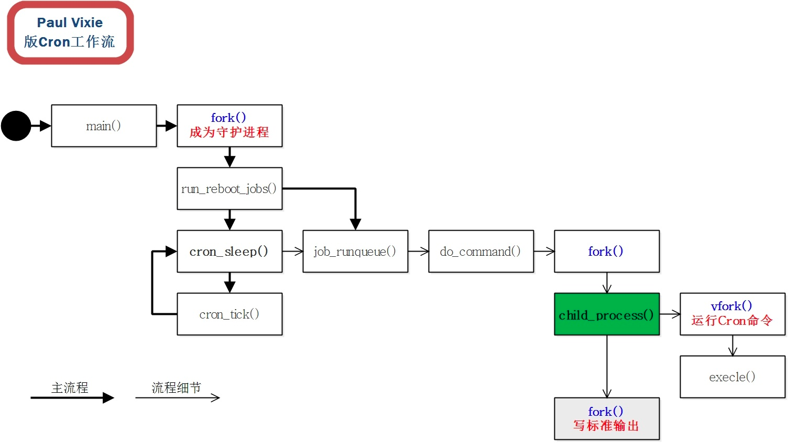
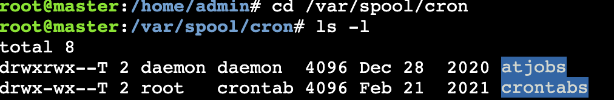
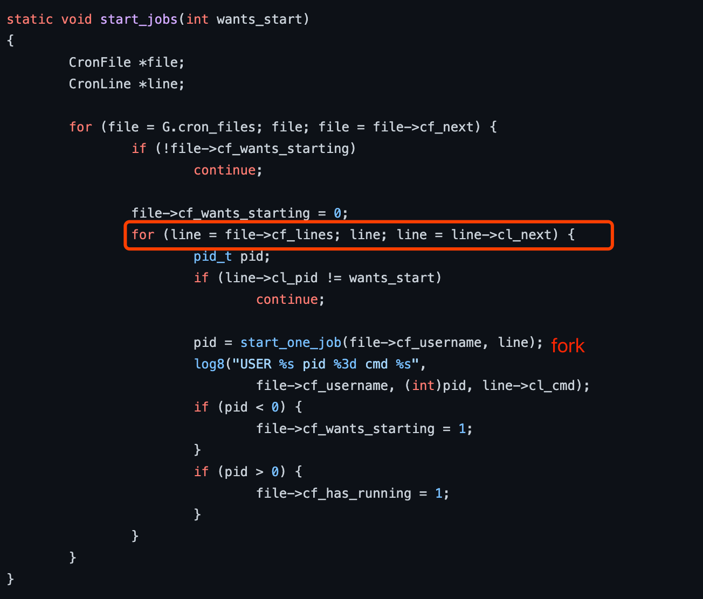

#crontab原理
crond守护进程是在系统启动时由init进程启动的，受init进程的监视，如果它不存在了，会被init进程重新启动。这个守护进程每分钟唤醒一次，并通过检查crontab文件判断需要做什么

一个守护线程轮询

Cron  examines  all  stored crontabs and checks each job to see if it needs to be run in the current minute

执行时fork子进程进行执行,不会等到子进程的结束
 it forks and execs that job, so a running job will not block the creation of a new job.
 [](https://stackoverflow.com/questions/9629447/will-cron-job-start-a-new-thread-or-wait-for-existing-one-to-complete)
 
##sleep(就绪队列,等待队列,定时器)
挂起进程（或线程）并修改其运行状态
用sleep()提供的参数来设置一个定时器。
当时间结束，定时器会触发，内核收到中断后修改进程（或线程）的运行状态。
例如线程会被标志为就绪而进入就绪队列等待调度
##os层面(硬件时钟周期,计数器,中断)
[T_01_crontab.md]
硬件层面是通过一个固定的时钟和计数器,每经过一个时钟周期将计数器递减，当计数器的值为0时产生中断
[](https://blog.csdn.net/xp178171640/article/details/118326453)
[](https://zhuanlan.zhihu.com/p/115923388)
```asp
fastcall signed long __sched schedule_timeout(signed long timeout)
{
	struct timer_list timer;
	unsigned long expire;
	// 算出超时时间
	expire = timeout + jiffies;

	init_timer(&timer);
	// 超时时间
	timer.expires = expire;
	timer.data = (unsigned long) current;
	// 超时回调
	timer.function = process_timeout;
	// 添加定时器
	add_timer(&timer);
	// 进程调度
	schedule();
	// 删除定时器
	del_singleshot_timer_sync(&timer);
    // 超时或者被信号唤醒，被信号唤醒的话，可能还没有超时
	timeout = expire - jiffies;

 out:
	return timeout < 0 ? 0 : timeout;
}
```
#crontab文件
##/etc/crontab
##/etc/cron.d/
directory that contains system cronjobs stored for different users.
##/var/spool/cron
Cron searches /var/spool/cron for crontab files which are named after accounts in /etThe found crontabs are loaded into the memoryc/passwd

#问题
##任务耗时阻塞
fork子进程执行
[](https://cloud.tencent.com/developer/article/1183262)
#源码
[](https://github.com/mirror/busybox/blob/HEAD/miscutils/crond.c#)
任务加载到内存后，直接遍历
```asp
typedef struct CronFile {
	struct CronFile *cf_next;
	struct CronLine *cf_lines;
	char *cf_username;
	smallint cf_wants_starting;     /* bool: one or more jobs ready */
	smallint cf_has_running;        /* bool: one or more jobs running */
	smallint cf_deleted;            /* marked for deletion (but still has running jobs) */
} CronFile;

typedef struct CronLine {
	struct CronLine *cl_next;
	char *cl_cmd;                   /* shell command */
	pid_t cl_pid;                   /* >0:running, <0:needs to be started in this minute, 0:dormant */
#define START_ME_REBOOT -2
#define START_ME_NORMAL -1
#if ENABLE_FEATURE_CROND_CALL_SENDMAIL
	int cl_empty_mail_size;         /* size of mail header only, 0 if no mailfile */
	char *cl_mailto;                /* whom to mail results, may be NULL */
#endif
	char *cl_shell;
	/* ordered by size, not in natural order. makes code smaller: */
	char cl_Dow[7];                 /* 0-6, beginning sunday */
	char cl_Mons[12];               /* 0-11 */
	char cl_Hrs[24];                /* 0-23 */
	char cl_Days[32];               /* 1-31 */
	char cl_Mins[60];               /* 0-59 */
} CronLine;
```


#相关
##busybox
[](https://busybox.net/about.html)
```asp
BusyBox combines tiny versions of many common UNIX utilities into a single small executable. It provides replacements for most of the utilities you usually find in GNU fileutils, shellutils,
BusyBox: The Swiss Army Knife of Embedded Linux

```

##GUN
##GPL(General Public License)
