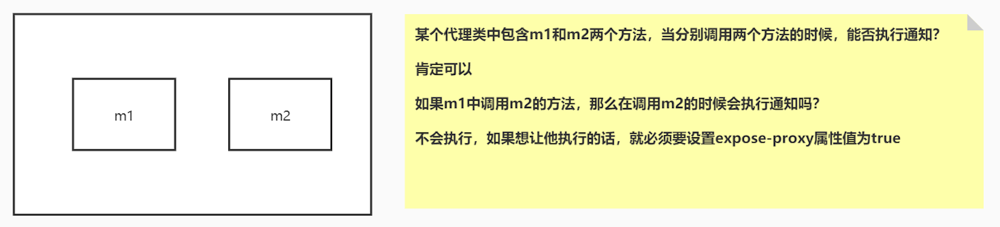

#谈谈Spring IOC的理解，原理与实现?
##思路
```asp
2,总:

控制反转(IOC,应用和框架角度):理论思想,原来的对象是由使用者来进行控制，有了spring之后，可以把整个对象交给spring来帮我们进行管理
依赖注入(对象角度):DI,把对应的属性的值注入到具体的对象中,(举例常见依赖注入,抛出技术点上钩,@Autowired,@Qualifier,@Resource,@Value)

8,分:

1、一般聊ioc容器的时候要涉及到容器的创建过程（beanFactory,DefaultListableBeanFactory）,向bean工厂中设置一些参数（BeanPostProcessor,Aware接口的子类）等等属性
2、加载解析bean对象，准备要创建的bean对象的定义对象beanDefinition,(xml或者注解的解析过程)
3、beanFactoryPostProcessor的处理，此处是扩展点，PlaceHolderConfigurSupport,ConfigurationClassPostProcessor
4、BeanPostProcessor的注册功能，方便后续对bean对象完成具体的扩展功能
5、通过反射的方式讲BeanDefinition对象实例化成具体的bean对象
6、bean对象的初始化过程（填充属性，调用aware子类的方法，调用BeanPostProcessor前置处理方法，调用init-mehtod方法，调用BeanPostProcessor的后置处理方法）
7、生成完整的bean对象，通过getBean方法可以直接获取,(循环引用)
8、销毁过程
9、面试官，这是我对ioc的整体理解，包含了一些详细的处理过程，您看一下有什么问题，可以指点我一下（允许你把整个流程说完）
```

##技术点
###常见依赖注入注解
```asp
1.哪里能用
2.注入时使用的标识符
```
@Autowired

@Qualifier

@Resource

@Value


###容器创建的关键类和接口
```asp
beanFactory
DefaultListableBeanFactory


ClassPathXmlApplicationContext
AnnotationConfigApplicationContext
AnnotationConfigServletWebServerApplicationContext
```

###bean解析的关键类和接口
```asp

```

###beanFactoryPostProcessor常见扩展

###BeanPostProcessor常见举例

###bean对象的初始化过程

#谈谈IOC的底层实现
##思路
1.工作原理
2.源码过程
3.数据结构
4.设计模式
5.设计思想

```asp
总:创建beanFactory,解析xml、注解生成beanDefinition,然后通过反射实例化对象,然后BeanPostProcessor扩展点完成注入,然后初始化,initializingBean

```
##技术点
###工作原理
反射
##源码
createBeanFactory，
getBean,
doGetBean,
createBean,
doCreateBean,
createBeanInstance(getDeclaredConstructor,newinstance),
populateBean,
initializingBean
```asp
1、先通过createBeanFactory创建出一个Bean工厂（DefaultListableBeanFactory）

2、开始循环创建对象，因为容器中的bean默认都是单例的，所以优先通过getBean,doGetBean从容器中查找，找不到的话，

3、通过createBean,doCreateBean方法，以反射的方式创建对象，一般情况下使用的是无参的构造方法（getDeclaredConstructor，newInstance）

4、进行对象的属性填充populateBean

5、进行其他的初始化操作（initializingBean）
```

##数据结构
使用三级缓存,concurrentHashMap
##设计模式
单例,工厂模式

#描述一下bean生命周期
```asp
背图：记住图中的流程

在表述的时候不要只说图中有的关键点，要学会扩展描述

1、实例化bean：反射的方式生成对象

2、填充bean的属性：populateBean(),循环依赖的问题（三级缓存）

3、调用aware接口相关的方法：invokeAwareMethod(完成BeanName,BeanFactory,BeanClassLoader对象的属性设置)

4、调用BeanPostProcessor中的前置处理方法：使用比较多的有（ApplicationContextAwareProcessor,设置ApplicationContext,Environment,ResourceLoader,EmbeddValueResolver等对象）

5、调用initmethod方法：invokeInitmethod(),判断是否实现了initializingBean接口，如果有，调用afterPropertiesSet方法，没有就不调用

6、调用BeanPostProcessor的后置处理方法：spring的aop就是在此处实现的，AbstractAutoProxyCreator

​		注册Destuction相关的回调接口：钩子函数

7、获取到完整的对象，可以通过getBean的方式来进行对象的获取

8、销毁流程，1；判断是否实现了DispoableBean接口，2，调用destroyMethod方法
```
#Spring 是如何解决循环依赖的问题的？
关键:三级缓存，提前暴露对象，aop
```asp
三级缓存，提前暴露对象，aop

总：什么是循环依赖问题，A依赖B,B依赖A

分：先说明bean的创建过程：实例化，初始化（填充属性）

​		1、先创建A对象，实例化A对象，此时A对象中的b属性为空，填充属性b

​		2、从容器中查找B对象，如果找到了，直接赋值不存在循环依赖问题（不通），找不到直接创建B对象

​		3、实例化B对象，此时B对象中的a属性为空，填充属性a

​		4、从容器中查找A对象，找不到，直接创建

​		形成闭环的原因

​		此时，如果仔细琢磨的话，会发现A对象是存在的，只不过此时的A对象不是一个完整的状态，只完成了实例化但是未完成初始化，如果在程序调用过程中，拥有了某个对象的引用，能否在后期给他完成赋值操作，可以优先把非完整状态的对象优先赋值，等待后续操作来完成赋值，相当于提前暴露了某个不完整对象的引用，所以解决问题的核心在于实例化和初始化分开操作，这也是解决循环依赖问题的关键，

​		当所有的对象都完成实例化和初始化操作之后，还要把完整对象放到容器中，此时在容器中存在对象的几个状态，完成实例化=但未完成初始化，完整状态，因为都在容器中，所以要使用不同的map结构来进行存储，此时就有了一级缓存和二级缓存，如果一级缓存中有了，那么二级缓存中就不会存在同名的对象，因为他们的查找顺序是1，2，3这样的方式来查找的。一级缓存中放的是完整对象，二级缓存中放的是非完整对象

​		为什么需要三级缓存？三级缓存的value类型是ObjectFactory,是一个函数式接口，存在的意义是保证在整个容器的运行过程中同名的bean对象只能有一个。

​		如果一个对象需要被代理，或者说需要生成代理对象，那么要不要优先生成一个普通对象？要

​		普通对象和代理对象是不能同时出现在容器中的，因此当一个对象需要被代理的时候，就要使用代理对象覆盖掉之前的普通对象，在实际的调用过程中，是没有办法确定什么时候对象被使用，所以就要求当某个对象被调用的时候，优先判断此对象是否需要被代理，类似于一种回调机制的实现，因此传入lambda表达式的时候，可以通过lambda表达式来执行对象的覆盖过程，getEarlyBeanReference()

​		因此，所有的bean对象在创建的时候都要优先放到三级缓存中，在后续的使用过程中，如果需要被代理则返回代理对象，如果不需要被代理，则直接返回普通对象
```
```asp
三级缓存：createBeanInstance之后：addSingletonFactory

​二级缓存：第一次从三级缓存确定对象是代理对象还是普通对象的时候，同时删除三级缓存 getSingleton

​一级缓存：生成完整对象之后放到一级缓存，删除二三级缓存:addSingleton
```
#Bean Factory与FactoryBean有什么区别？
```asp
相同点：都是用来创建bean对象的

不同点：使用BeanFactory创建对象的时候，必须要遵循严格的生命周期流程，太复杂了，，如果想要简单的自定义某个对象的创建，同时创建完成的对象想交给spring来管理，那么就需要实现FactroyBean接口了

isSingleton:是否是单例对象

getObjectType:获取返回对象的类型

getObject:自定义创建对象的过程(new，反射，动态代理)
```
#Spring中用到的设计模式? 
```
单例模式：bean默认都是单例的

原型模式：指定作用域为prototype

工厂模式：BeanFactory

模板方法：postProcessBeanFactory,onRefresh,initPropertyValue

策略模式：XmlBeanDefinitionReader,PropertiesBeanDefinitionReader

观察者模式：listener，event，multicast

适配器模式：Adapter

装饰者模式：BeanWrapper

责任链模式：使用aop的时候会先生成一个拦截器链

代理模式：动态代理

委托者模式：delegate
```

#Spring的AOP的底层实现原理? 
```asp
动态代理
aop是ioc的一个扩展功能，先有的ioc，再有的aop，只是在ioc的整个流程中新增的一个扩展点而已：BeanPostProcessor

总:
aop概念:动态代理业务逻辑,对业务逻辑植入切片逻辑
应用场景:rpc接口鉴权iauth,事务注解@transactional,日志
动态代理:spring默认jdk,无接口使用cglib

分：

​bean的创建过程中有一个步骤可以对bean进行扩展实现，aop本身就是一个扩展功能，所以在BeanPostProcessor的后置处理方法中来进行实现

​1、代理对象的创建过程（advice，切面，切点）

​2、通过jdk或者cglib的方式来生成代理对象

​3、在执行方法调用的时候，会调用到生成的字节码文件中，直接回找到DynamicAdvisoredInterceptor类中的intercept方法，从此方法开始执行

​4、根据之前定义好的通知来生成拦截器链

​5、从拦截器链中依次获取每一个通知开始进行执行，在执行过程中，为了方便找到下一个通知是哪个，会有一个CglibMethodInvocation的对象，找的时候是从-1的位置一次开始查找并且执行的。
```

#如何代理方法内部的方法

[](https://www.cnblogs.com/chihirotan/p/7356683.html)
