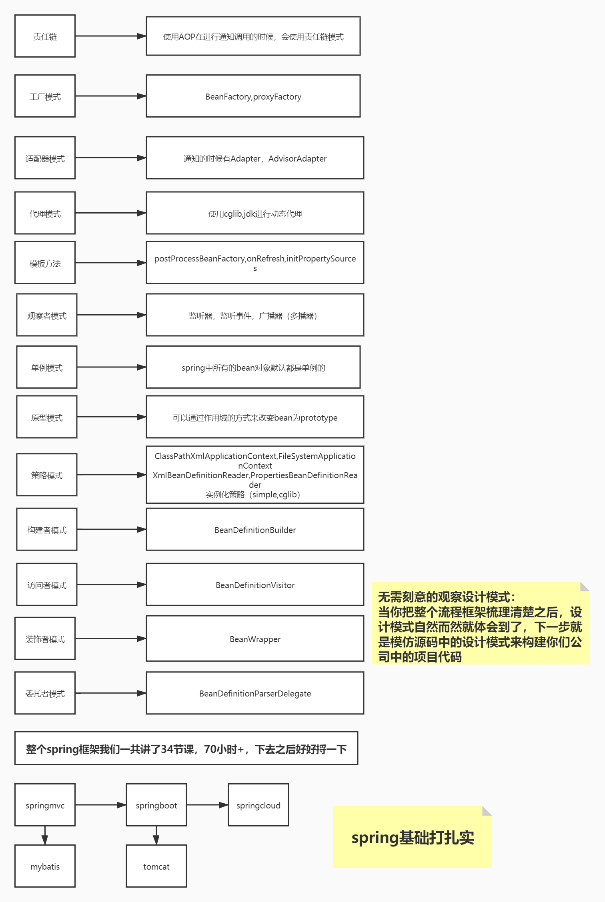

#单例
默认的bean对象
#工厂模式
beanfactory,工厂方法,一个工厂生成一类对象
ProxyFactory,工厂类
#动态代理
AOP代理对象,jdk(接口),cglib(非接口)
#责任链
aop
#模板方法
jdbcTemplate,redisTemplate
#观察者模式
监听器,ApplicationEvent,publishEvent
#适配器设计模式
在Spring MVC中，DispatcherServlet根据请求信息调用HandlerMapping，解析请求对应的Handler，解析到对应的Handler
（也就是我们常说的Controller控制器）后，开始由HandlerAdapter适配器处理
#装饰器
BeanWrapper
#策略设计模式
Spring 框架的资源访问接口就是基于策略设计模式实现的
UrlResource：访问网络资源的实现类。
ClassPathResource：访问类加载路径里资源的实现类。
FileSystemResource：访问文件系统里资源的实现类。
ServletContextResource：访问相对于 ServletContext 路径里的资源的实现类.
InputStreamResource：访问输入流资源的实现类。
ByteArrayResource：访问字节数组资源的实现类。
