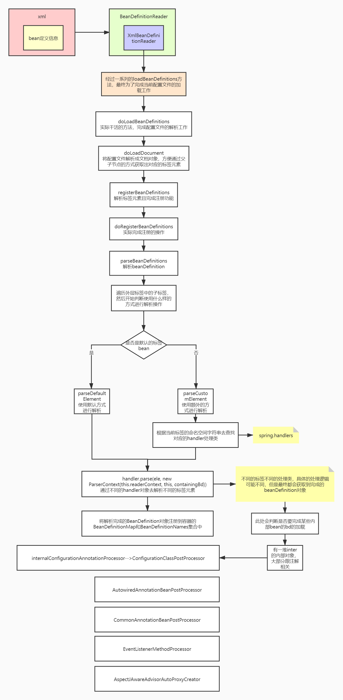
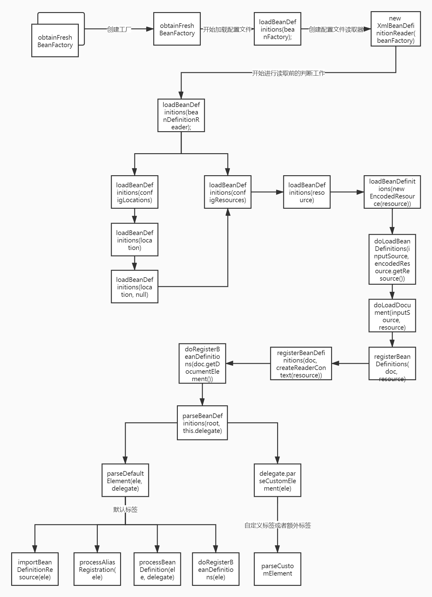
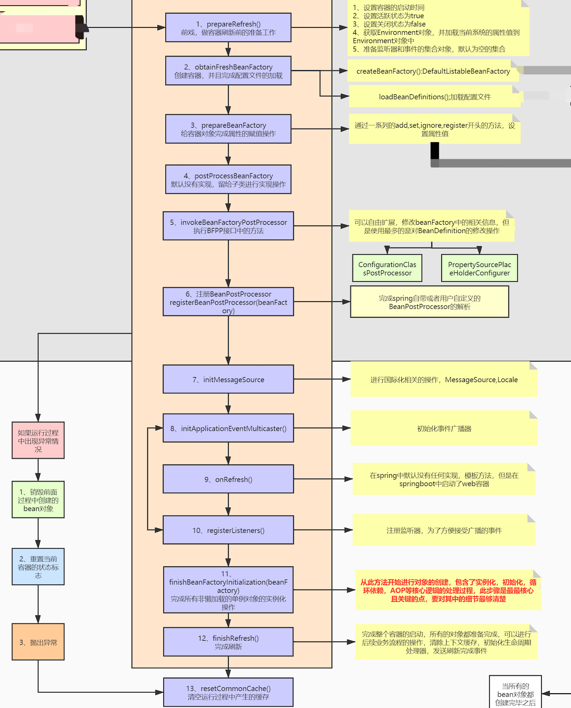
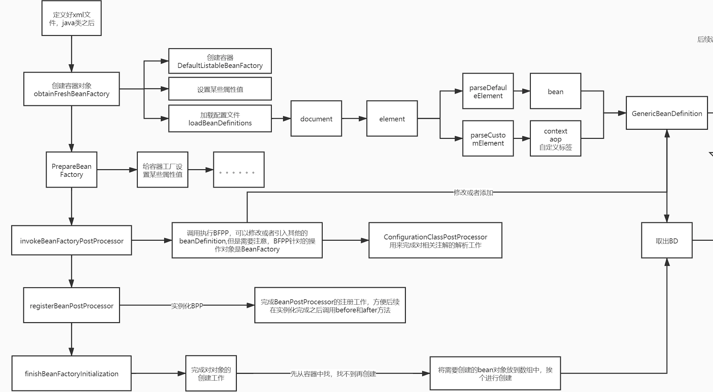
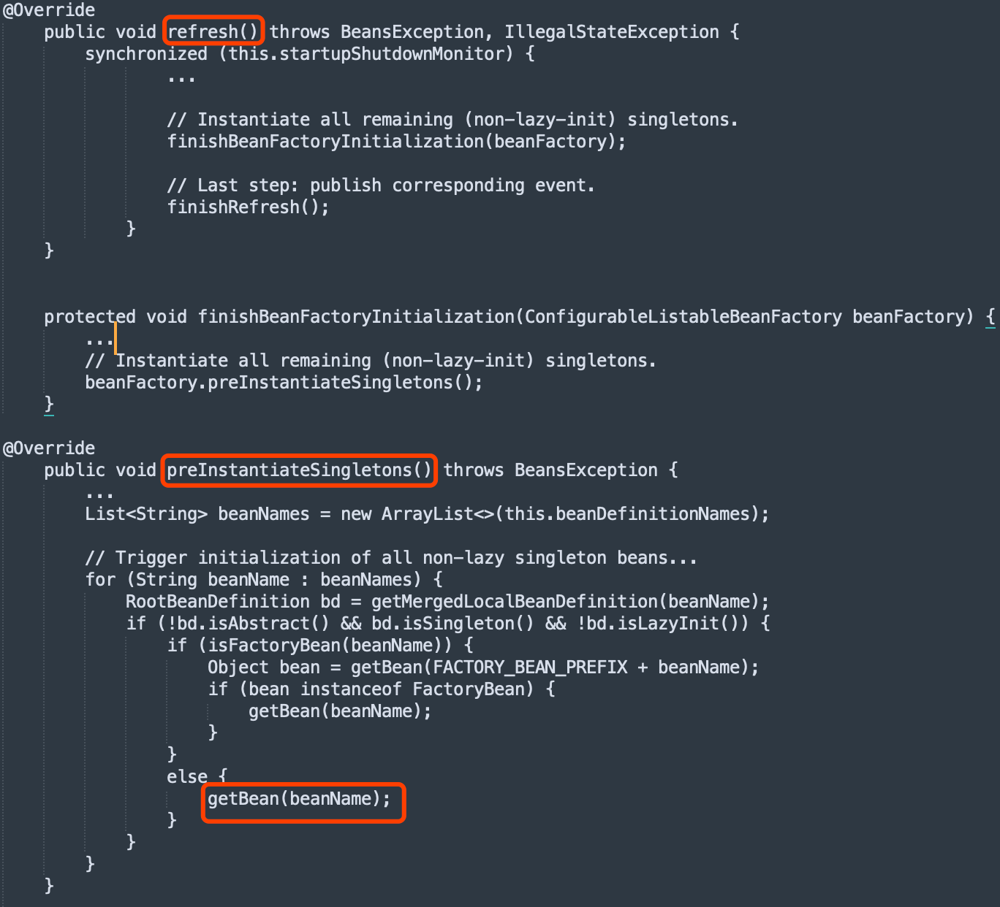
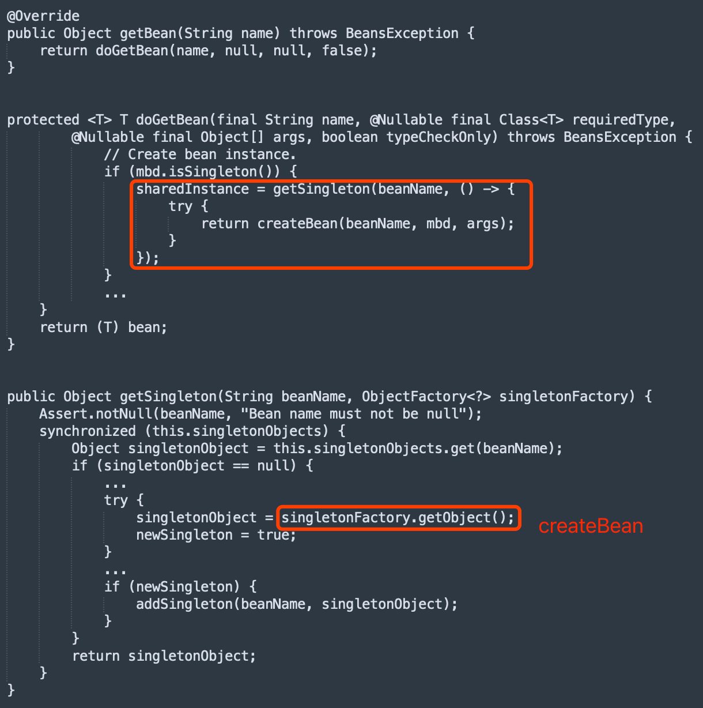
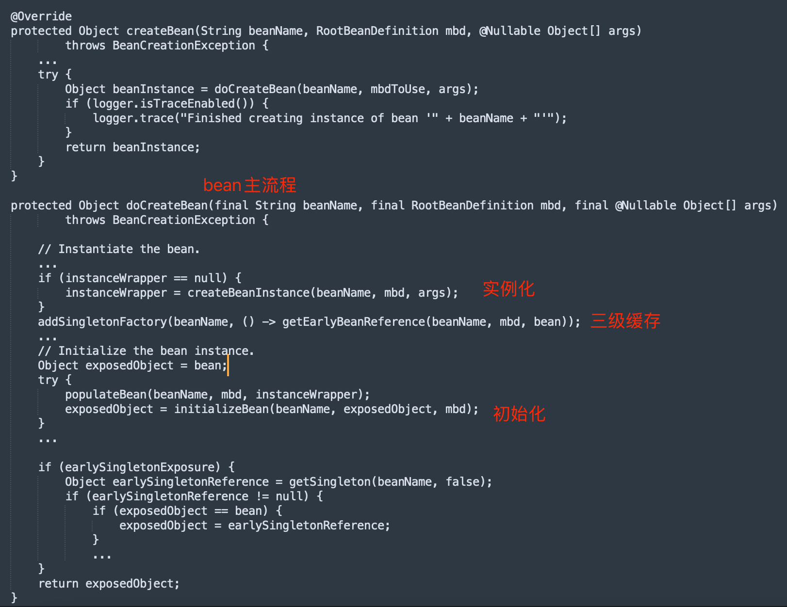
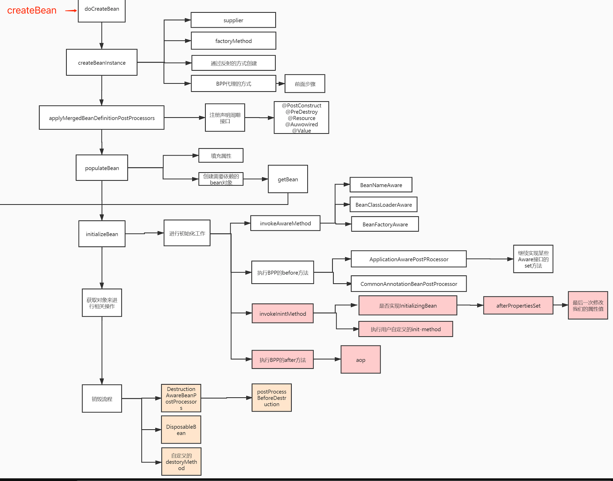
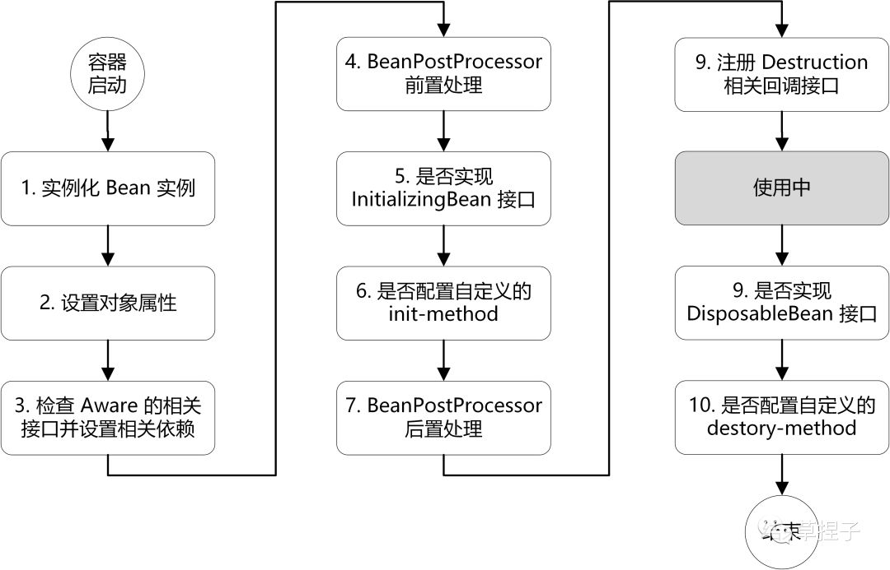
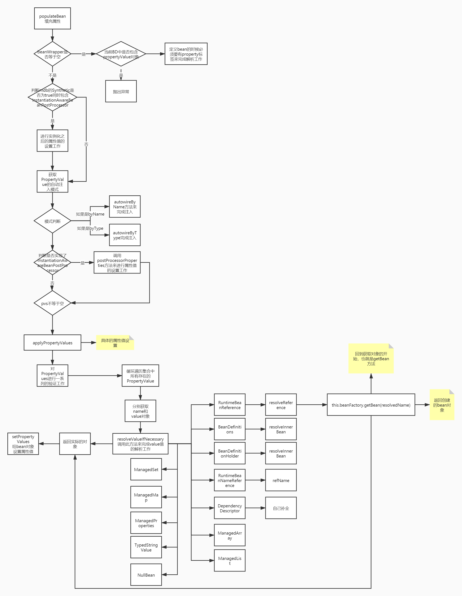

#bean生命周期
##配置文件加载
spring加载配置文件


##refresh核心方法

```asp
prepareRefresh,ApplicationListener初始化
refreshBeanFactory,创建DefaultListableBeanFactory,loadBeanDefinitions加载xml
prepareBeanFactory,加载系统基础beanPostProcessor,如ApplicationContextAwareProcessor,系统bean,如environment
invokeBeanFactoryPostProcessors,执行BeanFactoryPostProcessor,完成注解类型的beanDefinition的解析和修改,如ConfigurationClassPostProcessor
propertysourcePlaceholderPostProcessor
registerBeanPostProcessors,注入一些BeanPostProcessors到容器,排序,如autowiredBeanPostprocessor,commonbeanpostprocessor
initApplicationEventMulticaster,注入事件广播器
onRefresh,springboot启动web容器
registerListeners,注册事件监听器,广播早期事件
finishBeanFactoryInitialization,实例化初始化单例bean,包括生成AOP代理类
finishRefresh,发送完成事件
```
##核心四件套实例化流程,BeanDefinition,BeanFactoryPostProcessor,BeanPostProcessor,Bean

##Bean实例化前置流程GetBean



##Bean实例化初始化全流程


##bean初始化过程


##populateBean流程

