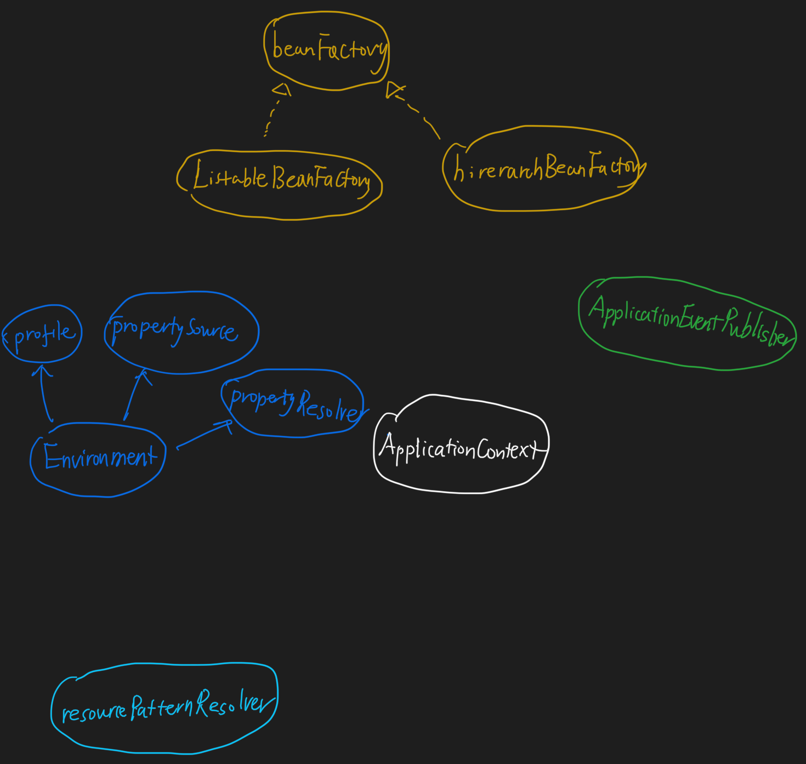
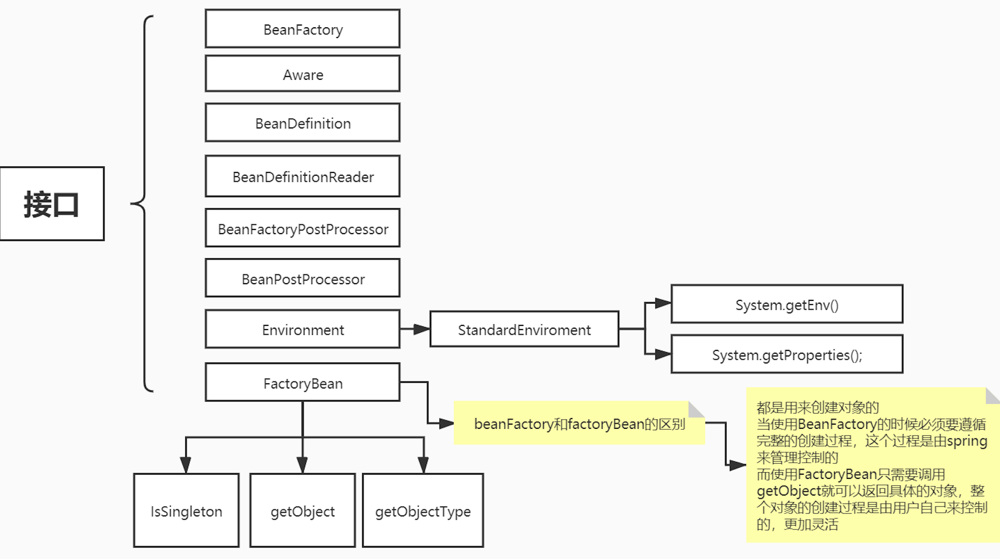
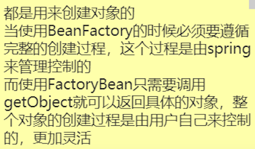
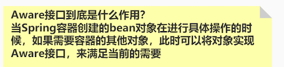

#容器类

##BeanFactory
容器

##ListableBeanFactory
列表

##HierarchicalBeanFactory
层级

##ApplicationContext
容器:ListableBeanFactory,HierarchicalBeanFactory
应用环境:EnvironmentCapable
资源解析:ResourcePatternResolver
事件通知:ApplicationEventPublisher
##ConfigurableApplicationContext
可配置

##AbstractApplicationContext
模板方法

##AnnotationConfigApplicationContext
注解容器

#环境类
##PropertySource
属性源,key-value属性对抽象
##propertySources
属性源集合
##PropertyResolver
属性解析器,用于解析相应key的value
##ConfigurablePropertyResolver
增加ConversionService
##AbstractPropertyResolver
前缀后缀${,}
##Profile
##Environment
profile+PropertyResolver
##ConfigurableEnvironment
Environment+ConfigurablePropertyResolver
##StandardEnvironment

#解析类
##BeanDefinition
清单文件
##BeanDefinitionReader
bean解析类
##BeanNameGenerator
##FactoryBean

#扩展类
##BeanFactoryPostProcessor
容器扩展类,增强BeanDefinition信息,@configuration扫描
##BeanPostProcessor
bean扩展类
##aware
通知类

###ApplicationContextAware

#事件通知类
