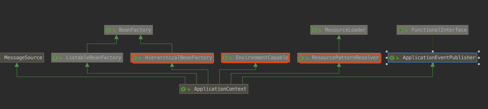
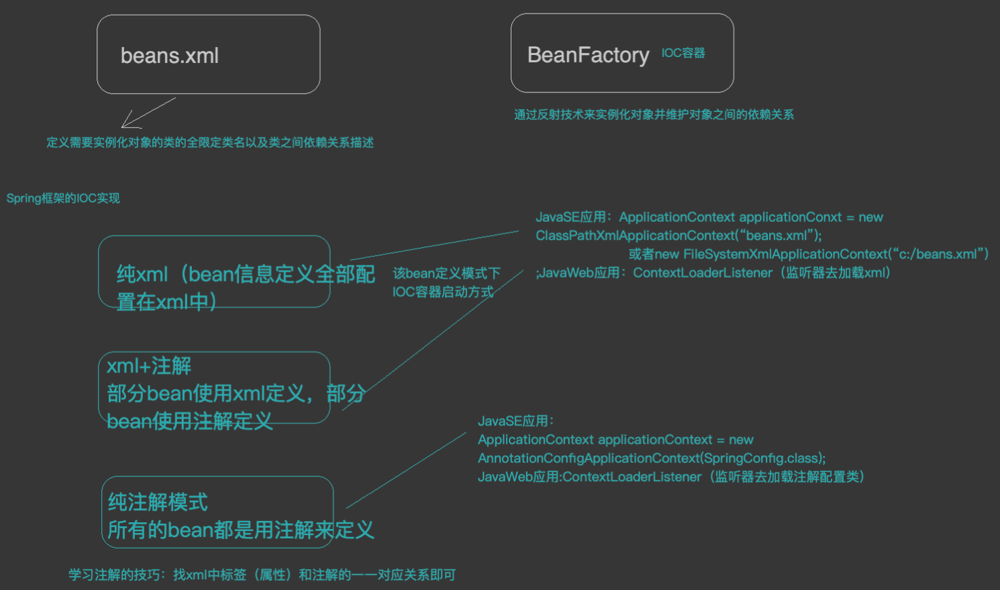

#初始化流程
#容器常见接口
##BeanFactory
getBean
##ApplicationContext

##AbstractApplicationContext
refresh()
##ClassPathXmlApplicationContext

##AnnotationConfigApplicationContext
#启动方式
##springboot
main函数new
##web项目
ContextLoaderListener

#父子层次关系

#环境上下文

#资源解析器

#发布订阅事件
