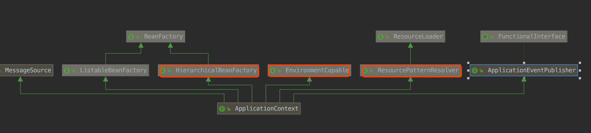

#容器常见接口
##BeanFactory
getBean
##ApplicationContext

##DefaultListableBeanFactory

##AbstractApplicationContext
refresh()
##ClassPathXmlApplicationContext

```asp
super()->实例化ResourcePatternResolver
refresh()->obtainFreshBeanFactory->loadBeanDefinitions(加载xml)
```
##AnnotationConfigApplicationContext
```asp
this()->实例化AnnotatedBeanDefinitionReader->实例化environment,创建@Conditional评估器,
        注入ConfigurationClassPostProcessor的BeanDefinition,AutowiredAnnotationBeanPostProcessor的BeanDefinition,CommonAnnotationBeanPostProcessor的BeanDefinition
        实例化ClassPathBeanDefinitionScanner扫描器,将@Component加入过滤注解列表中
        
register()->new AnnotationConfigApplicationContext(AppConfig.class);将AppConfig注入BeanDefinition,后序会扫描AppConfig的注解

refresh()->invokeBeanFactoryPostProcessors()->调用ConfigurationClassPostProcessor注入BeanDefinition,调用PropertySourcesPlaceholderConfigurer解析${}
           registerBeanPostProcessors()->实例化this()中注入的BeanPostProcessor的BeanDefinition
```
##
#父子层次关系
