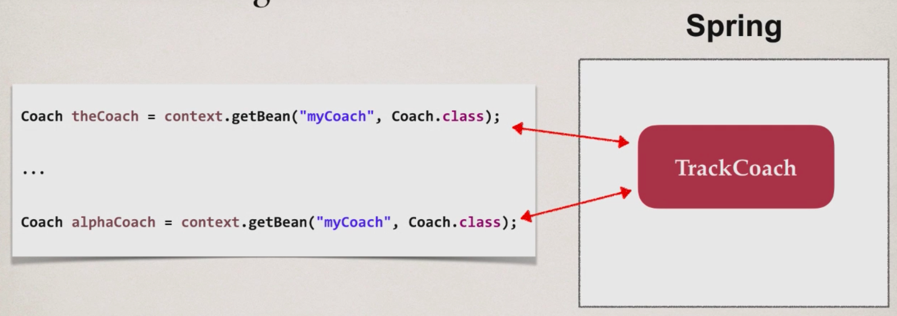
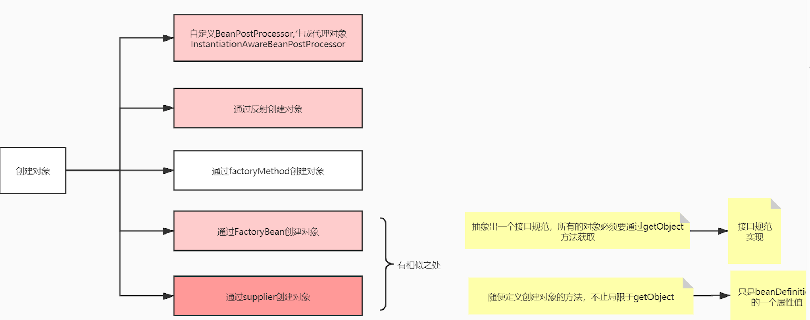
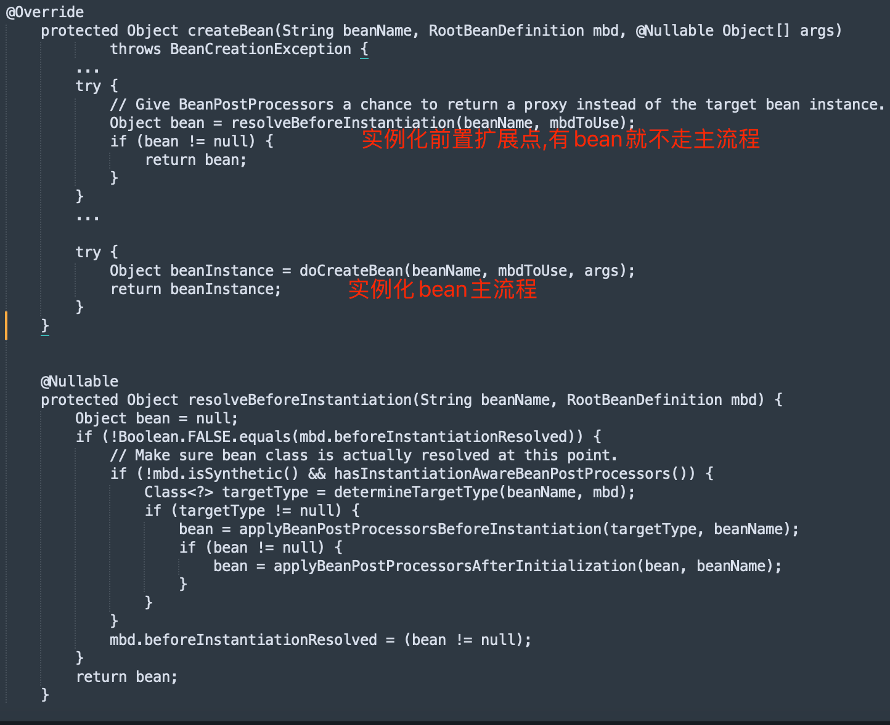
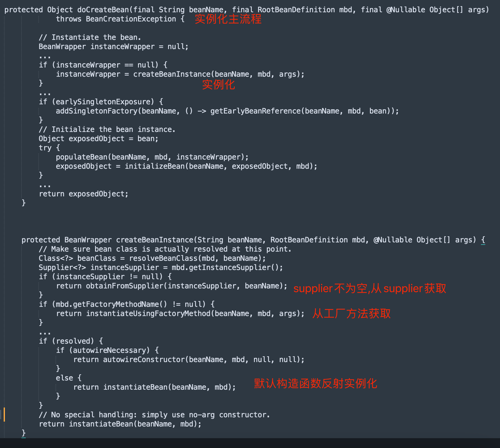
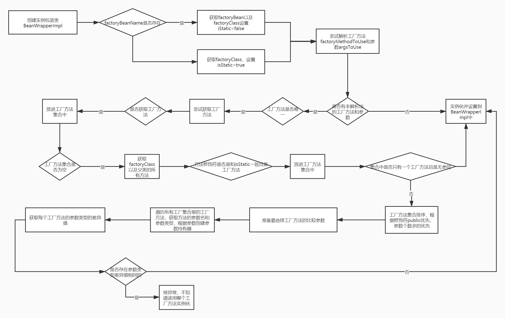
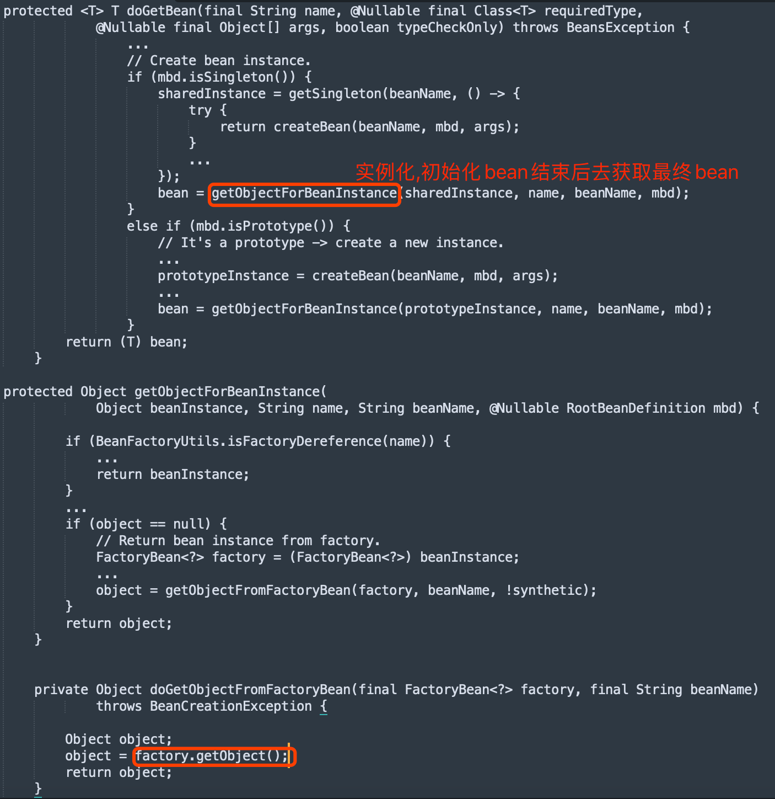
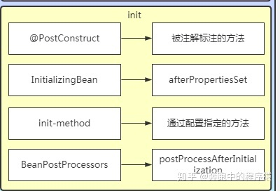
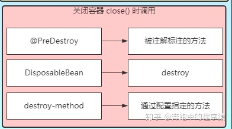

#临界知识
贫血模式vs充血模式
#对象范围
##原型

[](https://docs.spring.io/spring-framework/docs/3.0.0.M3/reference/html/ch04s04.html)
1.原型bean被定义为在每次注入时都会创建一个新的对象
2.原型对象也会经历beanProcessor的处理
3.原型bean不会被容器持有和管理,不会进入容器map
```asp
There is one quite important thing to be aware of when deploying a bean in the prototype scope, in that the lifecycle of
 the bean changes slightly. Spring does not manage the complete lifecycle of a prototype bean: the container instantiates, 
 configures, decorates and otherwise assembles a prototype object, hands it to the client and then has no further knowledge 
 of that prototype instance. This means that while initialization lifecycle callback methods will be called on all objects 
 regardless of scope, in the case of prototypes, any configured destruction lifecycle callbacks will not be called. 
 It is the responsibility of the client code to clean up prototype scoped objects and release any expensive resources 
 that the prototype bean(s) are holding onto. (One possible way to get the Spring container to release resources used by
  prototype-scoped beans is through the use of a custom bean post-processor which would hold a reference to the beans that need to be cleaned up.)

```
##单例
创建

#5种实例化方式

[](https://blog.csdn.net/u013277209/article/details/109804892)


##InstantiationAwareBeanPostProcessor#postProcessBeforeInstantiation(doCreateBean主流程之前)

扩展点postProcessBeforeInstantiation创建对象后,不会继续执行doCreateBean接下来的populateBean和initialBean
```asp
public class MyInstantiationAwareBeanPostProcessor implements InstantiationAwareBeanPostProcessor {
    @Override
    public Object postProcessBeforeInstantiation(Class<?> beanClass, String beanName) throws BeansException {
        if (beanName.equals("a")) {
            return new B();
        }
        return null;
    }
}

```
##Supplier接口(主流程的createBeanInstance中第一个)


```asp
public class CreateSupplierB {
    public static B createB(){
        return new B();
    }
}

@Component
public class MyBeanFactoryPostProcessor implements BeanFactoryPostProcessor {
    @Override
    public void postProcessBeanFactory(ConfigurableListableBeanFactory beanFactory) throws BeansException {
        BeanDefinition beanDefinition = beanFactory.getBeanDefinition("a");
        GenericBeanDefinition genericBeanDefinition = (GenericBeanDefinition) beanDefinition;
        genericBeanDefinition.setInstanceSupplier(CreateSupplierB::createB);
    }
}

```
##工厂方法(主流程的createBeanInstance中第二个)

##反射(主流程的createBeanInstance中第三个)


##FactoryBean(主流程结束后返回doGetBean时处理)
[](https://blog.csdn.net/u013277209/article/details/109742074)

FactoryBean可以生成某一个类型的Bean实例(返回给我们)，也就是说我们可以借助于它自定义Bean的创建过程
[拉钩spring.pdf 2.2]
```asp
@Component
public class MyFactoryBean implements FactoryBean<A> {
    @Override
    public A getObject() throws Exception {
        return new A();
    }

    @Override
    public Class<?> getObjectType() {
        return A.class;
    }
}

```


#生命周期方法
[](https://www.jianshu.com/p/c6c60ea40569)
##init方法
@PostConstruct
方法就是初始化后调用的方法

##destroy方法


#懒加载lazy init
设置 lazy-init 为 true 的 bean 将不会在 ApplicationContext 启动时提前被实例化，而是第一次向容器
通过 getBean 索取 bean 时实例化的,beandefinition构建无视lazy init,

如果一个设置了立即加载的 bean1，引用了一个延迟加载的 bean2 ，那么 bean1 在容器启动时被实例 化，而 bean2 由于被 bean1 引用，
所以也被实例化，这种情况也符合延时加载的 bean 在第一次调用 时才被实例化的规则

如果一个 bean 的 scope 属性为 scope="pototype" 时，即使设置了 lazy-init="false"，容器启动时也不 会实例化bean，而是调用 getBean 方法实例化的


