#============================== beanDefinition的扩展点===========================
#ConfigurationClassPostProcessor
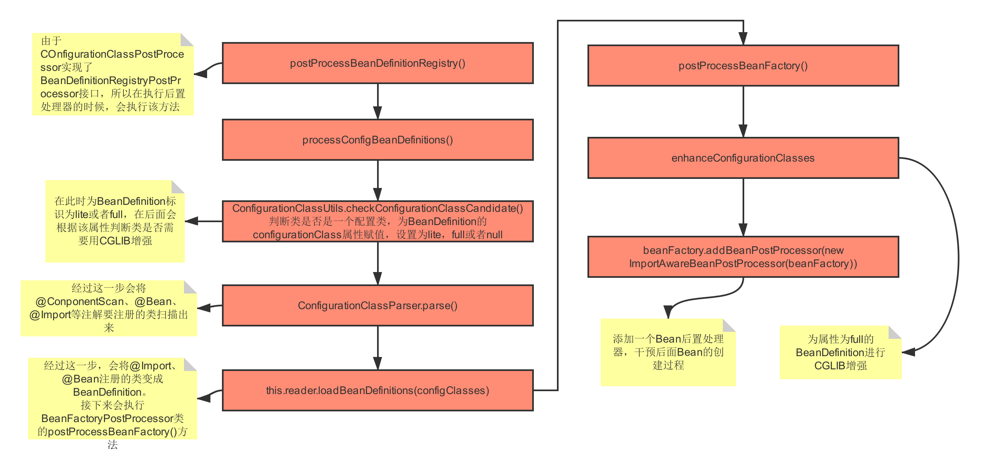

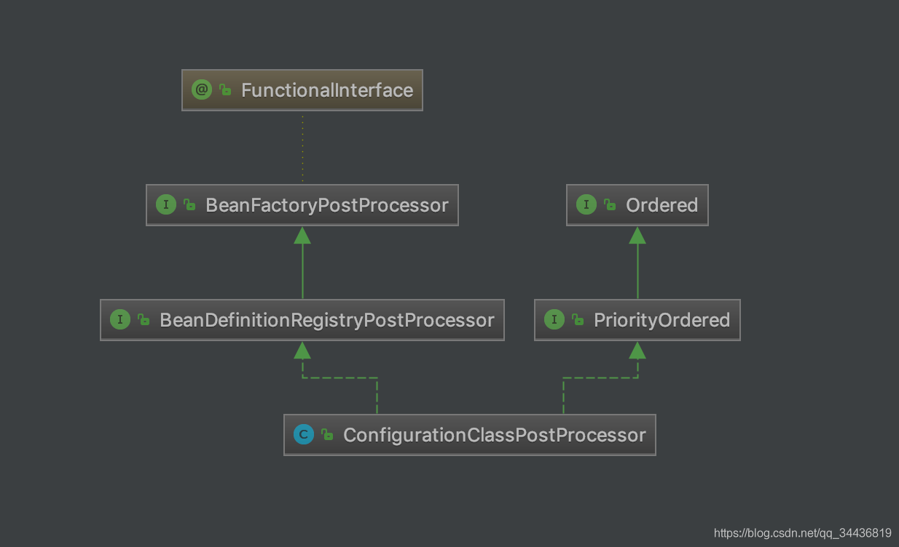

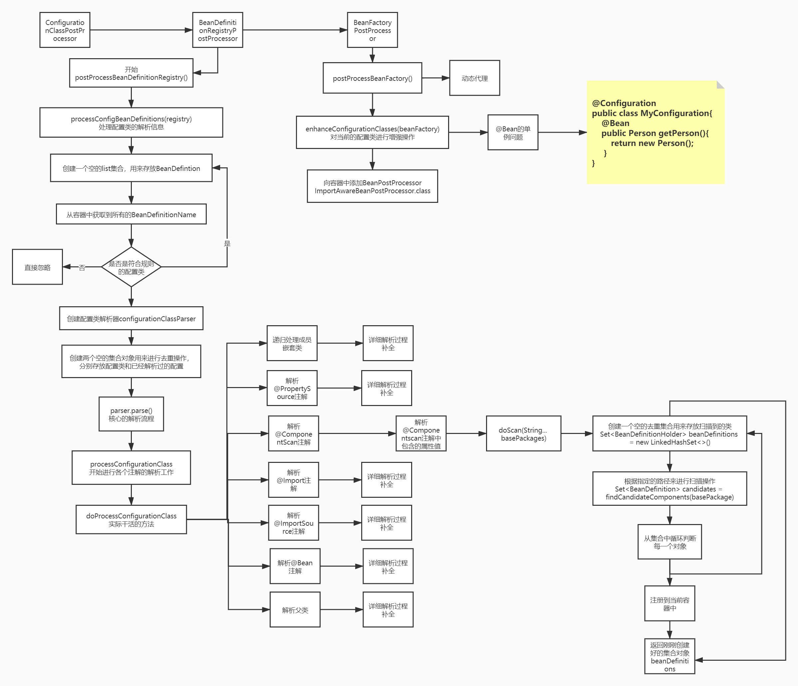
[](https://blog.csdn.net/qq_34436819/article/details/100944204)
#PropertySourcesPlaceholderConfigurer
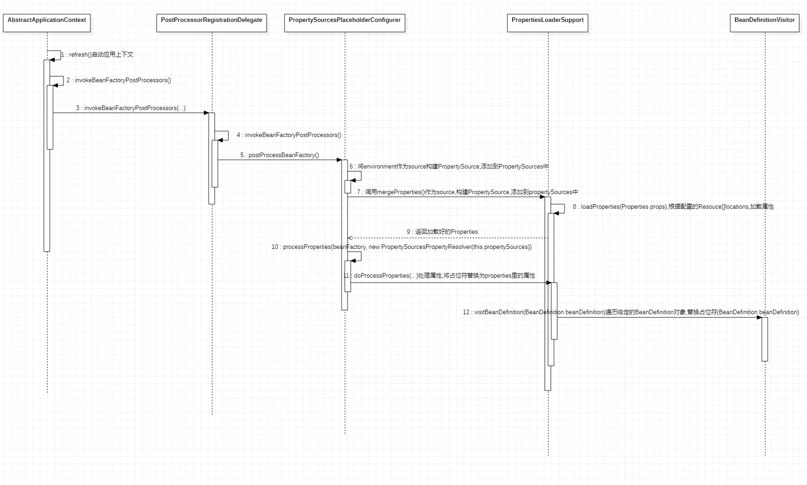
##propertySources优先级


#===============================bean对象的扩展点===========================
实例化(Instantiation): 要生成对象, 对象还未生成
初始化(Initialization): 对象已经生成，赋值操作
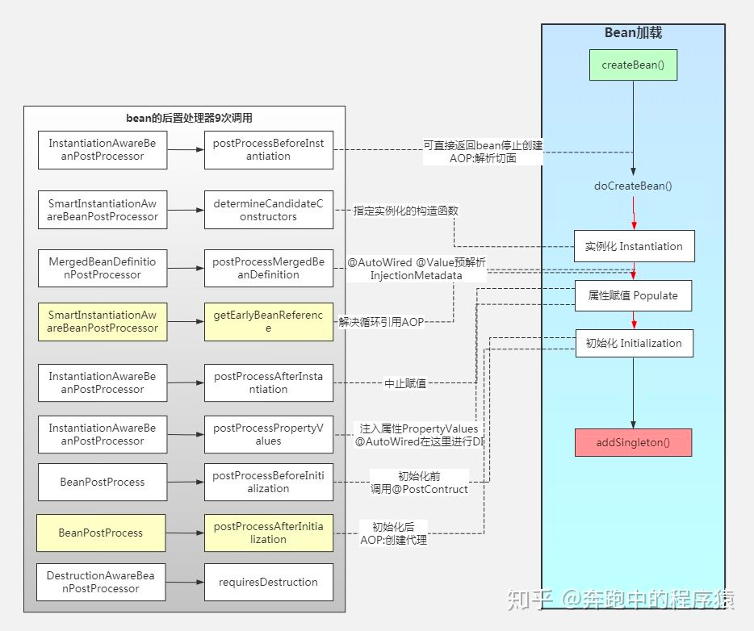

#InstantiationAwareBeanPostProcessor
InstantiationAwareBeanPostProcessor定义的方法是在对象实例化过程中做处理
##postProcessBeforeInstantiation(实例化前置处理,对象未生成)
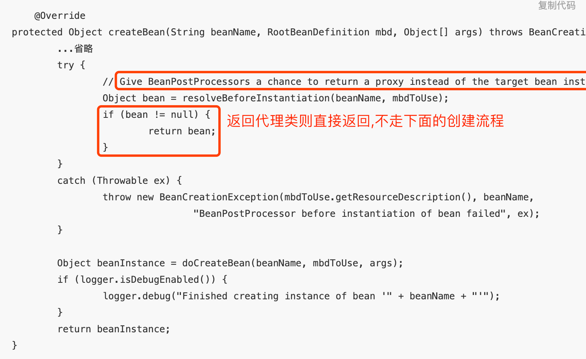

```asp
1.给BeanPostProcessor一个机会去返回一个代理对象. 就是在流水线doCreateBean()生成对象之前, 给用户自定义返回一个对象的机会
2.判断是有InstantiationAwareBeanPostProcessor的BeanPostProcessor
3.有则调用的是InstantiationAwareBeanPostProcessor的postProcessBeforeInstantiation()实例化前置处理方法，也就是在Bean没有生成之前执行。（注意：这里所说的是Bean未生成指的是Bean没有走spring定义创建Bean的流程，也就是doCreateBean()方法。）
4.如果postProcessBeforeInstantiation()返回的对象不为空, 那么对象的生成阶段直接完成了
5.接着调用postProcessAfterInitialization()[初始化后置处理] 处理这个对象.
6.如果为空,则走流水线doCreateBean()创建对象, 对象初始化
```

##postProcessAfterInstantiation(实例化后置处理,对象已经生成)
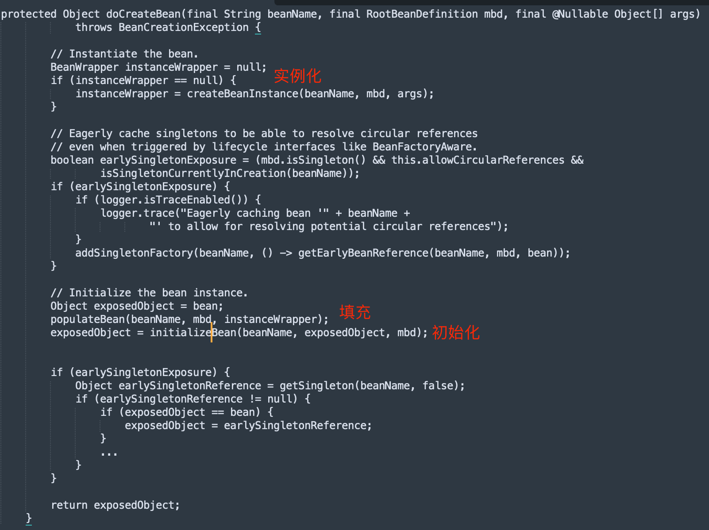
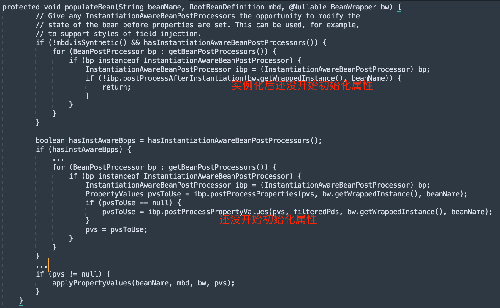
```asp
1.上文resolveBeforeInstantiation()没有返回bean.则走流水线创建Bean
2.doCreateBean(beanName, mbdToUse, args)创建对象，会经过populateBean(beanName, mbd, instanceWrapper)方法。
3.populateBean(beanName, mbd, instanceWrapper)依次执行postProcessAfterInstantiation() 与postProcessPropertyValues()
```
##postProcessPropertyValues(此处依赖注入,注入成员属性,@Resource,@Autowired,@Value)
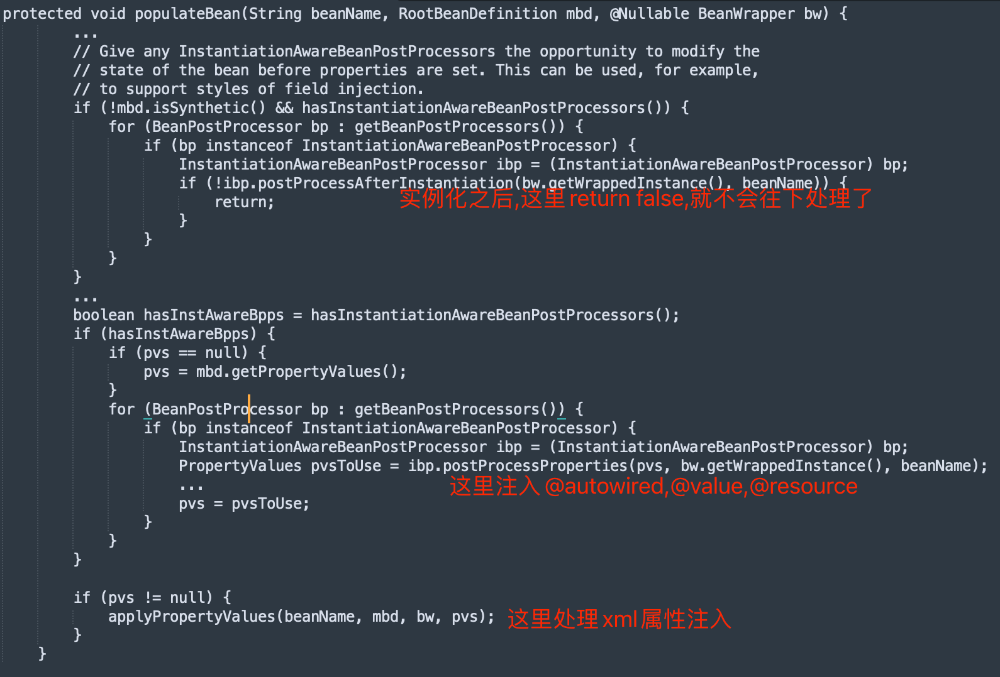


#BeanPostProcessor
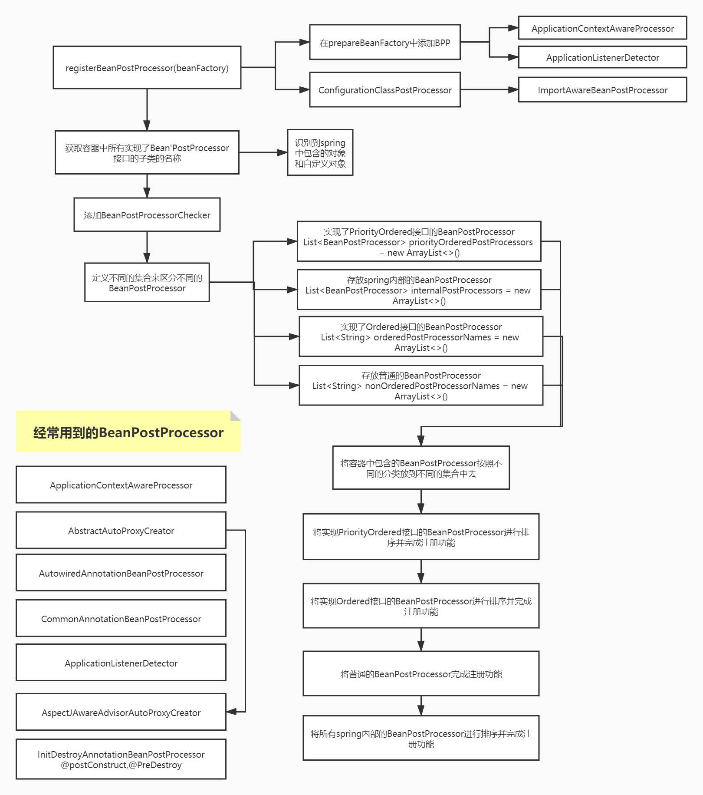
BeanPostProcessor定义的方法是在对象初始化过程中做处理
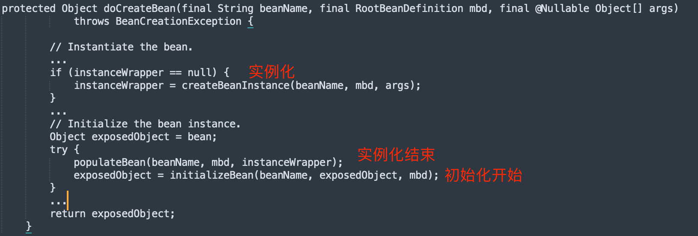
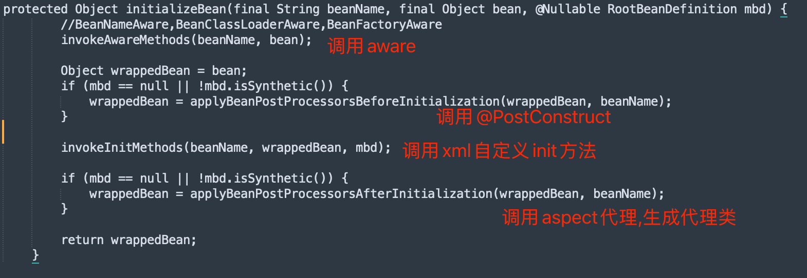
##postProcessBeforeInitialization(实例化之后,初始化之前,此时属性已注入,即@Resource,@Autowired,@Value已完成,初始化指代init方法)
The bean will already be populated with property values.
ApplicationContextAwareProcessor

CommonAnnotationBeanPostProcessor,@PostConstruct 和 @PreDestroy
##postProcessAfterInitialization(初始化之后)
AnnotationAwareAspectJAutoProxyCreator
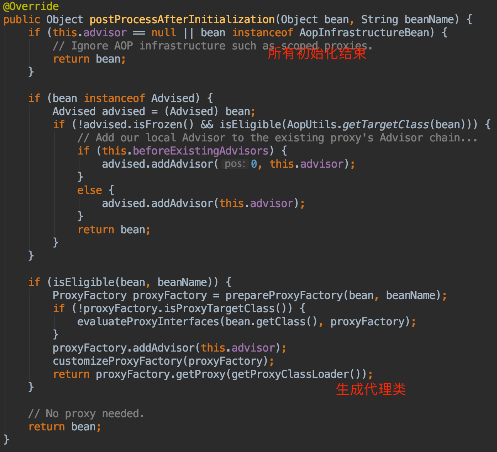

#重要的InstantiationAwareBeanPostProcessor

##AutowiredAnnotationBeanPostProcessor
1.postProcessBeforeInstantiation
2.postProcessAfterInstantiation
3.postProcessProperties:注入@Autowired,@Value
##CommonAnnotationBeanPostProcessor
1.postProcessBeforeInstantiation
2.postProcessAfterInstantiation
3.postProcessProperties:注入@Resource


#重要的BeanPostProcessor
##CommonAnnotationBeanPostProcessor
1.postProcessBeforeInitialization:invoke @PostConstruct
##AnnotationAwareAspectJAutoProxyCreator

1.postProcessAfterInitialization: 生成代理类
