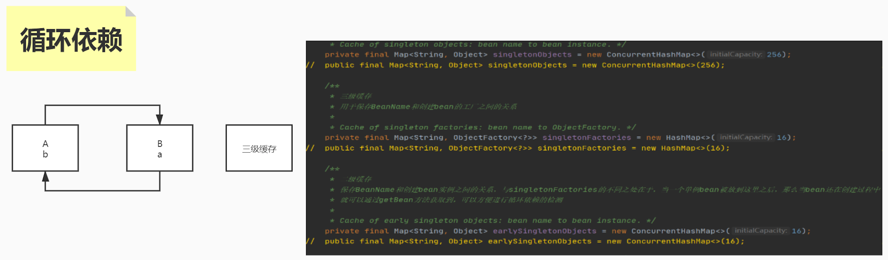
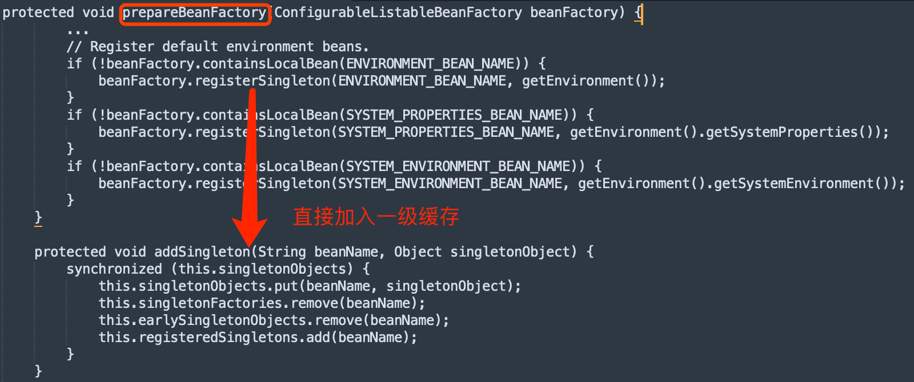

#注入方式
```asp
@Autowired:类型注入
@Qualifier:指定名称,单独不能使用,需要和autowired搭配
@Resource:@Resource,不申明则是先通过Name注入,然后通过type注入

```
#注入注解的对应beanprocessor
```asp
1.@Autowired ->  AutowiredAnnotationBeanPostProcessor
2.@Resource  ->  CommonAnnotationBeanPostProcessor
```
#注入时机
postProcessPropertyValues

#循环依赖问题
[](https://zhuanlan.zhihu.com/p/84267654)
循环依赖是指A依赖B，B依赖A。或者多个对象的依赖关系形成闭环  
这种情况下容器会无限执行，一直创建Bean，最终导致OOM.


##临界知识
对象对外暴露经历的过程:实例化、初始化
对象提前暴露:实例化后直接暴露,引用逃逸
属性注入:代理类、普通类
##三级缓存

[](https://www.cnblogs.com/semi-sub/p/13548479.html)
[](https://zhuanlan.zhihu.com/p/259255169)
[](https://zhuanlan.zhihu.com/p/84267654)
```
使用三级缓存：
1.singletonFactories：方法工厂对象，此工厂对象主要用于获取对象/对象的增强代理
2.earlySingletonObjects：存放未填充注入的对象
3.singletonObjects：存放最终态的对象
```
```
A的单独创建过程为：
a.创建A的实例对象,以工厂对象形式存入singletonFactories
b1.对A对象注入B对象

在上述过程b中，由于注入B对象会导致创建B实例对象，会导致:
c1.创建B实例对象，以工厂对象形式存入singletonFactories
c2.对B实例对象注入A对象, 如果A需要代理增强，进行代理增强，此时的A对象为不完全对象A，A
    存入earlySingletonObjects
c3.如果B对象需要代理增强，进行代理增强，此时的B对象为完全对象B，B存入singletonObjects

b2.对A对象注入B对象完成，A存入singletonObjects

d.返回实例A
```
##对象一定在是从三级->二级->一级的过程吗?
不一定
有可能直接注入到一级缓存,environment bean实例对象

有可能注入三级,@component申明的对象,如果对象不被代理,则不会加入到二级缓存,直接从三级到一级缓存


有可能注入二级吗?不存在,二级缓存用来存储三级缓存产生的代理对象,如果是普通对象,不需要二级缓存来存放
##为什么不用二级缓存
主要考虑到有的对象需要AOP增加，形成代理类,但代理类只有注入时才知道是否需要生成代理,因此实例化时
缓存lambda表达式,ObjectFactory缓存来处理生成代理类,后面注入时再判断是否需要生成代理类.
且代理类要保持单例不能每次都重新生成
```
protected Object getEarlyBeanReference(String beanName, RootBeanDefinition mbd, Object bean) {
    Object exposedObject = bean;
    if (!mbd.isSynthetic() && hasInstantiationAwareBeanPostProcessors()) {
        for (BeanPostProcessor bp : getBeanPostProcessors()) {
            // SmartInstantiationAwareBeanPostProcessor 这个后置处理器会在返回早期对象时被调用，如果返回的对象需要加强，那这里就会生成代理对象
            if (bp instanceof SmartInstantiationAwareBeanPostProcessor) {
                SmartInstantiationAwareBeanPostProcessor ibp = (SmartInstantiationAwareBeanPostProcessor) bp;
                exposedObject = ibp.getEarlyBeanReference(exposedObject, beanName);
            }
        }
    }
    return exposedObject;
}

```
##为什么不支持原型
原型不缓存在map中,由应用程序自己管理


##一级缓存,二级缓存,三级缓存存入时机?
```asp
private final Map<String, Object> singletonObjects = new ConcurrentHashMap<>(256);//一级
private final Map<String, Object> earlySingletonObjects = new HashMap<>(16);//二级
private final Map<String, ObjectFactory<?>> singletonFactories = new HashMap<>(16);//三级
```
普通@component bean实例化后存入三级缓存singletonFactories


如果是代理类,在被注入到属性时,从三级缓存获取对象放入二级缓存


初始化结束后,如果是代理类则从二级缓存进入一级缓存,如果是普通类从三级缓存进入到一级缓存,特殊系统bean environment直接注入一级缓存


##什么时候从一级拿到对象?什么时候从二级拿到对象?会从三级拿到对象吗?
```asp
一级缓存拿对象:
一般是系统bean,如environment bean对象实例化,明确知道不存在循环引用,也不存在代理,直接加入到一级缓存
```
```asp
二级缓存拿对象:
存在循环引用A<->B,A需要注入B,B需要注入A,在B注入A时,从二级缓存中获取A
```
```asp
三级缓存拿对象:
三级缓存是lambda表达式,没有代理时返回原始对象,不存在代理类时,从三级缓存拿对象到一级缓存中,不经过二级缓存
```

##怎么将三级缓存变成二级缓存?

