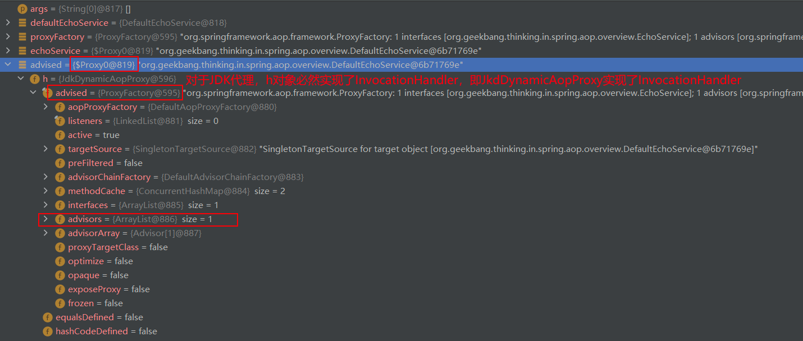
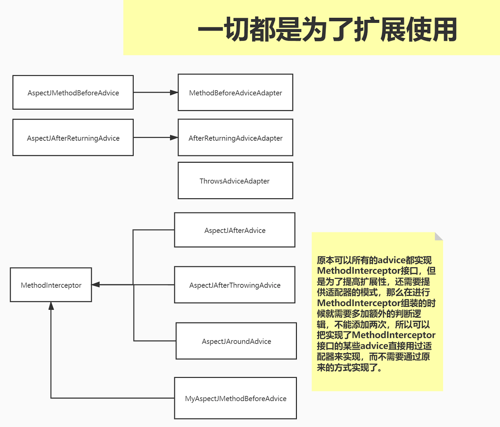

#核心逻辑对象

##aspect切面
##advice
通知，标识逻辑织入的位置,常见的有5种位置
##pointcut
切入点，标识对什么方法进入代理
##advisor
通知器，是通知与切入点的集合
advisor=advice+pointcut
##join point

#核心实现对象
##Advised
已经织入完成的通知者集合，包含在代理对象中，代理对象已经可以直接使用

advised=list[advisor]
##advice
5个通知器类型
##advisor
具体通知器advisor=advice+pointcut

##MethodInterceptor(CGLIb )

AspectJAfterAdvice
##MethodInvocation
责任链
##AdvisorAdapter
