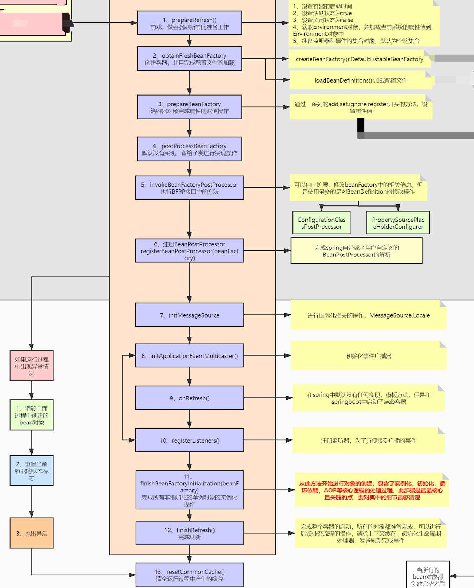

#AOP开关
##@EnableAspectJAutoProxy
通过@import注入 处理AOP的BeanPostProcessor(AnnotationAwareAspectJAutoProxyCreator)

##<aop:aspectj-autoproxy proxy-target-class="true"/>
使用xml namespace机制,申明aspectj-autoproxy时注入处理AOP的BeanPostProcessor(AnnotationAwareAspectJAutoProxyCreator)

namespace解析位于bean生命周期中的loadBeanDefinitions();

#扩展点AnnotationAwareAspectJAutoProxyCreator

##postProcessBeforeInstantiation
##postProcessAfterInitialization
