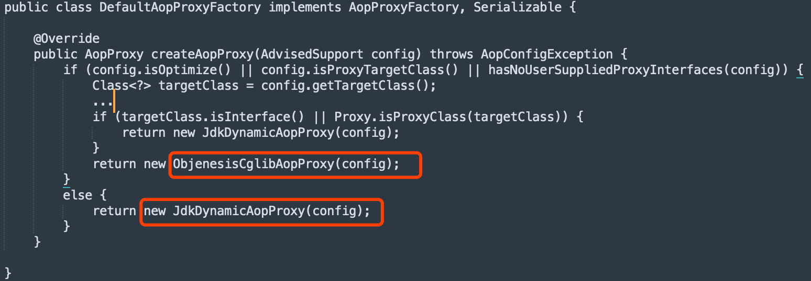
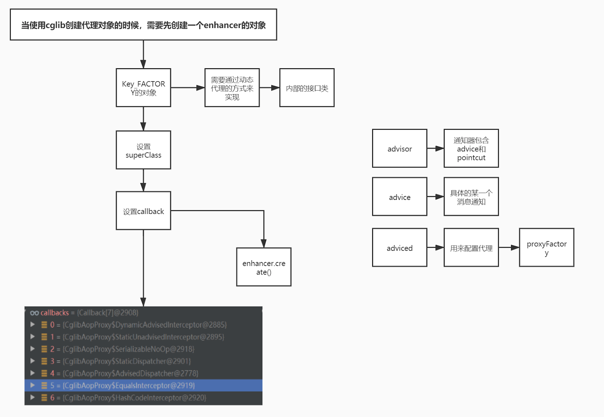

[](https://blog.csdn.net/qq_41071876/article/details/104613895)
#公共基类
##ProxyCreatorSupport
ProxyCreatorSupport内部使用DefaultAopProxyFactory
##DefaultAopProxyFactory

##ObjenesisCglibAopProxy

##JdkDynamicAopProxy
#三种具体实现
##ProxyFactory
[test_aop_01_ProxyFactory]
##ProxyFactoryBean
##AspectJProxyFactory
[test_aop_01_AspectJProxyFactory]
```asp
这三个类本身没有什么关系，但都继承自：ProxyCreatorSupport，创建代理对象的核心逻辑都是在ProxyCreatorSupport的createAopProxy方法中实现的
```
