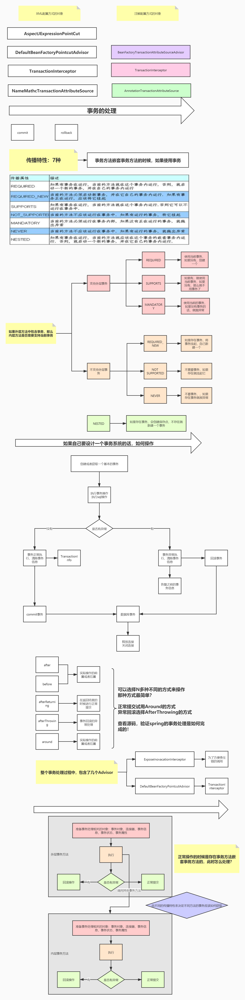
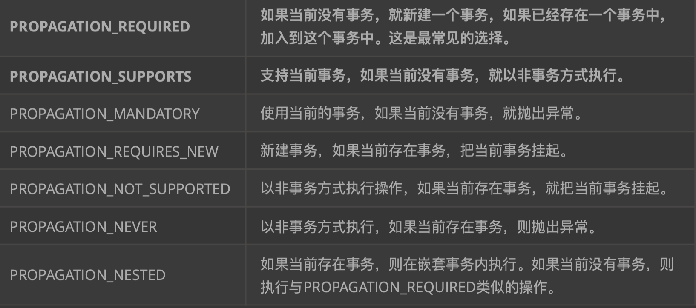
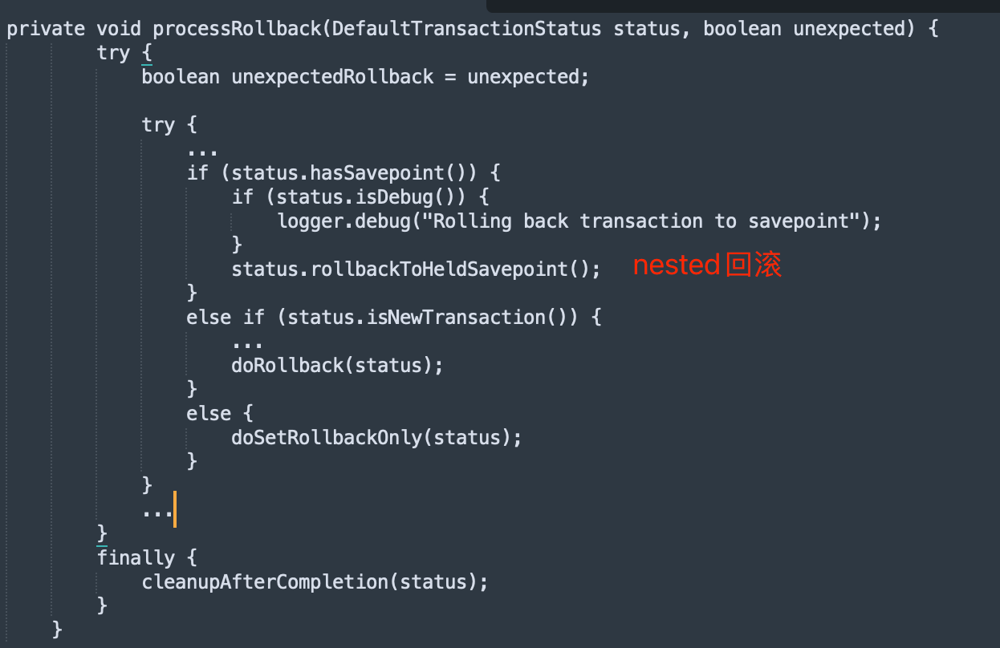

#临界知识
内层异常(任何传播类型),处理后会往外层抛异常,外层不进行捕获,外层任何类型都会回滚;外层捕获,只有required仍会回滚
内层required_new/nested,外层不try catch,仍会回滚
内层required+外层required,内层设置标志,外层即使捕获异常也会统一回滚
[](https://blog.csdn.net/gpf951101/article/details/77751025)
#nested
```asp
主事务和嵌套事务属于同一个事务
嵌套事务出错回滚不会影响到主事务
主事务回滚会将嵌套事务一起回滚了
```
外层REQUIRED,内层NESTED
```asp
内层异常回滚,外层如果try catch,不会进行回滚,不进行try catch,异常外抛,外层也回滚
```

[](https://www.jianshu.com/p/c6d4095f5833)
