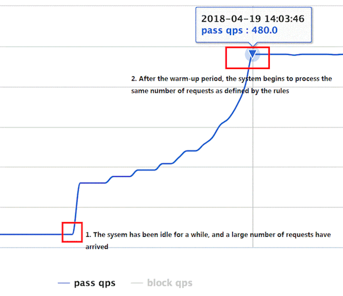

#流量控制

[](https://sentinelguard.io/zh-cn/docs/flow-control.html)
Sentinel 作为一个调配器，可以根据需要把随机的请求调整成合适的形状
```asp
流量控制有以下几个角度:

资源的调用关系，例如资源的调用链路，资源和资源之间的关系；
运行指标，例如 QPS、线程池、系统负载等；
控制的效果，例如直接限流、冷启动、排队等
```
```asp
resource：资源名，即限流规则的作用对象
grade: 限流阈值类型，QPS 或线程数
count: 限流阈值
strategy: 根据调用关系选择策略
```


##隔离类型
线程池隔离(thread pool)
信号量隔离(semaphore)
业内有使用隔离的方案，比如通过不同业务逻辑使用不同线程池来隔离业务自身之间的资源争抢（线程池隔离），或者使用信号量来控制同时请求的个数（信号量隔离）
Sentinel线程数限流不负责创建和管理线程池，而是简单统计当前请求上下文的线程个数，如果超出阈值，新的请求会被立即拒绝
##流控策略-QPS/线程数
###直接拒绝(快速失败)
```asp
直接拒绝（RuleConstant.CONTROL_BEHAVIOR_DEFAULT）方式。该方式是默认的流量控制方式，当QPS超过任意规则的阈值后，新的请求就会被立即拒绝，
拒绝方式为抛出FlowException。这种方式适用于对系统处理能力确切已知的情况下，比如通过压测确定了系统的准确水位时
```
###冷启动(预热WarmUp)

该方式主要用于系统长期处于低水位的情况下，当流量突然增加时，直接把系统拉升到高水位可能瞬间把系统压垮。通过"冷启动"，让通过的流量缓慢增加，
在一定时间内逐渐增加到阈值上限，给冷系统一个预热的时间，避免冷系统被压垮的情况
###匀速器(排队等待)
在某一秒有大量的请求到来，而接下来的几秒则处于空闲状态，我们希望系统能够在接下来的空闲期间逐渐处理这些请求，而不是在第一秒直接拒绝多余的请求。

##流控策略-调用关系
###根据调用方限流
###链路限流

###关联流量控制

##热点数据
[](https://sentinelguard.io/zh-cn/docs/parameter-flow-control.html)
