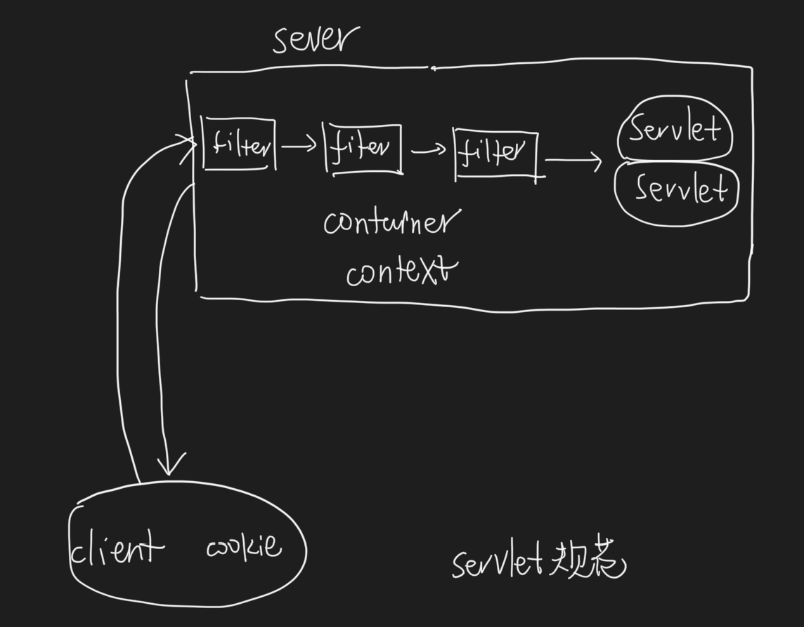
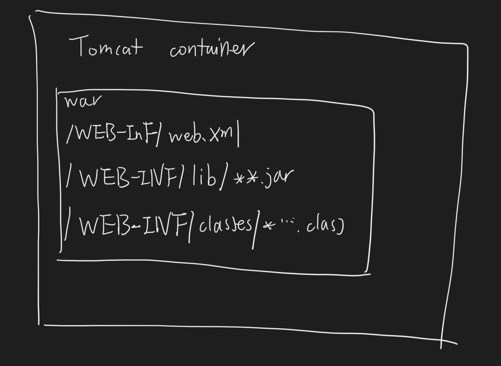
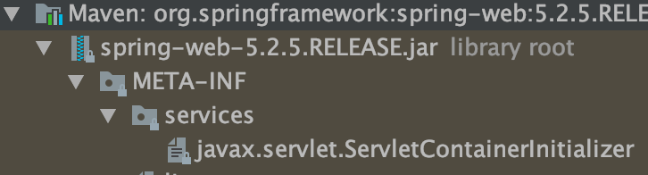
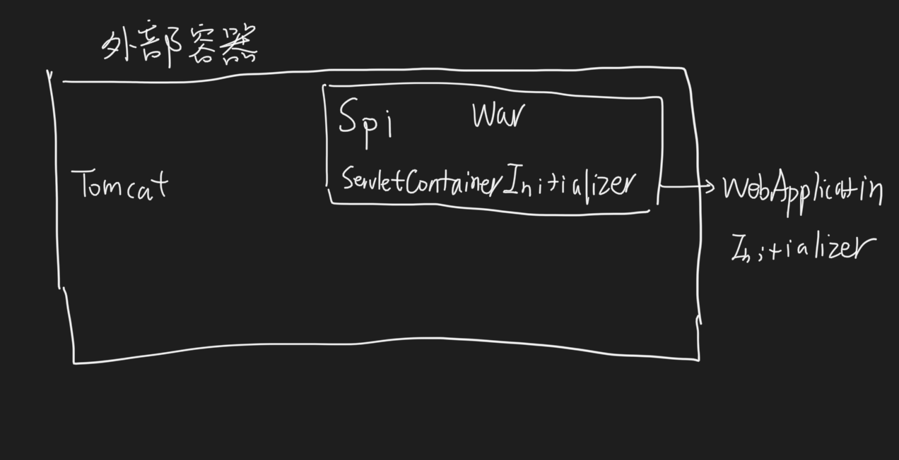
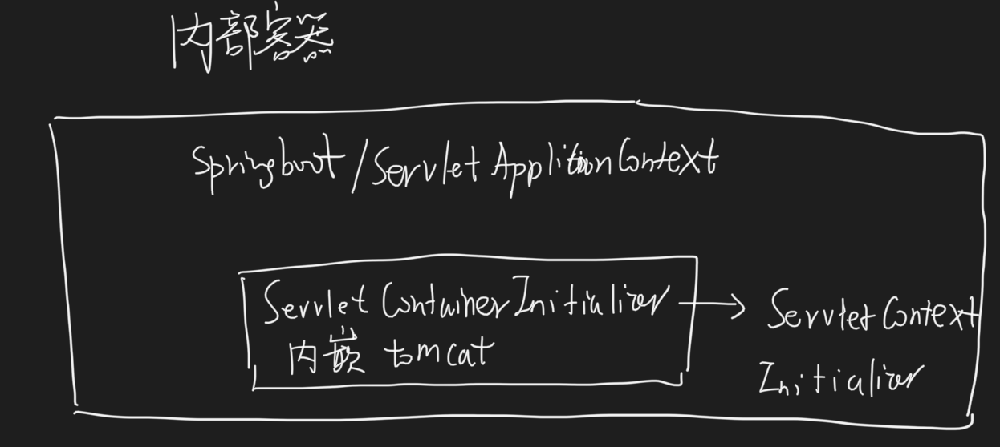

servlet规范(javax.servlet),以及各大容器的实现
##规范:
Servlet()
HttpServlet(javax.servlet.http)
ServletConfig(servlet配置)
ServletRegistration(函数式编程)

ServletContext(上下文)
ServletContextListener(初始化servlet/过滤器前)
ServletContextAttributeListener

ServletContainerInitializer(javax.servlet,spi,容器生命周期初始化回调,通过编程的方式去注册Servlet Filter Listenner等组件)

ServletRequest(javax.servlet)
HttpServletRequest(javax.servlet.http)
HttpServletMapping(javax.servlet.http)
ServletRequestListener(生命周期回调)
ServletResponse(javax.servlet)

Filter
GenericFilter(javax.servlet)
FilterConfig
FilterChain(责任链)
FilterRegistration(函数式编程)

Cookie(javax.servlet.http)
HttpSession(javax.servlet.http)
SessionCookieConfig

注解
HandlesTypes
WebFilter
WebListener
WebServlet

##对象模型

##外部tomcat部署war

容器扫描war包META-INF/services/javax.servlet.ServletContainerInitializer文件
eg:SpringServletContainerInitializer

SpringBootServletInitializer

##spring内嵌tomcat部署jar

[参考](https://segmentfault.com/a/1190000022763768)
