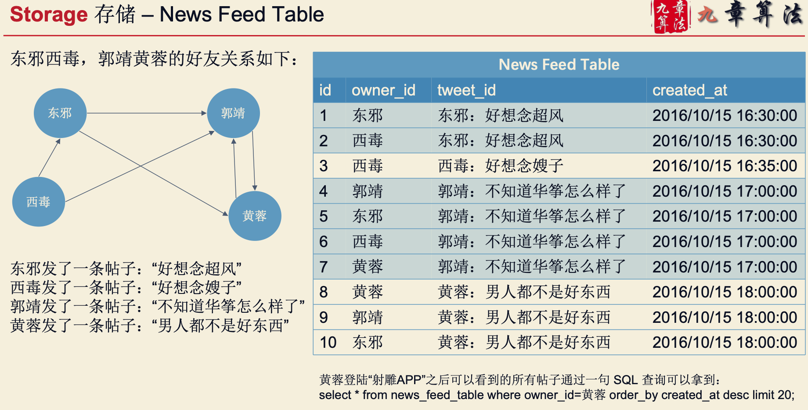
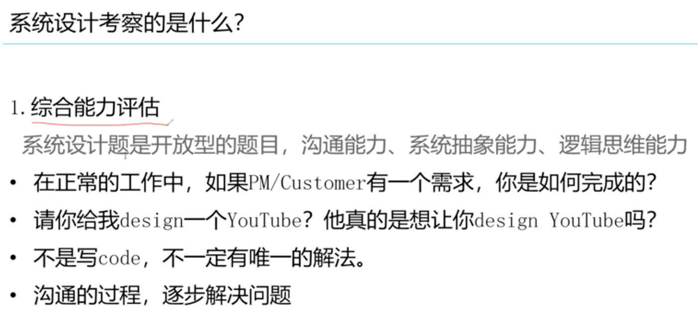

#临界
pull,push
预存储,异步
#系统设计考察什么
[](链接: https://pan.baidu.com/s/14a9S9H7UzZbvTl8NVkZkUA 提取码: cjv8)
```asp
Database, Schema, SQL, NoSQL, Memcached, File System, Distributed System, Latency, Scalbility, Master Slave, Load Balancer,
Web Server, Message Queue, Sharding, Consistent Hashing, QPS
```


#评判标准

#4S 分析法

##Scenario 场景


###需要设计哪些功能

###Analysis & Predict(QPS)


##Service 服务
将大系统拆分为小服务
1. Replay重放需求 
2. Merge归并需求
###将大系统拆分为小服务


##Storage 存储
数据如何存储与访问
1. Select为每个Service选择存储结构 
2. Schema细化表结构


###存储选择

###数据库的表结构
数据如何存储与访问

##feed信息流

###pull
pull+merge(k路归并)


pull缺陷
Pull模型有什么缺陷么?

###Push



##Scale升级
#沟通能力

确定需求范围
##核心考察点
核心想考察什么
##没有唯一解
##不断沟通
#系统架构设计能力

#常见案例
```asp
• 设计某某系统 Design XXX System 
  • 设计微博 Design Twitter
  • 设计人人 Design Facebook
  • 设计滴滴 Design Uber
  • 设计微信 Design Whatsapp
  • 设计点评 Design Yelp
  • 设计短网址系统 Design Tiny URL 
  • 设计NoSQL数据库 Design NoSQL
```
```asp
设计某某系统中的某某功能
  • 设计一个功能实现对用户访问频率的限制
  • 设计一个功能实现统计某个具体事件的历史发生次数 
  • 设计删除一个Tweet的功能
  • 设计邮件系统中将所有邮件标记为已读的功能
```
##请设计推特/微信

##短网址系统设计
##新鲜事系统设计
