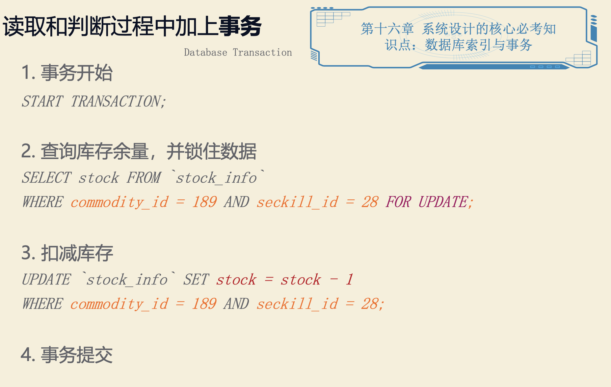
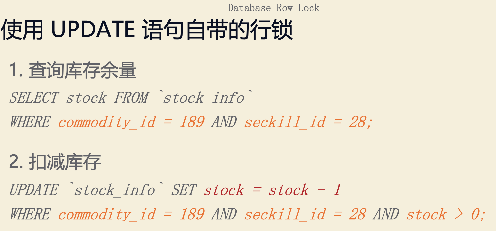

#临界知识

#4S分析法

##Scenario 场景
• 具体场景有哪些? 
• 实际需求有什么? 
• 详细流程怎么样?
###功能
限时,倒计时功能
限量,每人一台
有限,数量有限

详情页,倒计时,是否有货,限量
订单页,锁定库存,15min超时释放库存
支付页,支付成功扣减库存

###QPS
平日每秒 1000 人访问该页面。 秒杀时每秒数10万人访问该页面。 QPS 增加 100 倍以上。
###需求拆分

##Service 服务

##Storage存储
数据如何存储与访问
1. Select 为每个 Service 选择存储结构
2. Schema 细化表结构

##Scale升级

###瞬间大流量高并发
大量请求都访问 MySQL，导致 MySQL 崩溃。
对于抢购活动来说，可能几十万人抢 100 台 iPhone，实际大部分请求都是无效的，不需要下沉到 MySQL。

库存预热

SET seckill:28:commodity:189:stock 100
通过 Redis 扣减库存,redis和数据库一致性

通过 Lua 脚本执行原子操作

如果秒杀数量是1万台，或者10万台呢?消息队列

通过消息队列异步地创建订单,TCC事务一致性

库存扣减时机

###库存有限,不能超卖
读取判断库存，然后扣减库存

并发导致超卖的问题如何解决?
1.事务+当前读for update

2.当前读update + >0

###付款和减库存的数据一致性

付款和减库存的数据一致性 - 分布式事务 TCC

###严格限购

###Redis能力还是有限

###防止刷爆商品页面

###秒杀服务器挂掉，怎么办?

###恶意请求

###固定时间开启
服务端时间

###秒杀系统 VS 订票系统

