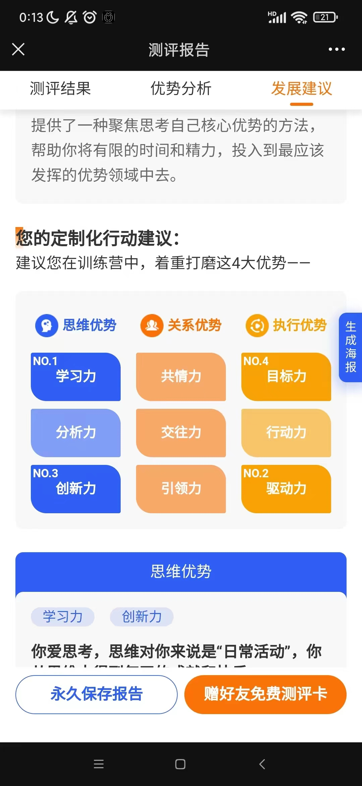

#9大优势崔催
不可替代性:结果驱动

#共情力
1.特点:敏感，对别人情绪敏感，玻璃心，没用好会很焦虑
2.痛点:利用好,分析好别人的需求做教练
3.策略:提问铲,明确别人的课题,明确别人的需求;询问,课题，共建
#交往力
1.特点:眼缘好,别人看眼睛就会信任你
2.痛点:喜欢对别人真诚,不愿意指出别人的问题,管理比较痛苦
3.策略:交往环,使用规则不使用人管理人,管理预期不要管理行为,
#学习力
1.特点:在学习中能获取乐趣,书本学习者,人际学习者,行动学习者
2.痛点:学习多,转化率低,赚不到钱,出不了成果
3.策略:分享枪,分享自己学到的成果给其他人,结构化,培养标准化能力,培养复制能力,首席培训官
#分析力
1.特点:思维清晰,能说出1,2,3点,走脑不走心
2.痛点:分析太多犹豫不决,瞻前顾后，空想家
3.策略:无影灯，空想家到策略家
#目标力
1.特点:有目标就像一个穿铠甲的战士,行动力很强,微观上
1.类型:目标驱动,竞争驱动,信念驱动
2.痛点:没有目标就容易浑浑噩噩,没有行动力，越在意目标越完不成目标,盯着局部目标忘记了最终目标
3.策略:边界刀,正确制定目标，意义目标，成果目标，行动目标
#驱动力
1.特点:一生都在追寻,成就驱动,竞争驱动,信念驱动,宏观上
2.痛点:没有理想就会觉得很空虚,迷茫,觉得人生黯淡无光,陷入瞎折腾
3.策略:指北针,找到自己的北极星
#行动力
1.特点:说干就干,立即就干,
2.痛点:容易鲁莽,冲动
2.策略:迭代人
