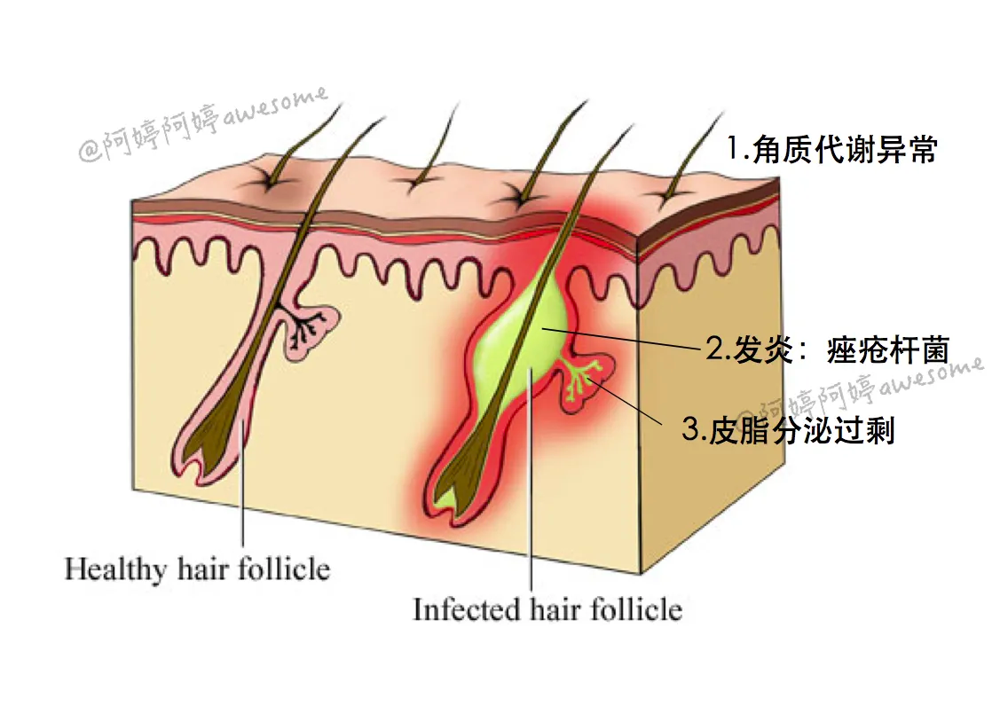
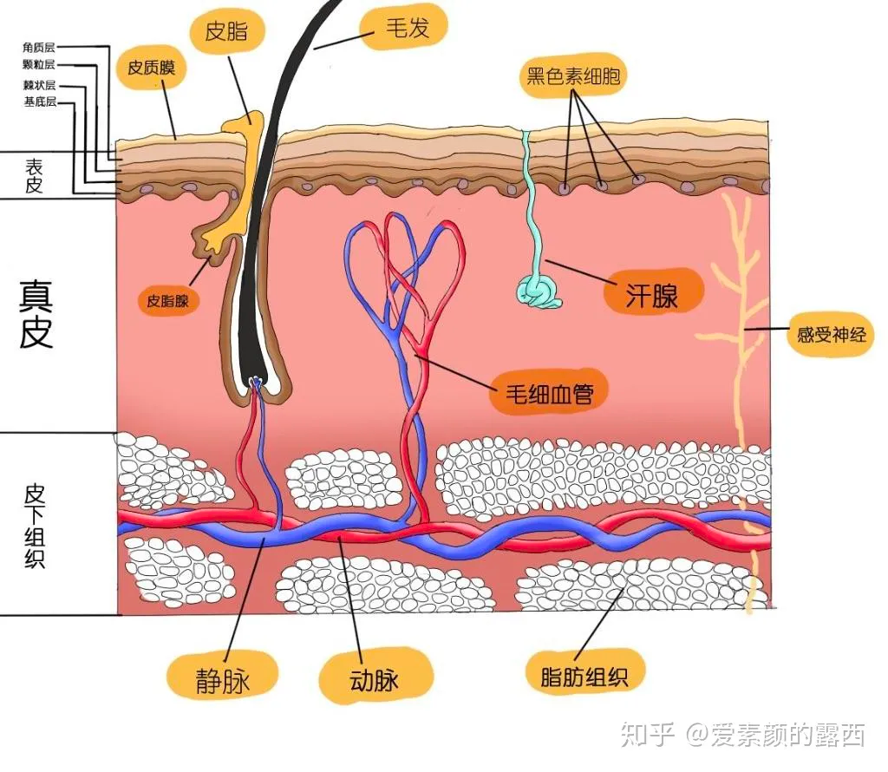
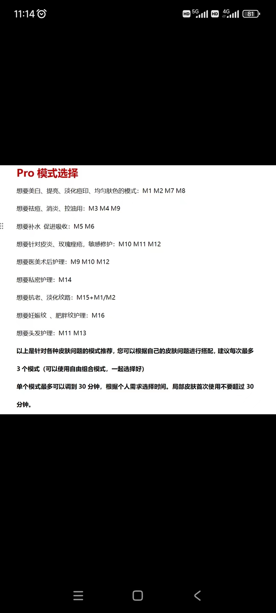
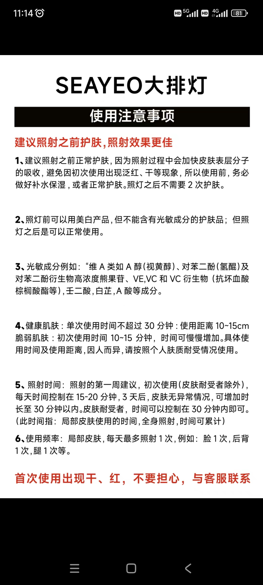

# 长痘三大因素

雄激素分泌旺盛 → 皮脂腺分泌旺盛 → 出现黑头/白头 → 受到痤疮丙酸杆菌感染 → 形成痤疮/痘痘

## 角质层过厚
毛囊被角质层覆盖，形成白头粉刺。聚集在毛囊口的油脂被氧化，加上空气污染越来越严重，变脏形成黑头粉刺
## 皮肤受到细菌感染
皮肤受到细菌感染（主要是痤疮杆菌），皮肤中发生一系列免疫反应，发炎长脓，形成了严重程度不一的有脓痘痘
## 皮脂腺分泌旺盛
皮脂腺分泌旺盛，多余的油脂聚集，加剧了上述两种情况的发生

# 每日护肤

## 早上 10min
1. 热敷 5min
2. 清水洗+祛痘+补水 5min (可复美胶原棒，可复美辅料)
3. 光子嫩肤    20min
4. 祛痘+美白

## 晚上  20min
1. olay洁面
2. 热敷+清水洗 5min
3. 补水+修复+保湿+祛痘+美白 5min

## 每周定期  60min
温和除去:周日按摩油,霍霍巴油10min,清洁面膜20min->祛痘面膜20min->修复10min

# 控油祛痘实践
## 避免皮脂腺分泌旺盛
[皮脂腺](https://www.zhihu.com/question/30353080)

### 避免熬夜
晚上是人体新陈代谢和排毒的极佳时机，熬夜会影响体内新陈代谢和内分泌，促使皮脂腺分泌旺盛，爆发痘痘。
熬夜影响内分泌

### 饮食避免影响内分泌 
避免牛奶

植物雌激素
1.豆浆(大豆异黄酮),无糖豆浆
2.坚果和蜂蜜

天然维生素e
1.黑芝麻
2.核桃仁
3.花生

### 好心情保持良好内分泌
坚持跑步,羽毛球 运动保持好心情

肾上腺激素和雄性激素的分泌紊乱会刺激到雄性激素的靶器官——皮脂腺，皮脂腺分泌更多的油脂就会容易导致毛孔堵塞，长痘痘。 当压力过大时，身体会释放激素，
试图抵消压力。 当这种激素分解或分泌时，会出现一种叫做活性氧的物质，但这种活性氧很麻烦。 活性氧会划伤皮肤细胞，会减缓痘痘和皮肤的修复 ，同时也会氧化皮脂，从而导致痘痘的形成
### 降低皮脂腺活性
口服维生素b6
多喝绿茶,补充维生素c

### 降低糖摄入
若是再摄入过多的添加糖，容易促使胰岛素分泌，导致雄性激素水平升高，雄性激素一升高，皮脂腺分泌也就更加旺盛，从而促使痘痘爆发

### 防紫外线
紫外线的UVA波长段可以到达真皮层，刺激到皮脂腺分泌油脂

### 避免高温
防止皮脂腺旺盛
## 疏通毛孔
### 湿敷
蒸脸机,热喷,打开毛孔,溶解油脂
### 2%水杨酸精华水
疏通油脂,水杨酸混保湿
### 每周一次深度清洁毛孔
清洁面膜
### 中午清水洗脸
防止油脂堵住

## 排痘
### 针清
放大镜
祛痘器
### 消毒
碘伏

## 痘印淡化
光子嫩肤
抗炎修复
抑制黑色素