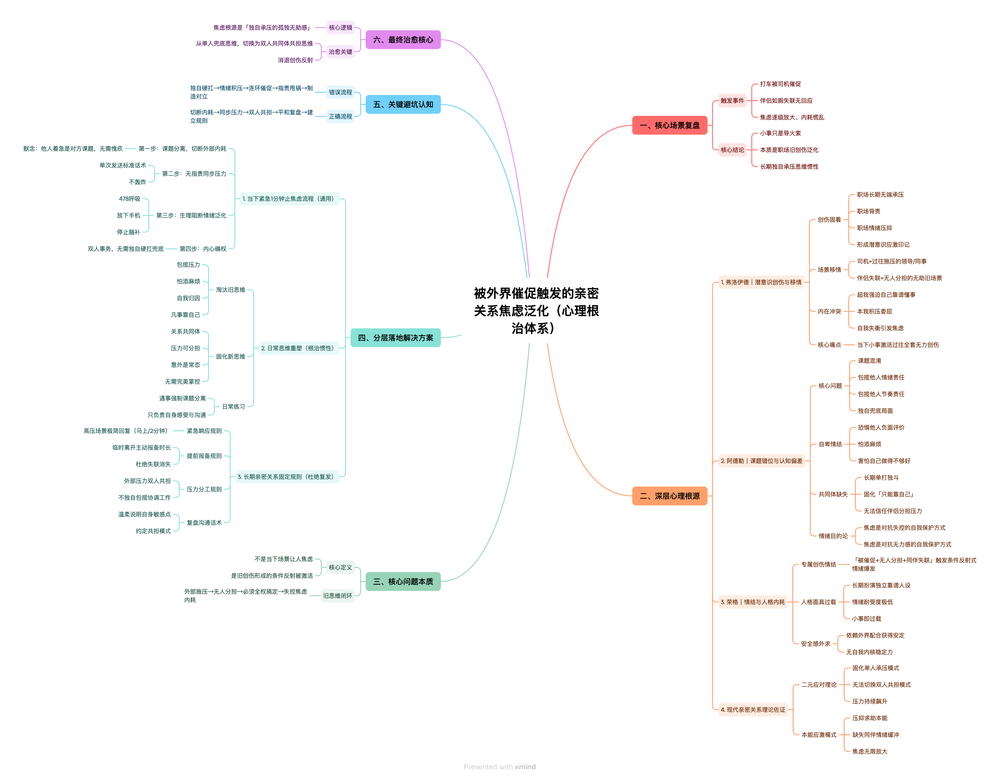

# 2022.01.21
背景:和陈志五聊天,他觉得尴尬,然后问我团队情况,我说了陆佳伟的绩效
结果:陆佳伟生气
分析:涉及到他人的利益相关的信息,不要泄露,别人会觉得损失
# 2022.01.25
背景:李国宇领导需要让人拿衣服,叫了陆佳伟和我旁边的李志刚,没有叫我,我很生气
结果:我很生气,我觉得要么他觉得我搬不动,这对我是侮辱,要么他觉得和我不熟,我觉得他有安全感和他熟,他却觉得和我不熟,
     我觉得很生气,我觉得感情亏了
分析:别人怎么做我即使干涉了,还有很多类似情况,我干涉不完,只能课程分离,课程分离不是对别人好,只是让自己不要因为别人的行为浪费太多时间,消耗
     太多在不必要的事情上
# 2022.07.15
学会分析人物之间的关系，从而知道自己的行动目的
比如领导对外的态度,小弟应该采取的措施
# 20241216
看到别人获奖会感到失落,自己的价值没得到实现
# 20241218
失落,听兰银斌说梦阳很看好宇迪,很失落,很愤怒,感觉不公平
为啥别人不咋努力就可以受欢迎,我这么努力却没人看到我的努力
不要在意别人的说法,关注别人做了什么,我能做什么

洞察真需求:
1.我们和会员域交互需要fuid
2.现金贷业务和我们交互ruid,fuid
3.ruid,fuid我们都没有

谈判:
考虑对方利益,找到对方利益点,让对方接受谈判本身

# 20250320
1.斌哥喜欢一起走，一起和他一起走
2.梦阳汇报情况说详细一点，斌哥在跟，时间不叫紧张没看

# 20250507
1.表达好感,引导到青木那里,为啥?
# 20250510
1.觉得自己没有输出的主线任务,寻找输出的主线任务,写旅行总结
2.建建被别人摸,会感到生气,想独占他,但是大家都是朋友,也没有官宣,所以应该可以随意,官宣后才不能随意摸
nf人比较在意人,会对别人比较在意,显得没有很强的边界感,会喜欢控制别人

# 20250512
1.喜欢一个人后,就想一直关注他,希望他时刻也关注我,如果他没有和我一样热情,就会感觉难受，课题分离
2.自我价值感的确认也与之相关，很多时候，人们通过他们反馈来确认自己的价值，如果对方不够热情，就可能怀疑自己做的不够好，不值得被爱

将注意力和精力放在自己的兴趣和事务上，培养个人独立性。当自己有丰富的个人生活和兴趣时，对对方关注的依赖就会减少，能缓解焦虑，增强自我价值感。

# 20250515
[背景]
liyudi,喜欢捧别人,捧自己,思路是,捧自己是为了证明自己很强,捧别人也是为了证明自己很会处理人际关系,当抬自己和抬别人矛盾时,她会毫不犹豫抬自己.
昨天第一件事,我说我忙,她说哪到哪,她怎么忙怎么忙,是为了证明自己很强，我心理在想你天天9点下班，我天天10点下班，你跟我说多忙多忙，不是在搞笑吗?
第二件事,我在吃吐司,成祥问我他家也有,我说我研究研究,lanyinbi说我讲究,liyudi说研究啥啊,直接买,
[分析]
lanyinbi是不认可我的行为,他觉得讲究不对,在克制自己,但是还是表达出来了,我对此比较生气,觉得和他又没啥关系,又没伤害他,觉得他很小心眼
liyudi是喜欢捧自己,并没有恶意,但是如果她捧她的时候踩了我,我会不开心,昨天就听烦的,甚至想到,以后换工位,不和他两坐一块
[解决方案]
lanyinbin是小农思维,不和他一般见识,直接忽略这件事,因为和他闹,他也不会改变对这件事的看法,他很固执,一定要回避讨论这件事
liyudi平时多捧她,但是涉及到自己的优势以及她通过捧自己打压我时,笑着和她说我的优势

# 20250516
[背景]
别人加我好友,我说中文名,别来说上来就中文名,还说您,我感觉阴阳怪气的,正想理论,但是收回了。什么情况应该断舍离？什么时候应该控制自己的情绪?
[分析]
别人一次说话不流畅，可能是大家上下文不一样，不要因此太过于生气
[解决方案]
不要因为别人一次说的话而生气否定别人,需要多次接触感受这个人的磁场频率，磁场频率相冲的可以断舍离。一次交流不顺利不要情绪波动大

# 20250520
[背景]
生气dp,说我和别人一起买房是为了捆绑别人,说我送礼是因为喜欢教练,很生气，感觉被小看了,被贬低了
而且他说他举报同事,而且是饭搭子,而且背着他举报的,感觉他很得意的样子,感觉他很不公正
他说找一个慢慢相处,平平淡淡的,而且说不急,不需要介绍,我会觉得他瞧不起人,很生气
我说我在表妹那里地位比较高,很难和表妹出柜,他说千万别做地位很高的人,容易很累
但是又要继续和他做朋友,怎么处理上述问题呢?

[分析]
你怎么看一个人,就是代表你是怎么一个人,他怎么看我,代表他是什么人,而不是代表我是什么人,别人否定我不是代表我咋样,而且代表他咋样,他是一个心思不纯的人
他看问题比较片面,没有考虑到很多因素,这是他做的事情，他有自己的因果问题
他拒绝了我的帮助,我也不一定要给他帮助,和他保持一定的距离吧，不近不远的程度
可能他有作为一个地位很高的人?

我喜欢别人顺着我的话说,如果别人一直否定,我会比较生气,会开始疏远他,以此告诉改变他,但是现实是他不会改变,但是我的情绪会因为他的话低落。
远离贬低我的人,或者暗示告诉贬低我的人,不要再这么说话,提示他我是啥人.告诉他这是他的想法，不代表是我。他怎么说我，我怎么说他，对付此类人，不需要
收敛自己的锋芒。

[方案]
1.你咋这么不单纯呢,我们是纯粹的友谊，心思不单纯
2.有啥好举报的，你不怕同事报复你，都是打工人，反馈事实即可
3.多接触才行，感觉你还是对自己喜欢啥类型比较模糊
4.你有类似的经历?说来听听？
从他出发,不要管他对我的评价

[todo]
和不同的人怎么沟通比较好?如果和不同的人用不同沟通方式会让自己变得不是自己喜欢的自己吗?

# 20250521
[背景]
做梦,梦见亲戚给了我们家庭40万,我爸不愿意把钱分给我们,因为他被传销骗了40万,我很难受，从他那里要不到钱
[分析]
我认为和他要钱是破坏家庭,但是如果和他本来就不是一家人,只是形似一家人,为了维护我自己的利益，我可以和他打官司。
[todo]
锻炼沟通谈判的能力

# 20250523
[背景]
今天花了1万,感觉钱不好赚,每年2.3*15=34.5
每年消费17+,存17-,5年存不到100w+,感觉钱太难赚,得好好干活,不然手头上的钱5年就花完了
[分析]
节流+开源
[todo]
每日计算节流多少,开源多少,哪些是节流得到的,哪些是开源得到的
[经济账]
12+10000

# 0525
[背景]
喜欢一个人就会想一直付出,难以保持自我,一旦难以保持自我,别人的一举一动就会让自我难受,情绪波动大。

害怕失去美好的对象，因为觉得自己长期没遇到这种性格合适的，会觉得很虚幻
[分析]
爱一个人就想时时刻刻和他在一起,但是时时刻刻在一起就会过于亲密,失去自我,最终导致双方不再亲密.

不要觉得虚幻，想象自己已经和性格很好的人在一起生活，自己变得越来越好，主导权掌握在自己手上
[todo]
感情好的核心是保持自己的内核,自己的内核稳才能吸引到其他人，每个人都是因为别人的价值而被吸引，而不是因为自己付出多少而被吸引

保持住自己的爱好和节奏，喜欢的人只是锦上添花，而不是雪中送炭，雪中送炭的话，就会随时随地因为别人的举动而波动很大，保持稳定的内核，才会吸引同样内核问题的人
[经济账]
1000(剪头发)
47(买酒)
63(买菜)
281(火车)
42(早餐)

# 0528
[背景]
王阳明杀了那么多土匪,他不会自责？土匪也有好人。他怎么保证一方安定，又能不错杀土匪呢？
[分析]
每个人默认自己都是好人,只是基于什么前提做了坏事，我们有义务帮助他们吗？我们能帮助他们变好吗？我们该嘲笑他们吗？
没有义务帮助他们，但是帮助他们能让你开心，那就帮助。
我们不一定能帮助他们变好，他们自己想变好，我们才能帮助他们
我们在不了解情况的时候不该嘲笑他们，为什么会嘲笑他们？认为自己是好人，承认自己嘲笑别人，但是承认不对

# 0604
[背景]
我说缺人,让jj拉人,他想到拉kb,我忽然有点生气吃醋
[分析]
我直觉认为他和凯宝熟悉,所以拉kb,我把kb当成了假象的情敌,他拉情敌所以我很生气,
也说明我没有彻底信任他,以他的人品性格,他应该是对kb没有想法,才拉上他的。
而且越担心什么,什么事情就越能左右我，我应该完全的信任他，不管他做什么事，我都在
心理认可他
[方案]
加kb好友,把他的朋友变成我的朋友,无条件信任他，引导他成为越来越值得信赖的人，而不是控制他，
越控制他代表越害怕他和别人亲热，代表自己会越失去自我，然后也会失去他。
破局方案就是，保持自我，自己的兴趣继续保持，信任他的人格，鼓励支持他，让他变成更好的自己，这样才能
保持住自己的能量，不断成长

# 0611
[背景]
去jj家很小很挤,会有很大落差,会觉得他很low,觉得和我不是一个层次
[分析]
我把消费观和人是否优秀挂在一起，默认住大房子，愿意消费的人层次较高，节约消费水平低的人层次低。
但是我真正欣赏的是一个人的价值观，消费观，远期目标，情绪价值，执行力
[方案]
时刻提醒自己关注的事情是什么，不断纠正自己错误的意识，明确欣赏他的主线是什么，其余的是副线
欣赏他情绪价值，善良，稳定，自律，可爱，讲段子

# 0619
[背景]
会觉得mdw赚钱很行，wjz赚钱能力不行,会觉得他不行，觉得他层次低
[分析]
容易把人物化,默认赚钱行就是优秀，赚钱不行就是不优秀，喜欢和赚钱强的人在一起
这没问题,喜欢和赚钱强的在一起，但是我得明确我最想要什么，情绪价值还是赚钱能力，还是其他
已经承认人家很优秀了，心理却觉得人家工资低不够优秀
[方案]
时刻提醒自己关注什么，明确欣赏他的主线是什么其他都是副线。

# 0620
[背景]
老胡一直和建建聊骚,我比较生气,觉得老胡轻浮不知廉耻,很想阻止老胡和建建撩骚
[分析]
阻止老胡撩骚,老胡可能会记恨,然后排斥,不利于大家子和睦。
相信建建的为人,他也需要朋友，他也有分寸
[方案]
不阻止建建和老胡聊天，但是得开开心心告诉老胡，我和建建在一起了，得有分寸
[行动结果]
通过其他人的行为和建建聊了此事,建建也有同样的感觉，我感觉心情舒服多了,感觉和建建站在一起面对这些事，对建建不再猜忌,而是共同面对,共同解决
# 0624
[背景]
mdw说还以为不跟他洗袜子,他还在纠结袜子的事情
[分析]
当一个人很执着一件事，说明他很在意这件事，一般是经历了一些难受的事情，也许mdw经历了被别人忽略遗忘,所以他特别在意别人的想法
[方案]
让他感受到我在意他,我们都在意他,感受到没有被抛弃,每天去他房间看看他,和他一起做操,骑电动车带他,一起打羽毛球

# 0624
[背景]
光光撩骚,我比较生气,生气回到了那种状态,大家都围着他转,仿佛他是最优秀的,别人什么都不是

很多人聚餐时，jianjian先给别人夹菜，最后给自己夹菜，感觉有点生气

我给他的豆腐，他平均给每一个人，我有点生气

给每个人夹菜，我也有点生气
[分析]
我生气的是他在享受这种优秀，好像让我变得没那么优秀，我为了自己的好受，希望他做出点什么。希望在一个认可我的群体中，而不是在一个认可别人的群体中
嫉妒他比我受欢迎，评估伴侣是否因受欢迎而忽视你，还是你因自卑放大了威胁感，每周投入时间做一件能体现你价值的事（如烹饪、绘画），增强内在满足感。

内在逻辑，他们不停下来，是因为觉得我们好说话，不会拒绝。
不喜欢自己默默承受，然后他表现的很有礼貌。

分析我们发展到哪个阶段，你和你家人相处模式？先照顾客人还是先照顾家人？为什么要先照顾客人再照顾家人

给每个人夹菜,这是比较亲密的行为，他对每个人都亲密，而且没给我夹菜,让我挺生气
[方案]

以后帮别人弄菜，直接把菜分成两份，每个地方各一份，不要再给别人夹菜了

# 0625
[背景]
对他的要求也变多了,希望我的付出,在他这里有回报,没有回报觉得很没劲
希望他聊天能有一些内容,不要这么干巴巴
[分析]
对他慢慢失去了新鲜感,希望他能付出,而不是我单纯付出,
[方案]
开玩笑跟他说,我做了什么什么,他怎么回报我?
有义务引导他去做一些事，但是不要强迫他去做这些事，让他自己去思考做这些事

[讨论]

# 0626
[背景]
工作时被打扰会很烦

产生一个想法,和mdw一起生活最大的问题是什么?pua?没有家的概念?消费观念不同?为啥对他有留恋?
因为他需要我,在他这里我得到了成长,在别人那里我感觉自己被贬低,在他这里我感觉自己被抬高
[分析]
被打扰打断了心流,会觉得很生气,希望心流的感觉

我喜欢这种做正确事情的感觉

钱给我带来自由感,尊贵感和安全感,
mdew
和他在一起的劣势:无趣,没活力,孤独,喜欢pua,慢慢有家的概念,消费观也在慢慢变化,被否定
和他在一起的优势:有钱的感觉,无微不至的照顾,优秀的感觉,被需要的感觉,自由的感觉,没有人争抢的感觉,很安全的感觉

wjz
和他在一起的劣势:有趣,有活力,不孤独,有家的概念,被肯定
和他在一起的优势:无钱的感觉,没有被需要的感觉,感觉不自由,有人争抢的感觉,不安全的感觉
[方案]
躲在一个地方工作

# 0704
[背景]
依赖别人的事情，等待别人的事情特别烦，不停地被打断，脑袋很疼，特别讨厌这种事
[分析]

# 0910
[背景]
我依赖别人输入，qa催我给逻辑，我会很紧张,感觉是我的职责
[分析]
我负责催,但不开发不是我的自责,把压力抛出去
[方案]
不要把压力全抗在自己这里,能把压力甩出去

# 1021
[背景]
和jj,lm一起出去徒步,jj对lm无微不至,嘘寒问暖,让我觉得他没有边界感,很生气
jj把东西给lm插好喂给老马也让我很烦心，过于亲密的行为
lm对jj越来越有好感,我也很生气，感觉被挖墙角了，被比下去了,被孤立了。
感觉自己很差劲，没有价值感，自己很无能，被否定

jj一直问路人,感觉不信任我，我也很烦躁
[分析]
嫉妒，占有欲，他的没边界感让我很烦
[方案]
和他细节分析，他做这些是什么行为和动机，是否有改进的可能性
比如他要去帮助别人时，能不能先给我打个招呼，照顾我的感受，一直让我照顾别人的感受会消耗我的能量

表达吃醋了,但不要生气
照顾老马的情绪和感受,尽量在建建面前少太秀恩爱
# 1022
[背景]
领导追问问题，感觉被领导责问，压力就会比较大，不舒服
[分析]
感觉自己被质疑了，像是做错事了，怎么做都是错，感觉被领导质疑，是犯了很严重的错误，呼吸困难
问题是否严重？责任是否在这里？追问自己!=责任在自己，领导追问!=问题严重

[方案]
如实反馈问题,不要默认领导在责问自己

# 1028
[背景]
感觉建建情绪不高,想询问他原因,又怕但关注他情绪,导致关系恶化
[分析]
我真的关心他情绪吗?还是说感觉他没有像以前一样热情,因此胡思乱想,希望他和以前保持一样热情,控制他达到以前热情的状态。
[方案]
每个人都有情绪低落高涨的时候,客观对待这个事情,当他需要安慰时,进行安慰。没有主动寻求帮助时，不进行安慰，避免让别人感觉
到压迫感，和控制感，让别人自己主动表达出情绪，如果别人不想表达，就不要过多关注别人的情绪。

# 1030
[背景]
1.被老马否定,说我没有人类的感情,导致今天情绪不高
2.看到季广磊请教李宇迪，感觉李宇迪特别受欢迎,想起高中时班中其他人受欢迎，自己羡慕别人
想起周冲做医生，周冲和李强关系好，是李强指导周冲做医生
3.周志星去巴西,让我觉得要处理好人际关系,没有和公司处理好关系

[分析]
1.我还是特别在意身边人的想法，别人的想法，特别是身边最重要的人，对我的认可特别重要，会直接导致我情绪不高，但是我仍有选择自己情绪的行动力

2.自己也想成为一个受欢迎的人，但是别人请教他，是因为别人觉得她很亲切，我真的想帮助他吗？也许我只是希望认可？

3.开始有点否定自己,自己真的喜欢社交吗?还是喜欢受欢迎的感觉?还是自己能量比较低

4.怎么把握自己的定位，让别人愿意分享资源给我

5.觉得自己好失败，没有和公司处理好关系，羡慕别人去巴西，但是让他去巴西也是业务所致，公司业务需要他爱

[方案]
看相关书籍

[背景]
一直选择晚餐,不知道自己想吃什么,处于游离状态,下次想好吃什么再选择,做个高效的人

# 1107
[背景]
失控场景容易慌,胸闷,想逃避，不知道咋处理
[分析]

[方案]

# 1114
[背景]
自己胸闷心情不好时,对同事充满敌意,充满埋怨,挑刺。对自己的对象也会泛化,觉得他每周都回去,不陪伴我
觉得他没有做出实际行动,只是嘴上说些漂亮话,做些漂亮事,但是没有实际行动。

每周自己回去享福了，留下我自己消化情绪和难过，感觉他好自私。感觉他其实对别人漠不关心。
觉得自己对他那么关注，那么喜欢他，他却每周都跑回家，每周相处时间本来就很少，周末还要跑回家。
越想越生气，觉得不公平，我对他那么用心，他每周只相处这点时间，根本不用心。

[分析]
越来越亲密，对他的定位就会越来越高，就会对他的要求越多。觉得自己的很多情绪都应该由他来帮忙一起消化。
成长性思维，觉得自己和他的关系应该更近一步，他应该像我一样付出很多，而不是嘴上说说。
但是侧面也说明了我越来越需要他,对他的需求越来越高,对他的依赖越来越高。
依赖越高，诉求越高，就会陷入恶性循环。
依赖=重要性?怎么证明他是重视我的呢?怎么证明他爱我呢?需要他重视我吗？需要他证明爱我吗?
对他的定位是什么?对他的期望是什么?
我想要什么?一个完全依赖的对象?一个一起出去玩的对象?一个聊天的对象?
对他期望降低，是不是对他的爱也应该降低？我会不会感觉不公平?

[方案]
对他的定位是爱人，但是每个人都不一样的，如果觉得自己付出过多，感觉到不公平时，和他沟通。
沟通看他的态度，对他的期望没那么高，但是得让他知道我的付出。

期望和他发展下去，就得带着发展下去的目标和动机去做事情。
的确会对他依赖比以前多，但是也不能无限制依赖，到了峰值后容易波动，知道关系也有峰值和谷底的。
掌握自己的主节奏的前提下，可以对他适当依赖作为添加生活的乐趣，而不是把对他的依赖当做生活的主旋律。

# 1207
[背景]
我说买了6盒,只吃了三盒。lh夸jianjian,虎里虎气很可爱,我感觉有点生气
[分析]
我感觉我的情绪被忽略了,lh夸建建,让我感觉建建啥都好,我不应该说建建.我感觉有点小生气
所有愤怒的背后，都是未被满足的需要.我的惭愧情绪没被认同,反而他夸了建建,让我有点难受.
让我觉得反而有错.
[方案]
我希望得到朋友的认可,但是只会有1/3认可我,所以我的重心放在1/3认可我的人那里,其他人保持礼貌.

# 1216
[背景]
1.带了三瓶玉米汁，想着给没吃饭的朋友急救，但是目的太明确，一直问别人
1.在故宫夺取攀攀饼干，表现自己的可爱
2.在攀攀家，对hsy很生气，吵闹，怕大家被他坑了
3.和青木，老胡表达对波波的生气，并表示以后不再叫波波
4.波波拄着拐杖都要来玩游戏，我说让他注意安全，他说要出来跟我们玩
5.青木发了很多situ,我当时感觉青木很轻浮

[分析]
1.可能会让有些人觉得抠抠搜搜，小题大做，的确是要给需要的人，但是尽量当别人主动提需求时再给，而不是自己问别人有没有需求
1.表达自己的可爱，但是攀攀和我关系亲密吗?我觉得和攀攀关系亲密了，但是攀攀不一定这么觉得
2.对hsy很生气表态，当时自己很担心大家被他骗，毕竟波波是自己带来的，他又是波波带来的，自己很有责任心，但是大家可能不太明白上下文
3.和青木老胡表达生气，是因为信任他两，但是忽略了他们可能也做过类似的事
4.很生气，感觉他强迫别人照顾他，一点眼力见都没有，很自私
5.可能他比较在意感受和刺激

[方案]
1.别人问的时候给，不问不给
1.下次很多人出去玩，得提示自己，我和他感到亲密，我能确认他也和我感到亲密吗?
2.在别人表达生气，可能让主人觉得尴尬，可以当大家说这个事情，但是不带情绪的说，客观描述事实，比如hsy你真会勾搭呀，波波都被你勾搭了，你可别勾搭我的朋友，我可不会放过你
3.尽量在大众场合不要表达自己的情绪和喜恶，避免造成误解，每个人有自己的经历，如果我无法判断，就尽量不表达喜恶
4.以后不叫他了，感觉他很自私
5.他没伤害不尊重任何人，尊重他的爱好，不要因为别人和自己不同，就使用道德标准评价别人

# 0128
[背景]
别人把东西放在我桌面上，我有点难受，想移过去。但是我担心别人评价我小心眼，我很在乎别人的看法

[分析]
fe关注和谐，Ni有洞察力，可能会注重边界感，通过小事联系到很多边界感问题，不喜欢被侵犯边界，但是又注重和谐的想法

[方案]
不说话，直接微笑的拿过去放着，让我觉得可以执行。避免使用Ti逻辑劣势造成逻辑僵硬。

# 0415
[背景]
和建建吵架,觉得他很自我中心,不关注身边人,只关注自己的情绪
我骨折去医院，他没说过要来医院看我，我过年在家养伤，他没说来看我，但是程程来看我了，凯哥来看我了。
感觉他社会化程度不够，感觉他不够关心身边人，感觉他很脆弱，需要人保护

[分析]
此时此刻，我和他处在感情升温阶段，也是对方诉求升级阶段，会对对方有很多诉求，但是如果对方做的不够好，就感觉没达标，又想对方能达标。
比如我生病时，觉得他作为我对象，应该做到能及时照顾我的感受，关心我，而不是我主动让他过来，这样让我觉得他很不值得依靠。
还有过年的时候让他来看我，让我觉得他特别不懂事，我身边骨折，他也不主动来看我，每次都是我让他过来他才过来，而且态度还很关心的样子。
让我觉得他只能锦上添花，无法雪中送炭

[方案]
我现在脑海里只有这种想法，感觉我需要冷静远离他一阵子，现在的感情是升温还是降温是个关键时刻，我需要冷却自己的思维后，
然后再思考对策，我需要什么，他能提供什么，是否还能继续走下去

# 0421
[背景]
老胡和攀攀邀请建建去玩,然后一起拍照,并且把他们三人的照片放在攀攀卧室,让我觉得整个过程就很冒昧,没有边界感,卧室是特别隐私的地方,然后卧室的照片放着
他们三人是什么意思?

[分析]
在我的视角，我可能认为他们喜欢建建，然后强行和建建成为三口之家，侵犯了我的男朋友的隐私。不太清楚在别人的视角意味着什么。

[方案]
元宝也说比较冒犯，和我对象沟通后，他后面会说清楚让他们放在客厅。后面我再找几个朋友问问他们怎么看。

后面我也做让他们难受的事情，让他们知道互相理解的重要性。但是现阶段我感觉消耗很多能量，只想远离他们
感觉和圈内的人相处好辛苦，和他们格格不入的感觉

# 0501
[背景]
老胡特别喜欢建建，总想和建建单独相处，建建喜欢玩，不懂得拒绝，我比较生气。我朋友中有个挖墙脚的，感觉我的朋友品德低下。

[分析]
我一直以来都是以品德交友，但是品德是比较个人化衡量标准的，品德交友可以对灵魂伴侣，但是遇到黄人，紫人，蓝人，必须以其他形式交友
如果继续以品德交友，那么自己会收到伤害。

另一方面建建不懂得拒绝别人，是因为喜欢被人崇拜，如果疏远别人怕失去别人的崇拜，但是要梳理清楚边界感和自己的诉求。

[方案]
两方面着手，1方面，和建建沟通他的诉求和他的边界感。1方面明确自己对朋友和搭子的定位。
朋友是指价值观，人生观一致的。
搭子是指在做一些事时可以一起顺路的。

# 0506
[背景]
我感觉我自己没有那么受欢迎，感觉建建更受欢迎

[分析]
老胡喜欢和建建互动，文文喜欢和建建互动，感觉他们都不和我互动。
我真的喜欢和他们互动吗?还是说只是我喜欢他们关注我？点赞我？
我感觉我并没有那么想和他们互动，只是渴望有很多人关注我而已
我的自我认同感是来自他们点赞我，认可我吗？
我的自我认同感一直都是来自自己的状态和节奏

[方案]
他们不点赞关注我，不等于我不优秀，渴望社交我可以主动去社交，但是不要纠结他们为啥不主动找我，可能他们对我的印象就是
我没那么喜欢和他们社交。不要把能量关注点放在为啥他们不主动找我，把关注点放在怎么让自己玩的开心上面。

# 0508
[背景]
最近几天总感觉缺爱,觉得他们不关注我,觉得他们和我玩不来,觉得好难过,感觉自己心里有他们,但是他们心里没有我,感觉很伤心

[分析]
我心里为什么有他们,他们心里为什么没有我?我为什么关注这些,他们不关注我嘛?
他们是istp,istj他们对待朋友圈的态度可能有自己的看法.
感觉自己出去玩都想着邀请他们，但是他们出去玩不邀请我。朋友圈点赞我都会点赞他们，他们不会点赞我
他们不会觉得礼尚往来的必要性，他们是istp,istj是另一套逻辑
我会觉得付出没汇报,但是他们可能本身就不在这套逻辑上

[方案]
把[注意力放在关心自己的朋友]上,他们和自己不同频,那就不要求他们以相同的方式回报.
不能以相同方式要求他们,不是他们冷落我，只是我们社交模式天生不一样，把他们当成性格天生冷淡，不懂情感回馈
偶遇就一起、他们找你就回应，不主动凑局、不刻意惦记。我难过归难过，但不否定自己、不卑微讨好、不强行融入他们的圈子
错的不是你，是大家性格不同、同频不了
不主动走心倾诉很深的情绪，因为 ISTJ/ISTP 接不住你的情感需求
不期待他们主动找你、主动约你、主动给你点赞，把期待降到最低，反而一点都不会伤心了
把他们当成[陪你做事的人，不陪你走心的人]
把「搭子」当成了「真朋友」来真心对待、用真心朋友的标准去要求他们
只一起玩、不走心、不惦记你 → 搭子
互相惦记、互相在意情绪、双向主动 → 真朋友
不要把所有身边人，都当成值得走心的好朋友。有的人只配当搭子，浅浅相处就好，不用投入情绪。

# 0511
[背景]
感觉自己需要朋友,害怕孤单,但是又不太能融入他们,只适合调节氛围.
因为绿人本身就比较少,雷达比较响,知道和他们不是最合适的一类,想自己舒服自在,但是长期的孤单
也会让人想要朋友

# 0525
[背景]
总感觉被周围人不理解,不喜欢,被周围人否定,被否定后就觉得自己很失败,就想远离他们

[分析]
把别人的接纳、肯定等同于自我价值。被否定、不被理解时，潜意识判定 “我不被爱、我无价值”，触发自卑挫败感，本能启动心理防御：疏远人群保护自己，避免再次受伤
外在人格：向外索取温暖、朋友、认同，迎合群体期待
内在阴影人格：敏感、高傲、精神独处、三观挑剔
你表面想合群，内心对相处模式、三观、谈吐有高标准，潜意识排斥浅层敷衍社交，自然无法真正融入，形成里外拉扯。
人都追求共同体归属感，但你陷入认可欲求枷锁：活着为了获得他人喜欢，一旦得不到，就自我否定。同时你习惯站在他人角度共情，却很少被同等理解，付出不对等加剧孤独

切断价值与他人评价绑定
记住：别人的否定，只代表对方认知，不代表你失败。不再把 “被喜欢” 当作自我合格标准，你的价值由自己定义。

接纳独处与合群共存
不必强迫自己彻底热闹，也不用强行封闭自己。接受自己既能享受欢聚，也需要独处回血，不用逼自己融入所有圈子，只筛选三观契合的人深交

普通人相处本就有误解、分歧、不认可，没人能被全员喜欢，减少心理落差

[方案]
浅层热闹随心参与，不必强求交心，轻松相处反而自在
被否定时不立刻自我怀疑，客观区分：是意见分歧，还是恶意评判
不必刻意讨好迎合，真实做自己，吸引来的才是同频朋友

被否定低落时，先独处平复情绪，不要一次性疏远所有人。慢慢小范围互动，慢慢找回舒服的人际节奏。

# 0527
[背景]
想去,想问梦阳情况,又有点紧张,怕不能去,给自己争取机会,不一定能去，但是给自己争取权益就是一种锻炼.

[分析]
已经争取询问,梦阳也表达了努力和拒绝原因

[方案]
我做了努力,梦阳表达了态度,我也表达了态度

# 0609
[背景]
上班容易焦虑的场景总结
1.很多人找我的时候容易焦虑烦躁,不知道处理哪个事情，感觉处理不完的事情
2.被esfp伤害后，遇到其他esfp也容易还未受伤害就开始应激反应
3.很多同事喜欢在群里口头沟通,方案不落实技术方案和prd,很多时候需要叮嘱追加,执行成本非常高,遇到研发开发和qa测试,浪费大量时间口口相传
4.很多业务逻辑梳理在产品，策略，研发模糊边界，最终都变成谁的口才好就可以不梳理，职责划分很不明确,当需求爆炸时，对接的梳理任务全集中在一个人身上
5.被别人强制带进到别人的需求去帮忙,不帮忙会觉得自己很冷库,帮忙会觉得自己时间都被打黑工占用
6.感觉被人一句话都要浪费很多时间去排查，很浪费时间很消耗，为自己的时间被浪费有点不开心
7.别人@我好像这个问题我就有义务解决，让我很焦虑，没解决这个问题好像我有未完成任务
8.听到张健的声音就烦躁,感觉他就要pua,就会难受,就感觉焦虑
9.需要别人审批,通知别人好几次还不审批,等待很焦虑,感觉失控
[分析]

# 0624

[背景]
我打到车了,司机催我时,我催我对象.但是我对象上厕所没理我,让我很焦虑,然后我再次催他,他还不出来,我就更焦虑了.
以前我上班时也经常因为被别人催着，本来不是我的问题，但是压力全落在我这里了，导致我很难受，有点焦虑.我猜测导致这个情节泛化到生活了,和亲密关系相处遇到相似的场景也会焦虑不知所措
[分析]
一、弗洛伊德（精神分析：童年根源 + 潜意识创伤、移情、情绪固着）
1.创伤固着：职场长期压力形成潜意识应激印记
弗洛伊德认为：重复、持续的被动压力会形成情绪固着点。
上班时：事情根源不是你，催促、指责、时间压力却全部砸向你，你没有渠道释放委屈、无力，情绪无法完成 “宣泄 - 消化”，只能压抑进潜意识。
你的潜意识记住一组绑定信号：
他人催促 + 只有我一人承担全部外部压力 + 无人分担、无人回应 = 危险、无助、失控
这个神经绑定不会只限定在职场，只要生活出现同结构场景，潜意识立刻调取旧创伤情绪，也就是情绪移情

2. 本次场景的移情投射（核心关键点）
   司机催促 = 当年催你的同事 / 领导（外部施压者）；
   对象沉默不回应 = 当年没人替你分担、没人站你这边；
   你当下的焦虑，不只是 “怕司机不耐烦”，是潜意识把当下的等待，等同于过去长期独自扛责的无助创伤。
   表层诱因是打车，底层爆发的是积压多年职场压抑的无力感

3. 本我、自我、超我的内在冲突
   本我：想摆烂、直接跟司机说不等、生气指责对象，逃避压力；
   超我：道德规训 —— 不能麻烦司机、不能乱发脾气、出门要守时、我必须负责协调好一切；
   自我（调节者）力量薄弱：一边外部施压，一边伴侣无反馈，自我无法平衡内外冲突，焦虑爆发
4. 压抑的防御机制
   过去职场你习惯隐忍，不表达难受，使用「压抑」防御；但压抑不会消失，只会降低情绪阈值。
   现在一点微小同款压力，焦虑直接过载，也就是你感受到的 “明明只是小事，我却控制不住心慌不知所措

二、阿德勒（个体心理学：课题分离、自卑情结、追求优越、共同体感受挫）
阿德勒不追溯童年创伤，聚焦当下的认知、责任认知、人际关系课题，完美解释你的泛化行为。
1. 核心问题：完全混淆他人课题，强行包揽不属于自己的责任
   阿德勒课题分离理论：
   1）司机等待、司机烦躁，是司机的课题；
   2）对象上厕所快慢、是否及时回复消息，是对象的课题；
   3）只有你的情绪、你的沟通方式，是你的课题。

   过去职场：你习惯性承接别人的焦虑，把别人的催促内化成 “是我没做好”；
   现在打车场景重复旧模式：司机着急，你默认全部压力由你来兜底，默认你必须搞定一切，一旦伴侣无法配合，你立刻陷入自我消耗。
   你默认：所有外部冲突、时间压力，都要我一个人解决，没人能依靠。

2. 隐性自卑情结：害怕自己给别人添麻烦，害怕被他人否定
   长期被催促塑造了你的底层认知：一旦我造成他人等待，我就是累赘、做错事的人。
   深层自卑：极度在意他人负面评价，恐惧司机反感、反感自己办事拖沓；当伴侣不能配合你 “完美守时”，你会放大灾难化想象，焦虑升级。
3. 共同体感觉缺失（亲密关系里的孤立感）
   阿德勒提出，健康关系会有「共同体感」：遇到压力时默认伴侣是战友，共同承担问题。
   但过往职场长期单打独斗，让你形成思维惯性：凡事只能靠我自己，别人不会配合我、不会分担我的压力。
   对象不回消息，瞬间激活 “我孤立无援” 的负面预判，焦虑加倍。
4. 行为目的论：焦虑是你逃避无力感的工具
   阿德勒目的论：不是场景让你焦虑，是你需要焦虑这种情绪，来合理化你的烦躁。
   你内心无法接受 “掌控不了局面”，焦虑的情绪其实在暗示：我很着急，我很努力在协调，错不在我，是外界和伴侣不配合。
   焦虑本质是你对抗 “失控无力” 的心理手段。

三、荣格（分析心理学：原型、阴影、情绪情结、集体无意识、人格阴影投射）
1. 「无力等待情结」—— 独立存在的心理情结（核心概念）
   荣格的情结：一组捆绑记忆、情绪、感受的心理单元，会独立触发情绪，不受理性控制。
   你形成了专属「被催促独自等待情结」：
   触发信号：第三方催促 + 同伴失联无法配合
   情结被激活时，理性思维下线，心慌、慌乱、焦虑、不知所措全部涌出，这就是你说的 “泛化”—— 情结不分职场 / 生活，只要匹配场景就自动启动。
   情结来自你长期未被看见的委屈，属于你内在未整合的受伤子人格。
2. 阴影投射：把内在压抑的烦躁投射给对象
   你的内在阴影包含：愤怒、委屈、想摆烂、不想独自扛压力；
   职场中你不敢释放这份阴影情绪，只能压抑；
   到亲密关系安全场景，阴影向外投射：对象迟迟不出现、不回应，你潜意识把所有积压烦躁归咎于他，反复催促本质是想让他承接你无法消化的压力。
3. 自我与自性的断裂：你过度向外索取 “可控感”
   荣格认为完整人格需要内在安定（自性），但你的安全感完全依附外部条件：司机不催、伴侣及时回应、一切按计划走，你才安心。
   一旦外部脱离预期，内在稳定的核心（自性）没有力量托住你，立刻陷入精神失衡、焦虑。
   你缺少向内安抚自己的能力，只能依赖他人配合来缓解不安。
4. 人格面具过载
   职场上你长期佩戴「靠谱、负责、独自处理问题」的人格面具，长期消耗内在能量；
   面具长期紧绷，导致你的耐受阈值极低，生活里一点点同类压力，精神直接过载崩溃

[方案]
2. 阿德勒视角：课题分离，重塑认知，建立共同体思维
   强制划分课题：司机等多久是司机的事，不必为对方情绪负责；对象上厕所快慢是他的事，你只需要表达你的感受，不用全权兜底局面；
   破除灾难化思维：迟到几分钟没有严重后果，不必过度放大他人的负面看法；
   和伴侣建立 “战友共识”：遇到外部压力共同承担，不用自己一个人硬扛。
3. 荣格视角：整合情结，向内建立安全感，接纳内在阴影
   觉察情结触发信号：一旦心慌焦虑升起，立刻意识到 “是我的等待情结被激活，不是当下这件事本身很可怕”，拉开自我与情绪的距离；
   向内自我安抚：不必等伴侣回应才安心，通过呼吸、独处稳定内在，把安全感从 “他人配合” 转移到自身；
   接纳内在的烦躁阴影：允许自己不想承担压力，不必永远强迫自己做靠谱、懂事、独自扛事的人。

落地解决方案

1. 当下紧急场景｜1分钟止焦虑流程（打车/赶时间/被催促通用）
- 第一步：切断外部压力内耗（课题分离）
  默念：司机的着急是他的课题，不是我的错，我不用为他的情绪负责。仅礼貌安抚一句，不再反复愧疚、反复道歉。

- 第二步：正确同步压力，不指责、不甩锅
  只发1条消息，停止连环轰炸：“师傅一直在催我，我一个人顶着压力很慌，你方便的话尽快出来，抽空回我一句我就安心。”

核心：把「我独自承压」转为「我们共同面对问题」。

- 第三步：生理平复，阻断情绪泛化
  478呼吸法+放下手机不脑补，杜绝盯着屏幕灾难化胡思乱想。

- 第四步：内心确权
  这件事是两个人的事，不是我一个人的责任，不用独自硬扛所有局面。