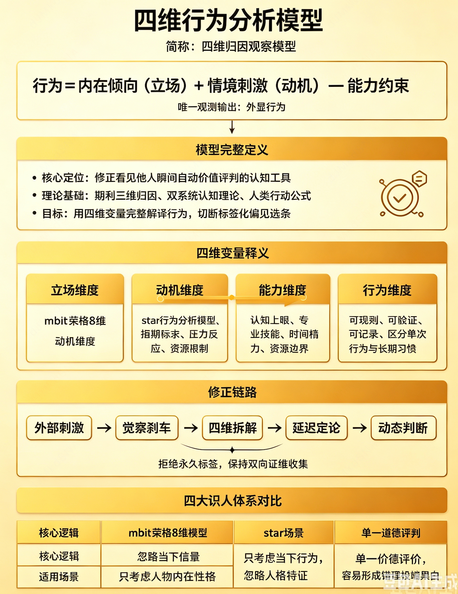

行为 = 内在倾向（立场） + 情境刺激（动机） − 能力约束
# 四维行为分析模型和需求挖掘模型的关联和差异?

# 四维行为分析模型和人生框架动态迭代模型的关联和差异?
```aidl
拆解三要素：
内在倾向（立场）：身份、价值观、固有角色、自我视角 → 对应换框「重定立场」
情境刺激（动机）：外部场景、时间条件、外部诱因、因果归因 → 对应「重定环境 + 重定时间 + 重定因果」
能力约束：资源、技能、客观限制（两套模型的补充新增维度，NLP 环境换框原生不含，可作为边界约束）

1. 内在倾向（立场） ↔ 环境换框：重定立场
行为模型含义：人自带固定角色、身份、利益视角，这是解读一切事件的底层滤镜；
换框对应逻辑：
你当下对一件事的负面意义，根源是你固化单一立场；重定立场就是更换内在倾向滤镜，换角色 / 身份 / 全局视角，直接改变解读。
举例：员工摸鱼，管理者立场 = 偷懒；员工立场：长期加班透支精力，短暂休息恢复效率。


2. 情境刺激（动机）是复合环境包，包含 3 类换框维度
情境刺激是外部全部环境总和，拆分出 3 个可换框变量：
（1）情境的空间载体 → 重定环境（狭义场景换框）
同一行为放在不同物理场景，外部刺激完全不同，动机价值反转。
例：大声争辩，办公室场景 = 冲突失礼；辩论赛场景 = 专业表达。
（2）情境的时间窗口 → 重定时间
同一事件放在短期 / 长期、过去 / 未来不同时间环境，刺激带来的动机评价改变。
例：短期项目亏损 = 失败；拉长 3 年产业周期 = 低成本试错布局。
（3）情境的归因逻辑 → 重定因果
人对外部刺激会自动预设因果，这套因果框架是解读动机的核心标尺；重定因果就是替换动机解读逻辑。
例：客户反复压价→旧因果：针对我、难搞；新因果：极度重视成本、长期大额复购客户。


从属关系：四维行为模型是底层客观成因框架，环境换框是上层认知干预工具；行为模型解释 “行为怎么来”，环境换框解释 “怎么改变对行为的看法”；
维度统一：行为模型里的「内在倾向、情境刺激」恰好完整覆盖环境换框 4 类划分，没有冲突；能力约束是行为模型独有的客观限制项；

```