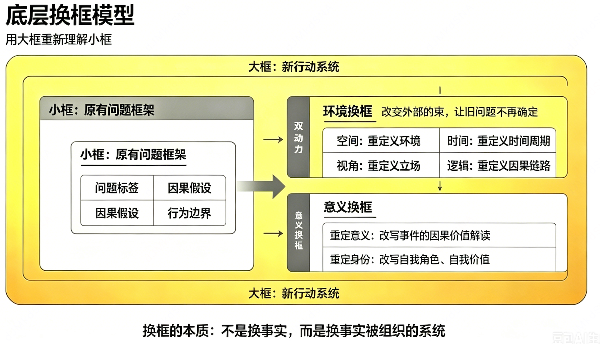

# 环境换框
```aidl
1. 重定环境（空间 / 场景维度：狭义物理环境）
定义：更换物理场景、场合、对象这个基础环境变量
逻辑：同一个行为，换一个物理场景，价值完全反转
例子：
孩子爱争辩、顶嘴 → 在家被解读 “叛逆不听话”；换到辩论赛赛场，同一行为变成 “逻辑强、善于思辨”
对应环境维度：空间场景、人群、客观场合（最直观的第一层环境）


2. 重定时间（时间周期维度：过去 / 当下 / 未来）
定义：更换解读这件事的时间窗口（短期视角↔长期视角；当下↔过去↔未来）
逻辑：同一事件，拉长 / 缩短时间周期，意义彻底改变
例子：
当下亏损一笔投资 → 短期解读 “失败、亏钱”；拉长到 5 年产业周期，是布局成长赛道的前置试错成本
对应环境维度：时间坐标系、周期长短、人生阶段（时间是第二层宏观环境）


3. 重定立场（观察者视角维度：主体环境）
定义：更换解读事件的身份、立场、角色（我↔对方↔第三方↔系统全局）
逻辑：同一事件，换不同利益 / 身份视角，得出完全相反的意义
例子：
同事拒绝配合你的需求 → 你的视角：对方冷漠不配合；换到同事视角：他手上 3 个紧急项目，资源完全不足；换到老板全局视角：公司资源分配机制本身失衡
对应环境维度：观察者身份、立场、利益角色（人际系统环境）


4. 重定因果（系统逻辑维度：因果链条环境）
定义：更换事件的因果参照系统，重新定义 “诱因 - 结果” 的关联环境
逻辑：我们对事件的好坏判断，绑定了自己预设的因果链条；换一套因果逻辑，意义反转
例子：
“客户挑剔砍价”，原有因果：挑剔 = 针对我、难沟通；重定因果：客户挑剔 = 极度重视产品、有长期复购潜力，挑剔是筛选高价值客户的信号
对应环境维度：内在预设的因果规则、逻辑框架、信念系统（心智参照环境）
```
```aidl
人类判断一件事的全部外部参照系统只有 4 类：
在哪（空间场景 = 重定环境）
什么时候（时间周期 = 重定时间）
谁来看（立场角色 = 重定立场）
按什么逻辑看（因果规则 = 重定因果）
```
```aidl
环境换框能改变意义的系统性底层支撑


支撑 1：NLP 核心理论 —— 地图不是疆域（认知建构论）
核心观点：我们大脑中对事件的 “意义解读”，是主观绘制的认知地图，不是客观事实本身；
环境是地图的 “绘制标尺”：你选用什么环境作为参照标尺，就会画出完全不同的认知地图；
换框原理：更换环境参照标尺，直接重绘认知地图，意义自然改变。
客观行为（疆域）不变，变的是你用来衡量它的环境标尺，解读（地图）随之重构。


支撑 2：情境主义心理学（行为情境决定论）
心理学底层：人的行为没有绝对固定属性，行为的价值、效用完全由所处情境（环境）决定
特质论误区：人习惯给行为贴永久标签（内向 = 不好、冲动 = 缺点）；
情境主义修正：所有特质都是情境产物，脱离环境不存在绝对好坏；
环境换框就是主动切换情境，瓦解单一负面标签，挖掘行为在其他环境下的正向效用。


支撑 3：系统论（整体大于局部，意义由系统关系定义）
系统论核心：任何单一元素（行为）的价值，取决于它所在的系统（环境）；元素脱离系统无独立价值。
行为 = 系统里的单个元素；环境 = 完整系统；意义 = 元素在系统里的功能；
换环境 = 把行为放入全新系统，它的系统功能（意义）立刻改变。
例：暴雨（行为），城市系统里是灾害；干旱农田系统里是救命资源。


支撑 4：建构主义认知科学（意义是主动生成，而非客观自带）
客观世界只存在中性事实，意义是大脑主动加工生成的产物；
大脑加工的固定公式：事实输入 + 环境参照框架 = 输出意义；
可控变量：事实（行为）无法修改，但环境参照框架可以人为替换；
只要修改公式里的环境变量，大脑输出的意义必然同步变化 —— 这是环境换框可操作、有效的核心认知底层。

```

# 内在意义换框
```aidl
1）重定意义：改写事件的因果价值解读（对应 ABC 理论里更换信念 B）

2）重定身份：改写自我角色、自我价值（自尊层级，底层信念）

ABC 核心公式：事件 A（触发）≠ 反应 C（情绪 / 行动），信念 B 才是中间决定性变量


```aidl
环境换框操作：更换 A 的配套环境参照，间接修正表层信念 B，改变 C；
意义换框操作：直接修改内在信念 B（重定意义）或底层身份 B（重定身份），彻底改变 C。
图中「A 到 C 中间打叉」核心结论：事件本身无法决定情绪行动，所有换框技术本质都是干预中间的信念 B。
```