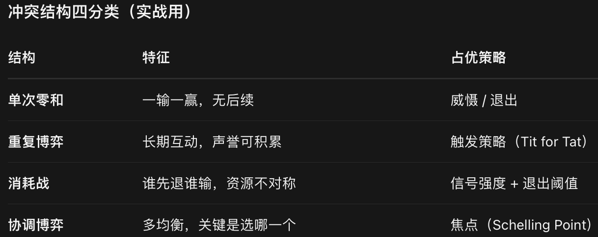

# 个体做事风险-个体风险税
## 第一性原理
公理 1：未来信息不完备，绝大多数现实场景不存在可提前识别的 “唯一最优解”；但是毁灭性错误清单是可以提前识别的。
公理 2：损益非对称：重大错误具备清零效应，少数大错误可以抵消大量正确决策的成果。
公理 3：追求绝对最优会带来高昂的思考成本，甚至引发认知偏差；规避错误的认知负担更低，可落地。
公理 4：绝大多数人生是重复博弈；只要不被踢出局，时间会放大你的收益；频繁出局，再强的判断力也没用。

### 绝对正确的事无法验真
“做绝对正确的事” 本身难度极高，很多时候根本不可知
绝大多数现实决策，没有一个上帝视角的 “标准答案”。
你没法预知未来，信息永远不全；
很多选择，要等几年之后才知道结果；
你拼命想选出那个最优解，本质是在寻找一个本来就不存在的确定答案。
比如择业、投资、人际关系，不存在一眼就能锁定的 “唯一正确选择”。
但是错误是可以识别、可以规避的。
哪些行为大概率会带来毁灭性后果，是已知的。
逆向思考就是干这件事：我不知道怎么暴富，但我知道什么一定会变穷，避开它。

### 错误的伤害是非对称的
错误的伤害是非对称的：一次大错，可以抹掉几十次正确的收益，收益是累加，重大损失是清零
投资：你做对 9 次，每次赚 20%；只要 1 次重仓踩大坑亏 80%，前面全部盈利直接归零。
个人发展：几十次靠谱选择积累口碑，一次重大决策失误、冲动犯错，直接毁掉信誉。
人际关系：千百次好好相处，一次毁灭性冲突，关系直接破裂。
做对一件事，是加分；犯一个致命错误，是直接扣光总分。
你就算不断追求 “最正确”，只要挡不住少数致命错误，整体结果依旧很差。
少犯错，本质是守住下限；追求最优，是搏上限。下限崩了，上限毫无意义

### 追求 “绝对正确” 会带来巨大隐性成本
想要找到那个 “最正确选项”，你要收集海量信息、反复权衡、无限纠结
时间成本：过度分析，陷入分析瘫痪，迟迟不行动，机会白白溜走。
心理消耗：总想选最好，容易焦虑，害怕选错，每一个选择都反复内耗。
错觉陷阱：总想做正确，人会更容易落入确认偏误，强行找证据证明自己选的是对的，看不见风险。
反观 “少犯错” 的思路：
不需要穷尽所有方案，只筛掉明显会翻车的选项，在剩下的安全集合里面挑一个就可以。不用追求完美，只排除毁灭性选项，决策成本低很多。

### 现实世界是重复博弈，长期看，低错误率自动胜出
人生、工作、投资都是反复多次的连续游戏，不是一次性赌局。
A 策略：拼命追求最优，偶尔大赢，但时不时出现毁灭性错误。
B 策略：不追求惊天大胜，但是很少犯致命错误。
短期看 A 会高光耀眼；拉长时间，只要有一次毁灭性失败，A 就出局，游戏直接结束。B 可以一直在牌桌上持续玩下去，时间站在他这边。

### 不代表 “不去争取正确，只求不犯错”，有明确边界
书里并不是说不要努力做正确的事，而是优先级：
先规避致命错误（守住下限），再去争取最优解（追求上限）

## 适用场景
风险不对称，一旦做错代价极大（投资、职业关键选择、法务、人际）：优先「少犯错」。一次错误代价太高，扛不起
损失可控，试错成本很低（创新、副业小测试）：可以主动追求最优，允许小错误，大胆探索


## 少犯错模型
### 逆向思考
不要一门脑子只想 “我怎么成功”；反过来想：做哪些事一定会搞砸，把这些事全部避开，你就赢大半

### 第一性原理

### 反脆弱系统
反脆弱系统要求：单次失败损失可控，但是成功收益巨大。
比如小额试错，亏得起；一旦成了收益很高。

### 汉隆剃刀
能解释成粗心、疏忽、记性差、信息不全，就不要轻易归为对方是故意坏、存心针对你
作用：极大减少内心愤怒、阴谋论。不是说世上没有坏人，而是不要默认别人动机是恶意。很多人际内耗，就是我们脑补别人的坏动机。
边界：如果多次反复，同样一件事持续伤害你，那就不能再用汉隆剃刀，要当成恶意对待。


### 去风险化
做低成本小实验，提前验证关键猜想，避免最后一次性爆大雷。
想做副业，不要直接裸辞 all in。先业余时间小范围试跑，看看市场到底买不买账。 创业的 MVP 最小可行产品，本质就是去风险化。


### 5Why 根因分析法
不要只解决表面现象，连续追问 “为什么”，挖到真正根源，不要只处理症状

### 三个视角描述问题
专门用于吵架、冲突场景

# 系统性风险分析-系统风险税
我思考完全理性，外部系统、制度、多人交互依然会出问题。
失败不完全来自个人愚蠢；来自系统溢出、激励扭曲、微小错误累积、兜底带来新风险、好事过量走向反面。
只要系统里存在"成本可外推 / 风险可转移 / 指标可博弈 / 损害可渐变累积 / 剂量可越过拐点"这五种结构之一，错就不是偶然，而是会被持续再生产出来。


## 第一性原理
1.决策主体只把可感知、可计价、当期的成本收益计入自身函数。
2.世界是耦合的：一个节点的输出是另一个节点的输入（空间耦合=外部性，时间耦合=渐变累积）。
3.信息是不对称且昂贵的，监督有成本。
4.人类意志与注意力是有限预算（决策疲劳、短视）。
5.多数关系不是线性而是有拐点/饱和/反转的非线性。
6.激励会诱导行为去贴近被测量的变量，而非变量背后的意图。

事实 1 + 事实 2（空间耦合）→ 成本外推到第三方 = 无意伤邻
事实 1 + 事实 3（信息贵/监督难）→ 风险转嫁且难追责 = 危险行业
事实 6（激励贴近测量）→ 把指标当目标就被博弈扭曲 = 许愿须谨慎
事实 1 + 事实 2（时间耦合）→ 单次成本≈0 但积分发散 = 越来越热
事实 4 + 事实 5（预算有限+非线性）→ 过量输入越过拐点反转为害 = 好事过头成坏事


### 系统具备溢出属性
个体行动的成本、收益不会只局限于当事人，会向外传递给第三方。很多伤害不是主观恶意，来自系统溢出效应（外部性）。
推导模型：外部性、公地悲剧、搭便车。
### 人对激励做出反应，不对美好愿望、道德口号做出反应
人会博弈规则、考核指标；当指标成为目标，指标就失效；善意的制度设计，会被现实行为扭曲，产生意料之外结果。
推导模型：古德哈特定律、逆向激励、非预期后果定律。
### 重大灾难经常不是单次巨大错误，而是大量个体理性的微小选择持续累积
人类对渐变、缓慢升温的风险感知能力很差；每一步单独看没问题，叠加之后系统崩坏。短期的便利，会转化为长期负债，并且锁死未来选择空间。
推导模型：小决策的暴政、短期主义、路径依赖、各类负债。
### 信息永远不可能完全对等；保护 / 兜底机制会衍生出新风险
交易、合作双方天然存在信息差；兜底可以抵御一部分风险，但同时改变人的行为模式，催生逆向选择、道德风险。代理人利益不一定和委托人一致。
推导模型：信息不对称、逆向选择、道德风险、委托‑代理问题。
### 几乎一切事物服从边际收益递减规律；好事过量就转化为坏事
追求安全、追求完美、搜集信息，全部都是好事；一旦超过临界点，收益转负。规避风险不能走向彻底不行动。要区分可逆与不可逆决策，平衡行动与防御。
推导模型：边际收益递减、完美是优秀的敌人、分析瘫痪、墨菲定律。
### 复杂系统存在多条失效路径
只要存在失效路径，就存在失效概率；不能默认一切按计划运行。墨菲定律本质是系统概率，不是命运诅咒。我们要做预案，而不是出事之后归因命运。

## 系统性错误模型

### 成本可外推-系统溢出效应
行为的代价 / 收益向外溢出，伤害无关第三方，主观没有害人，客观造成损害
无意伤邻｜外部性与公共物品
我的行为代价会不会甩给无关第三方？共享资源会不会被持续透支？
#### 外部性 Externality
[负外部性：行为人获得收益，代价由没有参与事件的第三方承担]。
例子：室友深夜打游戏，自己娱乐，室友承受噪音；工厂排污，居民承受污染。行为人主观不想害人，但成本向外转嫁。
正外部性：你的行为，无关旁人免费获得收益，例自家种花邻居赏花。
[人际大量矛盾根源：行为人不需要承担行为全部代价]

方案:书里的应对指向"内部化"——让外部成本回到决策者的账本上（税收、配额、明确产权）

#### 公共资源悲剧
共享公共资源，每一个个体理性利己，一点点消耗，集体把资源耗尽。
例子：公共办公区、公共网盘、公共草场。每个人心里 “我多用一点点没事”，累积之后资源报废。
启示：公共资源不能只靠道德自觉，必须配套规则约束。

#### 搭便车
分人享受公共资源成果，但不承担维护成本。团队摸鱼成员共享集体成果。
⚠️坑：不要直接把负外部性等同于对方人品恶劣，很多是系统机制

### 风险可转移-风险转嫁且难追责
#### 信息不对称 Information Asymmetry
交互双方掌握信息不对等。卖家知道产品缺陷买家不知道；下属知道真相上级看不到。很多坑不是刻意欺骗，是天然信息残缺。

#### 逆向选择 Adverse Selection
高风险参与者积极入场，优质参与者逐步退出，系统持续恶化。
典型保险场景：风险高的人积极买保险，风险低的放弃投保，保费被迫抬升。

#### 道德风险 Moral Hazard
一旦有兜底、出事有人买单，人的行为会变得更加冒进。
例子：买完保险不再谨慎保管财物；亏损由公司兜底，项目敢于激进赌博。


#### 委托‑代理问题 Principal‑Agent Problem
代理人替别人做事，优先维护自己的利益，而不是委托人的目标。
例子：职业经理人追逐短期 KPI，牺牲企业长期价值。
坑：不要看制度文字多么美好，要看这套制度实际引导人做什么。不要把代理指标当成终极目标。
实操自问：愿望达成之后，附带哪些副作用？这套考核人们会如何钻空子？
### 指标可博弈-把指标当目标就被博弈扭曲
你追求 A，设计制度去实现 A；愿望实现，却附带毁灭性副作用，整体局面更差

#### 非预期后果定律 Law of Unintended Consequences
行动除了你想要的直接结果，会产生大量事前难以预判的副产品；哪怕初衷善良。
和二阶思维区分：二阶是人主动推演连锁后果；非预期后果属于系统隐藏效应，聪明人也无法全部预判。
经典案例：眼镜蛇效应，悬赏杀蛇，民众养殖蛇骗取赏金，蛇数量反而增多。

#### 好心定律Goodhart’s Law
一旦把某个指标拿来作为考核目标，该指标就不再是好的衡量标准。
例子：考核 bug 修复数量，员工拆分大量微小 bug 刷数字，不去根治根源；只考核播放量，内容博眼球放弃质量。人会博弈指标，而不是达成指标背后真实目标。

#### 逆向激励（扭曲激励）Perverse Incentives
奖励惩罚规则，诱导出和初衷完全相反的行为。眼镜蛇效应就是逆向激励典型。

### 损害可积累到质变
灾难很少一瞬间爆发；大量个体无害的微小选择，逐步累积，把局面推向崩坏；人对渐变风险感知迟钝

#### 小决策的暴政 Tyranny of Small Decisions
每一个独立小决定，单独看完全合理；持续累积，酿成巨大灾难。
例子：每次刷 5 分钟短视频，单次无所谓，日积月累吞噬大量时间；项目一次次妥协质量，迭代几轮系统彻底腐烂。

#### 短期主义 Short‑termism
追逐眼前即时收益，牺牲长期利益。企业砍掉研发保季度财报；个人永远优先紧急琐事，搁置学习健身。

#### 路径依赖 Path Dependence
早期选择锁死未来可选空间，后期切换成本极高。早期草率选用工具，明知不好，但迁移代价巨大只能忍受。

#### 各类负债（技术负债、关系负债、知识负债）
当下为省事选择粗糙方案，短期省事，未来要加倍偿还代价。

### 临界点效应- 好事过头成坏事
害怕墨菲风险而走向另一个极端：什么都不敢行动；风险是双向，不行动同样有代价。
实操自问：继续加码投入，新增收益是否划算？我是否为了不出错陷入无限思考？决策可逆还是不可逆？
#### 边际收益递减 Diminishing Marginal Returns
投入持续增加，新增回报不断下降，超过临界点，投入越多结果越差。吃饭、加班、搜集信息全部适用；信息是好事，信息过载就是坏事。

#### 完美是优秀的敌人 Perfect Is The Enemy of Good
一味追求绝对完美，导致事情永远无法落地。区分：部分环节必须高可靠；部分环节可以先交付再迭代；全部环节卡死完美标准，行动直接瘫痪。

#### 分析瘫痪 Analysis Paralysis
为了规避犯错，无限搜集信息反复权衡，迟迟不下手；不行动本身也是重大损失，机会白白流失。配套希克定律：选项越多，决策负担越大，决策疲劳。

#### 可逆决策 vs 不可逆决策
可逆：做错代价小，可以回头修改，可以大胆试错。
不可逆：做完很难撤销，必须极度谨慎。
对抗分析瘫痪：可逆事情不要无限思考；不可逆事情加强防御


# 个体时间资源分配风险-时间税
你可以做好任意一件事，但不可能做好每件事。必须主动取舍，借助杠杆放大成果，对抗人性惯性，用机制代替意志力。

## 第一性原理
时间/注意力是单向、不可再生、预算有限的资源（用掉即没）。
任何选择都隐含排他性——选 A 就不能选 B。
人类效用函数对即时回报加权过高，对远期打折过狠（生物学遗留）。
产出对投入的关系多为非线性（有 80/20、有拐点、有复利、有过冲）。
工作体量对所给时间有弹性膨胀倾向（无外力约束就填满）。
单人多任务不成立，上下文切换有真实损耗。
重复动作可被工具/规则/系统替代，人均杠杆由此来。

事实 1+2 → 必须按机会成本排序，用北极星做滤波器 = 你能做好任意一件（但不能每件）
事实 4+7 → 80/20 找高杠杆、复利滚、过拐点就停 = 事半功倍
事实 3+5 → 现时偏好+帕金森导致拖延与膨胀，需承诺/默认/截期限对抗 = 摆脱坏习惯
事实 4+6 → MVP、激活能量、重定义问题、自动化=用最小能量撬动反馈环 = 通往成功的捷径

### 时间是不可再生、不可储存、总量固定的稀缺资源。
时间花出去就永久消失，无法回收。不存在把时间 “存起来以后再用”。
推导模型：北极星目标、艾森豪威尔矩阵、机会成本、二八法则。
推论：因此必须取舍，你不可能做完所有事情，必须主动拒绝大量事情。

### 单纯投入个人时间存在硬上限；杠杆可以打破个人时间上限
一个人一天时间固定；杠杆（人力、资本、内容、代码）让一份时间投入产生多次产出。
推导模型：各类杠杆、帕累托二八定律

### 人的意志力、心理能量是有限可消耗资源，会产生决策疲劳，不能长期依靠意志力对抗惯性
人的行为很大程度由环境、外部条件驱动，而非仅仅依靠主观决心。
推导模型：惯性、强制功能、习惯回路、损失厌恶、决策疲劳。
推论：改造环境、建立外部约束，比硬靠自律更可靠。

### 很多时间浪费不是做事慢，而是方向错、后期返工
在没有验证核心假设的前提下投入大量时间，会造成毁灭性时间损耗。
推导模型：过早优化、MVP、去风险化、预置死亡线

### 人的行为会被时间边界塑造。任务会填满分配给它的全部时间；琐事会挤占重要事项

## 时间杠杆模型

### 资源有限，先确立北极星目标，做优先级取舍
核心：资源有限，先确立北极星目标，做优先级取舍，拒绝什么都想要。

#### 北极星指标 / 北极星目标 North Star
白话：一个稳定不变的核心指引目标，环境变化，目标不变，所有行动以此校准。
例子：企业北极星：用户真实使用价值；个人北极星：长期人生核心目标。
作用：面对众多机会时，用来判断一件事要不要做，偏离北极星就拒绝。
坑：把手段当成北极星目标，例如把 “赚钱” 当成终极目标，赚钱只是手段。
实操自问：这件事是否服务我的北极星目标？

#### 艾森豪威尔矩阵
把任务分为「重要 / 不重要 × 紧急 / 不紧急」四象限。
1）重要且紧急：立刻处理（危机、截止）
2）重要不紧急：重点规划投入（学习、健身、长期规划，决定长期差距，最容易被挤压）
3）紧急不重要：授权、委托出去
4）不紧急不重要：直接砍掉、少做
坑：很多人永远被紧急事务裹挟，持续挤压重要不紧急事项。
注意：矩阵只是分类工具，真正难点是敢于拒绝大量任务，而不是全部接下再分类。

#### 帕金森定律 Parkinson’s Law
工作会自动膨胀，填满分配给它的全部时间。
例子：给 3 天写报告，就拖满 3 天；给 3 小时，也能产出可用版本。
启示：设置紧凑截止时间，限制投入时长，避免无限膨胀。
衍生：帕金森琐碎定律：开会花大量时间讨论无关紧要小事，重大议题草草带过。开会要控制对琐事的讨论时长。

#### 决策疲劳 Decision Fatigue
做决策会消耗心理能量；短时间大量做选择，决策质量持续下滑。
启示：重要决策放在精力最高时段；日常小事尽量标准化、减少选择。


### 利用杠杆，放大你的时间产出
核心：同样时间投入，寻求杠杆，不要单纯靠堆时间换成果。杠杆让一份时间多次复用。

#### 杠杆 Leverage
人力杠杆：别人的时间为你工作（团队、委托）
资本杠杆：金钱产生回报
媒体 / 内容杠杆：写文章、做课程，一次性产出，反复被人阅读观看
代码 / 产品杠杆：写一套程序，服务无数用户

白话：没有杠杆，你的产出上限 = 你的个人时间；有杠杆，产出可以远大于个人时间。
坑：杠杆不是一夜暴富，前期需要投入固定成本，后期才放大收益。
实操自问：这件事有没有杠杆点，一份投入能不能多次产生价值？

#### 帕累托法则（二八定律）Pareto Principle
大约 20% 的投入，产生 80% 的结果；剩余 80% 投入，只产生 20% 结果。
启示：识别那 20% 高价值动作，把资源集中在这里；削减低价值活动。
坑：不要机械死记 20/80 数字，它是定性启发，不是精确数学。

#### 收益递减法则（Law of Diminishing Returns）
投入过拐点后边际收益下降，乃至负收益；和"过犹不及"呼应，告诉你何时停。

#### 复利（Compounding）
知识、信誉、代码、关系随时间长程非线性滚动，"种树最佳时机是二十年前"即此意。


### 要用外部机制、环境设计改变坏习惯
核心：意志力是稀缺消耗品，不能靠硬扛；要用外部机制、环境设计改变行为

#### 惯性 Inertia
物体保持原有状态；人的行为也会维持旧模式。好习惯很难建立，坏习惯会自动持续。
坑：以为单纯靠意志力就能改掉习惯；意志力会耗尽，只靠意志力会反复失败。

#### 强制功能
白话：设计外部约束机制，迫使你做出想要行为，不靠意志力硬撑。
例子：
公开承诺，倒逼自己完成；
移除手机，物理隔离干扰；
设置截止日期，他人监督。
原理：改变环境，而不是只改变内心想法。

#### 损失厌恶 Loss Aversion
人对损失的痛苦，远大于同等收益带来的快乐。失去 100 块的痛苦＞赚到 100 块的快乐。
可以利用损失厌恶做自我约束；同时警惕：因为害怕损失，舍不得放弃无效旧事物。

#### 习惯回路 Habit Loop：暗示→行为→奖励
习惯由三部分构成：触发暗示、行为动作、获得奖励。
想要改变习惯，不要直接对抗行为；修改暗示、修改奖励。
例子：刷短视频：无聊（暗示）→打开短视频（行为）→即时愉悦（奖励）；
解法：移除暗示（手机不要放手边），替换奖励。

### 预先规避时间浪费，提前降低风险
捷径不是投机取巧；是提前设计，避免后期大量返工，减少无效消耗。

#### 过早优化 Premature Optimization
在还没有验证核心假设之前，就花大量时间打磨细节、追求完美。一旦底层假设错误，全部工作作废。
程序员经典坑；生活通用：事情还没跑通，就疯狂美化细节。

#### 最小可行产品 MVP
用最小成本，拿到真实反馈，验证核心假设，不要闭门长时间打磨。
启示：先跑通核心，再迭代完善，避免投入大量时间在错误方向。

#### 去风险化 De‑risking
优先检验会导致整件事失败的关键假设，而先做低风险琐事。
例子：计划旅行，先确认核心约束（别人能不能去），而不是先研究景点细节。

#### 预置死亡线 Pre‑mortem（事前验尸）
项目还没开始，提前假设：这件事已经彻底失败。倒推：是哪些原因导致失败？提前规避这些坑。
区别事后复盘；事前就推演失败路径，提前保护时间资源。


# 别跟自然对着干-自然税
把自然界运行规律迁移到人类组织、个人成长、社会传播。核心：系统自带惯性、反馈循环、临界点突变、混沌秩序；不要对抗系统固有本性，
学会顺势、识别突变、在不确定性中建立适应性。自然界不是线性平稳变化，大量是惯性维持现状、反馈自我强化、积累到临界点突然爆发、混沌环境下涌现新秩序。
人做事情，不要硬对抗系统本性，要理解系统的天然运行方式

## 第一性原理
实操自问：这个系统是混沌不可精细预测吗？维持秩序我需要持续输入什么能量？哪里是系统杠杆点？系统是脆弱还是鲁棒？

物质与信息都受守恒与不可逆约束（能量守恒、时间单向、熵不减）。
系统状态有惯性，改变状态需外力克服阻力，阻力随质量/历史承诺增大。
非线性系统存在阈值（临界质量），过阈前后行为定性不同。
变异+选择压力→适应度滤波，环境变则最优解移。
孤立系统趋无序，维持有序必须持续耗散能量。
随机碰撞概率随接触面线性/超线性增长。

把 6 条当积木，三个小标题不再是三堆技巧，而是同一条物理-生物链：
事实 2+3 → 惯性、林迪、战略税、飞轮、临界量 = 别跟自然对着干 / 利用链式反应
事实 1+5 → 熵增、动态平衡、幸运表面积、强制函数 = 从混沌到有序
事实 4 贯穿全章：自然选择是"适应度滤波"在生物层，市场选择是同一滤波在商业层
所以第四章第一性原理可压缩成一句：

师法自然 = 在熵增、惯性、阈值、适应度滤波这四个不可废除的底层约束下，要么顺现有动量搭飞轮，要么在临界区用催化剂撬链式反应，并持续输入能量对抗无序；凡违背这四约束的规划，都会像永动机一样自行熄火。

### 一切系统天然具备惯性,改变现状必须投入最低限度能量
推导模型：惯性、活化能、熵增。
推论：不要幻想零成本改变旧系统；秩序不会自动维持，需要持续做功。
### 孤立系统熵增，自发走向混乱

### 系统存在两类基础反馈回路：正向增强、负向平衡

正向反馈会不断放大变化（飞轮）；负向反馈负责维持系统稳态
推导模型：飞轮效应、正负反馈循环。

### 很多系统是非线性
前期缓慢积累，到达临界阈值之后发生突变（链式反应）；事物发展普遍服从 S 曲线。量变不一定线性输出，到达临界点才会爆发。
推导模型：临界量、引爆点、S 曲线、网络效应、梅特卡夫定律、技术采纳生命周期。

### 环境执行筛选机制
不是个体绝对强大就存活，而是适配环境的模式留存；竞争是相对的，对手同步进化，原地即退步。任何选择都附带隐性代价（战略税）。
推导模型：自然选择、林迪效应、红皇后假说、战略税。

### 复杂交互系统具备混沌属性
初始微小扰动会被放大，长期细节不可精准预测；但可以存在统计规律；大量简单个体交互，会涌现个体不具备的高阶整体特性。

### 系统干预存在杠杆点
少量精准干预远胜于蛮力投入；系统要追求鲁棒性，接受局部扰动，而不是追求绝对完美无波动。
推导模型：杠杆点、鲁棒性。

## 别跟自然对着干
物理、生物、化学里那些反复被验证的自然规律，同样支配着组织、市场和个人行为——别跟自然对着干，顺着惯性、链式反应和熵增的方向做决策

### 别跟自然对着干
系统自带强大惯性，改变需要能量；物竞天择，环境筛选参与者；不要逆系统本性硬推，要顺势，识别改变的代价
尊重惯性，要么顺现有飞轮，要么在惯性小的地方切入；别在高速运转的飞轮前硬掰

#### 惯性定律 Inertia
白话：系统会维持原有状态，改变现状需要投入额外能量。个人习惯、组织制度、社会观念都有巨大惯性。
物理里"静者恒静、动者恒动"；人或组织一旦形成战略、流程、观念，就会抵抗转向。
长期执行某战略积累的惯性叫战略税（Strategy Tax）——明明环境变了，仍因沉没成本继续缴税

例子：老旧组织很难转型，不是人蠢，是组织惯性；旧习惯会自动延续。
坑：只靠主观愿望，幻想快速改变巨大惯性系统，投入很少能量却期待巨大变化。

#### 战略税 Strategy Tax
白话：选定一套战略，必然要承担对应的代价；你选择一条道路，就要放弃其他可能性，附带隐性成本。
例子：企业选定广告业务模式，就会限制隐私相关功能；个人选定一个职业赛道，就要承担赛道带来的局限。
不要只看见战略收益，看见它附带的战略税。

#### 自然选择 Natural Selection
白话：环境筛选，不是强者生存，是适者生存；符合环境条件的模式留存，不匹配的被淘汰。
迁移到商业、个人：不是你多优秀，而是你的能力是否适配当下环境；环境一变，过去的优势会变成包袱。
衍生：林迪效应 Lindy Effect：一个事物存活的时间越久，预期剩余寿命也越长。经典书籍、经典技术更值得重视。


### 利用链式反应
主题：积累到临界量，发生非线性突变；传播、网络效应、S 曲线，量变积累到临界点，发生链式爆发。

#### 飞轮效应 Flywheel（正向反馈循环）
白话：一连串行动互相加强，一圈一圈积累动能；初期很重，越往后越省力。
例子：品牌口碑，更多用户→更多好评→吸引更多用户。
飞轮本质是正向反馈循环，前期要持续投入跨过活化能，一旦转起来，自我强化。
健康飞轮（用户口碑→更多用户→更多开发者→更好产品）要主动造；坏飞轮（拖延→焦虑→更拖延）要切断。

#### 活化能 Activation Energy
白话：启动改变所需要的最低门槛能量。没有达到活化能，哪怕方向正确，反应也不会发生。
启示：推动一件事，不只是持续努力，先要跨过启动门槛；可以用催化剂降低活化能，减少启动阻力，而不是单纯加大蛮力。
例子：社群冷启动，需要第一批核心用户作为催化剂，否则再多宣传也很难活跃。

#### 临界量 Critical Mass
白话：系统积累到某个阈值，触发剧烈、快速的变化，在此之前增长缓慢；跨过阈值之后链式反应自动发生。
例子：社群、产品、思想传播，用户数没到临界量，冷冷清清；一旦跨过临界量，自动扩散。

#### 引爆点 Tipping Point
和临界量高度相关：到达这个点，系统行为彻底转向。
临界量侧重 “积累的数量阈值”；引爆点侧重 “发生突变的那个瞬间”。

#### 拐点 Inflection Point
曲线斜率发生改变的位置，增长率发生变化。增长由慢变快，或者由快变衰减。

#### S‑曲线 S‑Curves
白话：事物发展典型轨迹：前期缓慢积累，到达临界点之后高速增长，之后饱和放缓。
技术、产品、个人技能成长大多服从 S 曲线。
坑：不要在 S 曲线早期，因为增长慢就放弃；也不要在后期饱和阶段，还期待高速增长。

#### 技术采纳生命周期
人群分为：创新者、早期采纳者、早期大多数、后期大多数、落后者。
一个新想法新技术，要先搞定小部分早期人群，再跨越鸿沟，触达大众。

### 从混沌到有序
主题：世界大量系统是混沌的，无法精准预测；但是混沌之中可以涌现秩序；区分可预测与不可预测；在不确定性下如何生存。

#### 熵增 Entropy
白话：孤立系统天然趋向混乱；想要维持秩序，必须持续输入能量。不投入维护，系统自发走向涣散、衰败。
例子：团队不管理就涣散；知识不复习就遗忘；房间不整理就变乱。
秩序不是天然存在，秩序是持续做功换来的。

#### 幸运表面积（Luck Surface Area）
你接触的人/场景越多，随机碰撞出机会的概率越大。主动放宽处世边界=扩大表面积。

#### 混沌 Chaos
白话：系统对初始条件高度敏感，微小初始差异，后期会被无限放大（蝴蝶效应）。长期无法精准预测，但依然存在统计层面规律。
启示：复杂社会、市场，不要妄想精准预言几年后的细节；追求方向判断，而不是精确预言。


#### 涌现 Emergence
白话：个体简单规则，大量个体交互，产生出个体层面不存在的更高层级秩序。蚂蚁个体行为简单，蚁群却可以完成复杂工程；脑细胞简单，大脑产生意识。
不能只用拆解个体的方式理解整体，整体会涌现出新属性。

#### 杠杆点 Leverage Point
白话：复杂系统内部，有些位置小小的干预，就可以带来巨大系统改变；与之相对，很多地方投入巨大，收效很小。
系统思考核心：寻找杠杆点，不要蛮力堆资源。

#### 可抗扰动（鲁棒性 Robustness）
白话：系统面对冲击、扰动，依然可以维持功能。
反义：脆弱系统，一点扰动直接崩溃。
不是追求系统永远不出错；构建鲁棒性，部分环节损坏整体还能运行。（和第一章反脆弱联动）

#### 非零和与双赢
看似零和（非黑即白）时，先找第三选项；自然系统里共生普遍，博弈不必总是对抗
[todo 非零和与双赢相关书籍]

# 谎言与统计数据-信息税
数据本身不会说谎，但人会挑选、曲解、操纵数据；人类直觉不擅长处理概率、样本、随机性。很多错误结论披着客观数字外衣传播。本章教会你看穿统计陷阱，在不确定性下评估证据。
## 第一性原理

1.世界底层是随机过程，单次观测自带噪声，不可被单点消除。
2.人类感知系统为节省算力，进化出模式脑补——在独立事件里硬看出规律（赌徒谬误、星座、连胜玄学）。
3.语言/故事的内存权重 >> 数字的记忆权重，所以轶事天然压倒基率。
4.采样必有成本，因此真实世界拿到的总是有偏子集（活下来的、愿答的、被记录的）。
5.因果图里 A、B 同现至少有四种可能：A→B、B→A、C→A&B、纯巧合；观测只能给相关，给不了因果。
6.任何估计量都是随机变量，自带方差与置信区间，单点报告=删掉了不确定性。
7.利益链（发论文、卖货、赢辩论）会在每跳注入方向性扭曲，不是对称噪声而是系统偏移。

事实 1+2+3 → 人会用故事和模式脑补替代概率 → 对应信不信由你 / 隐藏的认知偏差（轶事、赌徒、基率、幸存者）
事实 4 → 拿到的永远是偏样本，小样本更疯 → 对应警惕小数定律（小数定律、均值回归、大数定律）
事实 5 → 同现≠因果，要 RCT/A-B 切 → 对应具体情况具体分析（条件概率、混淆因子、RCT）

### 世界充满随机性。现实结果 = 真实信号 + 随机噪声
很多观察到的差异，只是随机波动，不是真实因果。
推导模型：大数定律、小数谬误、均值回归、假阳性假阴性、统计显著性。
推论：小样本无法可靠分离信号与噪声；样本足够大，才能过滤随机噪声。

### 相关性不等于因果
观察到的共变，有可能来自混淆变量、随机巧合，不一定存在直接因果链条。
推导模型：相关性≠因果、混淆变量、RCT 对照实验、轶事证据的局限。
推论：个案故事只能启发假设，不能证明因果；随机对照实验是隔离混淆变量的强证据。


## 谎言与统计数据
### 信不信取决于你
分辨证据质量，区分轶事、相关、因果、混淆变量、对照实验


#### 相关性≠因果性 Correlation does not imply causation
两件事同步变化，不等于一件导致另一件。中间可能存在混淆变量（混杂因子）。
例子：冰淇淋销量上升，溺水死亡变多；不是冰淇淋导致溺水，真实混淆变量是气温升高。

### 隐藏的认知偏差
就算拿到客观数字，大脑自带的认知偏差依然会扭曲你的判断

#### 赌徒谬误（Gambler's Fallacy）
轮盘连开 5 次红，以为下次黑概率变大——独立事件概率不变

#### 幸存者偏差（Survivorship Bias）
只研究活下来的公司/辍学富豪，忽略死掉的大多数

#### 基础比率谬误（忽视基准概率）Base Rate Neglect
白话：过度看重具体个案信息，忽略事件本身的基础发生概率。
经典例子：一种疾病检测准确率 99%，但疾病本身发病率极低；检测阳性，你真正患病概率依然很低。

#### 可得性偏差 Availability Bias
你会高估容易回忆起来的事件发生概率；新闻反复报道空难，就高估空难风险。


### 警惕小数 “定律”
人的直觉不理解样本量，把小样本当成可靠事实。

#### 大数定律 Law of Large Numbers
样本量越大，统计平均值越趋近真实客观值；统计结论可靠性建立在足够大样本之上

#### 小数谬误（小样本谬误）Small‑Sample Fallacy
把小样本、少量观察，当成普遍规律。
例子：只看两三个成功案例，就总结一套成功方法论。

#### 均值回归（向均值回归）Regression to the Mean
极端的好结果、极端坏结果之后，下一次结果大概率向平均水平回落。
例子：表现极好的员工，下次绩效回落，不一定是懈怠；只是回归均值；不要错误归因。
大量生活里的 “奖励就变差，惩罚就变好”，本质是均值回归，不是奖惩起作用。
实操自问：样本量够不够大？是不是拿少量个案下结论？极端表现之后回落，是不是均值回归？

#### 正态分布Normal Distribution
大量自然现象服从；大部分样本集中在中间均值附近，向两端逐步变少。

### 条件概率与贝叶斯
贝叶斯/条件概率：新证据到来要按基础比率更新信念，而不是全盘推翻或全盘接受。


# 决策成本-决策税

决策，还是决策 = 在信息不完全、选项开放、未来非遍历、算力有限的四重约束下，用"机会成本+折现"重算真实代价，
用"可逆性分流+决策树"替代穷举，用"未知未知冗余+二阶系统观"对冲尾风险；凡只比表面好坏、不比次优替代净值的取舍，都是伪决策。
## 第一性原理
1.决策者永远处于信息不完全状态，且补全信息的边际成本趋近无穷。
2.选项集开放且海量，枚举不可行，必须靠过滤器降维。
3.未来不确定且非遍历，单路径外推会漏掉未样本化事件（黑天鹅）。
4.人脑算力与意志有限，连续决策会退化（决策疲劳、Hick 定律、锚定）。
5.[任何选择的真实代价 = 显性成本 + 被弃替代的机会成本 + 二阶溢出 + 未知尾风险]
6.选择分两类底层属性：可逆（错了可回滚）与不可逆（错了付永久税）

事实 1+2+5 → 必须用量化把"隐式代价"显式化，用机会成本替代假二分 → 权衡成本与收益（利弊清单升级为 NPV+机会成本+BATNA）

事实 4+6 → 脑容量不够，必须砍选项、分可逆变不可逆、用树和敏感分析替代穷举 → 化繁为简（决策树、Hick、决策疲劳、可逆分流）
（注意"化繁为简"在书里双关：既指把复杂问题结构化，也指别被复杂度吓住而过度分析）

事实 3+5 → 已知清单之外有未知未知，正态尾巴不够用，要留冗余、看二阶、防群体盲思 → 谨防未知的未知数


## 决策成本
### 权衡成本与收益
利弊清单的失效、成本收益分析、机会成本、BATNA、NPV 与折现
决策不是比"好坏"，是比"相对次优替代的净现值"；不量化机会成本的取舍都是伪取舍
#### 利弊清单（Pro-Con List）及其缺陷
最常用但最弱。温伯格点出四刀——①假二分（现实不止两个选项）；②权重平等（地点和加薪各算 1 条）；③因素间相关却被当独立；④"隔墙草更绿"心理让好处被高估。

#### 成本收益分析（Cost-Benefit Analysis）
给每条利弊打权重量化（-10~+10 或折成钱），加总比大小；进一步把未来现金流用折现率折回当下算 净现值（NPV），引入机会成本、通胀、不确定性三件套。

#### 机会成本（Opportunity Cost）
选 A 的真实成本 = 被放弃的最佳替代 B 的价值。决策比较的不是"做/不做"，是"A vs 次优替代"。

#### BATNA（谈判中最佳替代方案）
谈不拢时你转身能拿到的次优解；任何报价低于 BATNA 就不接受，BATNA 越高议价力越强。


### 化繁为简
决策树、敏感性分析、可逆/不可逆分流、Hick 定律、决策疲劳
现实决策变量太多，无法穷尽全部信息；使用工具简化问题，避免分析瘫痪。

#### 决策树（Decision Tree）
把"选项→可能分支→概率→末端收益"画成树，求期望货币值（EMV）。处理多阶段、带不确定性的决策（如"先试点再扩"）

#### 敏感性分析（Sensitivity Analysis）
哪几个假设一动，结论就翻盘？把脆弱假设挑出来优先验证，而不是平均用力。

#### 可逆 vs 不可逆决策分流
可逆的（换文案、调按钮）快做、小步试错；不可逆的（架构、结婚、重资产）慢做、深推。这是全书最常被引用的决策分层。

#### Hick 定律
选项数↑→决策时长随 log 增长；先用筛选器砍选项，再做多步决策，别一次性 20 选 1

#### 决策疲劳
一天连续决策质量递减，重要决策前置到精力高峰，日常琐事默认化/外包


### 问题之锤

#### 已知的已知、已知的未知、未知的未知、以为已知的未知
[z_thinking_01_说话_关于说话的一切.md](z_thinking_01_%E8%AF%B4%E8%AF%9D_%E5%85%B3%E4%BA%8E%E8%AF%B4%E8%AF%9D%E7%9A%84%E4%B8%80%E5%88%87.md)

#### 黑天鹅（Black Swan）
低频高冲击、事后可解释但事前不可预测；对这类风险不能用正态尾部算，要讲"存活能力"和冗余。

#### 二阶效应
决策的一阶结果之外，反馈环、延迟、溢出（呼应第二章外部性、第四章熵增）会改写最终净值

# 冲突博弈-博弈税
[todo 看博弈相关书籍]
## 第一性原理

所有人际、职场、冲突，不是情绪对抗，是结构博弈。
所有矛盾、吵架、内耗、谈判、竞争，

全部来自五个底层博弈变量：
支付总账、个人效用、信号传递、承诺约束、演化本能

普通人：看情绪、看输赢、看表面对错
博弈高手：看结构、看收益、看信号、看长期均衡

### 支付
支付（Payoff）= 你玩这一局，最终拿到的所有好处 / 坏处
书本叫支付，人话：本局总账
不是只有钱！


包含：钱、面子、情绪、时间、人脉、口碑、未来机会、心理爽不爽。
普通人误区：博弈只看输赢、只看钱
博弈高手：每一次互动，算总账
例：
跟同事吵架，你嘴上赢了（小支付 +）
但得罪人、结仇、口碑变差（大支付 --）
总账是亏的 → 不该博弈

### 效用函数（Utility Function）
效用函数（Utility Function）= 你这个人真正在乎什么的计算公式
大白话：每个人心里的打分系统


每个人价值观不一样：
有的人：面子效用极高，钱其次
有的人：利益效用最高，面子无所谓
有的人：稳定效用第一，绝不冒险


博弈最核心真相：
你以为大家都在算钱，其实别人在算他的「个人效用」。
很多看不懂的反常行为，全是效用不同：
有人宁愿亏钱也要怼你 → 他尊严效用＞金钱效用
有人受委屈也不翻脸 → 他稳定、关系效用＞当下情绪
博弈本质：读懂对方的效用函数，你就完全预判他的行为

### 信号博弈（Signaling Game）
嘴上说的不算，行为是用来骗人 / 证明的
大白话：
所有看似没用的行为，都是在发信号
因为人心看不见、真心无法验证，
所以人类所有社交、职场行为，都是在互相发信号


加班不是为了干活，是发「我努力、听话」的信号
发火不是因为生气，是发「我不好惹」的信号
客气不是礼貌，是发「我愿意维持秩序」的信号
信号博弈核心：真话不值钱，代价越高的信号越真
免费的承诺、嘴上客气、画饼 → 弱信号（假）
付出代价的行为 → 强信号（真）

### 承诺设备（Commitment Device）
把自己后路焊死，防止自己反悔、防止对方试探
大白话：人为制造 “我不能怂、我不敢变、我必须硬” 的硬约束
普通人靠意志力博弈
高手靠装置博弈


生活例子：
公开表态（不敢反悔）
签订合同（违约有代价）
当众翻脸（没法回头和好）
固定规则、制度、流程


作用：
让对手知道：试探你没有用，你不会让步
直接终结博弈，不用拉扯。

### 演化偏好（Evolutionary Preference）
人天生自带、改不掉的博弈本能
大白话：几千年刻在基因里的默认博弈模式
不是道德，不是性格，是演化存活下来的最优本能：

厌恶损失（宁愿不赚，不能亏）
互惠本能（别人对我好，我必须回馈）
有仇必报（防止被持续欺负）
从众、慕强、喜好评、怕孤立

所有认知偏差，都是演化博弈偏好
你不用、别人会用；你不懂、就会被拿捏。

### 公理 1：任何人的任何行为，都是为了最大化自己的「总效用」
不是为了讲道理、不是为了作恶、不是情绪化
所有人所有选择：只为自己心里的总分更高
你觉得对方不可理喻，
只是你和他的效用函数不一样。

### 公理 2：所有人际互动都是重复博弈，单次输赢毫无意义，声誉永久计入支付
生活 99% 博弈：无限次重复博弈
单次占便宜 = 未来吃大亏
单次吃亏换口碑 = 未来长期红利

### 公理 3：人心不可观测，人类社会全部靠「信号博弈」运行
语言廉价，行为昂贵
代价越大的行为，信号越真实

### 公理 4：人的软承诺不可信，只有「承诺装置」能稳定博弈结果
口头保证、情绪表态随时反悔
制度、行为、后路锁死，才是真博弈约束

### 公理 5：所有人自带演化博弈本能，本能永远大于理性
你讲道理讲不过本能
顺本能可拿捏人，逆本能必遭对抗


## 博弈论基础
### 参与博弈 → 结构识别（Structure First）
你不是在处理“情绪”，而是在识别支付矩阵的结构。情绪是表象，结构是本质。
把冲突看成博弈游戏，看懂玩家、规则、回报矩阵，预判各方行为。


生活映射：
职场一次撕逼 = 单次零和 → 别打，直接威慑或退出。
长期合作 = 重复博弈 → 小背叛立刻惩罚，合作立刻奖励。
价格战 = 消耗战 → 比的不是谁狠，而是谁先让对方相信“我会耗到底”

#### 单次博弈
```
场景：一次性纠纷、临时合作翻脸、跟外地临时对接人冲突，以后基本不见面。
策略：能威慑就威慑，不能威慑直接退出，不要撕逼缠斗。

为什么不要深度撕逼缠斗？
收益上限很低，但是损失没有下限
零和，就算你吵赢，你拿到的收益就只有这一局的那一点利益。
但深度撕逼，你要投入大量时间、情绪精力，这部分是你的支付（成本）。

因为是单次博弈，你赢来的胜利，不能转化为未来的红利。
重复博弈里 “打赢冲突可以树立威慑，让对方以后不敢欺负你” 这个好处，在单次对局完全不存在。
对手反正以后不见，你今天吵赢，不会改变他未来对你的行为。
```

```
风险：单次冲突容易触发无约束的报复
重复博弈中，双方会有所克制，因为还要继续相处。
单次博弈没有未来约束，一旦彻底撕破，对手没有后顾之忧，有可能做出过激反击，你会承受额外无意义伤害。
```

#### 重复博弈
```
重复博弈的最大红利来自持续合作带来的总收益。
你要给对方清晰信号：好好合作，你能拿到好处。这是建立稳定合作均衡的正向激励。
如果合作没有任何正向反馈，对方看不到合作的收益，就没有动力维持合作。


为什么「小背叛必须及时惩罚」，但是不要过度报复
信号博弈的作用：修正对方的行为预期
如果对方发生越界、小背叛，你毫无反应，你的无反应会被解读成一个强信号：这么做是可以的，没有代价。
后续对方会不断试探你的底线，得寸进尺。


惩罚的核心目的，不是宣泄愤怒，不是报复出气，是改变对方下一轮的行为预期。
惩罚要匹配背叛程度，拒绝过度升级
如果一点小事就直接掀桌子，等于直接把重复博弈变成破坏性的单次博弈。
总账直接亏损，丢掉长期合作的巨大潜在收益。


举个职场例子：同事抢你的部分功劳（小背叛）
✅合理惩罚：公开适度澄清，明确边界，后续重要工作不再无条件向他开放信息。到此为止。
❌错误 1：忍气吞声，什么都不做，后续会持续被抢功劳。
❌错误 2：当众撕破脸，人身攻击，彻底闹僵，后续所有协作全部报废。
```

#### 消耗战：拼可信承诺信号，不是比拼当下谁更凶
场景：商业价格战、长期职场拉扯、僵局谈判，双方不断投入成本，坚持到最后一方获胜。
消耗战本质：比谁先退出；只要还在对局，双方都在持续烧钱 / 时间 / 情绪，双方都在持续受损。

核心逻辑：对手决定要不要继续耗，取决于他判断：你会不会一直耗下去。

```
什么是可信的信号？（代价越高，可信度越高）
你已经投入了不可逆的沉没成本；
你的外部约束决定了你不能后退（公开表态、制度规则）；
你的客观承受能力更强，消耗对你的伤害更小。

什么是无效的虚张声势（弱信号）
口头放狠话、情绪暴躁、激烈争吵。嘴上说 “我奉陪到底”，但是没有配套行动，对手会判断你只是施压，很快就会妥协。
消耗战的巨大陷阱
哪怕你最终 “赢” 了消耗战，双方都付出巨大代价，胜利的收益有可能还抵不上消耗掉的成本。
现实很多价格战，打到最后，就算对手倒下，自己也元气大伤；职场拉扯，就算争赢这件事，消耗大量精力，耽误自身发展。


所以消耗战优先原则：
尽量避免主动踏入消耗战；
如果已经身处消耗战，你的重点不是发火，而是向外释放可信的承诺信号，促使对手提前退出；
同时自己要算总账：就算我耗赢，整体支付是不是正向？如果赢的代价过大，及时主动退出才是理性。
```
### 影响力模型 → 信号与承诺（Signal & Commitment）
冲突谈判不只有利益，还有心理杠杆；来自西奥迪尼影响力六原则，同时警惕被别人操纵

互惠：别人给你好处，你本能想要回报；谈判中先让一小步，对方更容易让步。
承诺与一致：人会倾向与自己之前公开表态保持一致；先引导对方说出小的认同，更容易推进大的共识。
喜好：人更容易接受自己喜欢、信任的人的诉求。
社会认同（社会证据）：看到别人这么做，自己就倾向跟着做。
权威：人会顺从权威、专家身份。
稀缺：越是稀缺、快要消失的东西，人越想要

放到博弈框架下，它不是简单 “套路”，本质是修改对方的效用函数的工具

互惠、承诺‑一致：利用人的演化偏好，改变对方心理支付。
互惠：你给对方一点小收益，对方内心产生亏欠效用，愿意在后续做出让步。
承诺与一致：人内心要维持自我形象，公开表态就是一种弱承诺装置，一旦公开说出口，后续反悔心理成本会变高。

喜好、权威、社会认同、稀缺：属于信号博弈
喜好：亲近信号；权威：能力可信度信号；社会认同：群体共识信号；稀缺：损失风险信号。


重要区分：强信号 vs 弱信号
影响力话术、口头示好：属于弱信号，可以演戏，可以伪装。
真正付出代价的让步、公开立场、实质行动：属于强信号，可信度高。

### 视角决定一切｜立场 vs 利益，框架效应，换位思考
#### 分配正义 / 程序正义（Distributive / Procedural Justice）
前者看结果均不均，后者看过程透不透明；很多人肯接受不利结果，只要程序公平

#### 立场 vs 利益
立场：我要什么结果；利益：我为什么想要这个结果。
谈判最大误区：死磕立场；真正可以谈判的是背后的利益。
例子：立场 “我就要涨薪 3000”；利益 “我希望收入匹配我的付出，降低生活压力”。利益可以有多种方案满足，立场只有一种。

#### 工具理性 & 价值理性
工具理性：手段‑目的计算。我选手段，是为了达成某个现实目标，计算成本收益、支付、效用。
例：为了拿到更高薪资，选择妥协部分诉求；为了避免更大损失，选择退让。核心：看结果、看利弊。


价值理性：出于信念、原则、尊严、价值观去行动。行动本身就是目的，不完全计较现实得失。
例：“这件事侮辱我，哪怕损失利益我也绝不接受”；“这个事违背我的原则，再大好处也不干”。核心：对错、原则、尊严

# 解锁潜力-心理学税

## 第一性原理
### 人不是零件 → 角色匹配是产能函数
人的产出不是线性可加的，而是高度依赖于“角色-禀赋”匹配度。
把“匹配的人”提拔到“不匹配的岗位”，系统产出下降
你不用“激励”一个放错岗的人，先换岗。

### 技能不是重复 → 刻意练习是“误差修正回路”
技能增长只发生在：
能力边缘 + 即时反馈 + 针对性修正

### 协作不是人多 → 10x 团队是“低损耗结构”
多人系统产出 = 个体产出之和 − 通信损耗 − 责任稀释 − 政治成本
5 个普通人 + 低损耗结构 > 10 个高手 + 高内耗结构


# 市场支配力-经济学税
待完成,时机未到


