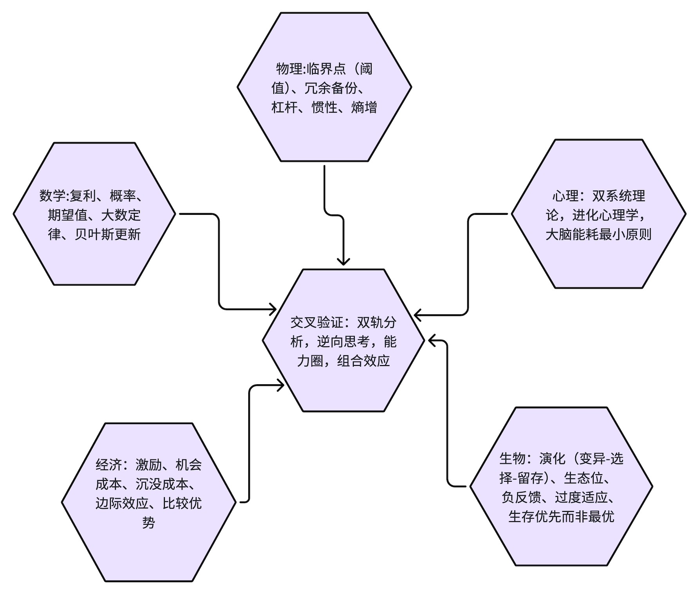

# 第一性原理

双轨分析：分析一件事，一方面理性客观分析客观因素；另一方面主动排查潜意识心理带来的自动错误判断，用纯T和纯F都进行分析

逆向思考（Invert，永远反过来想）；成功先研究如何失败；使用检查清单规避人为疏漏；坚守能力圈；安全边际.做成一件事,排他性，要么A要么非A

组合效应，把各个重要学科的基础原理编织成网状框架，交叉验证同一个问题。

认清自己能力圈，能力圈之外再诱人也不下重注；能力圈边界之外，承认自己无知。
```
格栅多元思维模型
├─理性轨道：数学（复利、概率、期望值）/物理（临界点、冗余备份）/生物（演化、生态位）/经济学（激励、机会成本）
├─心理轨道：人类潜意识误判倾向
├─工具：逆向思考 + 检查清单 + 能力圈边界 + 安全边际
└─输出：Lollapalooza 叠加效应（多模型同向共振）
```
```
遇到复杂问题，禁止只用一个角度看。举例子：判断一份工作，不只看薪资（经济学）；看激励机制；看团队人性心理；看行业生命周期；看自己能力圈是否匹配。多个模型交叉，结论才靠谱。
做决策，主动写下来：这件事会怎么失败？（逆向思考）。跳槽、投资、合作都先列出失败清单。
建立个人检查清单，重大决策逐条过，对抗大脑的遗忘、冲动。
认清自己能力圈，能力圈之外再诱人也不下重注；能力圈边界之外，承认自己无知。

底层公理：现实是跨学科复合系统，大脑自带先天心理漏洞，优先规避灾难，坚持现实诚实
        ↓
输入层：广泛跨学科学习，构建格栅多元思维模型（数学/物理/生物/经济/心理）
        ↓
分析层【双轨分析】
    ·理性轨道：简化、数学估算、逆向思考、识别激励、机会成本、安全边际
    ·心理轨道：25种误判心理学，排查潜意识自动错误
        ↓
工具层：逆向思考 + 检查清单 + 守住能力圈边界 + 识别正向/负向Lollapalooza叠加效应
        ↓
输出：只在赔率有利时下重注，其余时间耐心等待，依靠复利持续积累；主动复盘迭代模型
```
# 学科核心模型
## 数学
复利、概率、期望值、大数定律、贝叶斯更新
```
1. 复利（Compound interest）
核心原理：持续微小正向迭代，时间拉长产生指数结果；负向行为同样复利放大。
触发信号：一件事会长期重复做；需要评估长期结果，不要只看单次收益。

区分：哪些行为属于可复利资产（写作、专业能力、身体、个人口碑），持续投入；

```
```
2. 概率（基础概率、条件概率）
核心原理：现实极少绝对 100%，世界是可能性分布，不是非黑即白。
触发信号：遇到决策，总喜欢说 “一定、肯定、必然”；拿个别案例下结论。
场景：择业、择偶、合作、风险评估，看网上个案故事。
实操动作
大脑强制翻译：把 “一定会成功” 改成 “这件事成功概率大概 X%”；
区分个体案例和基础概率：不要看别人个例，先看基线成功率。


```
```
3. 期望值 E = 概率 × 收益 − 概率 × 损失
核心原理：决策看「期望值」，不看单次输赢。高概率小收益、低概率巨大收益、低概率毁灭性损失，完全不一样。
触发信号：面临选择，只盯着好处，忽略潜在损失；纠结要不要冒险。
场景：跳槽、创业、投资、合伙、高风险机会。
实操动作
在脑子里简易计算：成功概率 × 收益，减去失败概率 × 代价。
坚决避开：期望值为负，一旦失败会直接摧毁你的选项，无论收益多诱人。
举例：创业，成功赚 500 万，80% 概率失败，失败负债百万 → 期望值为负，谨慎参与。
允许：期望值为正，但失败不会毁灭生活，可以小仓位试错。
避坑：期望值是统计意义，单次依然会输；期望值正≠这次一定赢。
```
```
4. 大数定律
核心原理：只有样本足够多，实际结果才逼近理论概率；少量样本高度随机。
触发信号：仅凭几次经历总结一套人生道理。
场景：几次失败就认定行业不行；几次交往就给一类人贴标签。
实操动作：经历少时，不下强结论；把短期结果归为随机性，持续收集样本再修正判断。
```
```
5. 贝叶斯更新
核心原理：先有先验判断，遇到新证据，动态调整信念，不要固执不变。
触发信号：自己死守旧观点，无视新事实；或者看见一件事直接推翻全部认知。
场景：对人评价，对行业判断，对自我能力评估。
实操动作：我原先的看法是什么？新证据多大可信度？适度调整，不是全盘推翻。

```
## 物理
临界点（阈值）、冗余备份、杠杆、惯性、熵增
```
1. 临界点 / 阈值（Critical point）
核心原理：在到达阈值之前，几乎看不到变化；跨过临界点，系统发生突变。
触发信号：长期投入看不到反馈；系统看似平稳，突然崩盘或者质变。
场景：学习一门技能、身体劳损（熬夜、压力累积）；人际关系破裂；业务增长。
实操动作
很多努力不是无效，只是还没有抵达临界点，不要中途放弃；
同时警惕负向临界点：压力、透支一点点积累，表面没事，越过阈值直接崩溃。
膝盖劳损、长期压抑的关系，前期看不出问题，一次性爆发。
避坑：不要线性外推；不要认为 “现在没事 = 永远没事”。

```
```
2. 冗余备份（Redundancy）
核心原理：系统关键环节，不能只有一条通路；单一节点失效，整体不会崩盘。工程学：不要单点依赖。
触发信号：某一件事、某一个人、某一份收入是你唯一来源。
场景：收入来源、身体健康、重要资料、职业技能、人脉。
实操动作
收入：不要 100% 只依靠一份工资（不是立刻副业，储备现金就是冗余）；
能力：不要只掌握唯一一种岗位技能；
个人生活：重要信息多备份；不要把全部精神寄托押在一个人身上。
冗余有成本，不需要无限多，关键链路保证至少两套路径。
避坑：过度冗余会带来巨大负担，抓住关键节点做备份，不需要所有地方都冗余。

```
```
3. 熵增
核心原理：封闭系统自发走向混乱、衰败；维持有序必须持续输入能量。
触发信号：环境、生活、团队慢慢变乱，什么都没做错，但越来越糟。
场景：个人生活秩序、亲密关系、团队管理、自我管理。
实操动作
没有主动维护，关系、习惯、环境天然会变坏；
定期主动做功：复盘、沟通、整理、调整，对抗混乱；
不是出问题才处理，熵增告诉我们，变坏是默认状态。
```
```

4. 惯性
核心原理：系统维持原有状态，改变需要巨大外力。
触发信号：想改变习惯、改变组织，阻力巨大。
场景：改掉旧习惯；公司想转型。
实操：不要期待瞬间改变；小步持续施加力量；识别惯性，不要高估短期改变。

```
## 生物学
演化（变异‑选择‑留存）、生态位、负反馈、过度适应、生存优先而非最优
```
1. 演化：变异‑选择‑留存
核心原理：演化不追求完美，追求存活；大量试错变异，环境筛选，有用特征保留。
触发信号：不知道怎么找到最优方案；总想一步设计完美方案。
场景：探索副业、个人发展、做事方法迭代。
实操动作
不要一开始追求完美方案；做多个小版本的 “变异” 尝试；
让现实环境去筛选哪些有效，保留有效策略，淘汰无效；
小成本试错，不要 all in 在第一个版本。
避坑：试错不等于盲目折腾，每一次试错要有终止条件，控制代价。
```
```

2. 生态位（Niche）
核心原理：生物不需要在所有维度最强；找到竞争薄弱的位置，适配自身特质，就可以生存繁衍。
触发信号：处处和别人硬碰硬竞争，总觉得自己各方面不如人。
场景：职业赛道，个人定位，副业。
实操动作
不要总想和强者正面硬刚；寻找自己独特组合：你的性格、经历、技能叠加，别人很难复制的位置。
例子：普通技术，叠加很好的沟通，找到技术 + 沟通的生态位，而不是单纯和顶级程序员比拼写代码。
生态位会变化，环境改变，旧生态位会消失，需要持续观察。
避坑：不要找不存在的生态位，必须是外部环境有真实需求。
```
```
3. 生存优先，不是最优
核心原理：演化筛选的是 “能够活下来”，不是理论上最优。
触发信号：执着追求理论最优解，忽略现实存活约束。
场景：择业、创业，完美主义。
实操：优先保证可以持续活下去，再追求最优；活下来才有资格谈更好。

```
```
4. 负反馈调节
核心原理：系统存在调节回路，过度就会反向回调。
触发信号：物极必反；盛极而衰。
场景：高强度工作透支；短期运气极好。
实操：当一件事情走向极端，主动警惕回调风险。

```
## 经济学
激励、机会成本、沉没成本、边际效应、比较优势
```

1. 激励机制
核心原理：人的行为被激励驱动，激励大于道德、口头说教。
触发信号：看不懂一个人、一个组织的行为；只听言语，不理解行动。
场景：选工作、合伙合作、看人、组织内部矛盾。
实操动作
分析任何人，先拆解：什么东西奖励他？什么惩罚他？
不要听他说想要什么，看什么行为会给他带来收益。
一份工作奖励短期投机，就不要指望所有人踏实长期做事。
和人合作，提前设计激励，不要寄希望对方道德高尚。
避坑：不只看金钱激励；还有名誉、情绪、认同感，都属于激励。
```
```

2. 机会成本
核心原理：选择 A，代价是放弃 B 的全部价值；任何选择都有看不见成本，不只是花钱。
触发信号：纠结要不要投入时间、精力；只看到这件事的收益，看不见放弃的东西。
场景：加班、考证、谈恋爱、跳槽、刷短视频（时间机会成本）。
实操动作
做选择强制自问：如果我投入时间做这件事，我放弃的最好替代选项是什么？
熬夜娱乐，机会成本：第二天精力、长期健康。
一份高薪但极度消耗的工作，机会成本：健康、家庭、自我成长时间。
避坑：机会成本是最优替代，不是所有其他选项。
```
```
3. 沉没成本
核心原理：已经付出、无法收回的成本，不应该参与未来决策。
触发信号：舍不得放弃已经投入很多，但前景很差的事。
场景：糟糕关系，不适合的赛道，亏损持仓。
实操：做未来决策，把过去投入全部划掉，只看未来收益与风险。

```
```

4. 边际效用递减
核心原理：同一事物，持续增加，新增收益越来越低。
触发信号：以为越多就越好。
场景：财富、娱乐、加班、美食。
实操：追求适度，不要无限加码；到临界点之后继续投入，收益极低甚至负。
```
```

5. 比较优势
核心原理：哪怕一件事你全部都更强，依然适合分工，专注自己相对最强的部分。
触发信号：总想所有事情全部自己搞定。
场景：团队协作，生活分工。
实操：把自己相对劣势的事情外包 / 分工，聚焦自己相对优势。
```
## 计算机
```

1. 缓存‑内存‑硬盘分层（优先级模型）
原理：高速资源容量小，低速资源容量大。大脑精力是高速缓存，容量很小。
触发信号：事情太多，什么都想装在脑子里，经常疲惫混乱。
场景：日常任务、信息接收。
实操：
高速缓存（大脑）只放最高优先级任务；
次要全部放到外部笔记、清单（硬盘），不要占用大脑内存。

```
```
2. 解耦与模块化
原理：系统拆分为独立模块，一个模块损坏，不会摧毁整个系统；模块之间接口清晰。
触发信号：一件事情牵一发动全身，一处出错全部崩盘。
场景：个人生活、项目、亲密关系。
实操：把人生拆成模块：健康、事业、社交、自我成长。不要把全部人生价值绑定单一模块，比如全部自我价值绑定工作。工作受挫，整个人不崩塌。


```
```
3. 异常捕获、错误处理
原理：程序不能假设永远不出错，必须提前写好出错之后怎么处理。
触发信号：做计划默认一切顺利，完全不考虑出错。
场景：人生规划，项目规划。
实操：做计划必须思考：如果这个环节失败，我 fallback（备用方案）是什么。

```
## 心理学
绝大多数重大错误，不是智商不够，而是潜意识自动触发心理倾向。人甚至完全意识不到自己被操纵。
```
双系统理论（卡尼曼《思考，快与慢》）：系统 1 快直觉；系统 2 慢理性
进化心理学：石器时代大脑，现代环境错配；大脑优先生存，不是优先求真
大脑能耗最小原则：能走捷径绝不做费力逻辑运算
社会群居本能：人是高度社会性动物，内置大量群体协作的自动程序
```
```

损失厌恶
```

## 投资商业
区分创造增量价值 VS 零和财富转移博弈
少数几个重量级模型（复利、概率、激励、临界点、冗余）承担绝大部分解释力，费马帕斯卡系统。投资只是普世智慧的一个应用场景。
格栅思维：知识不是堆成一堆，而是网状互联；遇到现实问题，调用多学科模型共同解释。


# ai提示词
```

把大问题简化，抓住本质
剥离噪音，找到真正关键变量，不要被细枝末节裹挟。很多复杂问题 90% 信息是干扰。
反面：沉迷海量次要信息，越分析越混乱。

使用数学工具量化
尽量把定性感受转为数字：概率、期望值、成本、亏损上限。人脑直觉对大数、风险天生感知很差，数学修正直觉偏差。

逆向思考
正向思考：我如何成功；
逆向思考：什么会让我彻底失败？我要如何避开这些事。
很多时候，规避毁灭，比追求成功更容易达成目标。

多学科模型（格栅）
不局限一个领域，调动不同学科底层公理解释同一个现实问题。使用心理学，数学，物理，生物学，经济学，计算机
复利、概率、期望值、大数定律、贝叶斯更新
临界点（阈值）、冗余备份、杠杆、惯性、熵增
演化（变异‑选择‑留存）、生态位、负反馈、过度适应、生存优先而非最优
激励、机会成本、沉没成本、边际效应、比较优势
25 条低底层心理学

识别复合叠加效应（Lollapalooza 效应）
多种因素同向叠加，结果会不是简单相加，而是指数级放大。可以正向，也可以毁灭性负向。
```


