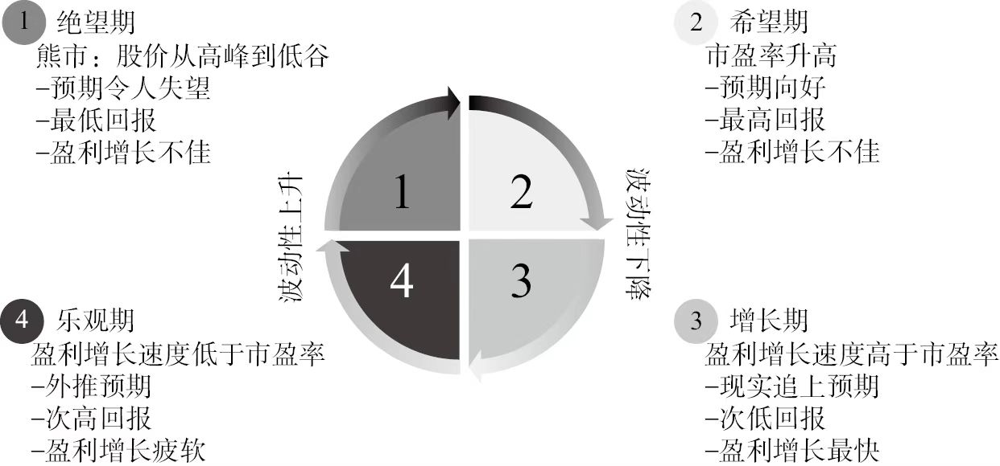
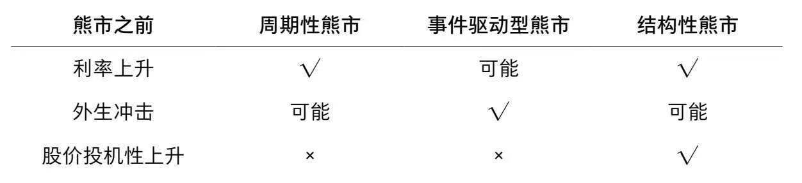
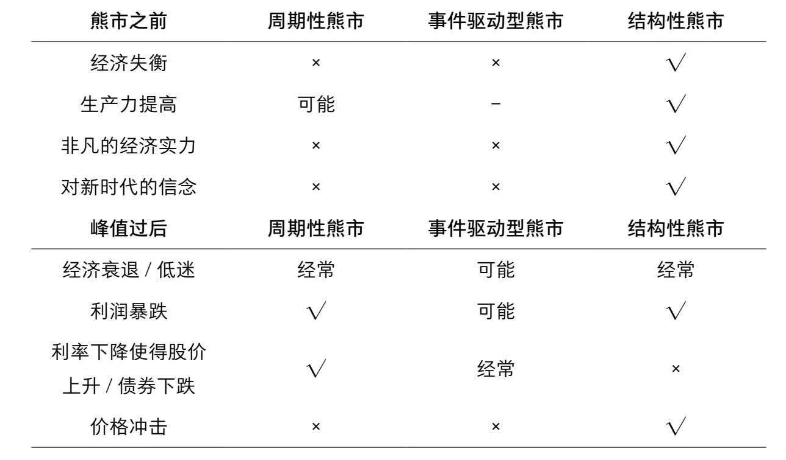
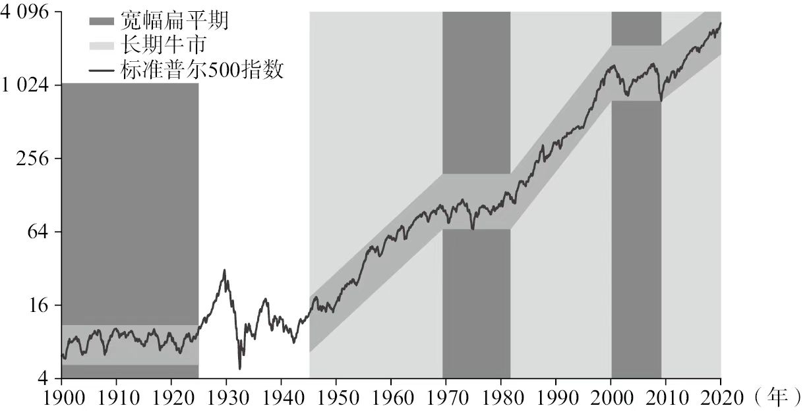
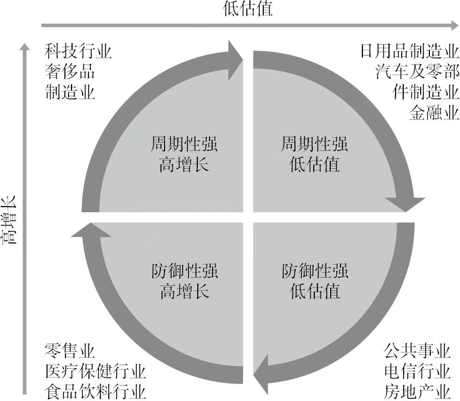
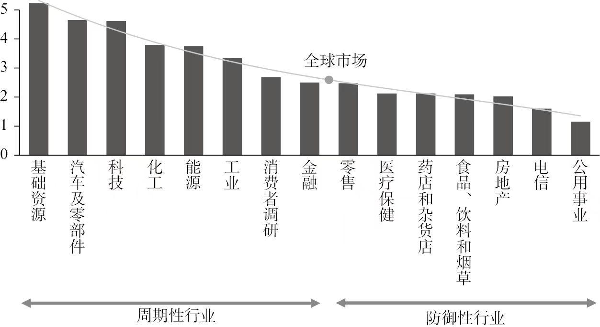

# 投资第一性原理
## 经济周期变好类型分析
经济真正变好的根本原因 = 出现了新需求
其他所有原因，都是为了 “让需求能出现、能实现”
```
真正原因（源头）有四种
新需求出现
技术 / 效率提升
外部需求增加
政府政策刺激
```
1992~1997:市场经济制度改革+新需求
2002~2007:全球化需求,城镇化内需求
2009~2010:政策刺激,创造临时需求
2016~2017:政策棚改,供给侧改革
2021~2023:外部需求,国内新产业
2024~2026:ai+科技新需求


## 通货膨胀->供需分析
1)通货膨胀的根本原因
整个社会人类形成一个生态圈，人既是生产者又是消费者，生态圈的一个环节发生变化会传导给生态圈的其他节点
```
科技、改革、全球化，最初都只是局部需求。但它们会通过三条路径扩散成全面通胀：

收入扩散
一个行业赚大钱 → 全行业消费变强：出口，房地产，互联网，新能源

成本传导
上游原材料涨 → 所有制造业成本涨:石油，煤炭，金属，粮食，航运

货币宽松
经济好 → 银行放贷多 → 社会钱变多 → 钱不值钱：钱多了，资源没变多
```

2)单一行业的需求扩大为啥导致整个社会的通货膨胀?
一个行业火 → 这个行业的人工资涨、赚大钱 → 他们去买房、买车、吃饭、旅游 → 带动全行业需求 → 全面通胀
通胀从来不是 “某一个东西贵了”，而是钱在整个社会里转得更快、更猛了


```
1. 先有一个 “领头行业” 需求爆了
比如：
全球化 / 出口爆了：工厂订单疯涨
互联网 / 科技爆发：程序员、大厂工资翻倍
房地产起来：建筑、建材、装修全火
政策基建：修路修桥，工人工资涨
这些都只是局部需求，没错。

2. 这个行业的人突然赚大钱了
重点来了：
赚钱的人不会只花在本行业。
出口工厂老板赚钱 → 买房、买车、吃好的
程序员涨薪 → 租房、外卖、旅游、买手机
建筑工人工资高 → 买菜、买衣服、给家里寄钱
老板投资赚钱 → 扩大再生产 → 买设备、原材料

3. 钱流到各行各业 → 全行业需求一起涨
一个行业火 → 一批人收入暴涨
→ 他们疯狂消费
→ 餐饮、零售、租房、交通、服务业需求全上来
→ 这些行业也开始缺人、涨价
→ 服务业涨价 → 所有人生活成本变高
→ 工人要求涨工资
→ 企业成本涨 → 产品再涨价
这就叫：工资 — 价格螺旋
一个点火 → 一圈火 → 全面火。

4. 钱变多了，也是关键推手
经济好的时候，银行敢放贷：
企业借钱扩产
老百姓借钱买房买车
社会上的钱变多了
→ 钱 “毛了”
→ 所有东西一起涨价
这就是全面通胀。
```

```
① 2001 入世 → 出口爆（局部需求）
结果：
工厂赚钱 → 老板买房 → 房价涨
工人多 → 吃饭租房贵 → 物价涨
出口赚外汇 → 国内货币变多 → 全面通胀

② 2009 四万亿 → 基建爆（局部需求）
结果：
钢铁水泥涨 → 工人工资涨 → 消费涨
房价暴涨 → 上下游全涨
全面通胀。


③ 2021 新能源爆（局部需求）
结果：
锂矿、硅料、化工暴涨
产业链工资涨
带动制造业整体涨价
PPI 大涨 → 传导到 CPI


④ 美国 2020 年发钱（局部刺激）
结果：
全民有钱 → 全品类需求爆
车、房、油、饭、机票全涨
全面大通胀
```

### 通货膨胀时央行为啥要加息?
央行不让通胀太高，不让钱变毛的太快，因为生态圈传导扩张要时间，局部通胀太快，导致和其他部分社会参与者脱节，导致老百姓物价疯涨.
必须要给经济降温，让借钱变贵=>加息=>导致债券利率变高


## 零利率时代投资策略
戈登增长模型：债券收益率+ERP(风险补偿)=股息率+gdp增长率，债券收益率越低代表大环境越差,股民对股市的风险补偿要求越高
日本和欧洲股市长期跑不赢通胀，央行已经无水可放

放水还能撑2~4年.
核心原则:
1)现金流动性30%-40%
2)黄金10%-15%
3)股票20%-30%:配置红利低波,新能源基建、光伏、储能,低估核心资产消费、医药


## 未来AI时代最重要的货币资源
[https://www.doubao.com/thread/a1c44fd7f7312?share_token=D99ECC15-0D51-4B0D-9D14-FAD04EA8433E]

# 股市周期分析
## 四个阶段

绝望期=》希望期=》增长期=》乐观期

## 熊市类型分析


周期性熊市和事件驱动型熊市通常会出现约30%的跌幅，而结构性熊市的跌幅更大，约为50%

事件驱动型熊市往往是最短的，平均持续时间为7个月；周期性熊市平均持续时间为27个月；结构性熊市平均持续时间为4年

事件驱动型熊市和周期性熊市往往在约1年后恢复到之前的市场高点，而结构性熊市平均需要10年才能恢复到之前的高点
### 货币与经济周期转向->[周期性熊市]
不断上升的利率和通胀，对经济衰退的担忧,利润预期下降
这类熊市是典型经济周期导致,是最常见熊市

周期性熊市平均持续2年，4年才能恢复
### 不确定性与风险溢价飙升->[事件驱动型熊市]
战争、危机、黑天鹅，担心影响全球供应链，能源，封锁:2020新冠疫情,俄乌战争,9.11恐怖袭击
这类熊市由不一定导致全国衰退的一次性冲击引发,战争，油价，新兴市场危机等

不仅仅是情绪，也有真实伤害盈利
战争->油价暴涨->企业成本上升
地缘冲突->贸易中断,供应链断裂
制裁封锁->扩过业务受损
社会恐慌->消费下降
盈利下降+估值杀跌=戴维斯双杀

事件驱动熊市平均1年左右

### 资产价格泡沫与结构性失衡->[结构性熊市]
债务失衡，银行业危机，金融泡沫和新时代的信念
通常由结构性失衡和金融泡沫接触引发，通常是资源配资不当的结果

这个是跌的最久，最容易引发全面金融危机的:2008次贷危机,2000互联网泡沫

为什么美国次贷危机=全球金融危机?
1.美国银行暴雷->全球美元流动性枯竭,各国银行缺美元,大家卖资源换美元->全球股市一起跌
2.全球金融机构都买了美国的有毒资产，华尔街将次贷打包成理财产品卖给了欧洲/日本/中国各大基金银行
3.美国衰退,全球贸易少一半,美国是全球最大消费市场
4.全球信心崩塌,美元暴雷,全球恐慌

复苏通常需要10年

### 评估熊市指标
1.失业率
2.通货膨胀
3.收益率曲线
4.强势的增长势头
5.高估值
6.私人部分的财务平衡(所有家庭和企业的总收入-总支出)

## 牛市类型分析
牛市是由周期的三个阶段组成的，希望期、增长期和乐观期
牛市股票价格的长期上升趋势往往也是分阶段出现的

### 长期牛市->超级周期

长期牛市，每一个时不时都被偶然的大幅下跌和微型熊市打断
1945-1968黄金时代
1982-2000长期牛市被打断过几次,但仍为超级周期

### 周期性牛市

### 无趋势牛市

## 金融泡沫
1)对新时代和新技术的信仰
价格和估值快速增长，导致人们对未来的增长和回报提出了不切实际的高要求
人们误认为市场提供了无限的盈利能力，害怕自己错过良机，随着市场信心的增强，估值会升到未来回报无法企及的水平，很多人之所以投资，部分是因为对他们成功的羡慕，部分是赌徒的兴奋

泡沫期间价格和估值惊人快速上升，导致估值高估了未来的回报。1825年到2000年推出的51项重大创新中，73%存在明显泡沫

2)放松管制和金融创新

3)宽松的信贷和金融环境

4)对新的估值方法的合理化

5)会计丑闻和违规行为的出现

## 股市周期核心指标

| 股市阶段 | GDP(经济总值) | CPI(物价) | PMI(就业) | 特征                                                  |
|------|-----------|---------|---------|-----------------------------------------------------|
| 绝望期  | 下降        | 下降      | PMI<50  | 市场从高峰走向低估,  16个月                                    |
| 希望期  | 回升        | 低位徘徊    | PMI<50  | 估值反弹持续很短，平均9个月，预期是主要驱动力，宏观数据和企业利润可能仍低迷              |
| 增长期  | 高速增长      | 上涨      | PMI>50  | 盈利增长并推高回报阶段，持续时间长，平均49个月 ，投资者会观望怀疑,市盈率可能收缩，债券利率可能上升 |
| 乐观期  |           |         | PMI>50  | 投资者自满，估值再次上升超过盈利增长，平均23个月  ,股价上涨,利润增长却很少            |

## 美股周期

## 港股周期

## A股周期


# 周期和行业的关系



## 周期强高增长
科技

## 周期强低估值
成熟行业:汽车行业，能源，工业，制造业，金融业，日用品

## 周期不敏感高增长
医疗保健，食品饮料，消费品

## 周期不敏感低估值
电信行业，房地产业

## 价值型公司与成长型公司
成长型:关注未来预期,看跑的快不快，科技，医药，互联网
价值型:看现在偏不便宜,看打不打折.价值偏周期，银行，煤炭，能源，化工

## 科技与周期

# 常见价值评估指标
## PE(price to earnings ratio市盈率)
PE=总市值/净利润

[看贵不贵，多少年赚回来，适合盈利稳定成熟的公司]
消费(白酒，家电，食品)，医药(稳定赚钱)，公共事业，电力，银行，保险

## PB(price to book ratio市净率)
PB=总市值/净资产

[看资产便宜不便宜，重资产，周期股，看家底]
银行，证券，地产，钢铁，煤炭，化工，船舶，制造

## PS(price to sales ratio市销率)
PS=总市值/营业收入


[还没赚钱，但营收很大的公司]
高科技，芯片，生物医药，互联网，云服务

## PEG(price/Earnings to growth市盈率相对盈利增长比率)
PEG=PE/净利润增长率
[高成长股贵不贵，增长快]
高增长科技，新能源，创新药，半导体

## ROA(return on assets总资产收益率)
ROA= 净利率 / 总资产

总资产 = 自己的钱 + 借来的钱

净利率包含利息、税，总资产包含现金、理财不干活的钱
[不够纯粹]

## ROE(return on equity净资产收益率)
ROE = 净利率 / 净资产

净资产 = 自己的钱

[ROE可能因为借钱而虚高，不一定是公司厉害，可能是敢借钱放大杠杠]。例如总资产100, 自己只掏20万，赚10万，ROE=10/20=50%


## ROIC(return on invested capital投入资本回报率)
EBIT(经营利润,做生意本身赚的钱)/(净运营资本+净固定资产)

净运营资本:为了做生意真正砸进去的本钱=应收款+存货-应付钱
净固定资产:厂房设备折旧后的剩余价值

借钱开厂，业务赚15%->ROIC 15%
自己的钱开厂,业务赚15%->ROIC 还是15%

[ROIC，看生意本身赚多少钱，不看借钱]

## EBIT/EV
EBIT(经营利润,做生意本身赚的钱)/EV(市值+负债-现金)
相当于买下公司要花的总代价

# 历史分析
恒生科技历年跌幅,涨幅,周期数

# 定投策略

## 左侧交易

[PE估值优化+静态定投策略+斐波那契倍投策略+网格化交易小幅度回撤策略]
0)起点设置在多少比较好？ 回撤-10%

1)PE估值
如果PE>80%，无论跌多少都只投基础金额5000
如果PE<60%, 按照以下斐波那契倍投策略
如果PE<30%, 所有金额*1.2倍

2)静态定投策略
PE偏低每月10000,PE中等每月5000,PE偏高暂停定投

3)斐波那契倍投策略
采用斐波那契 倍投思维
斐波那契:1,2,3,5,8

4)网格化交易小幅度回撤策略
每个月雷达不动定投一次,且在跌幅超过3%时再定投一次，为了防止一个月投太多次把子弹打空，可以设定一个月内同一跌幅只补一次,10%到20%最多补两次
回撤10%:投10000
回撤13%:3000(微调仓位,利用恐慌情绪)
回撤20%:投20000
回撤23%:6000(微调仓位,利用恐慌情绪)
回撤30%:投30000
回撤33%:9000(微调仓位,利用恐慌情绪)
回测40%:投50000


| 回撤幅度        | 静态定投策略 + PE估值                   | 斐波那契倍投策略 + PE估值 | 网格化交易策略 + PE估值 | 理由                         |
|-------------|---------------------------------|-----------------|----------------|----------------------------|
| -10%        | PE偏低每月10000,PE中等每月5000,PE偏高暂停定投 | 10000           |                | 技术性调整开始                    |
| -13% ~ -16% | PE偏低每月10000,PE中等每月5000,PE偏高暂停定投 |                 | 3000           | 小范围微调，仓位也微调，避免子弹打光         |
| -20%        | PE偏低每月10000,PE中等每月5000,PE偏高暂停定投 | 20000           |                | 关键支持位，很多熊市底部都在-20%，必须重仓    |
| -23% ~ -26% | PE偏低每月10000,PE中等每月5000,PE偏高暂停定投 |                 | 6000           | 小范围微调，仓位也微调，避免子弹打光         |
| -30%        | PE偏低每月10000,PE中等每月5000,PE偏高暂停定投 | 30000           |                | 黄金坑位，在纳指极其少见，出现就是宋茜，必须加大子弹 |
| -33% ~ -36% | PE偏低每月10000,PE中等每月5000,PE偏高暂停定投 |                 | 9000           | 黄金坑位，在纳指极其少见，出现就是宋茜，必须加大子弹 |
| -40%        | PE偏低每月10000,PE中等每月5000,PE偏高暂停定投 | 50000           |                | 世纪大跌，可能继续跌，所以分成观察位和预留位     |
| -50%        | PE偏低每月10000,PE中等每月5000,PE偏高暂停定投 | 80000           |                | 世纪大跌，可能继续跌，所以分成观察位和预留位     |


## 横盘震荡
横盘过长会给定投带来资金压力，指数在-15%反复拉锯没有创新低，一直投10000资金效率不高，
此时为磨底期，可以将定投金额回调到上一级。因为市场已经消化利空，不会暴跌，把子弹留给二次探底

[PE估值优化+磨底期时间熔断+磨底期时间阶梯+网格化交易]
0)设置在几个月比较好？一般6个月是耐心线，12个月是极限

1)磨底期时间熔断
横盘期间采用动态双轨如果震荡12个月，容易把子弹打光，超过6个月后，可以切换成静态定投，防止资金断裂，比如每个月买2万

2)磨底期时间阶梯
除开每个月定投的钱，6个月时额外加仓一次，12个月时再额外加仓一次

3)网格化交易
3%加仓


## 右侧交易
[止盈不止投]  起点设置在多少比较好？ +10%

| 涨幅        | 止盈不止投策略 | 理由                         |
|-----------|---------|----------------------------|
| +10%～+16% | 5000    | 按月定投                       |
| +20%～+30% | 2500    | 止盈不止投，定投金额减少为2500，防止踏空疯牛行情 |
| +30%～+?%  | 停止定投    | 停止定投                       |

## 右侧止盈

| 阶段   | 止盈条件                | 操作                           |
|------|---------------------|------------------------------|
| 第一阶段 | 持仓收益>30% 且 PE>80%   | 停止定投,卖出20%仓位                 |
| 第二阶段 | 持仓收益>50% 且 PE>80%   | 卖出50%仓位，市场可能出在泡沫化阶段，继续上涨空间有限 |
| 第二阶段 | 持仓收益>100% 且 PE>80%  | 卖出100%仓位，100%还不走就是贪婪了，会出问题   |
| 第三阶段 | 趋势反转后,移动止盈,最高点回撤10% | 清仓                           |
 

## 估值加验
像2000年泡沫破裂，纳指从PE=100跌到PE=80,虽然跌了20%，但是依然贵的离谱，此时越跌越买可能买在半山腰，套牢10年
如果PE>80%，无论跌多少都只投基础金额5000
如果PE<60%, 按照以下斐波那契倍投策略