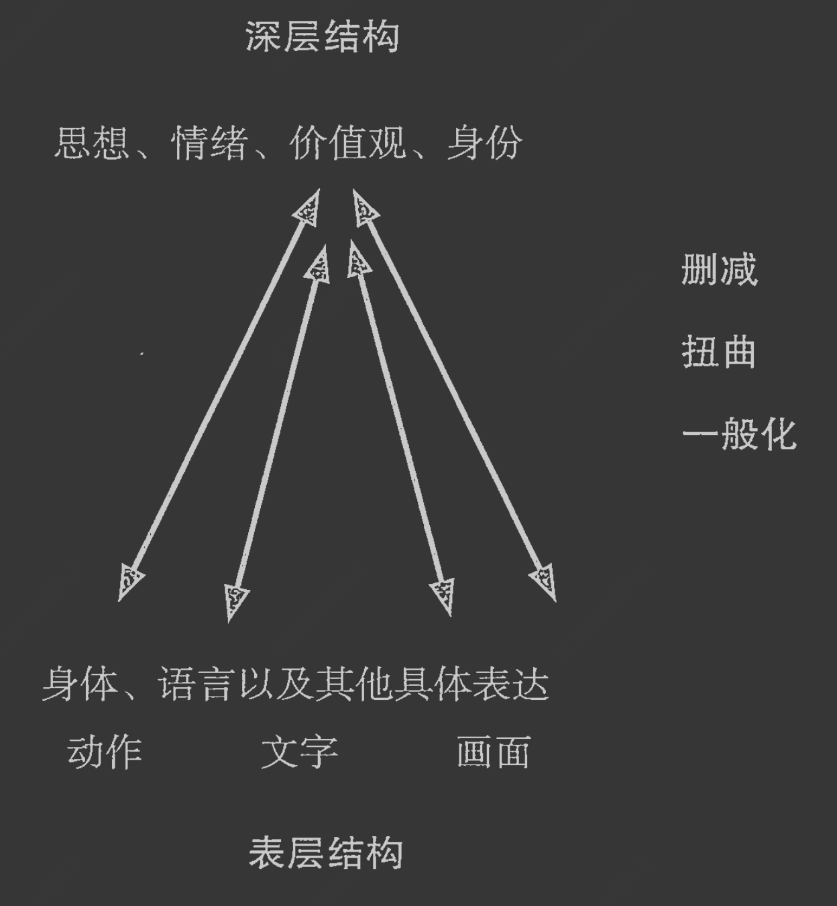
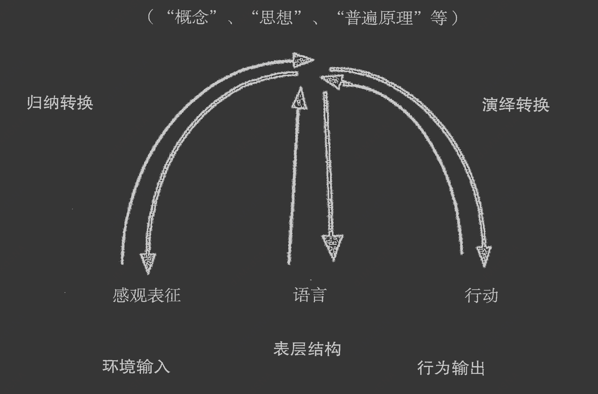
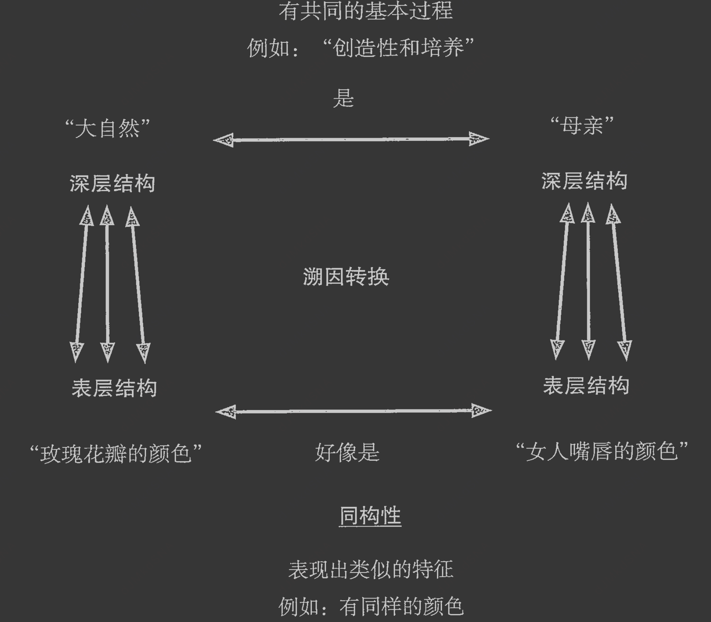
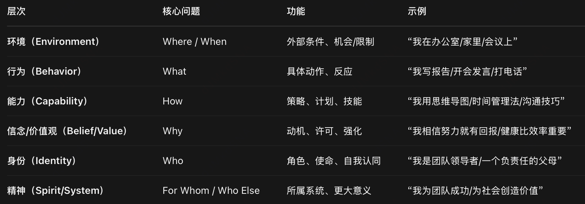
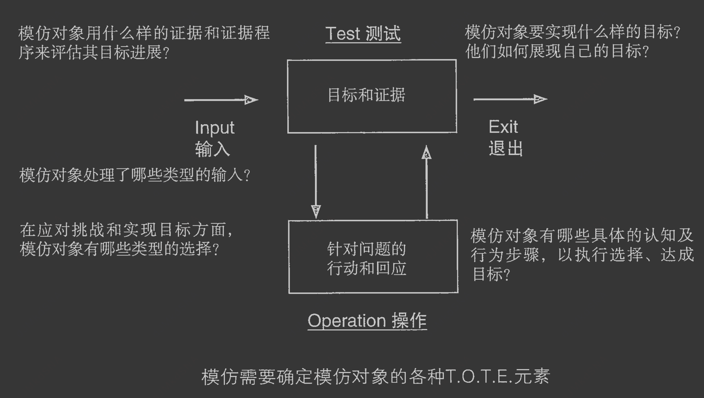
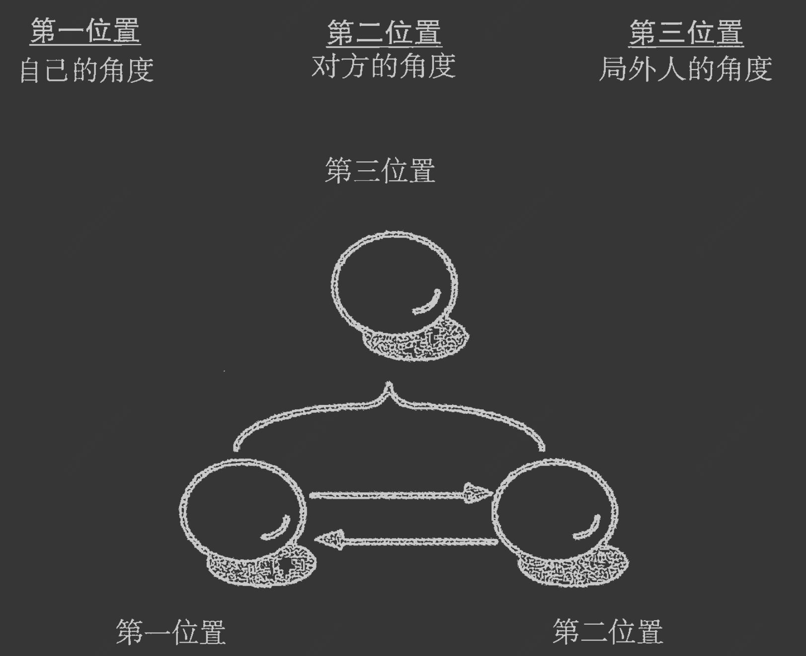
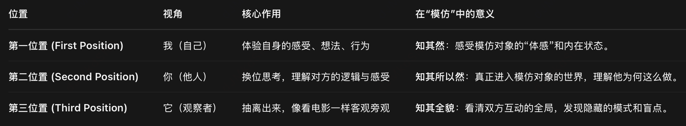
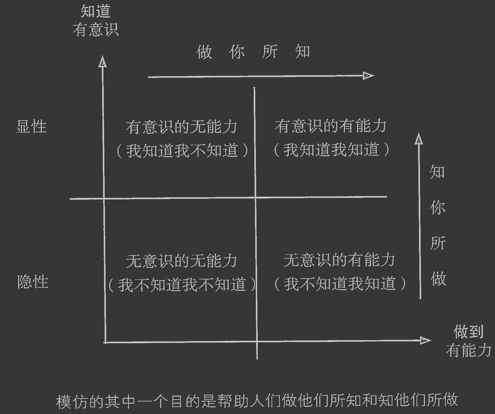

# 基本假设
## 地图不是疆域 The Map is not the territory
NLP 运作的基本假设是“[地图不是疆域]”。作为人类，我们必须通过自己的感官来体验现实世界，但我们的感官是有局限的。因此，在这个意义上，
我们永远无法知道现实世界究竟是怎样的。就像你现在看着本书的这一页，如果有只蜜蜂也看着同一页，它的感觉会与你非常不同，
因为蜜蜂的感官组织与我们人类的感官组织是不同的。我们只能根据感官接收到的信息，以及这些信息与我们个人的相关记忆以及其他经验来描绘我们周围世界的地图。
因此，我们并不是对现实本身做出反应，而往往是根据我们大脑的地图做出反应。


从这个角度来看，并没有绝对“正确”的地图。我们每个人都有自己的世界观，我们的世界观是建立在本人的“神经语言地图”（neurolinguistic map）基础之上的。
正是这些“神经语言地图”（而不是真实世界本身），决定了我们如何解释、如何应对周围的世界，给我们的行为和经验赋予意义。因此，真正限制我们、约束我们的，
通常不是外部的真实世界，而是我们内在的地图。NLP 的基本思想就是：在同样的现实情况下，如果你能丰富及拓展你的内在地图，你就会觉察更多的选择。
NLP 工具和技术的主要功能就是：帮助人们拓展、丰富或者增加我们对这个世界的思想地图。NLP 的基本预设前提是：[你的世界地图越丰盛，你就越有可能应对现实世界发出的任何挑战]。

## 生命和心智都是系统性的整体Life and mind are systemic
NLP 的第二个预设前提是：“‘身’和‘心’属于同一个系统”；意思是，我们每个人都是一个“系统”（system），我们的系统由很多相互作用的“子系统”（sub-system）组成，同时我们也是一些更大系统的一部分。
人内在的互动，人与人之间的互动，人与环境的互动都是系统性的，同时遵循一定的系统法则。我们的身体、我们的人际关系、我们的社会……所有这一切都是相互影响的，共同构成了系统与子系统的生态平衡（ecology）。

## 法则弹性可变The law of requisite variety
系统论（systems theory）有一个法则，被称为“弹性法则”。这个法则对于任何领域的卓越表现都非常重要。弹性法则的意思是：要达到效果，我们需要不断探索行为和方法的弹性变化。
如果环境或系统发生改变，即便一个曾经有效的方法，未来也可能不再有效。换句话说，过去的成功可能是一种创造力的陷阱或局限。人们很容易相信：过去成功的方法，未来也会继续有效。
可是，如果周围的系统发生了改变，曾经有效的方法将不再有效。

## 表层结构-深层结构

我们通过大脑和语言塑造出来的世界模型只是真实世界的“表征”（representation），并不是真实世界本身。然而，深层结构的许多重要线索都表现在语言的表层结构中。
NLP 扩大了“深层 / 表层结构”这一概念的使用范围，使它并不局限在语言模式和内在表征方面。NLP 认为：深层结构是由感官经验和情绪体验
（即：原生体验，primary experience）构成的。NLP 将语言看作是“次生体验”( secondary experience )。“次生体验”来自于我们的“原生体验”，是我们世界观的一部分。

NLP 的目标之一就是通过分析“表层结构”的“语法”或形式，识别出产生问题的“删减”、“扭曲”和“一般化”，并且提供一个工具系统，从而达到更丰富的“深层结构”表征（representation of the deep structure）
NLP 的另一个目标是能够在表层结构和深层结构之间建立更好的联系，模型仿效技术即要达成这一目标。


NLP 视之为“深层结构”与“表层结构”之间连接的函数。“深层结构”是潜在的，经过一系列转换，在具体的“表层结构”中显现。这个过程包括数据的选择性“建构”以及数据的选择性“破坏”

## 结构主义
原始数据转换成结构的过程中，包含对原始数据的选择性删除（selective deletion）、扭曲（distortion）或一般化（generalization）。
大脑既不能如镜像般反映现实，也不能建构现实。“强”结构是由“弱”结构选择性破坏信息而形成的。只有当原始数据经过一系列“转化”，
变得与大脑中预先存在的结构相一致时，原始数据才会变得有意义。

## 归纳转换(向上归类) inductive transformations 

从 NLP 的角度来看，有“归纳转换”（inductive transformations）和“演绎转换”（deductive transformations）。我们通过“归纳转换”感知周围世界的模式并建立内在地图。
我们通过“演绎转换”描述我们对世界的感知和内在地图，并展开行动。在我们通过感官收集经验的过程中，归纳转换透过“上堆”（chunk up，也译作“向上归类”）
帮助我们挖掘更深层次的结构模式（比如：“概念”、“思想”、“普遍原理”等）。演绎转换“下切”（chunk down，也译作“向下归类”）我们的深层结构，到达表层结构，
从而将一般的想法和概念呈现为特定的词语、动作以及其他形式的行为输出（比方说，学习一门外语的词汇和练习用纯正的外语发音去娴熟地沟通，虽然这两个过程可能都应用了一些转换，
但所涉及的转换方式和转换步骤则是不一样的）。

## 演绎转换(向下归类) deductive transformations

## 溯因转换(横向归类) abductive transformations

还有一种被称为“溯因转换”（abductive transformations），也就是深层结构被转化为其他深层结构，表层结构被转化为其他表层结构。这种转换方式包括隐喻（metaphor）
和类比（analogy）。所谓“类比”，如“羊毛像雪一样白”或者“她的嘴唇像一朵红玫瑰”，指的就是这种基于明喻（simile），也就是用一种表层结构比拟另一种表层结构
（即：同构性，isomorphism）的方式。所谓“隐喻”，如：“大自然母亲”或“地球宇宙飞船”，意味着更深层结构之间的关系（即：同态性，homomorphism）。
很显然，这种转换模式是诗歌和某些创作灵感的基础，同时也是人们解决问题和进行学习的基本过程。

## 6层模型

```aidl
环境决定了外部的机会或限制，一个人对此必须做出反应。它关系到运用某个特定技能或能力的地点（where）和时间（when）。
行为是人在环境中所做出的具体动作或反应。它关系到某个特定技能或能力用来做什么（what）。
能力通过大脑地图、计划或者策略，引导及指引行动的方向。它关系到某个特定技能或能力是如何（how）做到的。
信念和价值观提供了对能力支持或抑制的强化作用（动机和许可）。它关系到某个特定技能或能力是为了什么（why）。
身份与一个⼈的角色、使命和/或自我意识有关。它关系到某个特定技能或能力的所有者是谁（who）。
精神与人所从属的更大系统有关。它关系到某个特定技能或能力是为了谁（for whom）或还牵涉到谁（who else）。
```
```aidl
这个模型完美呼应了 “深层结构 ↔ 表层结构” 的转换逻辑：
下层（环境、行为） 是表层结构 —— 可观察、可操作；
上层（信念、身份、精神）是深层结构 —— 决定意义、动机、方向。


它也体现了 Chunk Up / Chunk Down 的应用：
从“行为”（what）上堆到“身份”（who）→ 找到意义；
从“信念”（why）下切到“能力”（how）→ 找到方法。


同时，它与 溯因/归纳/演绎转换 也紧密相关：
溯因：从行为反推信念（如：他迟到 → 他可能不重视规则）；
归纳：从多次行为总结能力模式（如：他总用思维导图 → 他有结构化思维）；
演绎：用身份驱动行为（如：我是领导者 → 我必须主动承担责任）。
```

## TOTE模型

T = Test（测试 / 检验）
O = Operate（操作 / 行动）
T = Test（再次测试 / 检验）
E = Exit（退出 / 结束）
完整英文：Test - Operate - Test - Exit

```aidl
技巧和能力在应用中经常是“非线性”的。一个特定的技巧或能力（比如：“创造性思维”或“有效沟通”）可以为很多不同类型的任务、情况以及环境提供支持。
能力必须能够“随机访问”（randomly accessed），因为我们必须在不同的时间，根据特定的任务、情境或环境，立即调用不同的技能。
因此，相对于线性的步骤，技巧需要围绕 T.O.T.E. 模型来组织。T.O.T.E. 模型是一个反馈回路，包括：

a. 目标；
b. 选择实现目标的方法；
c. 用于评估目标进展的证据。
```

能力与程序的区别：
程序（Procedures）：线性的、固定的步骤（如：菜谱、操作手册）。
能力（Capabilities）：[非线性的、可随机访问的]（如：创造力、沟通力），能跨任务、跨情境复用。

“随机访问”（Randomly Accessed）：
能力不是按部就班执行的，而是根据当下情境即时调用不同技能组合。
举例：[“有效沟通”在谈判、安慰、汇报中，用的策略和语言完全不同，但底层能力是相通的]。
T.O.T.E. 模型（反馈回路）：
T（Test）：评估当前状态与目标之间的差距 → 目标（Goal）
O（Operate）：采取行动 → 选择方法（Method）
T（Test）：再次评估进展 → 证据（Evidence）
E（Exit）：达成目标则退出，未达成则返回 O 或调整目标。
这是一个动态循环，而非线性流程，非常适合描述“能力”的运作方式。

```aidl
一些技能和能力实际上是由其他技能和能力构成的。“写一本书”的能力是由所使用语言的词汇能力、语法能力、拼写能力，以及与这本书主题相关的知识所组成的。
这些通常被称为“嵌套 T.O.T.E.s”（nested T.O.T.E.s）、“子回路”（sub-loops）或者“子技能”（sub-skills），因为它们与构建更复杂技能的更小组块相关。
例如，“领导力”是由许多子技能组成，比如：有效沟通能力、建立亲和力的能力、解决问题的能力、系统思考能力等等。
```

## 模仿的三种感知位置


[地图不是疆域]

[对于同一情况，每个人都会形成自己特有的大脑地图]

[对于一个特定的事件或经验，没有单一的‘正确’地图”]


## 显性模仿、隐性模仿

准备阶段
模仿的准备阶段，包括选择一个模仿对象，这个对象有你希望模仿的能力，然后确定以下几个方面：
a）你将要进行模仿的背景；
b）何时、何地，你会开始模仿这个人；
c）你想和被模仿者有什么关系；
d）进行模仿的时候，你会处于什么样的状态。
这个阶段还包括建立适当的条件、心锚，以及 “生命线”，这样可以让你更好地实施模仿项目。

## 模型
需求场景	选用模型
访谈观察目标人物、收集肢体语言线索，表层行为观测	BAGEL
B.A.G.E.L —— 表层行为观察模型
B = Body Posture 身体姿势
A = Accessing Cues 内在调取线索（生理读取线索）
G = Gestures 手势
E = Eye Movements 眼球运动线索
L = Language Patterns 语言模式


拆解日常决策、沟通这类基础思维，认知策略	ROLE
R.O.L.E —— 简单认知策略拆解模型
R = Representations 表征系统（V/A/K 感官系统）
O = Organization 信息组织顺序（内在思考先后流程）
L = Submodalities 次感元
E = Effect 效应（这套认知流程最终产生的感受、判断结果）


解决工作、团队、人际现实问题，冲突建模	SCORE
S.C.O.R.E —— 复杂行为、问题分析模型
S = Symptoms 症状（当下可见问题表现）
C = Causes 成因（维持症状的根源）
O = Outcomes 目标结果（想要达成的状态）
R = Resources 资源（达成目标可用能力、支持）
E = Effects 远期效应（目标实现带来长期连锁影响）


拆解战略规划、教学、创新等复杂思考流程，稳定运行的长期心智地图	SOAR
S.O.A.R —— 复杂高阶认知建模模型
S = Situation 触发情境（什么场景启动这套思维）
O = Operations 内在操作步骤（内部思考运作流程）
A = Antecedents 前置诱因（塑造这套思维的过往印记、内在触发条件）
R = Results 输出结果（整套认知最终产出的决策、结论）


## AI提示词
每个行为的背后都有一个正面动机。如果一个人的行为不值得肯定，但至少你可以肯定他的正面动机。
使用NLP地图不是疆域的理论以及归纳、删除、扭曲、假设的理论， 使用表层结果-深层结构以及6层结构 where/when/what/how/why/who/for whom分析现状，
并结合三个角度：自己的角度、对方的角度、局外人的角度分析各方视角,
并结合BAGEL ROLE SCORE SOAR模型给出方案