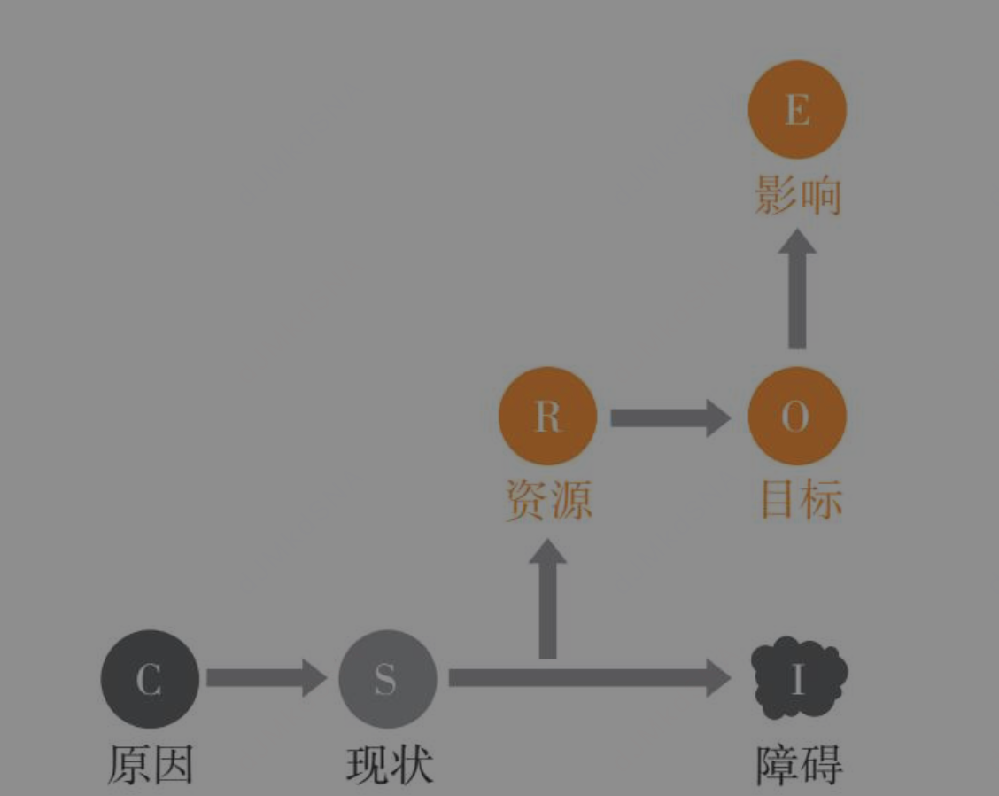
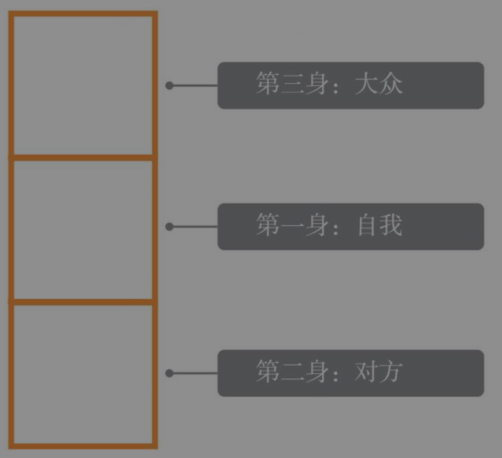
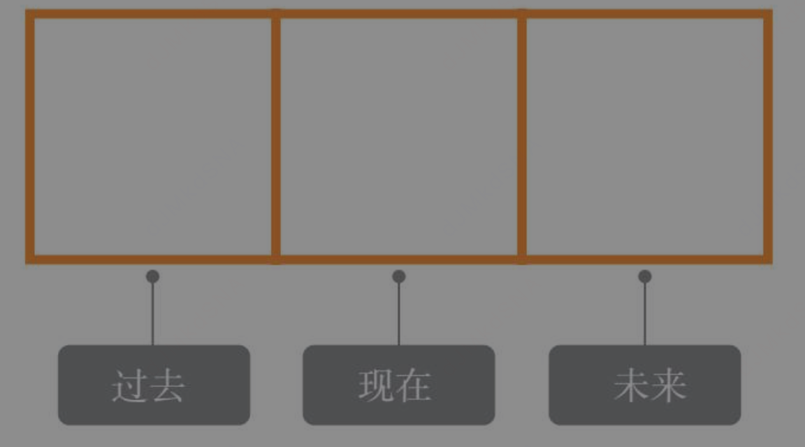
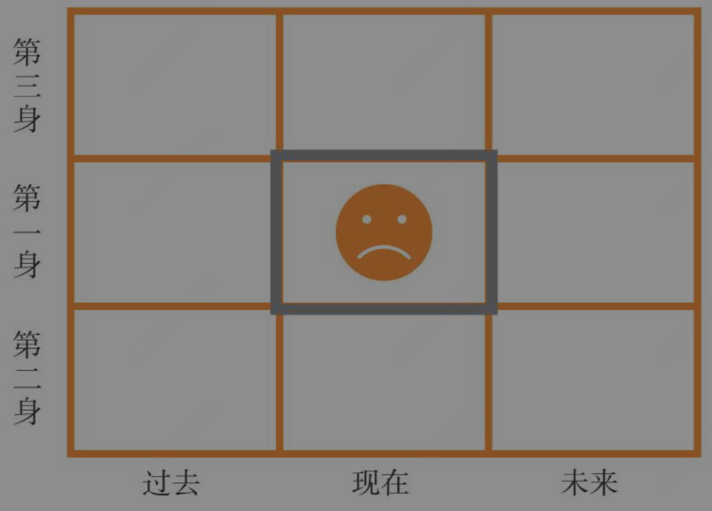
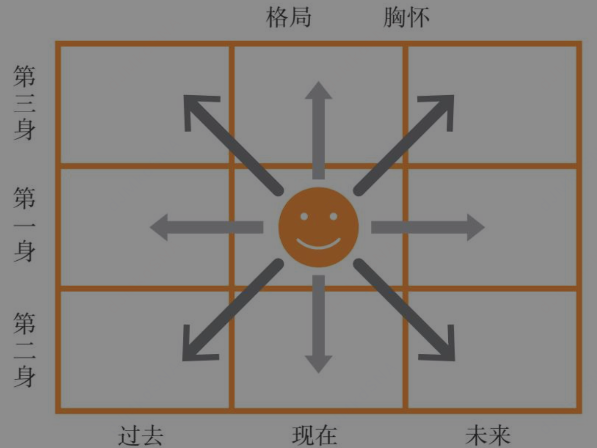
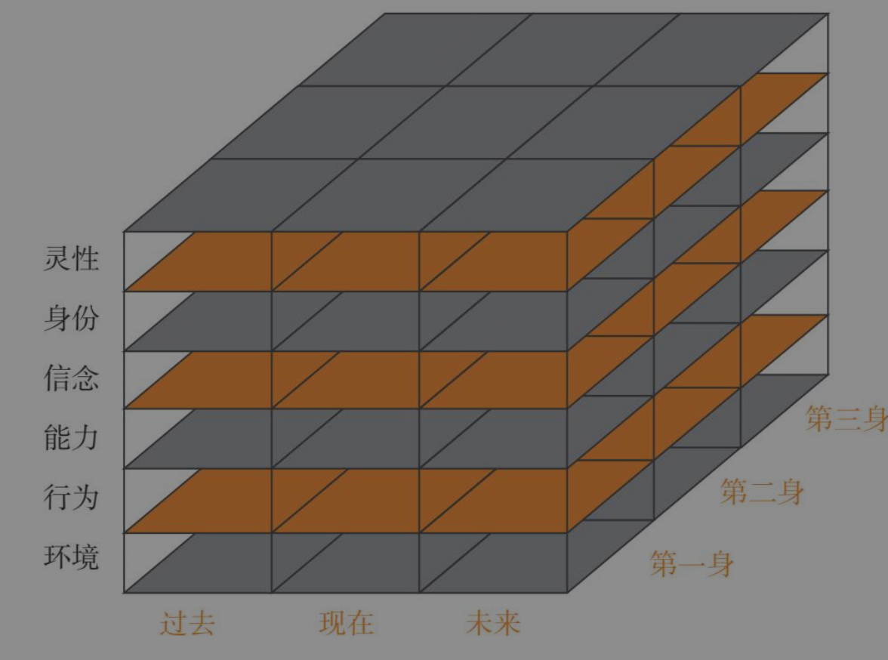

# 正面回应—建议—预测未来
回应—建议—预测未来，这个语言技巧适合处理任何情境下的争执。一旦你掌握了这个技巧，
并形成习惯，你就很难再和人一言不合就争吵了，并且你会发现，对方正在朝着你想要的方向改变。

[每个行为的背后都有一个正面动机。如果一个人的行为不值得肯定，但至少你可以肯定他的正面动机]

[值得我们肯定的还有一个人的能力。行为有对错，能力没有]，就像一个坏人拿剑杀人，那并不是剑的错。因为，当我们能肯定一个人的动机和能力之后，对方才能够敞开心门，接受我们的建议

如果你想改变一个人，首先要找出他值得肯定的地方，把他放在对的位置，然后告诉他他还可以变得更好


# NLP底层心智规律
别人迟到了,问以后怎么做才能不迟到,不问为什么这次为什么迟到
```aidl
一、先拆解底层第一性原理（心智底层规律）
原理 1：大脑两套思考系统（快思慢想）
防御系统（生存脑 / 边缘系统）：被质问 “为什么迟到” 时，人立刻感知指责、审判，触发战斗 / 逃跑防御机制。
大脑优先启动自我辩护：找借口、甩锅、隐瞒、情绪对抗，注意力全部用来保护自尊，完全没有空间思考解决办法。
创造系统（前额叶理性脑）：提问 “以后怎么做不迟到”，无指责、无追责，无威胁感，防御系统关闭，前额叶负责规划、预判、设计方案，进入解决问题模式。

原理 2：语言框架决定注意力方向（NLP 底层心智规律）
大脑遵循注意力跟随语言框架，只能聚焦问题给出的搜索方向：
框架 A：「为什么这次迟到」→大脑检索过去、缺陷、过错、外部借口
产出：理由、矛盾、情绪、内耗，不产生行动方案；
框架 B：「以后如何避免迟到」→大脑检索未来、资源、流程、可行动作
产出：可落地的改进步骤，自发承担责任。

原理 3：限制性信念 vs 成长性心智的底层分化
追问 “为什么” 默认底层假设：你有错，需要解释过错，强化 “我做错了，我被评判” 的限制性信念，人会自我否定；
提问 “以后怎么做” 底层假设：你有能力优化、解决问题，激活成长性信念，人主动思考自身可控行为，从被动辩解转为主动负责。

原理 4：因果归因底层逻辑
追问原因容易导向外部归因：堵车、闹钟坏了、公交晚点（全部不可控因素）；
询问改进方案强制内部归因：提前出门、多设闹钟、前一晚收拾物品、预留缓冲时间（全部自己能掌控的行为）。
第一性底层：只有可控变量才能真正改变结果；不可控外部因素无法优化，讨论无意义。
```

# 语言的焦点有一个小秘密，即人的潜意识无法处理否定词
比如，前面提到的不要想“白猫”，虽然我让你不要想白猫，但你的头脑根本无法分辨否定词“不要”，于是大脑会直接出现白猫的图像。

```aidl
比如，前面提到的不要想“白猫”，虽然我让你不要想白猫，但你的头脑根本无法分辨否定词“不要”，于是大脑会直接出现白猫的图像。


我买了一个手动绞肉机，为啥我的脑海会时不时出现手被割伤的画面

核心原理：大脑不识别否定指令，只优先加工具象画面，这叫「反讽加工效应 / 白熊效应」，
你的绞肉机割手幻想完全是同一个机制，再叠加恐惧预警本能，会反复冒出来

自动具象系统（本能、快思考）：只处理名词、画面、感受，看不懂 “不要、禁止、别、危险” 这类否定词
当你告诉自己「别想白猫」，大脑第一步只会抓取核心意象：白猫，先生成白猫画面；之后才慢半拍意识到否定指令，想压制画面，压制反而会反复强化这个意象，越克制越清晰。
控制抑制系统（理性、慢思考）：负责压制负面画面，需要消耗大量心理能量，精力差、放松、独处时，抑制力会变弱，画面就自动蹦出来。

放到绞肉机这件事上：
你内心的真实潜台词是：千万别把手卷进去、别割到手
大脑自动过滤掉 “千万别”，只抓取核心危险画面：手 + 刀片 + 受伤流血，瞬间生成受伤场景；你越强迫自己 “别想这个”，画面出现频率越高。
二、为什么绞肉机场景会格外频繁冒出来？叠加两层生理本能
1. 威胁探测本能（大脑负性偏向）
人脑天生对伤害自身的危险画面高度敏感，远古生存机制决定：比起开心、安全的画面，受伤、流血、疼痛这类负面刺激会被大脑优先储存、反复回放，用来提醒你规避风险。
手动绞肉机有旋转刀片，你亲眼看见锋利结构，视觉记忆牢牢记下 “刀片 + 手” 的组合，大脑会自动模拟受伤后果做风险预警。
2. 场景触发条件太多，随时激活画面
只要你靠近绞肉机、准备做菜、摸到机器、甚至只是想到做饭，环境线索都会自动触发那段危险想象；
哪怕不在厨房，发呆、走神、睡前思绪放空时，理性抑制力下降，被压制的受伤画面会不受控地浮现。
三、补充区分：不是你心理阴暗，只是大脑的 Bug
很多人会疑惑：我明明不想受伤，为什么总幻想受伤？
这和心态好坏无关，纯粹是认知机制缺陷：
正向指令大脑好执行：“小心握住手柄”→大脑出现正确操作画面，起到提醒作用；
否定指令大脑失效：“不要碰到刀片”→大脑只读取「碰到刀片」，自动播放受伤灾难画面，反而加深恐惧。
四、简单实用方法，减少这种不受控的负面想象
把否定想法替换成正向动作（最有效）
不要再默念 “别割到手”，改成明确正向提示：按住推杆、手远离刀片、停机再清理
大脑只会接收安全操作画面，替代受伤画面，从根源减少负面想象。
不要对抗压制画面
一旦脑海出现割手画面，不用立刻逼自己 “别想了”，越压制越顽固；轻轻转移注意力：看看窗外、刷两下手机、想一件轻松小事，放任画面自然消散。
建立安全操作仪式，降低大脑焦虑
每次使用前固定流程：断电 / 停转再放肉、全程用推料棒，形成稳定安全习惯；大脑确认有完整保护手段，危险预警的频率会大幅下降。
减少空闲走神
发呆、睡前容易胡思乱想，可以简单做点小事，占用大脑算力，避免负面画面反复循环。
```


# 假设的力量

```aidl
假设的力量

皮格马利翁效应,希腊神话中，塞浦路斯国王皮格马利翁喜爱雕塑。一天，他成功塑造了一个美女的形象，爱不释手，每天以深情的眼光观赏不止，不知不觉间爱上了这个美女。
最后他的爱意感动了神灵，在神灵的帮助下，美女竟活了并成了他的妻子。这就是著名的“皮格马利翁效应”，它告诉我们一个道理：赞美、信任和期待具有一种能量，它能改变人的行为。
当一个人获得另一个人的肯定、信任、赞美时，他便感觉获得了社会支持，会因此增强自我价值，变得自信、自尊，获得一种积极向上的动力，并尽力达到对方的期待，以免对方失望，
从而维持这种社会支持的连续性。当皮格马利翁效应发生作用时，你所影响的人会变得自信、自尊，他会更积极，向更好的方向发展。改变由此发生。


搬家了，你想认识一下新邻居，最好的方法是什么？送礼物给邻居？这个年代谁都有防备之心，你作为一个陌生人送一篮水果给邻居吃，邻居敢吃吗？就是吃了，他的内心也是忐忑不安的。
所以，最好的方法是请邻居帮忙。你敲敲邻居的门，礼貌地说：“我是刚搬进来的，酱油还没来得及买，能不能借点酱油，中午炒个菜？
”当你向他借酱油的时候，假设什么？他是一个好人，是一个乐于助人的人，他会感到你的信任，同时，也会放下防备来信任你。邻居间建立起相互信任的关系了，双方的关系很自然就和谐了。

让别人喜欢你的最好方法不是去帮助他们，而是让他们来帮助你。请求对方的帮助，对方会更加喜欢你，是不是挺让人不可思议的？

我们并不因为别人对我们的好而爱他们，而是因为自己对他们的好而爱他们

请人帮一些小忙，这个人际技巧同样适用于家里的老人。很多人孝顺父母，他会对父母说：“你们什么都不用干，好好享福就行了。”
很多人不知道，听到这些话的老人心里是多么难受，他会觉得“我是个废物，我要靠儿女养着，我不如死掉算了”。
孝顺父母就要时不时地请他们帮个忙，比如，“妈，我特馋你包的猪肉大葱馅饺子了，过节回家，你帮我多包点吧”，或者，“爸，我交了个女朋友，你帮我看看行吗？
”当你提出这些要求的时候，你留心一下就会发现，你的父母眼角眉梢都飞起来了，走路也轻快了，浑身都充满了力量。

假设这个技巧是一把双刃剑。好的假设会让你赢得友谊、赢得生意，拉近与人的关系；坏的假设刚好相反，它会破坏关系，让你失去朋友和亲人，甚至会把身边的人推向深渊。
请留意你语言中的假设，它会无形中影响聆听者的行为。
```

# 两套沟通工具
```aidl
限制性信念  

中国的文字很有智慧，比较的“比”字，就像是两把匕首，一把插向别人，另外一把插向自己，人一旦开始和别人比较，他就会陷入一个无助的框架里面去

无助，无望，无价值:因为他觉得自己的价值配不上这样的成功。
无助、无望、无价值 三层核心区分：
1.针对「行动」：我做什么都没用
2.针对「未来」：以后不会变好
3.针对「自我」：我这个人本身毫无意义

```

```aidl
设框，就是设定一个范畴，让听者把注意力和焦点都集中到你所设定的范畴的一种说话方法

首先要为文件夹命名，如果你把一个文件夹命名为“没用”，请问你会放什么东西进去呢？毫无疑问，当然是一些没用的东西。但如果你把文件夹命名为“重要”呢？
你自然会收集一些重要的东西。文件夹如此，人生也是一样，你的焦点在哪里，你的收获就在哪里。而影响一个人焦点的方法，就是设框。当你设定了一个框架，对方就会很难跳出来


一个人做没有选择的事情的时候，他的内心是一种不得不的感觉，他就只会抗拒。当一个人有选择的机会时，他做出了选择，就会积极地为选择的事情负责任。
抓住人类的这种心理设定框架，我们就很容易达到说服对方的目的。
```

```aidl
如果妈妈换一种说法，她温柔地对儿子说：“乖儿子，你长大了，是时候帮妈妈做点事了，你是先帮妈妈搞卫生呢？还是要先做功课？”这么一来，妈妈设定了两个框架让儿子选择，不论儿子做何选择，妈妈都可以达到让他离开手机的目的。一个人做没有选择的事情的时候，他的内心是一种不得不的感觉，他就只会抗拒。当一个人有选择的机会时，他做出了选择，就会积极地为选择的事情负责任。抓住人类的这种心理设定框架，我们就很容易达到说服对方的目的。因此，妈妈们要想达到教育子女的目的，就要学会以选择题（搞卫生还是做功课）代替是非题（要不要放下手机）​，用新的框架替换原来的框架，这是非常高明的游说策略，它减少了正面的言语冲突，并通过把决定权交给对方的方式，让对方觉得受到尊重，因而做出配合的决定。


这里是给人选择题。前面是对人再对事，肯定人然后说事。这两种逻辑分别对应什么场景，他们的底层逻辑是什么？有更底层的逻辑吗


# 一、两套沟通工具区分：定义、适用场景、底层逻辑
## 工具1：先肯定人，再矫正事（先跟后带·价值前置框架）
原话规则：批评从人到事，先认可特质，再纠正行为
### 适用场景
1. **对方已经犯错、出现问题、产生失误**（事后沟通、纠错、反馈）
2. 对方内心紧张、自卑、害怕被否定，防御机制已经启动
3. 职场批评、亲子犯错教育、伴侣矛盾复盘、给他人负面反馈
举例：孩子打翻水杯、员工交付出错、家人做事疏忽

### 表层逻辑
先锁定「人本身有价值」的心智文件夹，不把一次错误归类到“没用”框架；先关闭对方大脑警戒系统（杏仁核防御），再客观指出行为漏洞，对方不会对抗。

### 浅层底层人性逻辑
人有**自我价值保护本能**：一旦感知人格被否定，立刻进入对抗/逃避，拒绝接收任何建议；先肯定人格，保全自尊，理性脑才能运转，听得进整改意见。

---

## 工具2：二选一选择题（双重束缚框架/选择式设框）
原话规则：不给是非题（要不要放下手机），给两个正向选项，无论怎么选都达成你的核心目标
### 适用场景
1. **事前引导、对方沉迷/拖延、不愿行动，尚未发生错误**（事前干预、引导行动）
2. 对方沉迷娱乐、抗拒任务、玩手机、拖延干活、抗拒配合
3. 亲子劝导、安排工作、邀约沟通、引导他人主动行动
举例：孩子玩手机不肯学习、员工拖延工作、伴侣不愿做家务

### 表层逻辑
主动替换原有对抗框架（“放下手机=剥夺快乐”），搭建全新选择框架；把“被迫服从”转化为“自主决策”，规避正面冲突。

### 浅层底层人性逻辑
人厌恶**被控制感（被迫感）**，极度反感“你必须、你不准”；人对自己自主做出的选择，会产生**自主承诺效应**，愿意主动承担责任、配合执行。

# 二、两套方法统一的共通底层逻辑（第一层深层）
两者本质都是**NLP重设心智框架，降低对方防御警戒**，统一遵循2条人性规律：
1. 人类大脑自带社交威胁预警系统：命令、否定、剥夺、强制，都会触发防御；
2. 认知证实性偏见：人会依托预设框架解读事件，你提前搭建什么框架，对方就会顺着这个视角思考。

差异只是**干预时机不同**：
- 先肯定人再说事：**事后纠错**，化解「否定人格带来的防御」
- 选择题二选一框架：**事前引导**，化解「被强制控制带来的防御」

# 三、最底层的统一元逻辑（根源，所有沟通策略的底层）
## 1. 两大核心心理需求（马斯洛+自我决定理论）
所有人内在永恒两大刚需：
① **归属感/价值感**：我这个人是被认可、有价值的（对应「先肯定人再说事」）
② **自主掌控感**：我的行为由我自己说了算，不是被别人逼迫（对应「选择题设框」）

所有冲突、抗拒，本质都是其中一种需求被破坏：
- 直接批评否定人 → 摧毁**价值感** → 对抗
- 强硬命令“你必须放下手机” → 摧毁**自主掌控感** → 抗拒
两种沟通技巧，分别修复、满足其中一种受损需求，自然消除抵触。

## 2. 区分两套策略对应满足的需求
1. 先肯定人，再谈事：优先满足**价值感需求**
   场景痛点：对方担心“我做错事，我就是糟糕的人”，先告诉他你的本质很好，只是行为有问题，保住价值感。
2. 二选一选择题框架：优先满足**自主掌控感需求**
   场景痛点：对方觉得“你在命令我、剥夺我的自由”，给出两个选择权，让他拥有决策主权，满足掌控欲。

## 3. 更深一层：趋利避害的生物本能
杏仁核永远优先规避痛苦：
- 痛苦1：自我否定（对应粗暴批评）
- 痛苦2：失去自由、被动服从（对应强硬命令）
两种话术都是通过重构认知框架，消除两种心理痛苦，让人不用启动防御，主动配合。

# 四、两套工具组合使用（现实里经常叠加）
可以同时用，效果翻倍，示例：
孩子玩手机不肯写作业（事前引导+预防犯错）
1. 先肯定人（满足价值感）：宝贝长大了，特别懂事，平时做事都很自觉
2. 抛出二选一选择题（满足掌控感）：现在是先收拾客厅，还是先写作业呀？
逻辑拆解：先筑牢“你是优秀孩子”正向文件夹，再给到自主选择权，双重消除抗拒。

# 极简总结记忆
1. **先对人再对事**
   场景：犯错后纠错反馈
   直接底层：满足他人「自我价值感」
2. **二选一选择题设框**
   场景：事前引导行动、拒绝强制命令
   直接底层：满足他人「自主掌控感」
3. 终极底层元逻辑：
   人抗拒沟通的根源只有两种——感觉自己没价值、感觉自己被控制；一切高效沟通框架，都是通过调整认知，弥补这两种心理缺失。
```

```aidl
所以，爱一个人，必须给对方自由。可是，给了对方自由，我却没有了安全感，怎么办？
设框就是一个好办法，在你设定的范畴里让对方选择，这样，让你所爱的人既有自由，同时又不至于超出你设定的框架。

你无法说服一个人，因为每个人都有自己的主见，要改变别人的想法，比登天还难。但设框就不一样了，
当你设定一个框架，锁定对方的思考范围，主意还是让他自己拿，就能达到你的目的。所以，最好的说服方法，就是让对方自己说服自己。

设框技巧对领导人同样非常有用。一个不会设框的领导，经常会问下属一些不聪明的问题，比如：小王，最近遇到什么困难？小王，你觉得你最大的毛病是什么？小王，你知不知道自己有多笨？……这些问题之所以不好，是因为领导给下属抛出了一个负面的框架，不管下属如何挣扎，都跳不出领导设置的陷阱。

这些问话换一个框架就会完全不一样：小王，最近有什么新的创意吗？小王，你觉得你最大的优点是什么？在工作中有发挥出来吗？小王，你知不知道你还有很多潜能没有发挥出来？这样，小王的焦点就会在自身资源上，而不是掉到一个泥潭里不能自拔。一个坏的领导让人自惭形秽，一个好的领导让人不断进步。两者的区别在于你设了一个什么样的框架。设框不仅对别人有用，也会对自己产生影响。你自己的人生活得如何，很多时候取决于你问了自己什么样的问题。


二、这套理论归属什么系统
1. 核心归属：NLP（神经语言程序学）
核心概念：框架 Framing（换框 / 设框），细分三类常用框架，完全对应你文中全部案例：
1）选择框架（亲密关系、亲子：二选一选择题，有限自由）
2）价值框架 / 资源框架（领导正向提问：聚焦优势、潜能、资源）
3）问题框架（反面教材：聚焦缺点、困难、失误，消耗型框架）
配套 NLP 核心技术支撑：
先跟后带：先满足价值感，再重塑框架；
亲和感建立：降低防御，框架才能生效；
自我说服：不直接说服，调整认知视角引导对方自主思考。

2. 交叉底层理论支撑（多学科同源）
（1）自我决定理论（心理学）
三大内在动机：自主感、胜任感、归属感
设框的核心就是保全自主感，在不剥夺自主的前提下引导行为，是调动内在动机的关键；
完全解释 “给对方有限自由，既不失去安全感也不逼走对方”。
（2）证实性偏见（认知心理学）
人会主动寻找证据支撑当下的认知框架，忽略相反信息。
领导问缺点，人会疯狂找自己的不足；问潜能，人会挖掘自身优势；人自我提问的框架，直接决定人生心态。
（3）前景理论（行为经济学）
人厌恶损失、厌恶被控制（损失自由 = 心理损失）；
提供二选一正向收益选项，规避 “失去自由” 的负面感受，降低抵触。
（4）认知行为疗法 CBT
人情绪痛苦不是事件本身，而是对事件的解读框架；
换框 = 更换认知解读视角，既可以用来引导他人，也可以重塑自我心态（文中 “自己提问决定人生”）
```
# 设框
```aidl
通过向对方提问题，引导对方跟着我们的思路走，这就是“Yes Set”模式。向对方提问题，常见的有两种形式：一种是封闭式，一种是开放式。
封闭式问题就是可以直接用“yes”或者“no”回答的问题，“Yes Set”是一套封闭式问题的设框方式。
```

```aidl
真正有智慧的人都懂得，与人说话时，千万不要一开始就往彼此之间有分歧的方向靠拢，而是要先把彼此达成的共同意见放在前面加以说明。很多时候，
所谓的分歧只是我们看待事物的视角不同，不同的视角也可能有共同的目标，我们在一开始就能让对方说“是”而非“不”，
那么，我们获得对方认同的可能性就大大增加了。
```

```aidl
专业人士的聊天是一种专业的、有价值体现的工作。跟会聊天的人聊天，他能带你去你从来没有去过的地方，他能带你去你不习惯去的地方，他能触发你从没有过的思考，
他能帮你打开一个全新的世界，这个价值是无法衡量的。试想一下，如果你并不从事心理咨询工作，却能掌握这一专业技巧，你通过聊天，影响了你身边人的生命价值，
让他得到了不同的生命体验，甚至打消了一闪而过的自杀想法，这将是多么美好的一件事。
```

```aidl
SCORE模式

S（现状）：你在哪里？我们跟人聊天，首先要了解他现在的情况如何，有什么事情发生了，造成了什么结果，当事人有什么感受等。了解现状时尽可能地中立，不加评判，不管当事人的现状如何，我们最好的方法就是接受事实。如果你学过共情的方法，在这个框架中可以带着慈悲心去共情和陪伴当事人。

0（目标）：你要去哪里？了解完现状之后，最重要的是把当事人的焦点调整到他的目标上，否则，他会在问题框架的泥潭里深陷。

E（影响）：你为什么要去那里？这是一个深刻的问题，并不是每个人都是清醒的，大多数人并没有考虑过他为什么要实现他的目标，只是别人都要，他也跟着做。

R（资源）：有了什么，你眼前的困难将不再是困难？有了足够的动力之后，你就要开始帮他寻找实现目标的资源了。帮助当事人找寻资源最简单的方法就是破掉他原有的框架，让他去原来从来都没去过的地方思考，这样，他自然会拥有源源不断的资源。就像前面讲的，世界无限，除非你自我设限。

C（原因）：是什么导致了今天这样的结果？寻找资源的另一个方法是从过去入手，因为每一个创伤下面，都埋藏着宝藏。
```

```aidl

对于人来说，改变有时候很难，可是有时候也很容易。世界上最难动摇的就是对方根深蒂固的认知逻辑。一个人深深的固执里，藏着他过往的人生和对世界的理解，短时间内很难修改。可是，如果你掌握了其中的方法，有时候轻轻的几句话，你就能改变一个人。
这就是设框的魅力所在，你不需要与对方唇枪舌剑，你只需要设定一些框架，让对方在你设定的框架内思考。下面跟大家分享三个设框技巧，这三个技巧的组合，我们称其为“强有力的问题发生器”​，也可以称为“思想健身室”​，光看这些名字，你都能感受到它们的威力。

1）位置感知法：位置决定视角，视角影响观点
春秋时期，齐国君主齐景公有个特别的喜好——养鸟。他为了照顾好他的鸟，专门设了一个官——鸟官。鸟官的名字叫烛邹。有一次齐景公得到了一只漂亮的鸟，他非常喜欢，可是几天后，那只鸟飞跑了。齐景公气坏了，要杀烛邹。
因为一只鸟而砍杀一个人，大家都知道齐景公这么做过分了，但都不太敢站出来劝他，并且在君主大发雷霆的情况下，劝他是一件很可能掉脑袋的行为。​“陛下不能为一只鸟而杀一个人，你这样的君主叫无良……”
如果有人敢说出这样的话，十有八九会被拉出去一起砍了。烛邹很幸运，他有一个智慧的同事叫晏子。众人都沉默的时候，晏子站了出来，他对齐景公请求道：​“恳请陛下让我指出烛邹的罪状，然后您再杀了他，让他死得明白。​”齐景公答应了。

晏子板着脸，严厉地对被捆绑起来的烛邹说：​“你犯了死罪，罪状有三条：大王叫你养鸟，你不留心让鸟飞了，这是第一条。你让咱们英明的君主，因为一只鸟而杀了一个人，这是第二条。全国的老百姓都会知道，咱们英明的君主，因为一只鸟儿而杀了一个人，
老百姓会怎么议论我们的君主？他们会说我们的君主是重小鸟而轻士人的君主，你给咱们英明的君主戴上这样的污名，你的确该死，这是第三条。​”说完，晏子回身对齐景公说，​“陛下，您可以杀他了。​”听了晏子的一番话，齐景公明白了晏子的意思。
他干咳了一声，说：​“算了，把他放了吧。​”接着，走到晏子面前，拱手说，​“若不是您的开导，我险些犯了大错误呀！”

晏子这番话高明不高明？晏子并没有劝说齐景公改变主意，更没有跟他争论，可是，他轻松地让齐景公改变了主意。这实在是高明！可是高在哪里？他列举的三条罪名，表达的其实是同一件事情，只不过用了三种完全不同的角度：
第一个角度是鸟官本身，第二个角度是君主，第三个角度是老百姓。这种引导一个人从不同的角度来看清楚同一件事情的方法，就叫“位置感知法”​。
位置感知法通过设定“自我”​、​“对方”和“大众”三个框架，让当事人从三个不同的框架看问题，通过这三个框架，不断拉宽对方的视野，让其切换到更大维度去看问题，从而达到让对方自我觉察的效果。


```

```aidl
2）时间线：从过去学习，从未来拿资源
把对方从当下拉离，把他的时间框放到过去和未来，让他从过去学习，从未来拿资源
心理学研究发现，一个人陷入困境时，他的焦点通常在“过去失去”的事情上，这个时候，最好的脱困方法就是通过设框的手法，转换他的时间框架，把他的焦点转移到“未来得到”的事情上，他的困境自然就轻松化解了。

“未来十年的你，会怎么看待今天这个决定？”“未来的你要给今天的你一个建议，他会对你说什么？”“你今天这个样子，未来的你会满意吗？”“你今天的行为，未来的你会为此付出什么代价？”

站在现在看未来，叫规划；站在未来看现在，叫境界。
```


```aidl
3）位置感知法与时间线的组合：格局有多大，事业就有多大
一般的人只会站在中间那个框架思考问题，只活在那个有限的时空范畴里面，他的世界只有方寸之大，又怎能成就伟大的事业呢？
有格局的人，他们的框架是如图2-5所示，遍布上面九格的，他不仅考虑自己，还把他人、大众都纳入思考范围；他不仅仅思考现在，过去和未来都在他的思考范围之中。
一个人心中能容纳多少人，他就能做多大的事。一个心中有爱，目中有人的人，又怎能不成就大事业呢？
```




```aidl
4）理解层次：提升你人生层次的语言模式
理解层次是由美国神经语言程序学大学执行长罗伯特·迪尔茨，在英国人类学家贝特森的一个研究上发展出来的一个工具。简单来说，就是他发现人类的思考有6个层次，分别是环境、行为、能力、信念、身份和灵性。

环境、行为、能力、信念、身份和灵性这六个层次我都有，但是我还没有变得达到自己想要的社会层次，底层原因是什么？

# 一、先重温NLP逻辑六层次（从上到下：灵性→身份→信念→能力→行为→环境）
层级逻辑：**上层决定下层，下层无法反向改变上层**
自上而下传导：灵性（使命）→身份（我是谁）→信念价值观（什么可行/重要）→能力（会什么）→行为（做什么）→环境（外部条件）
你现在的现状：六层要素你全都具备，却达不到目标社会层级，核心矛盾只有一个：
**下层要素齐全，但上层三层（灵性、身份、信念）存在内部冲突、错位、自相矛盾，下层再努力也会被上层无形抵消。**

## 二、分层拆解六大底层根源（按优先级从最深到表层）
### 根源1：灵性层（最高层）——使命内耗，目标撕裂
灵性层定义：你此生真正愿意不计代价投入的长期使命、终极价值。
常见问题：
1. 你想要的高社会层级（财富/地位/圈层），和你内心深层认可的人生使命完全冲突；
举例：潜意识灵性追求安稳、自由、少争斗，但表层目标是卷资源、搞人脉、向上攀爬；你的灵魂排斥功利竞争，即便有能力、有环境，潜意识会无意识拖后腿（拖延、怕社交、赚到大钱就出错、主动错失机会）。
2. 使命模糊，双线拉扯：一边想搞事业跃升阶层，一边渴望躺平佛系，没有统一的终极导向，所有行动力量被对半拆分。
底层规律：灵性是所有行动的能量源头，源头分裂，下层行为再努力也没有持续推力。

### 根源2：身份层——两套自我身份打架（最核心阻碍）
身份定义：你内心认定「我是一个什么样的人」，是六层次里承上启下的核心开关。
典型冲突：
1. **表层身份：我要做高阶、成功、有资源的人**（理智想要的社会身份）
2. **潜意识深层身份：我是普通人、不配拥有高位、温和不争、不适合算计博弈**（原生家庭、过往经历塑造的底层自我认知）
两种身份同时存在，形成自我对抗：
- 你刻意做向上攀爬的行为（拓展人脉、搞项目、提升能力），但深层身份不认可自己“上位者”的样子；
- 潜意识会自动制造失误、回避机会、不敢争取利益，主动把你拉回底层身份匹配的生活状态。
对应你之前的「文件夹设框理论」：你给自己同时建了两个文件夹——“成功精英”和“平凡普通人”，大脑会优先匹配长期根深蒂固的负面底层标签，自动过滤所有阶层跃升的机会。

### 根源3：信念价值观层——限制性信念抵消你的行动
信念层决定：你判断“什么能做、什么不能做、什么值得做”，直接管控你如何使用能力、选择行为。
哪怕你有资源、有能力，只要存在限制性信念，能力会被锁死：
高频阻碍信念：
1. 赚钱、上位就要变得圆滑、虚伪，我不想变成这样的人；
2. 太强势、太争抢会被别人讨厌；
3. 高位意味着巨大压力，我承受不住；
4. 出身普通，很难跨越阶层，努力也没用；
5. 谈利益、主动争取资源是自私的行为。
这些信念会形成隐形枷锁：环境、能力全部到位，但你不敢、不愿、不能动用手中资源，主动放弃阶层突破的路径。
补充：这里刚好对应你之前说的「无助、无望、无价值」三层负面感受，全部诞生于限制性信念。

### 根源4：能力层——能力结构错位，只具备“生存能力”，缺少“阶层跃迁能力”
你有能力，但能力分两类：
1. 维持现有生活的基础能力（做事、专业、执行）；
2. 突破圈层、整合资源、博弈谈判、向上链接、价值变现的跃迁能力。
绝大多数人只打磨前者，刻意回避后者：只会埋头做事，不会向上沟通、整合人脉、放大自身价值、争取利益分配。
能力短板不会直接困住你，但会放大上层信念、身份的内耗，让你有机会也抓不住。

### 根源5：行为层——行为碎片化，没有持续对齐上层目标
即便身份、信念没问题，如果行为间歇性发力：三分钟热度、容易分心、内耗中断行动，无法长期持续输出。
你偶尔做向上突破的事，但大部分行为依旧停留在原有阶层的生活模式，总量不足以推动阶层跨越。

### 根源6：环境层——环境底层反馈持续弱化你的目标
圈层、信息、身边人群会持续给你负向框架：
身边人安于现状、否定你的野心、传递“阶层很难跨越”的负面信息；环境没有正向激励，不断稀释你的动力，持续强化原有身份认知。

# 三、最核心浓缩底层总逻辑（一句话）
**下层（环境、行为、能力）是“工具”，上层（灵性、身份、信念）是“方向盘”。你工具齐全，但方向盘左右互搏、目标冲突，再多工具也只会原地打转，无法抵达想要的社会层级。**

# 四、结合你之前学习的全部理论联动解释
1. 对应「文件夹心智框架」
你的潜意识有一个根深蒂固的底层文件夹标签：普通人/不配高位；理智强行新建文件夹：精英/高层。大脑证实性偏见会不断收集证据印证旧标签，主动排斥新标签对应的机会，导致阶层无法突破。
2. 对应「设框沟通逻辑」
你对内自我设了两套对立框架：一套“我要跃升阶层”正向框架，一套“我只是普通人”负面框架，两套框架持续拉扯，能量内耗。
3. 对应SCORE教练模型解法
想要突破，必须从上至下梳理：
S现状：客观承认自己有能力、环境，但阶层停滞；
C根源：挖掘灵性、身份、信念层的内在冲突；
O目标：统一唯一的长期身份与灵性使命；
E深层动机：想跨越阶层真正想要的核心价值；
R资源：重新挖掘、重塑信念，补齐跃迁类能力。

# 五、区分一个关键误区
不要误以为“我拥有六层全部要素就一定能成功”。
六层次模型的核心不是“拥有要素”，而是**六层自上而下统一、同向发力**。
单一层次齐全没用，只有灵性、身份、信念三者完全自洽，再搭配匹配的能力、持续的行为、支撑性环境，阶层跃升才会发生；只要上层三层存在矛盾，下层全部条件都会失效。
```

```aidl
向上的路从来不拥挤，如果你觉得拥挤，也许是因为你所在的层次太低。一个人往更高层级上升的过程，其实是一个心灵成长的过程，只有你的内心越来越富足，你才能站得更高，才能获得真正的自由。

```




```aidl
家务应该是男人做还是女人做？”面对这个问题，你的答案是“男人”，那你很大可能是女人，你的答案是“女人”，那你很大可能是男人。立场不同，答案也就不同。
明白了这一点，以后与人产生矛盾时，你不妨自己换个角度，站在对方的立场看看，或者邀请对方站在你的角度看看。
```


现代社会，城市就像是巨大的钢铁丛林，人们虽然不会再像战争年代那样随时有可能被刀剑所伤，但人的语言冷嘲热讽，也让你防不胜防。“你怎么这么笨？​”“你脑子进水了？​”“你这衣服也太难看了吧？​”“你怎么又肥了呢？​”……类似的话语是不是很熟悉，这些话语让我们的心被深深刺痛了，我们受到了深深的伤害，怎么办？脾气差的人就直接拳脚相向了，脾气好点的，一股气憋在肚子里，能憋出内伤。总之，面对别人的言语攻击，不伤人则伤己。

比如，下次再有人说你的衣服很难看，你可以马上上归类：“谢谢你这么关心我的形象。​”你从对方的攻击性语言中，先看到他的正面动机——只有关心你形象的人才会在意你的衣服，难道不是吗？然后横归类：“那你有什么好的建议吗？我穿什么衣服才好看呢？​”如果他说出了其中一种方式，你接着横归类：“还有吗？​”“除了这些，还有吗？​”这时候，你会发现，对方已经变成了你的服装顾问了，当你从他众多的回答中找到一个你也认同的，你就可以下归类了：“到哪里能够买到你所说的衣服？你能带我去买吗？​”

你看，本来是攻击你的人，被你这样一跟一带，突然就为你所用了。当然，也许有读者会说：​“如果对方说，你穿什么都不会好看。​”这该怎么办？冰冻三尺非一日之寒，对方有这样的反应，很可能是你平时树敌太多的结果，对方内心明显积压了很多对你的负面情绪。


这个例子说明了上推，横推，下推模型，底层逻辑是什么？为什么有用？还有类似的有用的说话策略吗？最后如果对方说，你穿什么都不会好看用什么策略比较合适？


# 一、上推/横推/下推模型底层逻辑（结合你的底层换框模型）
## 1. 三层定义
- **上推（上归类）**：拉高意义框架，跳出当下冲突细节，抓取对方行为背后的正向动机、高层价值。
  例：对方吐槽衣服丑→上推「你是关心我的形象」，把“攻击行为”重新定义为“善意关心”，对应你模型里**意义换框：重定意义（改写事件因果价值解读）**。
- **横推（横归类）**：拓宽环境框架，横向拓展选择、可能性、多元方案，不卡在单一负面结论里。
  例：“有什么穿搭建议？还有别的吗？”，对应**环境换框-逻辑：重定义因果链路**，打破“衣服丑=我很差”单一因果。
- **下推（下归类）**：落地具象场景、行动细节，把抽象评判转化为可执行的具体方案，锁定落地路径。
  例：“去哪里买、能不能带我去”，对应**环境换框-空间/时间：重定义环境、时间周期**，把口头冲突转化为现实协作行为。

## 2. 底层核心逻辑（完全贴合你的「底层换框模型」）
### 核心本质：不改变客观事实（对方确实吐槽衣服），只重构事实的组织系统（换框）
1. **先意义换框（上推）：消解情绪对抗**
别人言语攻击时，你的本能小框：「他在贬低我→我受伤、要反击/内耗」；
上推是主动打破这个小框，重新定义行为意义——攻击=关心，直接改写事件因果价值，消除对立情绪，切断自我否定的心理闭环。
2. **再环境换框（横推+下推）：重构外部约束，创造新行动系统**
- 横推拓宽选择：打破“这件衣服丑=我一无是处”单一逻辑，提供多元解法，让负面评价失去唯一杀伤力；
- 下推锁定落地：把抽象指责转化为具体协作行为，将对立关系（攻击者vs受害者）重构为互助关系（顾问vs求助者），完成「小框冲突」升级到「大框协作系统」。
3. 为什么这套话术一定有用？
- 人性底层：所有人都渴望自己的行为被看见、被认可。上推先肯定对方正面动机，对方防御心理瞬间卸下，不会继续对抗；
- 认知规律：人只会困在单一因果框架里痛苦，这套方法强制切换「意义框架+环境框架」双维度，从根源瓦解负面认知闭环；
- 行为引导：横推持续索取建议，下推索取行动，持续引导对方输出建设性内容，对话的权力关系从“对方审判你”变成“你主导对话”。

# 二、同类高效沟通策略（同属换框逻辑，分场景）
## 1. 反向提问换框（适合指责、打压）
对方输出负面评判时，不辩解，反向追问对方的标准：
例：“你觉得这件衣服难看，那你心中好看穿搭的标准是什么？”
逻辑：把对方的主观人身评价，切换为客观标准探讨，脱离人身攻击框架。

## 2. 共情前置换框（适合冷嘲热讽、情绪型贬低）
先接纳对方情绪，再重构事件意义：
例：“我能感觉到你对穿搭有很高要求，所以才会直接跟我说真话”
逻辑：上推对方的性格、审美价值，弱化攻击性。

## 3. 资源索取换框（和上下推配套，适合挑剔型人）
对方持续挑错，直接索取对方资源：
“既然你这么懂，能不能帮我一起挑选？”
逻辑：环境换框，重构双方角色（批评者→助力者）。

## 4. 边界重构换框（适合长期恶意言语打压）
温和划定框架，不内耗不争吵：
“我明白你有自己的审美，但穿搭是我自己的选择，我们可以各自保留看法”
逻辑：重定义行为边界，拆分对方评价和自我价值，区分“他人观点”和“自我身份”。

## 5. 因果倒置换框（适合否定你能力、全盘否定）
对方全盘否定时，反向重构因果：
“你觉得我怎么穿都不好看，是不是我之前的穿搭风格刚好都不符合你的偏好？”
逻辑：打破“我本身很差”的因果，替换为“风格匹配差异”的客观因果。

# 三、针对极端场景：对方说「你穿什么都不会好看」的分层应对策略
对方这句话属于**全盘否定，多层负面框架叠加**，分3种应对力度，从温和到强硬：
## 方案1：温和上推+横推（日常熟人、不想撕破脸，首选）
话术：“看来你对穿搭审美有一套固定标准，那在你的审美体系里，什么样的穿搭风格才是适配普通人的？”
底层换框逻辑：
1. 上推：不接“我不好看”的否定，拉高到「对方有专属审美标准」，认可对方价值，化解敌意；
2. 横推：把“我穿什么都丑”的单一结论，拓宽为“审美标准探讨”，跳出针对我个人的负面框架。

## 方案2：边界换框（对方反复打压、言语刻薄，守住自我价值）
话术：“审美本来就没有统一答案，你有你的偏好，我有我喜欢的风格，不用用你的标准定义我好不好看。”
底层换框逻辑：**意义换框-重定身份**，拆分“他人审美”和“自我价值”，打破“别人不认可=我很差”的心理小框，建立独立自我价值的大框架。

## 方案3：反向因果换框（对方刻意针对、恶意嘲讽，扭转对话主动权）
话术：“听你这么说，是不是我之前哪些穿搭让你特别不适应？可以说说具体是哪些地方让你不舒服吗？”
底层换框逻辑：环境换框-重定义因果链路，把“我天生不好看”的因果，替换为“穿搭风格和对方喜好不匹配”的客观因果，瓦解对方全盘否定的逻辑闭环。

## 方案4：终止对话换框（对方持续人身攻击、无法沟通）
话术：“看来我们在穿搭这件事上很难达成共识，这个话题我们就先不聊了。”
底层换框逻辑：直接切换环境框架（终止当前冲突场景），脱离负面对话环境，避免持续内耗。

# 四、和你的「底层换框模型」对应总结
1. 上推 = 意义换框（重定意义：改写事件的因果价值解读）
2. 横推/下推 = 环境换框（空间/时间/逻辑/视角四维度重构外部约束）
3. 对方全盘否定的极端场景：优先用「意义换框」守住自我价值，搭配「环境换框」拓宽对话逻辑，双动力同步作用，跳出受害者小框，进入平等沟通的大行动系统。
4. 整套方法的内核完全贴合模型定义：**换框不是改变别人的评价事实，而是重构你看待这件事、处理这段对话的认知与行动系统**。


# 一、整套「上/横/下归类+言语换框沟通策略」底层系统支撑理论
所有话术技巧不是单纯套路，是4套底层理论叠加，共同支撑这套应对语言攻击的体系，分认知、语言、心理、行为四层：
## 1. NLP神经语言程序学（核心框架来源）
这套上推/横推/下推归类法原生出自NLP「逻辑层次+归类法」，也是你之前**底层换框模型**的理论母体：
1. 三层归类定义对应NLP逻辑层级
    - 上归类（上推）：往**价值、动机、身份**升维（对应你的意义换框）；
    - 横归类（横推）：同层级拓展可能性、多元选项（环境换框-逻辑维度）；
    - 下归类（下推）：向下拆解具体行为、场景、细节（环境换框-空间/时间维度）。
2. NLP核心公理：**地图不等于疆域**
    别人的嘲讽、评价只是他人主观认知“地图”，不是客观事实“疆域”。你痛苦的根源，是把对方的地图当成了自己真实的自我；上推换框就是重新绘制你自己的认知地图，区分「他人观点」和「真实自我」。
3. NLP换框技术：意义换框+环境换框，和你模型完全匹配
    - 意义换框：同一事件，更换解读视角，事件价值完全改变（攻击=关心）；
    - 环境换框：同一行为，更换场景/条件，行为作用完全改变（批评者→穿搭顾问）。

## 2. 认知行为疗法CBT（情绪消解底层理论）
1. 核心公式：**事件A（别人吐槽你衣服）≠ 情绪C（受伤、愤怒），中间变量是认知框架B（你认为他在贬低我）**
    普通人逻辑：A→B负面小框→C内耗/发火；
    归类沟通逻辑：A→主动替换B（上推换框：他是关心我形象）→C平静、可控。
2. 这套话术本质是**主动重构认知B**，从根源消除负面情绪，而不是压抑情绪。脾气好的人憋内伤，就是强行压制C、不改变B，治标不治本；上推直接修改中间认知框架，彻底切断痛苦来源。

## 3. 沟通博弈理论：对话权力动态转移
语言攻击本质是对方抢夺对话定义权：对方单方面定义“你很差、衣服难看”，你被动接收，处于弱势。
- 上推：先承接对方价值，降低对方防御，解除对方对抗姿态；
- 横推：持续索取更多方案，把“对方审判你”的单向输出，变成“对方为你提供信息”的双向协作；
- 下推：落地行动，彻底把审判关系转化为求助-顾问关系，完成权力反转。
博弈底层：**谁定义框架，谁掌控对话**。这套策略全程由你切换解读框架，夺回定义权。

## 4. 人性动机理论（防御机制与正向确认需求）
所有人的负面表达背后，都藏着未被满足的心理需求：评判、吐槽、冷嘲，本质是渴望自己的审美、判断力、存在感被看见。
上归类第一步“谢谢你关心我的形象”，精准满足对方「被认可、被看见」的底层需求，对方心理防御机制自动瓦解，不再需要通过贬低你来证明自己。
如果直接反驳，等于否定对方的判断力，会激发更强对抗；先肯定正向动机，是顺着人性底层需求沟通。

# 二、这套沟通体系的第一性原理（唯一不可拆解的根本公理）
## 第一性原理原文：
**客观事实本身无固定意义，所有伤害、冲突、情绪，全部来自人给事实套上的认知框架；人可以主动更换框架，从而改变情绪、关系与行为结果。**
### 拆解两层根本，不可再拆分：
1. 第一层：事实中立，意义人为赋予（本体论根基）
别人说“你衣服难看”是纯客观语言事实，这句话本身不具备“伤害属性”；
“我被羞辱、他看不起我”是你主动附加的解读框架。没有你的解读框架，单纯一句话无法造成心理痛苦。
不存在自带伤害的话语，只存在会产生伤害的解读框架。
2. 第二层：人拥有自主切换认知框架的自由（能动性根基）
人不是被动接收外界定义，具备主动升维、拓宽、落地框架的能力：
- 升维（上推）：切换**意义框架**，改写事件价值；
- 拓宽（横推）：切换**逻辑框架**，增加多元可能性；
- 落地（下推）：切换**环境框架**，转化现实行动。
你可以不选用“他在攻击我”的痛苦小框，主动选用“他想给我建议”的协作大框，这是这套方法能生效的绝对根本。

### 第一性原理对应你的「底层换框模型」
模型结论：换框本质不是换事实，而是换事实被组织的系统。
二者完全同源：第一性原理是哲学底层，换框模型是落地实操模型，上/横/下归类是模型对应的沟通工具。

# 三、基于第一性原理，推导为什么这套策略一定有用（深度拆解）
1. 解决情绪内耗：直接移除痛苦的根源（负面认知小框），而非压制情绪
普通人应对：压抑情绪/争吵，只处理情绪结果，认知框架不变，下次被嘲讽依然受伤；
归类法：更换解读框架，从根源消除痛苦的产生条件，不会憋出内伤、不会暴怒。
2. 解除对方对抗：顺应人类“渴望被认可”的底层需求，消除对方攻击动机
对方嘲讽的底层动机：证明自己优越、释放负面情绪；
上推先肯定对方正向动机，对方不需要再通过贬低你来获得优越感，攻击行为自然终止。
3. 重构双方关系：通过多维度换框，升级关系系统（从小框对立→大框协作）
原始小框系统：攻击者 VS 受害者；
换框后大系统：顾问 VS 求助者；
客观事实没变（对方吐槽衣服），但组织事实的系统完全改变，行为互动模式随之改变。
4. 掌握永久主动权：不再由他人的言语决定你的心情，框架选择权收归自身
只要你掌握换框能力，任何人的负面评价都无法绑架你的情绪，不受他人语言操控。

# 四、同底层原理、可灵活迁移的通用沟通策略（全部基于第一性原理）
全部遵循「更换认知框架」核心，适配不同场景，方便生活灵活运用：
## 1. 意义换框类（上推同源，解决指责、否定、人身评价）
1）动机正向重构：任何负面行为，提取背后正向需求
例：伴侣指责你晚回家→“你是担心我安全才这么着急对吧？”
2）价值升维解读：把当下负面事件，关联长期正向价值
例：领导批评工作出错→“你愿意直接指出问题，是希望我快速提升能力”

## 2. 环境换框-横向拓宽类（横推同源，打破单一负面结论）
1）标准拆分提问：对方给出单一否定，追问多元评判标准
例：“你觉得我这件事做得差，那你心中合格的标准包含哪几点？”
2）多元可能性拓展：不局限当下场景，拓展其他条件、视角
例：“这件方案行不通，那换客户群体/换执行时间会不会有改善？”

## 3. 环境换框-向下落地类（下推同源，化解空泛指责）
1）具象行动拆解：把笼统否定，拆解为可落地的具体调整
例：“你觉得我沟通方式有问题，具体哪句话、哪个场景让你不舒服？”
2）资源协作索取：邀请对方参与解决，转化对立身份
例：“既然你更有经验，能不能帮我梳理一套调整方案？”

## 4. 边界换框（应对全盘否定、持续恶意打压）
当对方拒绝配合、全盘否定时使用，重定义自我身份框架：
核心逻辑：区分「他人评价」和「自我价值」，不把对方观点纳入自我认知框架。
话术模板：“你的观点只是个人偏好，不代表客观全貌，我尊重你的看法，但我也保留自己的选择。”

# 五、极端场景：对方说“你穿什么都不好看”的深层原理+分层策略（结合第一性原理）
这句话的本质：对方给你套了一个**终极封闭负面小框**，彻底切断所有可能性，单一因果闭环（你的外形=永远不好看）。
基于第一性原理，有三条解决路径，层层递进：
## 路径1：上推意义换框（优先推荐，温和化解，不撕破脸）
原理：打破“他否定我”的小框，升维到“他有独特审美体系”的大框架，剥离对你个人的攻击属性。
话术：“看来你对穿搭有非常固定且完整的审美标准，能和我说说这套标准核心是什么吗？”
作用：不再承接“我不好看”的负面定义，把话题从“评判我”切换为“探讨审美”，消解对立。

## 路径2：横向逻辑换框（拓宽因果链路，打破绝对化结论）
原理：重构因果，把“我本身不好看”单一因果，替换为“风格匹配差异”多元因果。
话术：“原来我所有穿搭都不符合你的审美偏好，那什么样风格的穿搭会更贴合你的标准？”
作用：消除全盘否定的绝对性，证明不是我本身有问题，只是双方审美不匹配。

## 路径3：身份边界换框（对方持续恶意攻击，守住自我框架）
原理：重定自我身份框架，切割他人评价与自我价值，建立独立认知大框。
话术：“审美没有统一标准答案，好看与否是非常主观的感受，我更在意自己穿着舒适开心，不必用你的标准定义我。”
作用：主动隔绝对方负面框架入侵自我认知，从根源杜绝自我否定、情绪受伤。

## 路径4：场景换框（终止无效沟通）
原理：直接更换环境框架，脱离当前冲突对话场景。
话术：“看来我们在这件事上很难达成共识，这个话题就先到此为止吧。”
作用：主动退出负面互动系统，不再给对方持续输出否定的环境条件。

# 六、如何把这套第一性原理落地，做到生活灵活运用（实操训练方法）
1. 日常觉察训练：每次感到被言语刺痛时，立刻停顿问自己：
    “我现在给自己套了什么小框架？这件事有没有其他解读框架？”
    强制中断本能负面解读，激活换框思维。
2. 三层归类刻意练习：遇到负面评价，按顺序思考三层框架
    ①上推：对方行为背后正向动机是什么？
    ②横推：这件事还有哪些不同角度、可能性？
    ③下推：如果要解决这件事，有哪些具体落地动作？
3. 框架区分练习：时刻区分「客观事实」和「自我解读」
    事实：别人说了XX话；解读：我认为他看不起我。
    反复提醒自己：解读是我可以自由更换的，事实无法改变，但解读完全由我掌控。
4. 极端场景预案：提前预设全盘否定、恶意嘲讽场景，预先搭建多重换框思路，临场不会失控。


# 催眠
对于未完成的事情，大脑总有一种要去完成它的冲动。运用大脑的这种特性，我们人为地创造一种空白，让你的大脑通过想象去填满它，这就是催眠。
传统派的催眠是让你掌握一种工具去帮助别人，帮别人做心理治疗。策略派的催眠也可以帮助别人，但是它更多发生在生活里。

催眠就是作用于人的潜意识，它可以绕过我们意识的防卫

## 读心术
[催眠其实就是设一个上归类的框]，让当事人在无意识的状态下，在设定的框架内做选择。
## 因果
这个逻辑就叫作因果，这就是我们要讲的第二种催眠语法，给对方一个理由，让他更容易接受我们的陈述或者指令。因为”是真的，​“结果”也就被潜意识认定是真的，我们给对方一个“因为”​，他就更容易接收“结果”​，哪怕两者的逻辑关系并不是非常严谨。
```aidl
核心 NLP 理论 3：次级感知 / 潜意识分离（催眠层级理论）
NLP 催眠分支（米尔顿模式 Milton Model）专门解释这个语法，米尔顿・艾瑞克森的催眠话术体系就是这套逻辑：
人类意识分表层意识（批判、理性、反驳） 和深层潜意识（接收、执行、不评判）；
「因为」负责占用表层意识：大脑会主动去思考、辨析这个理由是否成立，理性注意力被 “理由” 占据；
当表层意识忙于分析 A（原因）时，批判能力下降，B（结论、指令）直接绕开防御进入潜意识。
这就是米尔顿模式里经典的分心式暗示：用理由分散理性审查，悄悄植入目标观点。
米尔顿模式明确归类：Cause-Effect（因果连接词）是标准软化暗示语法，专门弱化抵抗。
```
## 复合等同
复合等同暗示：“牛仔裤，就是真男人的选择”，没有命令口吻，只是陈述一种 “等同事实”，意识找不到明确反驳靶点，防御直接失效。
不同于因果需要编造理由转移注意力，复合等同连理由都省略，一步完成概念绑定，暗示更隐蔽。
无推导、无理由，直接融合两个概念，潜意识直接接纳绑定关系，很难产生抵触。

## 预设
所谓预设就是把一个正向的指令隐藏在前提假设中，让当事人在没有觉察的情况下接受这一指令，从而让生活变得越来越好。
NLP 两大体系对预设的定位
米尔顿模式（催眠、暗示、营销、沟通）
主动运用预设：刻意把期待的行为、感受、认知设为隐藏前提，弱化对抗，潜移默化植入正向信念，也就是你说的 “不知不觉接受指令，改善状态”。
检定语言模式 Meta Model（心理咨询、破限制性信念）
反向拆解预设：挖出别人话术里隐藏的负面预设，提问打破固化认知。
例：有人说 “我失败所以没人喜欢我”
隐藏负面预设：失败的人不配被喜欢；咨询师会拆解提问：失败和被喜欢之间有必然关系吗？

# 反催眠-后设语言模式
让我们能对自己或别人的语言背后的含义有更好的洞察，能够迅速发现自己或对方的语言背后的深层含义，包括自己思维和逻辑上的缺陷。
[地图不是疆域，但是你的地图就是你的疆域]
催眠语法是设一个上归类的框，后设语言正好相反，它是一套下归类的破框语言技巧，分为删减、扭曲和一般化三大类

原则一：首先取得对方的信任

原则二：永远把对方放在“对”的位置

原则三：提前设好框架

原则四：把决定权交给对方

# 魔术语言

## 你认为的事实只是信念
要想改变一个人执着的信念，只有一个途径，那就是用他的信念来改变他的信念
当一个人意识到自己认为的事实仅仅是一个信念时，就为改变打开了一个空间
我们要想改变一个人执着的信念，只有一个途径，那就是用他的信念来改变他的信念，
魔术语言是一套巧妙的破框语法，它能挑战对方的框架，却不跟对方产生对抗，而是以巧劲把对方固执的想法化解。
当一个人认为信念就是事实的时候，改变是不可能的。因此，改变的前提是，把他认为是事实的信念，还原为信念。

当一个人承认并意识到自己认为的事实仅仅是一个信念时，就为改变打开了一个空间。

将事实还原为信念之后，除了用位置感知法拉宽当事人的世界观之外，还可以带他看看，去看他坚持这个信念会给他带来的后果

## 有效果比有道理更重要
人们总是要证明自己是对的，所以，争论是无法让对方改变信念的，只会激起对方的逆反心理。这时，不如把注意力放在未来，
带他去看看他坚持的想法未来会带给他什么样的后果，当他关注未来时，他就能更理智地面对现在。