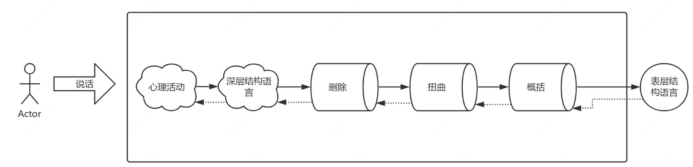
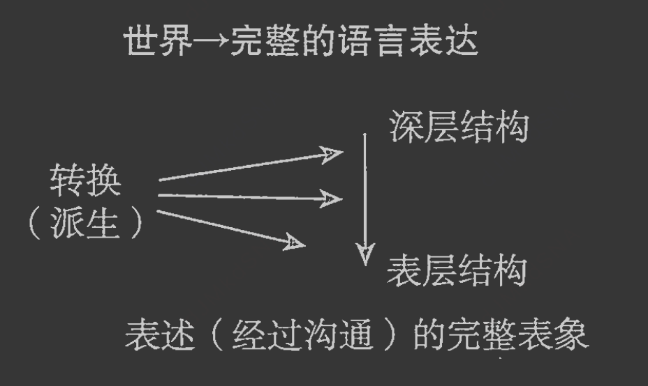
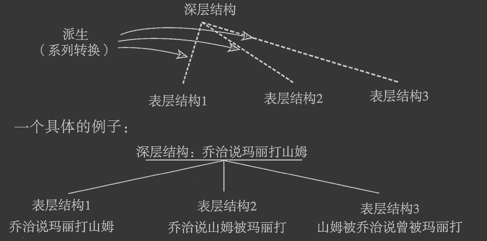
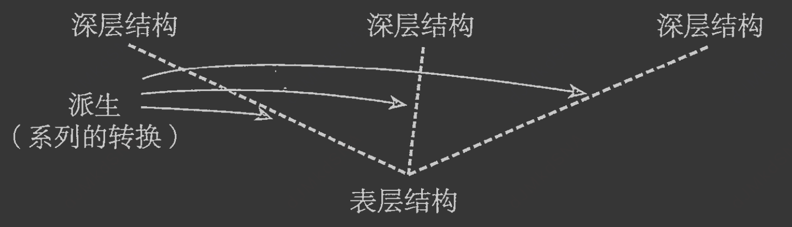

# 模型

[公理0：地图不等于疆域]
人类不直接感知客观世界，而是通过神经系统在脑中构建“世界模型（地图）”来指导行动。
推论1：客观世界（实体）与心中模型必然不同。
推论2：每个人的模型因神经、社会、个体限制而彼此不同。
核心痛点：痛苦与限制不来自世界本身，而来自模型的贫瘠与僵化——我们把相对正确的“地图”当成了绝对的“疆域”
[公理1：语言是模型的编码，而非经验的本身]
深层结构（完整经验）→ 经三大失真机制 → 表层结构（说出的话）。
沟通的误差、自我的卡点，本质是编码过程中的信息流失与扭曲。

[核心工具:元语言模型,逆向还原系统]
模型结构
输入：对方的表层语言（删减/扭曲/概括后的句子）。
处理：通过特定提问，识别语言漏洞。
输出：还原缺失的参考索引、完整动词、隐藏假设，扩展内心模型。

# 世界地图
人类并不直接操纵外部世界。我们每个人都自己在脑海中创建了一个世界的投影——换句话说，是一个模型或者地图——来帮助我们做出各种行动。
我们脑海中的世界模型决定了我们体验世界所得到的经验，我们如何认知世界，以及我们能够看到哪些选择


有两点我们希望说明：首先，客观世界和心中模型肯定是不一样的；其次，我们每个人在心中建立的模型彼此都是不同的。有许多方法可以证明这一点。
在本书中，我们将造成模型与实体差异的原因分为三个方面②：神经限制（neurological constrains）、社会限制（social constrains）和个体限制（individual constrains）

## 神经限制
我们脑中的模型和实体产生差异的其中一个原因，就是神经系统在感知的过程中会有条不紊地扭曲和删除/过滤实体的一些因素。
这个作用减少了人类体验世界的更多可能性，也导致了我们对事情的主观体验与事实之间的偏差。我们的神经系统天生地组成第一组障碍，阻隔了实体世界和心中的模型。

## 社会限制
造成体验和事实之间偏差的第二个因素是社会习俗的限制(有色眼镜)——我们也把这叫做社会遗传因素③。借着社会遗传因素，我们参照周围人的分类方式和信息挑选方式：我们的语言、我们接受的认知方式，以及公认的假设。

## 个体限制
个人体验异于客观真实的第三个因素，我们叫做“个体限制”。因为个体限制的因素，我们基于自己过去的体验在心中构建模型。每个人从过去到现在的个人体验，
独一无二，就像指纹一样。类似每人截然不同的指纹，每个人成长中都有奇特的经历，没有两人的经历是等同的。

# 语言漏洞
不同形式的心理治疗就引导出不同方式度过这些改变的关键点。不同的是，有些人可以难度较小地度过这些关键时期，并用
数倍于他人的能量和创造力经历这段时期。但其他人面对同样的挑战，却带着数倍于他人的痛苦和畏惧——忍受的时期——那时他们最基本的需求就是生存。
在我们的研究中，这两类人的基本区别，就是有创造力的、克服困难和压力的人，心中有着丰富多变的模型来解读他们的处境，同时也有足够宽的范围来选择他们要采取的行动。
其他忍受着度过的人，可以做的选择更少，他们手头的选择看起来都不理想——就像是生来就要在生存搏斗中失败的人。我们想知道的是：怎样会使得同一个世界中不同的人有这等迥异的体验？
我们知道[这差距来自他们心中模型的丰富程度]。于是，问题变成了：怎样会使人宁可痛苦地面对多变和复杂的世界，也依然坚持在贫瘠而缺乏变动的模型中思考？


在接下来的研究中，我们明白了这些人到底是怎样将自己锁在痛苦中，其中一个很重要的发现是：[他们不是坏、疯狂或“有毛病”。实际上是，他们在其所知的范围内，
选择他们认为最好的模型]。换句话说，人类的行为，无论一接触的时候让别人感觉多么奇怪，在产生该行为的人看来，这种选择都是最有意义的⑦。问题并非他们做了“错误”的选择，
而是在于他们现有的选择还不够丰富——也可以说他们观察世界的角度不够丰富。最无处不在的矛盾就是，我们生存、成长、改变和体验快乐这些事情中所经历的过程，
也正是让我们固执于贫乏模型中的那种过程——这个过程就是玩符号游戏，给自己造模型。所以，让我们实现非凡和独一无二成就的事情以及阻碍我们进步的事情，
本质上是同一种过程；区别只在于[固执者把自己想到的模型（模型都是相对正确的），当成了绝对的事实。而这两种过程，大体上有三种机理：概括化⑧、删除和扭曲]。

## 归纳
[以一件小事推导出全盘定论]
概括化(generalization)是这样一种过程:个人的模型来自所有的体验,

模型的其中一部分脱离了它源于的那部分经历,并被用来代表所有情况;而真实的情况是,这一部分只适用于这种经验。
我们概括化的能力实际上对于生存在复杂的世界中,是必需的。比如:我们被一个热炉子烫到以后,应该将其概括化为“热的炉子都是不可以摸的”。
不过,如果将这个被炉子烫的体验概括化为“炉子都是危险的”,碰到有炉子的房间我们都不进去,那么就对我们的行动产生了不必要的限制。

这里的重点是说，同一个准则有用或者无用，取决于具体的情况和场合——也就是说没有“对”的概括化，每个模型只能在实际情形中被评价。
更进一步说，这给了我们一把钥匙去探知人类怪异或不适当行为，只要我们能够看到此人的行为源自何种情形。

## 删除
[说话主动漏掉关键信息]
我们用来有效生存或者搞死自己的第二种机制，叫做删除(deletion)。删除，是我们排除其他视角，选择性地使用某些角度去看待我们的体验。
一个最简单的例子，就是在吵闹的大厅里我们为了跟其中某个人交谈，必须无视其他人的声音。但是，人们也容易因为同样的删除机理而忽略自己的重要他人所传递来的信息。
比如一个相信“我不值得别人在乎”的人，向我们抱怨说妻子从来没给过关心他的信号。家访时，我们注意到他妻子确实表达了关心他的信号。
但因为这些信号跟他之前所使用的概括化冲突，因此他确实感受不到妻子的关怀。这种删除效应可以被证实：当我们提醒他注意妻子说的某些话，他说他没有听见妻子说过这些。

删除，就是把我们关注的视角从大千世界抽出一个我们可以应付得来的局部。这种关注范围的缩小在某些情况下有用，但在某些时候是痛苦的来源。
## 变形
[把事实换一种错误逻辑解读]

第三种机制是扭曲（distortion）。扭曲，就是更改我们接收到的感官信号。幻觉/幻想，就是让我们还没有体验过一件事就预先为它准备。人在预演一个演讲的时候，
就会扭曲眼前的现实（想象眼前是听众）。人所创造出的所有创意/艺术作品，都是通过扭曲实现。

比如前面提到的那个概括化地认为没什么要在意的人，一旦从妻子那里接收到关怀的信号，就立刻扭曲它。而且很特别的是，每次他听到妻子说出关怀他的话，
他除了删除这些意思，还转过来对我们笑着说：“你们看，她就是想从我这得到些什么才会说这些。”他就用这种方式避免自己的体验（即他的视听）与他所理解的模型出现冲突。
于是，他阻止了自己拥有更丰富的表象系统（representation），也阻碍了他和妻子之间的亲密关系。

一个经常被拒绝的人制造了一个概括化模型：他自己是不值得关心的。顺着这个概括化模型，他要么删除关心他的信息，要么把这些信息理解成不真诚。
既然他觉察不到任何关心的信息，这种状况也就维持了他自己本来的概括化“我是不值得关心的”。这就是一个典型的正反馈循环（positive feedback, Pribram, 1967）。
一个人的概括化或者期望会过滤（即删除）或者扭曲他的体验，使之与他的期望一致。因为他没有什么体验与他的概括化矛盾，他的期望就被固定下来，形成循环。人们就是这样维持自己狭隘的模型。

## 隐藏假设

# 表层结构-深层结构
元语言模型（NLP 语言解析工具）本质就是拆解人嘴上说的话，找出藏在语言里的三层失真漏洞：删减、扭曲、概括化，
再用提问、语法校正把模糊、虚假、缺信息的表达还原成真实完整的深层想法，用来理清思路、打破自我限制、看清别人话里的隐藏假设。


```aidl
语言直觉
语法规范直觉， 断句规范直觉 ，语义规范直觉
断句直觉，句子完整性直觉

每个句子都被母语者的两种直觉分析成两个层面的结构:[表层结构]——关于如何用直觉树状结构将字词组成句子;还有[深层结构]——他们的直觉能够完整表现出句中事物的逻辑语义结构。
在转换语法模型给每个句子都表现成了深层结构和表层结构,语言学家们就得分析出两种结构之间如何联系。他们用一系列转换(transformation)来表示这种联系。
```

[一样的深层结构可以衍生出多种表层结构]

## 同义现象
人心里真实完整的想法叫深层结构；说出口、写出来的话叫表层结构。
我们心里明明有完整画面，但说话时一定会自动 “加工篡改”，加工分三种手段：删减、扭曲、概括化，这三个就是后设模型的三大核心失真机制


当人类想要相互交流自己经历的事情时，他们就形成了一种完整的语言表达形式；这就是所谓的深层结构。当他们开始讲话的时候，他们就做出一系列的选择（也就是词语转换），
选择用哪种形式来传达信息。总体来说，这些选择都是无意识的。

句子结构可以被看做一系列句法选择的结果。说话人从有限的句法特征中选择几个来造句，从而传达想要表达的内容。
然而，我们做出这些选择的过程是有规律可循的，这个过程（一种派生的过程）导致了表层结构的出现。表层结构也就是我们认为有意义的句子

然而，我们做出这些选择的过程是有规律可循的，这个过程（一种派生的过程）导致了表层结构的出现。表层结构也就是我们认为有意义的句子或一系列词。
表层结构本身就可以看成完整语言表达——深层结构的表现。词语转换改变了深层结构——无论是[词语删除]，还是[改变词语顺序]——但并不改变句子的意思。
这个过程的模型就是我们表达和传递我们经历的模型过程的模型——一个模型的模型——也就是元语言模型。它表现了我们对自身经历的直觉。


## 歧义现象
歧义现象则是另外一种情况。当同一个表层结构有多个意思时，母语为英语的人就会意识到产生了歧义


在元语言模型中，人们通过语言的直觉来安排词语的顺序，以避免一些深层结构通过转换（派生）而与表层结构产生联系。因此，元语言模型明确地表现了我们有规律可循但又无意识的语言行为。

# 深挖深层结构
深层结构：你内心完整、未经删减扭曲概括的真实想法、原始感受、完整事实，是表层话语的源头。
人所有负面自我限制（我不行、没人爱我、事情无解），全部来自表层语言对深层真实的篡改。
挑战深层结构：不止纠正表面一句话，顺着语言漏洞往下挖，找到底层固化的思维偏见。
比如你总说 “我做不好工作”，表层是概括化，深挖深层结构：你心底认定 “一次出错 = 我永远能力差”，挑战这个底层认知，从根源破除限制。

# 找出假设/前提
所有人说话都会自带隐藏预设假设，藏在句子里不用明说，但直接影响判断，也是扭曲、概括的来源。

# 模型扩展
有一个共同点：他们在当事人心中的模型里引进了变化，使当事人的行为有了更多选择。我们所看见的，实际是这些“魔术师”自己对于当事人的内心世界有一个相当清晰的模型——比如，
meta model（后设模型）——就可以使他们有效地扩展和丰富当事人心中的模型，让当事人的生活更富有选择，也更愉悦。

# 语言漏洞实践

## 删除
[删除],一句话可能删除了一些重要的名词.原则是[形容词只形容事件不直接形容人,动词必须作用于名词]
```aidl
(18) 我不知道说什么。
有一个删减和动词 “说” 关联 (对谁说)。
(19) 我说过我会试一试。
有两个删减，一个和动词 “说” 关联 (对谁说)，一个和动词 “试” 关联 (试什么)。
(20) 我和一个无趣的男士交谈。
两个删减：一个和 “交谈” 关联，一个和 “无趣” 关联。
(21) 我希望见见我的父母。
没有删减。
(22) 我想听。
一个删减：和 “听” 关联。
(23) 我丈夫声称他被吓到了。
两个删减：一个和 “声称” 关联，一个和 “被吓到” 关联。
(24) 我大笑，然后离开了家。
一个删减：和 “大笑” 关联。
```

### 删减比较范围和对象
"er","more/less",比较次,最高词
对于比较级：
形容词比较级，加上 “和什么相比”。例如，和什么相比更有进取心？或者比什么更加有趣？
对于最高级：
最高级，加上 “和什么关联”。例如，关于什么是最好的答案？关于什么是最困难的？

### 清楚的,明显的
"ly"副词
第二类特殊的删减以 “ly” 副词在当事人描述的表层结构中出现来判断。
例如，当事人说：
(77) 很明显，父母不喜欢我。
Obviously, my parents dislike me.
或者
(78) 父母明显不喜欢我。
My parents obviously dislike me.
注意这些表层结构能够用下面的句子进行释义：
(79) 这是很明显的，父母不喜欢我。
It is obvious that my parents dislike me.
一旦可以变成这种形式，治疗师能够很容易断定深层结构中哪部分被删减了。

### 必须,一定,必要,不可能
(89) 不然会发生什么？
或者，用一个更扩展的形式：
(90) 如果你没能______ 将会发生什么？
这里你在______中替换当事人原表层结构的合适部分。具体细节用上面的例子，当事人说：
(91) 每个人都必须考虑其他人的感受。
治疗师可以回应：
(92) 不然会发生什么呢？
或者，更加完整地问：②
(93) 如果你没有考虑其他人的感受会发生什么？
这些表层结构可以用逻辑学家称为 “必须性” 的语态操作者的出现来判断。它们在英语中以这些表面形式出现：
have to (不得不)，例如 I/You have to，我 / 你不得不……
One has to，每个人都不得不……

## 扭曲
[名词化属于 “曲解”]

[人本来描述一件正在发生、能变动的动作，非要把它打包成一个固定、死的名词，这一步就是名词化]，是我们下意识歪曲真实生活的说话习惯。
识别名词化的用处：把 “凝固的死结论” 变回 “能调整的活过程”
很多人痛苦，是因为自己的语言骗了自己：
比如把 “我和他相处得很糟糕”（动态动作）说成关系很差（名词）；把 “我做事总害怕出错”（动态动作）说成我有恐惧（名词）。
一旦变成名词，人会默认：这是一个固定、定型、改不了的东西，不受自己掌控。
咨询师找出这个名词化词汇，就是为了拆穿这种语言骗局，让当事人看清：
所谓 “关系、恐惧、失败、矛盾” 根本不是一块固定石头，只是一连串正在发生、随时能调整、能改变的行为过程。


第一步：听当事人描述表层结构。
第二步：对于表层结构中的每个非过程词或者动词的要素，问问自己，它是否描述了某个事件，这个事件事实上是存在于世界中一个过程，或者问问自己，是否有某个动词听起来 / 看起来像这个名词，并且意思相似。
第三步：测试事件词是否适用于这个动态框架的空白处，“一个进行中的______”（an ongoing ______）。
对于当事人表层结构中出现的每个非动词，无论描述的是一个和过程相关的事件，还是你能找到一个动词和它在声音 / 样子 / 意思上相近，名词化都发生了。

## 概括化
当人们创造他们的经历模型时所产生的普遍过程之一就是它的概括化。
概括化也许会通过忽视细节和丰富他们的原始经历来弱化当事人模型。因此，概括化使他们无法区分能为他们提供更多的处理任一特殊情形的选择。
同时，概括化将特定的不愉快经历扩大到受世界困扰的程度（一个不可逾越的障碍）。例如，将特定的不愉快经历 “洛伊斯不喜欢我” 放大为 “女士们不喜欢我”。质问当事人概括化的目的是为了：
(1) 将当事人的模型与其经历重新联系起来。
(2) 减少那些从概括化到他能开始解决的某些确切的事情中产生的不可逾越的障碍
(3)确保在当事人的模型中展现了细节和丰富的经历,因此创造出基于不是很明显区别上的选择机会。

语言学上说,我们应该注意我们用来识别当事人模型中概括化的两种重要方式。同时,这些为我们提供了一种质问这些概括化的手段,就是以下两个过程:

(1)检查名词和事件词语的参考索引;

(2)检查详尽完整的动词和过程词语。

### 缺乏“参考索引”的概括化（模糊指代）
在通过回答这些问题来要求当事人提供参考索引时，当事人重新将他模型中的概括化与其经历联系起来。在接下来的表层结构中，构想出能获得缺失参考索引的合适的问题。

没有人注意到我所说的东西。

具体来说，是谁？是什么？

我总是避免让我感到不舒服的情形发生。

具体来说，是什么情形？

### “不完整指定动词”的概括化（动作描述模糊）
定义：动词没有完整阐述动作的细节，导致经验被模糊化。
句子越详细，图像越清晰。元语言模型鼓励通过提问（如“具体来说，是什么情形？”）来“展开”不完整的动词，使经验更具体。

## 假设
[形容词只形容事件不直接形容人,动词必须作用于名词]
(172)我很担心我的儿子会和我丈夫一样懒惰。

治疗师识别出了假设。

(173)我的丈夫是懒惰的。

并将其展示给当事人，问她具体来说，她的丈夫是如何懒惰的。当事人用治疗师对治疗中结构完整的评价的另一种表层结构来回答。


