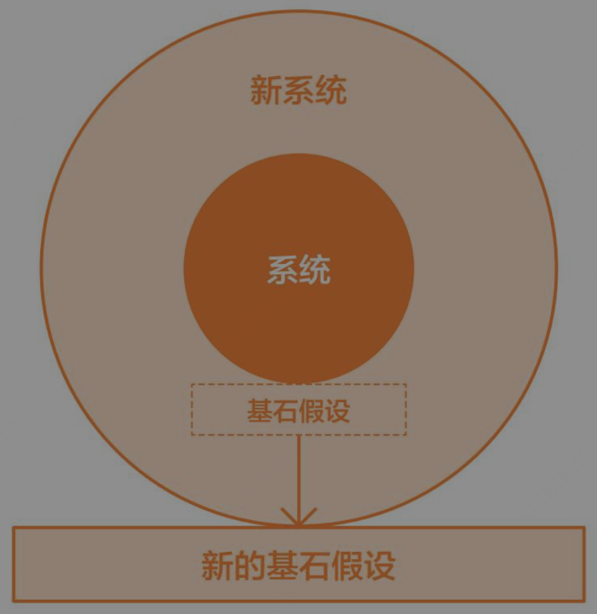
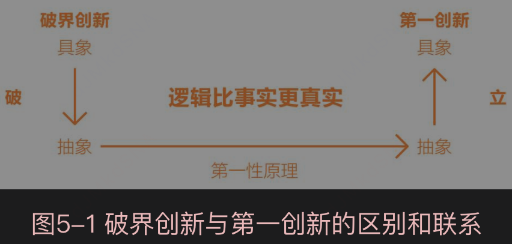
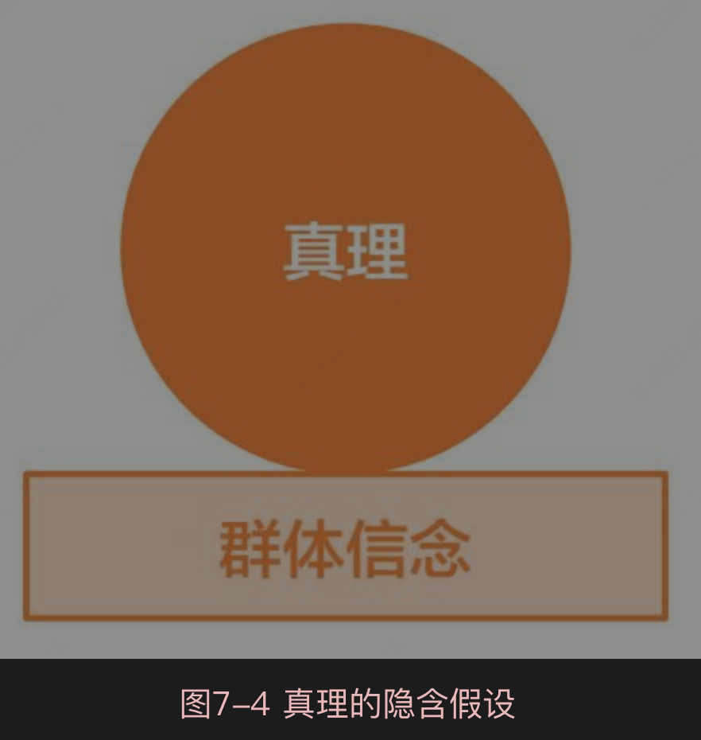

# 第一性原理模型

# 归纳法
[只能证伪,不能验真]
空间归纳法

时间归纳法

独立可重复性

在此基础上，波普尔得出了科学的第一大特性——可证伪性，即有可能被证明是错误的那个学问才是科学。
如果一个学问永远不可能被证明是错误的，那么这个学问就不是科学。总而言之，归纳法只能证伪，却不能证明。

在付出最小成本的前提下，获取相对正确的知识，所以归纳法不能得到真理，但可以帮我们生存下来，或者暂时性生存下来

尽管现阶段的所谓知识并不是真理，但它对于维护我们的生存足够了

在“过去的经验在未来依然有效”这个命题下，隐藏着未来与过去一样的时间维度连续性。
但是市场产业并非总是连续性的，当企业的发展跨入新阶段或者行业市场发生了质的变化时，企业就会面临跨越非连续性的问题。这时用原来归纳法思维总结出来的规律指导未来，不但毫无益处，反而有害。
# 演绎法
[只能保真,不能证伪]  

[具备可迁移性]
演绎法必须有一个基石，一个来自系统之外、能够逻辑自洽的元起点。这个元起点既可以称为第一前提、逻辑奇点，也可以称为第一性原理。

古希腊的哲学家和科学家相信，世界上始终存在一个必然正确的元起点，从这个元起点出发，通过逻辑性的推导，人们就可以获得新知识。

虽然演绎法思维可以从逻辑的维度高效地解决某个领域的全部问题，但[演绎法有一个结构性的问题——不能证伪]   (谁举证，谁证明)。
[使用演绎法的关键在于确保前提的正确性，即前提不能来自归纳法]
```aidl
这时有且仅有一条路，即三段论的前提如果不能来自归纳法，就必须来自一个更高链条的演绎推理所推导出的一个结论。在一般情况下，在一个更大的系统中，经过演绎推理推导出的一个结论，
对于包含在大系统中的子系统而言，可以把这个结论继承过来作为新推论的大前提，同时可以保证这个大前提为真。
这时，问题又来了：我们怎么能保证在大系统中演绎法前提的确定性呢？同样的道理，这个前提不能来自归纳法，所以我们只能从更大范围的系统中找到一个演绎推理的结论，
将它继承过来作为三段论的前提。当然，演绎法的链条不能无限地倒推下去，最终必须有一个基石，即一个能够自确定的元起点——第一性原理
```
```aidl
在演绎法推导的过程中，只有前提正确，结论才能正确。但是，我们如何确认前提是正确的呢？归根结底，演绎法的前提来自归纳法，
所以演绎法终极无效。举例如下。所有的人都会死，苏格拉底是人，所以苏格拉底也会死。在这个命题中，前提是所有人都会死。挑战在于，
凭什么说“所有人都会死”​？回答这个问题，我们只能从记忆、经验的角度总结出世界上没有长生不老之人这一观点，以此验证这个前提的正确性。
因为作为前提的认知来自归纳法，而归纳法是不能保真的，所以我们也无法判定演绎法推导出的结果的正确性。在三段论演绎法中，只有前提正确，才能保证结论正确。
从这个角度来说，演绎法的隐含假设就是前提。演绎法的价值在于其可保真性，实际上，可保真性取决于前提为真，而来自归纳法的前提不能确定为真。
所以，。
```

[第一性原理+演绎法＝＝＞理性系统]


```aidl
依据已经给定的某个第一性原理，加上演绎法的推理方式，我们就可以把系统之内的其他所有命题推理出来。换句话说，任何理性系统内部都是用演绎法来推论的，
而推论必须建立在第一性原理之上，我把它画成一个模型（见图1-1）。这里我把第一性原理放在理性系统之外，它是系统的大前提，由它加上演绎法，推出整个理性系统。
```

```aidl
第一性原理的特性有很多种不同的表达方式。它是系统之外的，既是自确定的，也是元起点，对应我们在中学学到的概念“公理”；它是基石假设，是整个推理过程中的第一因，
又被称为逻辑奇点等。如果深究，这些不同的描述确实存在一定的区别。但对于我们在生活、工作中的实际应用来说，这些区别基本上可以忽略不计。针对不同的表达角度，
第一性原理在实际应用中的含义也不尽相同。但在实际应用的过程中，对我们而言，只要是决定系统的元前提，我们都可以称之为第一性原理。
```
# 归纳 vs 演绎
```aidl
简单来讲，亚里士多德认为，从一件事物推导出另一件事物，中间存在一个必然的导出，而这个导出的过程就是所谓的逻辑。

根据这种认知，亚里士多德创造了演绎法中的经典句式，即我们常见的三段论。

三段论，顾名思义有三个组成部分，大前提、小前提和结论。在大前提和小前提正确的基础上，结论必然成立。
我们可以用一个经典的三段论句式来说明。所有的人都会死，苏格拉底是人，所以苏格拉底也会死。
在上面的三段论中，如果大前提和小前提是正确的，那么第三句结论一定为真。

与归纳法相比，演绎法的一大优点恰恰是可以保真，而使用归纳法时，无论前提多么正确，做多少实验去验证，也不能保证结论一定为真。

关于演绎法和归纳法之间的争论由来已久，争论的核心就是逻辑与实践的关系，是逻辑引导实践，还是实践引导逻辑。换句话说，这个问题涉及逻辑是真实的，还是实践是真实的。

```

```aidl
与以实践引导真知的归纳法不同，起源于古希腊对哲学和科学思考的演绎法思维模式更倾向于相信逻辑假设在先，实践检验在后。在实际操作过程中，
我们可以先用一个抽象的理论假设来指导未来的生活和工作，然后用未来的实践结果来检验这个理论是否成立。这种思维方式的缺点是速度慢，想要找到一个深刻的抽象理论并不是一个简单的过程。
但其优点也非常明显，根据这种思维模式确认出来的理论，往往具备可迁移性，只要在逻辑上成功地推导出一个共同的抽象概念，与此相关的所有具象问题就都可以解决
```

```aidl
我相信大多数人会选择归纳法，通过实践获取经验，然后将经验推广、扩大。实际上，如果企业的发展始终沿着第一曲线不断进步，归纳法确实有效。但在现实中，
所有成为顶尖企业的公司，几乎不存在凭借一条曲线持续发展的情况。企业在从第一曲线向第二曲线转换的区间，也就是我命名为创新的领域的时候，需要的就是演绎法，即大胆提出假设，并用实践去验证。
```

# 第一性原理
[不是系统之内，而是系统之外]
实际上，第一性原理并不是系统的中心思想，而是这个系统之外、之前的一个[元前提]
根据“简一律”[7]，我们知道每一个理性系统[8]都可以简化为一个根本原则，实际上，这个中心思想并不是第一性原理，而是来自第一性原理。
简单来讲，中心思想是在系统之内的，是由第一性原理加上演绎法推导而出的。


比如在商业层面，一家企业的商业模式是其经营的中心思想，但一定不是其第一性原理，商业模式得以形成的基石假设才是第一性原理。
同样的道理，公司发展的战略并不是企业经营的第一性原理，战略得以形成的基石假设才是。

系统之间是有层级之分的，最简单、直接的划分方式就是“母系统”和“子系统”​。某一个系统的第一性原理，既可以是一个不证自明的元起点，
也有可能是一个更大的母系统的中心思想，作为子系统的第一性原理。从系统的维度来说，每一个系统都有自己的第一性原理，所以不同系统的第一性原理之间也有层级之分。

[所有比我们想要推导的理性系统范围更大、层级更高的母系统，其中心思想或者推导结论都可以作为子系统第一性原理的来源]。

[每一个系统并不是只有一个元前提]，在很多情况下，有可能两个或者两个以上的第一性原理支撑了同一个理性系统。
实际上，第一性原理在西方的哲学体系中是一个复数词——First Principles。所以无论是爱因斯坦的相对论、牛顿经典力学定理，还是达尔文的进化论
，其实都有2~3个第一性原理作为支撑。所以，大家也不要被“第一”这个词误导

# 欧氏几何哲学-公理化思维
一切学问都是证明系统，所以在一些理性学科中，我们会发现，人们对逻辑推导过程的重视甚至超过了对最终结果的重视
我们常说“微言大义”这个词，意思是说用一句简练的话表达深刻的道理。但是在哲学语境中，我们强调的是假设与证明，
即便是一句极度简练的话，我们也必须经过逻辑推理证明其有效性，否则就不是微言大义，而是虚假命题。
[系统中的证明都是逻辑证明]
在推导的过程中，想要保证每一个步骤的正确性，我们必须找到相应的公理予以支撑。
[从为数不多的公理出发，推导出所有定理和命题，从而构建了整个平面几何体系。这种基于演绎法的公理化思维方式，才是欧几里得留给后世的巨大财富，是人类思维的神迹]

[人类社会之所以能够快速地发展到今天，依靠的就是从已知推导未知的能力]

圣人说过的话就是我们的行为准则，圣人也许没有对他的结论进行严密的推理，大众通常满足于知道并认同结论就行了。而在古希腊的哲学里，任何结论都不重要，中间的推理过程才是重要的实体，这是一种与东方的传统思维恰恰相反的思维方式。
公理化思维

# 破界创新-隐含假设

[打破系统的边界，最直接的方法就是将作为基石的第一性原理击碎]。创新“不破不立”，“破”的是系统得以形成的第一性原理，“立”的是新的第一性原理，这个方法就是破界创新
任何理性系统的边界都是由第一性原理决定的。也就是说，第一性原理作为理性系统得以形成的元起点，虽然支撑了整个理性系统，但它同时也禁锢了这个系统的边界。
它是系统得以形成的根基之处、最大的确定性之源，因此也是系统的最脆弱之处

第一性原理如同系统的“黑洞”一般，它既是系统的能量，又是系统的禁锢，任何系统和个人都很难摆脱这样的“黑洞”。

破”的是系统得以形成的第一性原理，“立”的是一个新的第一性原理，这个方法论就叫作破界创新。

```aidl
1.“破”隐含假设[1]

对既有的系统，人们通常会遗忘隐含的基石假设（故称之为“隐含假设”），所以破界创新的第一步就是破隐含假设（也是破界创新最难的一步）。
那么，如何跳出现有系统，找到并打破隐含假设？答案是通过哲学的思维。从狭义层面分析，研究具体对象的学问叫作科学，而把第一性原理作为研究对象的学问叫作哲学[2]

2.“立”基石假设
更深、更大的系统通常都存在于基础学科中，如果你仅仅是在商言商，就无法提出破界创新的方法论，只有基于基础学科的基石假设，才会构建出一个更大的系统。

3.“见”全新系统
我们在处理问题时，一般最关注的是解决方案，最看重解决方案的“内容”。但是，与其在内容本身上下功夫，不如去探寻这个内容下面的“一”，尤其是要打破那个隐含假设，
这才是最关键的。当把这个“一”打破，方案自然而然便会出现。就像在这三个步骤中，第三个步骤的发生，其实就是前两个步骤的结果。

破界创新的思维方式不是在内容上做功，而是在结构上做功，是在看不到的地方做功。过去我们认为，事业成功需要的是努力、勤奋和大量的时间，但那些工作全都在系统的边界之内。
其实，创业是一种智慧，是一种认知，是在系统之外的东西，需要静下来，独立思考。
```

```aidl
破界创新的关键和难点在于发现和打破隐含假设。与禅修非常类似，当看到“隐含假设”时，我们就“开始”打破它了。通常，最常见的隐含假设就是群体信念，它包含你与周围人的共识，也有行业的常规，
它们往往构成我们认知的隐含假设，而你身处群体信念之内，却难以察觉。因为每个人都有一种深入骨髓的从众心理，我们会把社会中的主流思想当作真理看待。
实际上，所谓群体的信念都是最危险的隐含假设。尤其是它已经深入人心到变成一种常识或者共识，当人们根本不会去质疑它甚至是忘了质疑它的时候，人们就会被这个群体信念禁锢。
```
```aidl
什么是“隐含假设”？答案就是周围人的群体信念。往往那些大家都深信不疑、不被质疑的东西，才是给予你最大限制的隐含假设。怎么打破这种限制？答案是通过哲学思维。
什么是哲学？回到哲学的原点，康德说，“所谓哲学起始于对所谓自明的东西的追问”，它可以表现为好奇心、初心、童心等。所以，亚里士多德说，哲学起始于对万事万物的惊异，这种初心才是产生创新的源头。
```

```aidl
破界创新并没有解决原有系统的极限问题，但是让原有系统的极限点问题变得无关紧要。如果我们眼睛永远盯着系统边界里面的问题，将永远突破不了边界。
```

```aidl
任何文化一开始都是为了维护载体在某一个特定环境下的生存。但是环境会发生变化，所以最后几乎所有文化，在变化的环境里，都会变成对载体的戕害。如何破除这种戕害？答案是改变思维结构。
```

# 第一创新

```aidl
大多数企业进行的创新工作使用的都是归纳法的逻辑。创业者或经营者根据以往的实践成功经验，归纳并总结出某种创新模型，然后通过把这种模型推广到企业的各个经营环节或各个门店中，
推动企业向前发展。现在市面上很多关于创业、创新管理的畅销书，基本上都是这个范例。

过去我们相信“实践出真知”的归纳创新，现在我们推崇的是逻辑上正确、事实上就一定正确的演绎创新，一言以蔽之，就是基于第一性原理的第一创新。这种创新可以跨越领域依赖性，在不同领域中通用。
```

```aidl
第一性原理通常处于系统之外，往往来自其他更高维度的系统。我们在商业系统中是找不到商业系统的第一性原理的，
只能在更大的社会科学和自然科学中才能找到它，因此重要学科的重要原理可以作为商业的第一性原理。
```
[我原以为我们是正常的，而他是天才。在我研究之后才发现，他是正常的，而我们被遮蔽住了。遮蔽我们的恰恰像那些哲人所说的，是我们的思维方式本身]
```aidl
如果这种思维模型是错误的，或者只用一种思维模型来看待世界，我们对世界的认知就会出现扭曲，这就是所谓的“锤子综合征”。


我认为普通人的思维方式被传统和过去的经验束缚太多了。人们几乎不从第一性原理的基础上思考任何问题。他们会说‘我们会这么做，因为我们过去都是这么做的’，
或者‘没人这么做，所以这么做肯定不对’。但是，这么想真是太荒谬了。你需要从零开始建立你的逻辑推理，物理学上，我们叫‘从第一性原理开始思考’。
你从基础概念开始，然后从那里开始建立你的逻辑推理，最后再看你的结论到底成不成立。你的结论和其他人过去得出的结论可能一致，也可能不一致

创造性思维和第一性原理一样，都是每个人与生俱来的本能，只是大多数人的这种本能被后天的知识和教育遮蔽了。
```

```aidl
迁移式学习首先应将知识拆解为基本原理，把知识看作一棵语义树很重要。深入细节或枝叶前，保证你可以理解基本原理，也就是主干和大分支，否则细节和树叶就没有可依附的东西。其次，在新领域中重构基本原理，然后在其上悬挂细节。从一个领域学习到的内容应用到另一个领域
```
[归纳法的一大问题，就是你很难将在一个领域里获得的成功迁移到另外一个领域]
```aidl
归纳法的一大问题，就是你很难将在一个领域里获得的成功迁移到另外一个领域。由此看来，马斯克的学习方式并非归纳法，而是演绎法，是第一性原理式的思维方式，他不过是将同一种思维方式运用到不同的领域罢了。
他在诸多领域内取得的创新，归根结底都是基于第一性原理的创新，也就是本章的主题——第一创新。
```
[物理学还原论]

# 大统一理论-定律中的定律

# 真理连贯论-真理符合论
所有的客观事实都存在于我们的主观信念当中

真理连贯论
